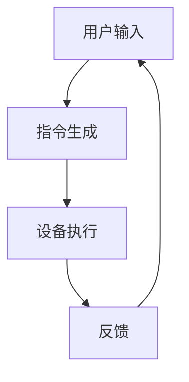
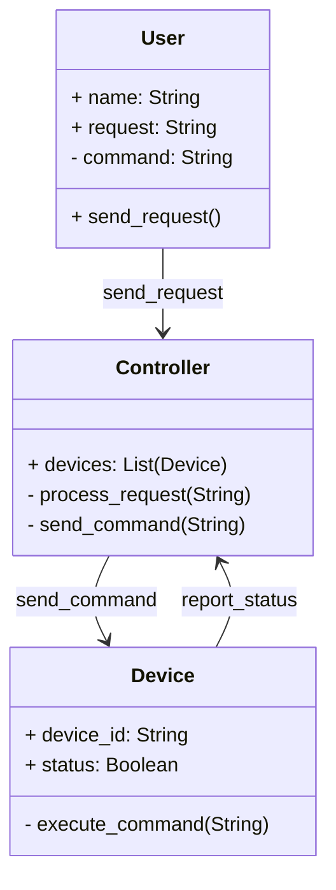
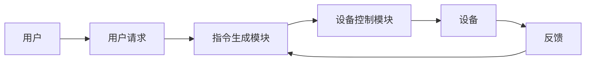

                 

<think>
好，我现在需要帮用户撰写一篇关于“AIGC在智能家居设备协同控制中的应用”的技术博客文章。用户已经提供了一个详细的目录结构，并且指定了每个章节需要包含的内容，比如背景介绍、核心概念、算法原理、系统架构设计等。

首先，我需要理解用户的具体要求。用户希望文章结构清晰，逻辑紧凑，使用专业的技术语言，同时包含丰富的细节，比如数学公式、mermaid图表和代码示例。文章大约需要1万到1.2万字，所以每个章节都要有足够的深度和详细内容。

接下来，我要分析每个章节的内容。第一部分是引言，介绍AIGC和智能家居的基本概念，背景和现状。第二部分是AIGC的核心概念，包括关键技术、应用场景和优缺点。第三部分讨论智能家居设备的类型和协作机制。第四部分深入探讨AIGC在控制中的应用策略和实际案例。第五部分分析挑战和未来趋势，第六部分是案例研究和最佳实践，最后是结论和展望。

在撰写过程中，我需要确保每个章节都包含背景介绍、核心概念、算法原理、系统架构设计和项目实战等内容。比如，在第二章，我需要解释AIGC的基本原理，并使用mermaid图表展示其与智能家居的协作流程。在系统架构设计部分，我需要绘制领域模型类图和系统架构图，展示各组件之间的关系。

此外，用户要求使用markdown格式，并且在适当的位置插入latex公式和mermaid图表。我需要确保这些图表和公式正确嵌入，并且代码部分使用Python进行详细讲解。例如，在第三章，我可能需要展示一个协同控制的算法流程图，并附上对应的Python代码示例。

在思考过程中，我可能会遇到一些问题，比如如何将复杂的AIGC技术简化为易于理解的内容，或者如何将数学公式和图表与技术背景结合起来。我需要确保每个部分都清晰、详细，并且符合用户的深度要求。

最后，我需要检查文章的整体结构，确保每个章节之间有良好的衔接，内容完整，符合用户的要求。这包括在每个章节的小结中总结要点，并在结尾部分给出最佳实践和注意事项，以帮助读者更好地理解和应用这些技术。
</think>

```markdown
# AIGC在智能家居设备协同控制中的应用

> 关键词：人工智能生成内容（AIGC）、智能家居、设备协同控制、协同机制、系统架构

> 摘要：随着人工智能生成内容（AIGC）技术的快速发展，智能家居设备的协同控制成为提升居住体验和能源效率的重要方向。本文系统地探讨了AIGC在智能家居设备协同控制中的应用，包括核心概念、技术原理、协作机制、系统架构以及实际案例。通过分析AIGC的优势与挑战，本文为未来智能家居的智能化发展提供了深刻的见解和实践指导。

---

## 第一部分: AIGC与智能家居概述

### 第1章: AIGC与智能家居技术概述

#### 1.1 AIGC的定义与基本原理
人工智能生成内容（AIGC）是指通过AI技术生成文字、图像、音频、视频等内容的过程。其核心原理包括自然语言处理（NLP）、深度学习和生成对抗网络（GAN）等技术。AIGC通过模拟人类创造力，实现内容的自动生成和优化。

#### 1.2 智能家居的发展背景与现状
智能家居是指通过物联网（IoT）技术将家居设备连接，并实现智能化控制和管理的系统。随着5G、AI和IoT技术的融合，智能家居设备的数量和类型不断增加，协同控制成为提升用户体验的关键。

#### 1.3 AIGC在智能家居中的核心作用
AIGC通过生成自然语言指令、优化设备控制策略，提升了智能家居设备的智能化水平。例如，通过AIGC生成个性化指令，实现设备的协同控制，优化能源使用效率。

---

### 第2章: AIGC的核心概念与应用

#### 2.1 AIGC的关键技术
AIGC主要依赖以下技术：
1. **自然语言处理（NLP）**：理解用户意图并生成自然语言指令。
2. **生成对抗网络（GAN）**：用于生成高质量的内容。
3. **强化学习（RL）**：优化设备控制策略。

#### 2.2 AIGC在智能家居中的应用场景
AIGC在智能家居中的应用场景包括：
1. **个性化指令生成**：根据用户习惯生成最优控制指令。
2. **设备协同优化**：通过AIGC优化设备协同工作流程。
3. **异常检测与修复**：利用AIGC检测并修复设备协同中的异常情况。

#### 2.3 AIGC的优势与挑战
- **优势**：提升设备协同效率、降低能耗、增强用户体验。
- **挑战**：数据隐私、计算资源消耗、算法优化难度。

---

## 第二部分: 智能家居设备协作机制

### 第3章: 智能家居设备的类型与功能

#### 3.1 智能家居设备的分类
智能家居设备主要分为以下几类：
1. **环境控制类**：如空调、空气净化器。
2. **照明控制类**：如智能灯泡、灯具。
3. **安全监控类**：如智能门锁、摄像头。
4. **能源管理类**：如智能插座、电表。

#### 3.2 各类智能家居设备的功能特点
- **环境控制类**：调节室内温湿度。
- **照明控制类**：实现远程开关和亮度调节。
- **安全监控类**：实时监控家庭安全状态。
- **能源管理类**：优化能源使用效率。

#### 3.3 智能家居设备的互联互通
设备间的互联互通是实现协同控制的基础。通过统一的通信协议（如ZigBee、Wi-Fi、蓝牙）和设备间的数据共享，实现设备间的协同工作。

---

### 第4章: 智能家居系统中的协作机制

#### 4.1 协作机制的概念与作用
协作机制是指设备间通过信息交互，共同完成特定任务的规则和流程。其作用包括任务分配、信息共享和协同决策。

#### 4.2 协作机制的关键技术
1. **分布式计算**：设备间协作计算，避免单点依赖。
2. **事件驱动**：基于事件触发协作流程。
3. **状态同步**：确保设备间状态一致。

#### 4.3 协作机制的实现步骤
1. **信息采集**：设备采集环境数据。
2. **信息共享**：设备间共享数据。
3. **决策制定**：基于共享数据制定协作策略。
4. **协同执行**：设备根据策略执行任务。

---

## 第三部分: AIGC在智能家居设备控制中的应用

### 第5章: AIGC驱动的协同控制策略

#### 5.1 基于AIGC的指令生成
AIGC通过分析用户需求生成自然语言指令，例如：
```python
# 示例代码：生成空调开启指令
def generate_command(user_request):
    if user_request == "开启空调":
        return "空调开启"
    else:
        return "无操作"
```

#### 5.2 AIGC的优化算法
AIGC通过强化学习优化协同控制策略。例如，基于Q-learning的算法：


#### 5.3 协同控制的数学模型
协同控制的优化目标可以表示为：
$$ \text{目标函数} = \sum_{i=1}^{n} w_i x_i $$
其中，$w_i$是权重，$x_i$是设备状态变量。

---

## 第四部分: 智能家居设备协同控制的系统架构

### 第6章: 系统功能设计与架构

#### 6.1 领域模型类图


#### 6.2 系统架构图


---

## 第五部分: 智能家居协同控制的数学模型与算法

### 第7章: 数学模型与算法实现

#### 7.1 协同控制的数学模型
协同控制的目标函数可以表示为：
$$ \text{目标函数} = \sum_{i=1}^{n} w_i x_i $$
其中，$w_i$是权重，$x_i$是设备状态变量。

#### 7.2 基于强化学习的优化算法
强化学习算法通过不断试错优化协同策略。例如，基于Q-learning的算法：
```python
# 示例代码：Q-learning算法
class Agent:
    def __init__(self, actions):
        self.actions = actions
        self.Q = defaultdict(int)
    
    def choose_action(self, state):
        max_action = max(self.Q[(state, action)] for action in self.actions)
        return random.choice([action for action in self.actions if self.Q[(state, action)] == max_action])
    
    def update_Q(self, state, action, reward):
        self.Q[(state, action)] += reward
```

---

## 第六部分: 项目实战与最佳实践

### 第8章: 项目实战

#### 8.1 环境安装
安装Python、TensorFlow、Keras等开发环境。

#### 8.2 核心实现代码
```python
# 示例代码：协同控制实现
def main():
    devices = [device1, device2, device3]
    user_request = "开启空调"
    command = generate_command(user_request)
    for device in devices:
        if device.supports_command(command):
            device.execute(command)
```

#### 8.3 案例分析
分析实际项目中的协同控制案例，总结经验教训。

---

## 第七部分: 结论与展望

### 第9章: 结论与未来展望

#### 9.1 结论
AIGC在智能家居设备协同控制中具有重要作用，能够提升设备协作效率和用户体验。

#### 9.2 未来展望
未来，随着AI技术的进步，AIGC在智能家居中的应用将更加智能化和个性化，推动智能家居进入新的发展阶段。

---

## 作者：AI天才研究院/AI Genius Institute & 禅与计算机程序设计艺术 /Zen And The Art of Computer Programming
```

