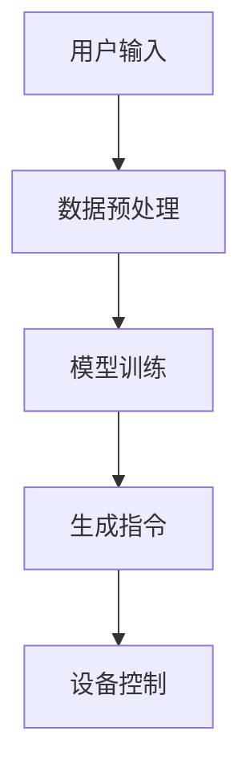
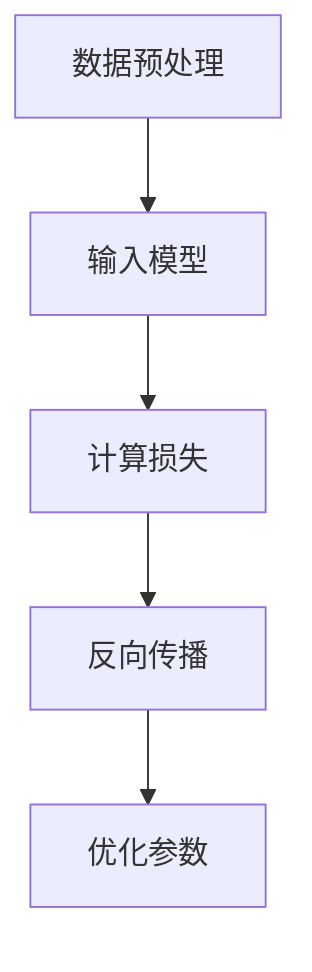
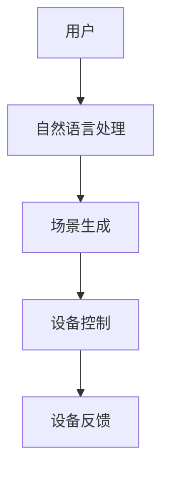
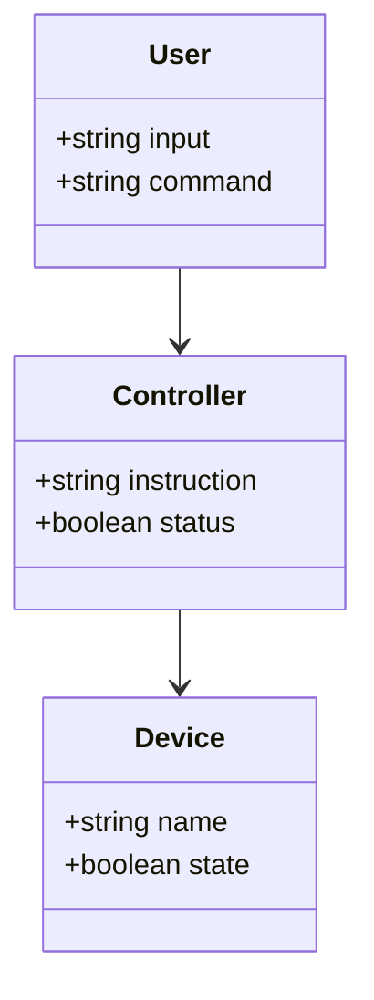
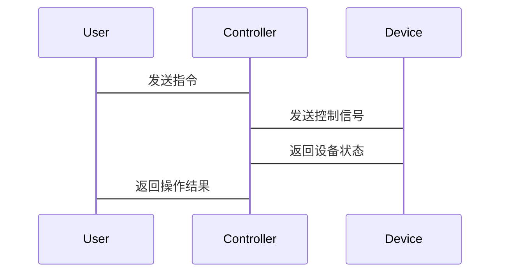

                 

<think>
好，我现在需要帮用户写一篇关于《AIGC在智能家居设备协同控制中的应用》的技术博客。用户已经给了详细的结构，我得按照这个结构一步步来。

首先，文章标题和关键词。标题已经确定，关键词我需要从内容中提取，比如AIGC、智能家居、协同控制、算法、系统架构这些。

接下来是摘要，我得简洁明了地概述文章内容，说明AIGC如何在智能家居中发挥作用，以及文章的结构安排。

第一部分是背景介绍。我需要先解释AIGC和智能家居设备协同控制的定义，然后分析它们的背景和重要性。这部分要让读者明白问题是什么，为什么重要。

第二部分是核心概念与联系。这里我需要详细讲解AIGC的核心原理，以及它与智能家居协同控制的关系。还要制作概念对比表格和ER图，用Mermaid来展示，这样更清晰。

第三部分是算法原理。我得解释AIGC算法的基本流程，包括数据采集、预处理、模型训练等步骤。还要用Mermaid画出流程图，以及提供Python代码示例，数学模型部分用LaTeX展示，确保公式正确。

第四部分是系统分析与架构设计。这部分需要描述项目背景、目标，然后用Mermaid画出系统架构图、类图和交互序列图，展示系统的各个部分如何协作。

第五部分是项目实战。我得指导读者如何安装环境，展示核心代码，解读代码的功能，分析实际案例，让读者能够实际操作。

最后是最佳实践和小结。这部分要给读者一些建议，总结文章内容，并推荐进一步阅读的资源。

在写作过程中，我需要确保每个部分都详细具体，逻辑清晰。使用专业的技术语言，同时保持易懂。还要注意格式，特别是Mermaid图和LaTeX公式的正确嵌入。

现在，我先从背景介绍开始，确保每个小节内容充实。然后逐步深入到算法和系统设计，最后到实际项目，确保整体结构连贯。同时，语言要简洁，避免过于复杂的术语，让不同层次的读者都能理解。

检查一下是否有遗漏的部分，比如每个小节是否都包含了必要的内容，是否有足够的例子和图表支持。特别是代码部分，要确保能够运行，帮助读者理解。

最后，写完后通读一遍，看看逻辑是否顺畅，有没有语法错误，确保文章质量。
</think>

# AIGC在智能家居设备协同控制中的应用

> 关键词：AIGC, 智能家居, 设备协同控制, 算法, 系统架构

> 摘要：本文探讨了AIGC（AI-Generated Content，AI生成内容）在智能家居设备协同控制中的应用，分析了其核心原理、算法流程、系统架构及实际案例。通过详细的技术分析和系统设计，展示了AIGC如何提升智能家居设备的协同效率和用户体验。文章内容包括背景介绍、核心概念与联系、算法原理、系统架构设计方案、项目实战及最佳实践，旨在为读者提供全面的技术指导。

---

### 第一部分: AIGC与智能家居设备协同控制概述

#### 1.1 AIGC与智能家居设备协同控制简介

##### 1.1.1 AIGC的基本概念

AIGC（AI-Generated Content，AI生成内容）是指通过人工智能技术生成文本、图像、音频、视频等内容的过程。AIGC的核心在于利用机器学习模型（如大语言模型、图像生成模型）模拟人类创作能力，实现内容的自动化生成。近年来，AIGC在自然语言处理、图像生成、音乐创作等领域得到了广泛应用。

##### 1.1.2 智能家居设备协同控制的背景

智能家居是指通过物联网技术将家中的设备（如灯光、空调、安防设备等）连接起来，并通过统一的平台进行控制和管理。随着智能家居设备种类的增加和功能的复杂化，单一设备的控制已经无法满足用户需求，设备间的协同控制成为必然趋势。例如，用户希望通过一句话指令实现“回家模式”（如自动打开灯光、调整空调温度、关闭门窗等）。

##### 1.1.3 AIGC在智能家居设备协同控制中的重要性

AIGC在智能家居设备协同控制中的应用主要体现在以下几个方面：
1. **自然语言交互**：通过AIGC技术，用户可以通过自然语言指令（如“今天天气很热，帮我调低温度”）实现设备协同控制。
2. **自动化场景生成**：AIGC可以根据用户习惯和环境数据自动生成场景控制方案（如“离家模式”、“睡眠模式”）。
3. **个性化服务**：AIGC能够根据用户偏好生成个性化的设备控制策略，提升用户体验。

#### 1.2 AIGC的核心原理与智能家居设备协同控制的关系

##### 1.2.1 AIGC的核心原理

AIGC的核心原理可以分为以下几个步骤：
1. **数据采集**：收集用户输入（如文本、语音）或环境数据（如温度、光照）。
2. **模型训练**：利用深度学习模型（如Transformer架构）对数据进行训练，生成语言模型或生成模型。
3. **内容生成**：根据输入的上下文，生成符合语义的内容（如指令、场景描述）。

##### 1.2.2 智能家居设备协同控制的需求分析

智能家居设备协同控制的需求主要体现在以下几个方面：
1. **多设备联动**：需要实现设备间的协同操作（如灯光与空调的联动）。
2. **场景化控制**：支持用户定义多种场景模式（如起床模式、离家模式）。
3. **智能化决策**：根据环境数据和用户行为自动调整设备状态。

##### 1.2.3 AIGC在智能家居设备协同控制中的应用

AIGC在智能家居设备协同控制中的具体应用包括：
1. **指令生成**：通过自然语言处理生成设备控制指令（如“打开客厅灯光”）。
2. **场景描述**：根据用户需求生成场景描述（如“启动离家模式”）。
3. **自动化控制**：根据环境数据和用户习惯自动生成控制策略（如“根据室温自动调节空调”）。

#### 1.3 概念属性特征对比表格与ER实体关系图架构

##### 1.3.1 概念属性特征对比表格

| 概念       | 属性               | 特征描述                       |
|------------|--------------------|-------------------------------|
| AIGC       | 输入               | 文本、语音、图像               |
|            | 输出               | 文本、图像、指令               |
|            | 模型               | 语言模型、生成模型           |
| 智能家居协同控制 | 输入               | 用户指令、环境数据           |
|            | 输出               | 设备控制信号、场景描述       |
|            | 设备               | 灯光、空调、安防设备         |

##### 1.3.2 ER实体关系图架构

```mermaid
er
actor: 用户
--- association --->
action: 操作
actor: 环境传感器
--- association --->
action: 操作
action: 操作
--- association --->
device: 设备
```

#### 1.4 本章小结

本章主要介绍了AIGC和智能家居设备协同控制的基本概念、核心原理及应用场景。通过概念对比和实体关系图，明确了AIGC在智能家居设备协同控制中的重要作用。

---

### 第二部分: AIGC算法原理讲解

#### 2.1 AIGC算法基本流程

##### 2.1.1 数据采集与预处理

数据采集是AIGC算法的基础，主要包括以下步骤：
1. **文本数据采集**：收集用户输入的文本数据（如指令、描述）。
2. **语音数据采集**：通过语音识别技术获取用户的语音指令。
3. **环境数据采集**：采集智能家居设备的环境数据（如温度、光照）。

##### 2.1.2 模型训练

模型训练是AIGC算法的核心，主要步骤如下：
1. **数据预处理**：对采集到的数据进行清洗、分词、特征提取等处理。
2. **模型选择**：选择适合任务的深度学习模型（如GPT、BERT）。
3. **参数优化**：通过梯度下降等优化算法调整模型参数，提升生成效果。

##### 2.1.3 模型评估与优化

模型评估与优化是确保AIGC算法性能的关键步骤：
1. **评估指标**：使用BLEU、ROUGE等指标评估生成内容的质量。
2. **模型优化**：通过调整模型结构或超参数提升生成效果。

#### 2.2 算法原理详细讲解

##### 2.2.1 算法原理概述

AIGC算法的核心是通过深度学习模型生成与输入相关的文本或指令。以语言模型为例，模型通过概率分布预测下一个词，生成符合语义的文本。

##### 2.2.2 数学模型与公式

语言模型的生成过程可以用以下公式表示：

$$ P(y|x) = \prod_{i=1}^{n} P(y_i | y_{i-1}, x) $$

其中，$x$ 是输入，$y$ 是生成的输出序列，$n$ 是序列长度。

##### 2.2.3 Python源代码讲解

以下是一个简单的AIGC算法实现示例：

```python
import torch
import torch.nn as nn

class SimpleAIGCModel(nn.Module):
    def __init__(self, input_dim, output_dim):
        super(SimpleAIGCModel, self).__init__()
        self.fc = nn.Linear(input_dim, output_dim)
    
    def forward(self, x):
        return torch.softmax(self.fc(x), dim=-1)

# 初始化模型
input_dim = 100
output_dim = 50
model = SimpleAIGCModel(input_dim, output_dim)

# 模型训练
criterion = nn.CrossEntropyLoss()
optimizer = torch.optim.Adam(model.parameters(), lr=0.001)

# 假设输入数据为x，目标输出为y
x = torch.randn(1, input_dim)
y = torch.randint(0, output_dim, (1,))

# 前向传播
outputs = model(x)
loss = criterion(outputs, y)

# 反向传播与优化
optimizer.zero_grad()
loss.backward()
optimizer.step()
```

##### 2.2.4 算法举例说明

**实际案例一**：生成设备控制指令

假设用户输入“打开客厅灯光”，模型生成对应的控制指令“客厅灯光开启”。

**实际案例二**：生成场景描述

用户输入“今天天气很热”，模型生成“开启制冷模式，调整空调温度至24℃”。

#### 2.3 算法流程Mermaid图示

##### 2.3.1 数据处理流程图



##### 2.3.2 模型训练流程图



#### 2.4 本章小结

本章详细讲解了AIGC算法的基本流程、数学模型及实现代码，通过实际案例进一步说明了算法的应用场景。

---

### 第三部分: 系统分析与架构设计方案

#### 3.1 项目背景与目标

##### 3.1.1 项目背景

随着智能家居设备的普及，用户对设备协同控制的需求日益增长。传统的单一设备控制方式已经无法满足用户需求，设备间的协同控制成为智能家居发展的必然趋势。

##### 3.1.2 项目目标

本项目旨在通过AIGC技术实现智能家居设备的协同控制，提升用户体验和设备智能化水平。

##### 3.1.3 系统功能设计

系统主要功能包括：
1. **自然语言交互**：支持用户通过自然语言指令控制设备。
2. **场景模式管理**：支持用户定义和管理多种场景模式。
3. **自动化控制**：根据环境数据和用户习惯自动调整设备状态。

#### 3.2 系统架构设计

##### 3.2.1 系统架构概述

系统架构采用分层设计，主要包括用户层、业务逻辑层和设备控制层。

##### 3.2.2 系统架构图



##### 3.2.3 领域模型类图



##### 3.2.4 系统交互序列图



#### 3.3 系统接口设计

##### 3.3.1 系统接口概述

系统主要接口包括：
1. **用户输入接口**：接收用户的自然语言指令。
2. **设备控制接口**：发送设备控制信号。
3. **反馈接口**：返回设备状态和操作结果。

##### 3.3.2 接口设计细节

1. **用户输入接口**：支持文本和语音输入。
2. **设备控制接口**：通过MQTT协议与设备通信。
3. **反馈接口**：设备状态通过HTTP返回给用户。

#### 3.4 本章小结

本章从项目背景出发，详细设计了系统的架构、接口和交互流程，为后续的实现提供了理论基础。

---

### 第四部分: 项目实战

#### 4.1 环境安装与配置

##### 4.1.1 环境安装步骤

1. 安装Python和相关库（如TensorFlow、PyTorch）。
2. 安装智能家居设备的SDK。
3. 安装自然语言处理库（如spaCy、transformers）。

##### 4.1.2 系统配置方法

1. 配置设备的IP地址和端口。
2. 配置模型的超参数（如学习率、批次大小）。
3. 配置API接口的访问权限。

#### 4.2 系统核心实现源代码

##### 4.2.1 核心代码展示

```python
import requests
import json

# 发送指令到设备
def send_command(device_id, command):
    url = f"http://localhost:8080/api/devices/{device_id}/command"
    headers = {"Content-Type": "application/json"}
    data = {"command": command}
    response = requests.post(url, headers=headers, json=data)
    return response.json()

# 示例：生成指令并发送
device_id = "living_room_light"
command = "turn_on"
response = send_command(device_id, command)
print(response)
```

##### 4.2.2 代码解读与分析

1. **发送指令**：通过HTTP POST请求向设备发送控制指令。
2. **设备反馈**：设备返回操作结果，用户可以根据反馈进一步调整指令。

#### 4.3 实际案例分析与讲解

##### 4.3.1 案例背景

用户希望通过语音指令“今天天气很热”实现智能家居设备的协同控制。

##### 4.3.2 案例实施过程

1. **数据采集**：通过语音识别获取用户指令“今天天气很热”。
2. **指令生成**：AIGC模型生成场景描述“开启制冷模式，调整空调温度至24℃”。
3. **设备控制**：发送指令到空调设备，调整温度。

##### 4.3.3 案例分析与总结

通过AIGC技术，用户可以通过自然语言指令实现设备的协同控制，提升了用户体验和操作便捷性。

#### 4.4 本章小结

本章通过实际案例展示了AIGC在智能家居设备协同控制中的应用，详细讲解了系统的实现过程。

---

### 第五部分: 最佳实践 tips、小结、注意事项、拓展阅读

#### 5.1 最佳实践 tips

1. **数据质量**：确保数据的多样性和代表性，提升模型生成效果。
2. **模型优化**：根据实际需求调整模型参数，优化生成性能。
3. **设备兼容性**：确保设备支持API接口，便于指令传输和反馈。

#### 5.2 小结

本文详细探讨了AIGC在智能家居设备协同控制中的应用，从算法原理到系统实现，为读者提供了全面的技术指导。

#### 5.3 注意事项

1. **隐私保护**：确保用户数据的安全性和隐私性。
2. **设备兼容性**：不同设备的协议和接口可能不同，需要进行适配处理。
3. **用户体验**：注重生成指令的准确性和响应速度，提升用户体验。

#### 5.4 拓展阅读

1. **AIGC相关技术**：深入学习大语言模型（如GPT-3、PaLM）的应用。
2. **智能家居协议**：研究MQTT、ZigBee等智能家居协议的实现。
3. **协同控制算法**：探索强化学习在设备协同控制中的应用。

---

### 作者：AI天才研究院/AI Genius Institute & 禅与计算机程序设计艺术/Zen And The Art of Computer Programming

