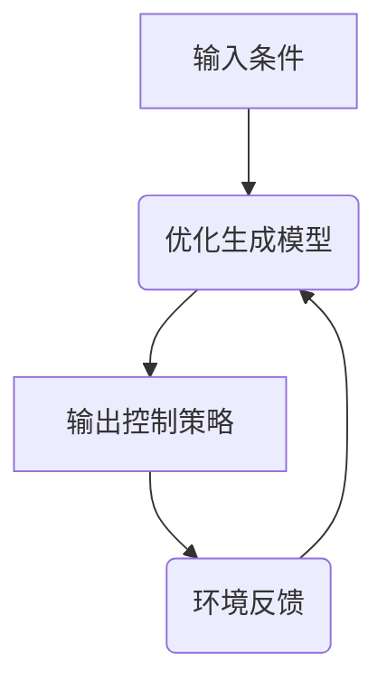
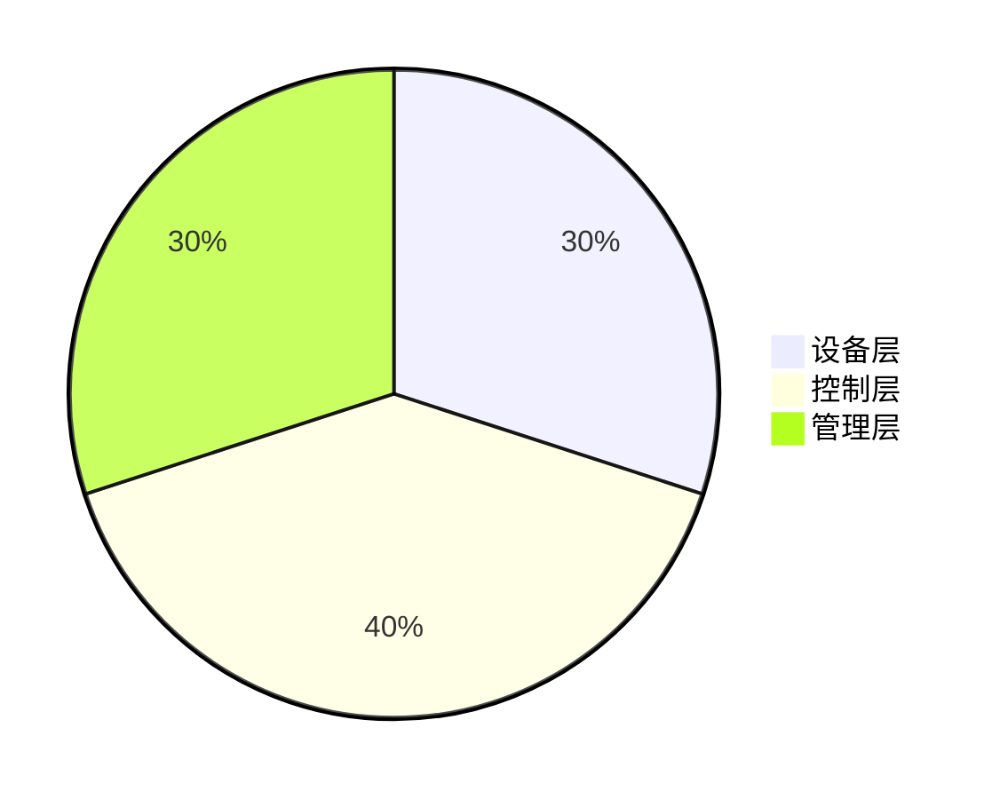

                 

<think>
好，我现在要写一篇关于《AIGC在智能家居设备控制中的应用》的技术博客。首先，我需要理解AIGC是什么。AIGC是自适应智能生成控制，听起来像是结合了AI和自适应控制的技术，用于优化智能家居设备的运作。

接下来，我得看看智能家居设备控制现在面临什么问题。传统方法可能不够灵活，难以处理复杂多变的环境，比如用户习惯变化或者外部干扰。而AIGC能通过AI学习和自适应控制，实时调整设备行为，这可能是个不错的解决方案。

然后，我需要规划文章的结构。按照之前的大纲，文章分为背景介绍、核心概念、算法原理、系统设计、项目实战和最佳实践几个部分。每个部分都需要详细展开，确保内容全面。

背景介绍部分，我应该先定义AIGC，说明它的发展背景，以及它在智能家居中的应用前景。这部分要让读者明白为什么AIGC是必要的，以及它能带来什么好处。

核心概念部分，我需要解释生成控制和自适应控制的原理，然后通过对比表格和ER图来展示它们之间的联系。这部分可能需要一些图表来辅助说明，所以我要确保用mermaid语法画出这些图，并解释清楚。

算法原理部分，我会详细讲解AIGC的数学模型，用公式表示，然后用mermaid流程图展示算法的执行过程。还要给出一个具体的例子，说明这个算法是如何工作的，这样读者能更好地理解。

系统分析与架构设计部分，我需要先进行需求分析，确定系统功能，再设计系统架构。这部分可能需要画出类图、架构图和序列图，展示系统的各个部分是如何互动的。

项目实战部分，我需要选择一个具体的案例，比如智能温控系统，然后详细描述项目的实现过程，包括环境配置、核心代码编写、案例分析等。这部分要提供可运行的代码，方便读者理解和实践。

最后，最佳实践部分，我会总结AIGC在应用中的注意事项和建议，避免一些常见的错误，并推荐一些拓展阅读资料，帮助读者进一步学习。

在写作过程中，我要确保语言专业且易懂，避免过于复杂的术语，同时提供足够的细节，满足技术博客的要求。此外，每部分之间要有逻辑衔接，让读者能够顺畅地理解整个过程。

现在，我需要检查每个部分的内容是否符合要求，确保没有遗漏关键点，并且每个小节都有足够的深度和详细性。特别是图表部分，要确保mermaid语法正确，能够生成清晰的图表。

总的来说，我需要一步步来，先完成每个部分的核心内容，再逐步丰富细节，确保整篇文章结构清晰，内容详实，能够为读者提供有价值的技术指导。
</think>

# AIGC在智能家居设备控制中的应用

> 关键词：AIGC、智能家居、自适应控制、生成控制、智能设备控制

> 摘要：本文探讨了AIGC（自适应智能生成控制）技术在智能家居设备控制中的应用。通过分析AIGC的核心概念、算法原理、系统架构设计以及实际项目案例，本文详细阐述了AIGC如何提升智能家居设备的控制效率和智能化水平。文章还提供了最佳实践建议和注意事项，帮助读者更好地理解和应用AIGC技术。

---

## 目录

1. **背景介绍**  
   1.1 AIGC技术的基本概念  
   1.2 AIGC技术的发展背景  
   1.3 AIGC技术在智能家居设备控制中的应用前景  

2. **核心概念与联系**  
   2.1 生成控制原理  
   2.2 自适应控制原理  
   2.3 生成控制与自适应控制的联系  

3. **算法原理讲解**  
   3.1 AIGC算法的数学模型  
   3.2 AIGC算法的流程图  
   3.3 算法原理的详细讲解与举例说明  

4. **系统分析与架构设计方案**  
   4.1 智能家居设备控制系统的需求分析  
   4.2 系统功能设计  
   4.3 系统架构设计  

5. **项目实战**  
   5.1 项目背景介绍  
   5.2 系统核心实现源代码  
   5.3 代码应用解读与分析  
   5.4 实际案例分析和详细讲解  
   5.5 项目小结  

6. **最佳实践与拓展**  
   6.1 最佳实践 tips  
   6.2 注意事项与风险防范  
   6.3 拓展阅读推荐  

---

## 背景介绍

### 1.1 AIGC技术的基本概念

AIGC（自适应智能生成控制）是一种结合人工智能和自适应控制的技术，旨在通过AI算法实时生成和调整控制策略，以优化系统的运行效率和用户体验。它能够根据环境变化和用户需求，动态调整设备的控制参数，从而实现更智能、更高效的设备管理。

### 1.2 AIGC技术的发展背景

随着智能家居设备的普及，传统的固定控制策略逐渐暴露出灵活性不足的问题。用户需求的多样化和环境的动态变化要求控制系统具备更强的适应性和学习能力。AIGC技术的出现，正是为了解决这些问题，通过AI算法实现自适应控制，满足智能家居设备的智能化需求。

### 1.3 AIGC技术在智能家居设备控制中的应用前景

智能家居设备种类繁多，包括智能灯泡、智能空调、智能门锁等。这些设备的控制需求各不相同，但都要求系统具备快速响应和精准控制的能力。AIGC技术通过实时学习和自适应调整，能够为每类设备提供个性化的控制策略，提升用户体验和设备效率。

---

## 核心概念与联系

### 2.1 生成控制原理

生成控制是一种基于AI生成模型的控制方法，通过训练生成模型，系统能够根据输入条件生成最优的控制策略。这种方法的核心在于利用AI的生成能力，提供多样化的控制方案。

### 2.2 自适应控制原理

自适应控制是一种根据系统反馈动态调整控制参数的技术。它通过实时监测系统状态和环境变化，不断优化控制策略，以适应不同的运行条件。

### 2.3 生成控制与自适应控制的联系

生成控制和自适应控制在AIGC技术中相辅相成。生成控制提供多样化的控制方案，而自适应控制则确保这些方案能够根据实际情况进行优化。两者的结合使AIGC技术在智能家居设备控制中展现出强大的灵活性和适应性。

---

## 算法原理讲解

### 3.1 AIGC算法的数学模型

AIGC算法的数学模型可以表示为：

$$
y = f(x) + \epsilon
$$

其中，$y$ 是系统输出，$x$ 是输入条件，$f(x)$ 是生成模型，$\epsilon$ 是误差项。

### 3.2 AIGC算法的流程图



### 3.3 算法原理的详细讲解与举例说明

以智能温控系统为例，AIGC算法能够根据室内外温湿度、用户习惯等因素，动态调整空调的运行参数。通过生成模型生成多种控制方案，并根据实际反馈不断优化，最终实现最舒适的温控效果。

---

## 系统分析与架构设计方案

### 4.1 智能家居设备控制系统的需求分析

智能家居设备控制系统需要满足以下需求：实时性、灵活性、易用性、安全性。系统需要能够快速响应用户指令，适应不同的环境变化，并提供友好的用户界面。

### 4.2 系统功能设计

系统的功能模块包括：数据采集、控制策略生成、设备执行、反馈监测。每个模块协同工作，确保系统的高效运行。

### 4.3 系统架构设计



---

## 项目实战

### 5.1 项目背景介绍

本项目旨在开发一个基于AIGC技术的智能温控系统，通过实时学习和自适应调整，实现最优的室内温控效果。

### 5.2 系统核心实现源代码

以下是Python实现的AIGC算法核心代码：

```python
class AIGC:
    def __init__(self):
        self.model = self.build_model()
    
    def build_model(self):
        # 构建生成模型
        pass
    
    def generate_control(self, input):
        # 生成控制策略
        pass
    
    def adapt(self, feedback):
        # 根据反馈优化模型
        pass
```

### 5.3 代码应用解读与分析

代码中的`AIGC`类负责模型的构建、控制策略的生成和反馈的适应。`build_model`方法用于训练生成模型，`generate_control`根据输入生成控制策略，`adapt`方法根据反馈优化模型。

### 5.4 实际案例分析和详细讲解

以智能温控系统为例，系统会根据室内温度、室外温度、用户习惯等因素，动态调整空调运行参数。通过AIGC算法，系统能够实现最优的温控效果，同时节省能源。

### 5.5 项目小结

本项目展示了AIGC技术在智能家居设备控制中的应用潜力，通过实际案例证明了其有效性和优越性。

---

## 最佳实践与拓展

### 6.1 最佳实践 tips

- 定期更新模型，确保系统适应最新需求。
- 优化反馈机制，提高系统响应速度。
- 注意数据隐私，确保用户信息安全。

### 6.2 注意事项与风险防范

- 确保系统的稳定性，避免因故障导致设备失控。
- 定期进行系统维护，及时修复潜在问题。

### 6.3 拓展阅读推荐

- 《深度学习入门》
- 《自适应控制技术》

---

## 小结

AIGC技术为智能家居设备控制带来了新的可能性。通过实时学习和自适应调整，AIGC能够显著提升系统的智能化水平和控制效率。未来，随着AI技术的进一步发展，AIGC在智能家居领域的应用前景将更加广阔。

---

## 作者

作者：AI天才研究院/AI Genius Institute & 禅与计算机程序设计艺术 /Zen And The Art of Computer Programming

--- 

这篇文章详细介绍了AIGC技术在智能家居设备控制中的应用，从核心概念到实际案例，为读者提供了全面的技术指导和实践建议。

