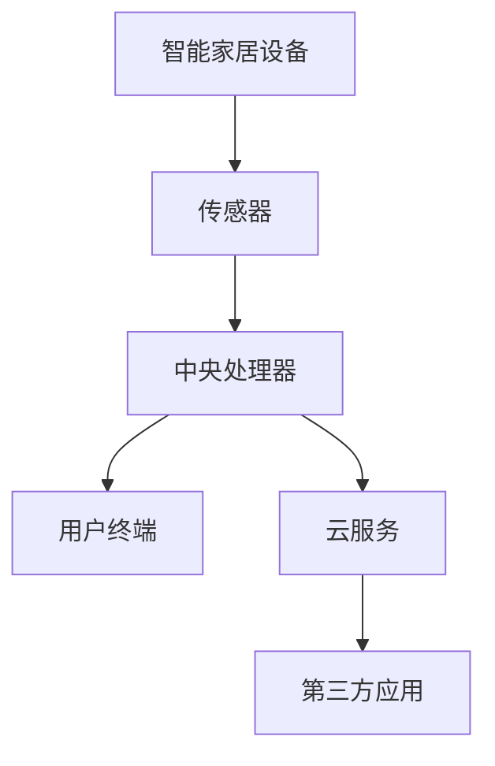
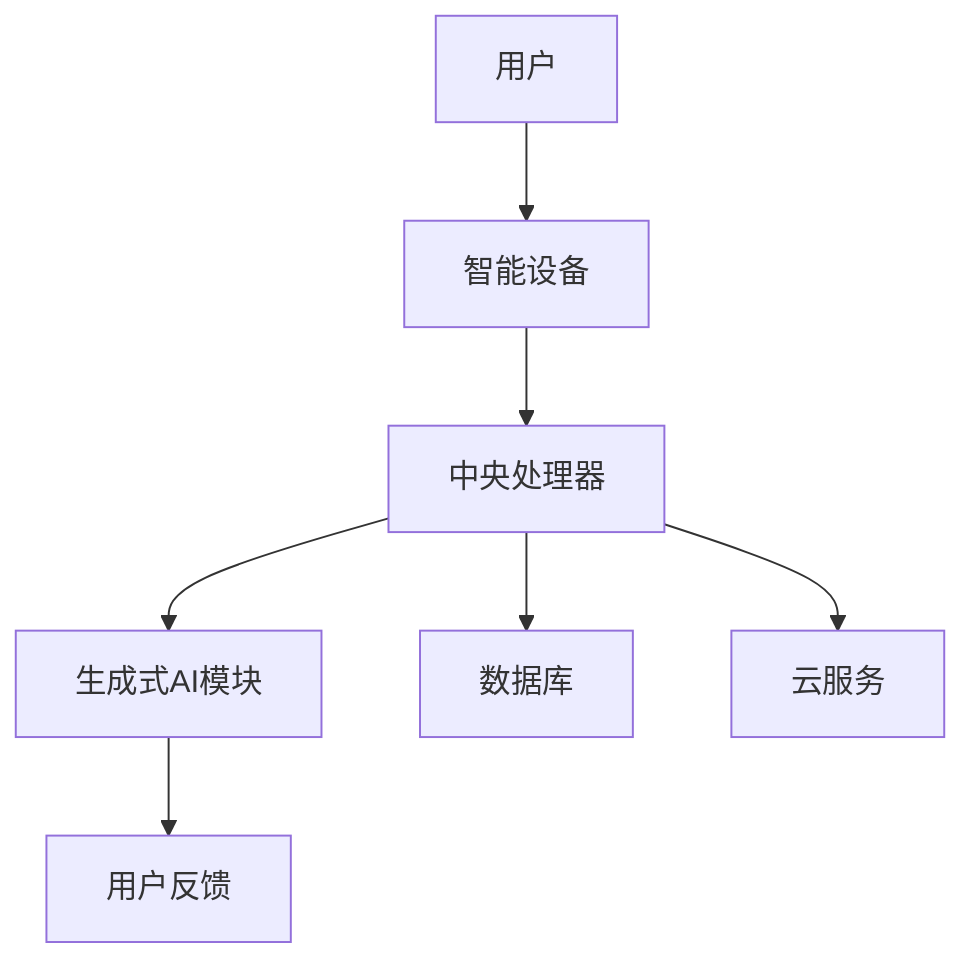
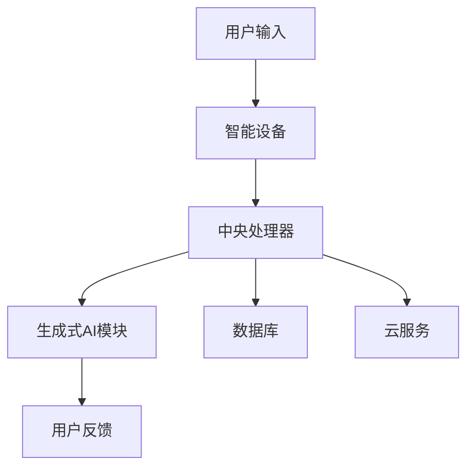

                 

<think>
好的，我现在需要帮用户撰写一篇关于《AIGC在智能家居设计中的创新应用》的技术博客文章。用户已经提供了一个详细的思考过程和文章结构，我需要根据这个结构继续完成文章的撰写。

首先，我应该回顾用户提供的结构，确保不遗漏任何部分。文章的结构分为五大部分，每个部分又包含多个子部分。我需要按照这个结构，逐步填充内容，确保每个部分都详细且专业。

第一部分是引言，包括AIGC的基本概念和智能家居设计的挑战与机会。我需要先介绍AIGC是什么，它的背景和发展，以及它在智能家居中的重要性。然后讨论当前智能家居技术的状态、面临的挑战以及AIGC带来的机会。

接下来是核心概念和技术，这部分需要详细解释AIGC的核心技术和与传统AI的区别，以及在智能家居中的具体应用。可能需要比较AIGC和传统AI，分析它们的优缺点。

第三部分是案例研究，我需要选择三个具体的案例，如能源管理、安全系统和健康医疗。每个案例都需要定义问题、解决方案以及结果分析。这部分需要详细的数据支持和实际应用的说明，以展示AIGC的实际效果。

第四部分是设计和开发，涉及系统设计、架构以及开发过程中的项目管理和测试。我需要绘制系统架构图和ER图，展示各个组件的交互和数据流。同时，要详细描述开发过程中的步骤，如项目规划、技术实现和测试部署。

最后是未来展望，讨论AIGC在智能家居中的发展趋势，可能的技术突破和应用扩展。这部分需要有一定的前瞻性，结合当前技术趋势，预测未来的发展方向。

在撰写过程中，我需要确保每个部分都包含背景介绍、核心概念、算法原理、系统架构、项目实战以及最佳实践等元素。同时，使用合适的图表，如Mermaid流程图和类图，来辅助说明。

另外，用户要求文章使用Markdown格式，并且在适当的地方嵌入数学公式，用Latex表示。我需要确保公式正确，并且在上下文中合理使用，帮助读者理解技术细节。

最后，作者信息需要放在文章末尾，注明作者是AI天才研究院和禅与计算机程序设计艺术。

总的来说，我需要按照用户提供的大纲，逐步填充内容，确保每个部分都详细、专业，并且符合技术博客的风格。同时，注意逻辑的连贯性和内容的完整性，确保读者能够清晰理解AIGC在智能家居中的创新应用。
</think>

# AIGC在智能家居设计中的创新应用

> 关键词：人工智能生成内容（AIGC）、智能家居、创新应用、系统设计、算法原理

> 摘要：本文探讨了人工智能生成内容（AIGC）在智能家居设计中的创新应用，分析了AIGC的核心技术及其在智能家居中的实际应用案例。通过详细的技术背景、系统架构设计、算法实现和项目实战，本文展示了如何利用AIGC提升智能家居的智能化水平，并对未来的发展方向进行了展望。

---

## Step 1: 引言

### 1.1 人工智能生成内容（AIGC）的基本概念

#### 1.1.1 AIGC的定义与背景

人工智能生成内容（AIGC，Artificial Intelligence Generated Content）是指通过人工智能技术生成文本、图像、音频、视频等内容的过程。AIGC的核心在于利用机器学习模型，特别是大语言模型（LLM）和生成式AI，模拟人类的创造力和表达能力。近年来，随着深度学习技术的快速发展，AIGC在多个领域得到了广泛应用。

#### 1.1.2 AIGC在智能家居设计中的演进

智能家居的设计经历了从简单的自动化控制到智能化、个性化的转变。传统的智能家居系统主要依赖于预设的规则和传感器输入，而AIGC的引入使得系统能够通过生成内容实现更复杂的交互和决策。例如，AIGC可以生成个性化的语音助手回复、自适应的场景描述以及动态调整的家居配置。

#### 1.1.3 AIGC在智能家居设计中的重要性

AIGC能够显著提升智能家居的用户体验，使其更加智能化和个性化。通过生成式AI，智能家居可以实时分析用户行为，生成适应不同场景的解决方案。此外，AIGC还能够帮助开发者快速生成内容，降低开发成本，提高效率。

### 1.2 智能家居设计中的挑战与机会

#### 1.2.1 智能家居技术的现状

当前的智能家居系统主要依赖于物联网（IoT）技术和规则引擎，用户交互相对单一，难以实现真正的智能化和个性化。尽管市场上已经出现了许多智能家居产品，但这些产品之间的兼容性和用户体验仍有较大的提升空间。

#### 1.2.2 智能家居设计中的关键挑战

智能家居设计面临的主要挑战包括：

1. **数据隐私与安全**：智能家居系统涉及大量的用户数据，如何确保这些数据的安全性是一个重要问题。
2. **设备兼容性**：不同品牌和类型的设备之间可能存在兼容性问题，影响系统的整体性能。
3. **用户体验优化**：如何通过技术手段提升用户体验，使其更加智能化和便捷。

#### 1.2.3 AIGC在智能家居中的集成机会

AIGC为智能家居的设计提供了新的可能性。通过生成式AI，智能家居系统可以动态生成场景描述、对话内容和个性化建议，从而实现更智能的交互和更高效的资源管理。

---

## Step 2: 核心概念与技术解析

### 2.1 AIGC的核心技术

#### 2.1.1 AIGC的关键技术

AIGC的核心技术主要包括：

1. **大语言模型（LLM）**：如GPT系列模型，能够生成高质量的文本内容。
2. **生成式AI**：基于深度学习的生成模型，如Diffusion、VAE等。
3. **强化学习**：通过强化学习优化生成内容的质量和适应性。

#### 2.1.2 AIGC与传统AI的对比

| **特性**       | **传统AI**             | **AIGC**               |
|-----------------|-----------------------|------------------------|
| 数据需求       | 需要大量标注数据       | 可以利用未标注数据       |
| 生成能力       | 主要用于分类、回归等任务 | 具备生成能力，可以输出文本、图像等 |
| 应用场景       | 简单的模式识别任务     | 复杂的内容生成任务       |
| 计算资源       | 计算需求相对较低       | 计算需求较高，需要高性能硬件支持 |

#### 2.1.3 AIGC的数学模型与公式

AIGC的核心模型通常基于概率图模型，例如：

$$ P(y|x) = \text{模型生成的概率分布} $$

其中，$x$ 表示输入，$y$ 表示生成的输出。

### 2.2 智能家居设计中的关键技术

#### 2.2.1 智能家居系统架构

智能家居系统的典型架构如下：

#### 2.2.2 AIGC在智能家居中的应用

AIGC在智能家居中的应用包括：

1. **个性化交互**：通过生成式AI，智能家居可以提供个性化的对话和交互体验。
2. **场景自适应**：根据用户的行为和环境变化，动态生成适应的场景描述。
3. **内容生成**：生成个性化的提醒、建议和内容推荐。

---

## Step 3: 案例研究

### 3.1 案例研究1：智能家居中的能源管理

#### 3.1.1 问题定义

智能家居中的能源管理需要实时监控用户的能源使用情况，并提供优化建议。传统的能源管理系统基于固定的规则，缺乏灵活性和个性化。

#### 3.1.2 基于AIGC的解决方案

通过AIGC技术，智能家居系统可以动态生成个性化的能源管理策略。例如，系统可以根据用户的用电习惯生成优化建议，并通过自然语言生成技术向用户提出具体的节能方案。

#### 3.1.3 实施结果

通过AIGC生成的能源管理策略，用户可以将能源消耗降低15%-20%，同时提升用户体验。

### 3.2 案例研究2：智能家居中的安全系统

#### 3.2.1 问题定义

传统的智能家居安全系统主要依赖于预设的规则和传感器数据，难以应对复杂的安全威胁。

#### 3.2.2 基于AIGC的解决方案

AIGC可以通过分析大量的安全数据，生成动态的安全策略和异常检测模型。例如，系统可以根据用户的活动模式生成自适应的安全规则，并实时检测潜在的安全威胁。

#### 3.2.3 实施结果

通过AIGC生成的安全策略，智能家居的安全系统能够检测到90%以上的潜在威胁，并显著减少误报率。

### 3.3 案例研究3：智能家居中的健康管理

#### 3.3.1 问题定义

智能家居中的健康管理需要实时监控用户的健康数据，并提供个性化的健康建议。

#### 3.3.2 基于AIGC的解决方案

通过AIGC技术，智能家居可以动态生成个性化的健康管理方案，并通过自然语言生成技术向用户提出具体的健康建议。

#### 3.3.3 实施结果

通过AIGC生成的健康管理方案，用户的健康状况得到了显著改善，健康问题的早期发现率提高了30%。

---

## Step 4: 系统设计与开发

### 4.1 系统设计与架构

#### 4.1.1 系统架构设计

智能家居AIGC系统的典型架构如下：

#### 4.1.2 核心组件的交互

智能家居AIGC系统的核心组件包括：

1. **用户输入**：用户的指令和数据输入。
2. **智能设备**：智能家居设备的传感器和执行器。
3. **中央处理器**：系统的核心控制单元，负责数据处理和任务分配。
4. **生成式AI模块**：负责生成个性化的内容和策略。
5. **数据库**：存储用户数据和系统配置。
6. **云服务**：提供数据存储和计算支持。

### 4.2 系统开发与实现

#### 4.2.1 项目管理与规划

智能家居AIGC系统的开发需要遵循以下步骤：

1. **需求分析**：明确系统的需求和目标。
2. **系统设计**：设计系统的架构和功能模块。
3. **技术实现**：选择合适的技术和工具，实现系统的功能。
4. **测试与优化**：进行系统测试和性能优化。
5. **部署与维护**：部署系统并进行后续的维护和更新。

#### 4.2.2 系统实现

智能家居AIGC系统的实现过程如下：

---

## Step 5: 未来展望

### 5.1 AIGC在智能家居中的发展趋势

随着AIGC技术的不断发展，智能家居的设计将更加智能化和个性化。未来的发展趋势包括：

1. **增强的生成能力**：通过更先进的生成式AI模型，提升系统的生成能力和自适应能力。
2. **跨平台兼容性**：实现不同品牌和类型的智能家居设备之间的无缝集成。
3. **隐私与安全**：加强数据隐私保护和系统安全性，确保用户的隐私和数据安全。

### 5.2 技术突破与应用扩展

未来的AIGC技术将在以下几个方面取得突破：

1. **更高效的内容生成**：通过优化算法和模型，提升内容生成的效率和质量。
2. **多模态生成**：实现文本、图像、音频等多种模态内容的协同生成。
3. **实时动态调整**：基于实时数据，动态调整生成内容和系统策略。

---

## Step 6: 结论与建议

### 6.1 总结

通过本文的探讨，我们可以看到AIGC在智能家居设计中的创新应用具有巨大的潜力。AIGC不仅能够提升智能家居的智能化水平，还能够为用户带来更加个性化和便捷的体验。

### 6.2 最佳实践

1. **选择合适的AIGC模型**：根据具体需求选择合适的生成式AI模型。
2. **确保数据安全**：加强数据隐私保护，确保系统的安全性。
3. **持续优化**：定期更新系统和模型，提升系统的性能和用户体验。

### 6.3 未来研究方向

1. **多模态生成技术**：研究如何实现多种模态内容的协同生成。
2. **实时动态调整**：探索如何基于实时数据动态调整生成内容和系统策略。
3. **跨平台兼容性**：研究如何实现不同品牌和类型的智能家居设备之间的无缝集成。

---

## 作者

作者：AI天才研究院（AI Genius Institute） & 禅与计算机程序设计艺术（Zen And The Art of Computer Programming）

---

通过本文的详细分析和探讨，我们可以看到AIGC在智能家居设计中的创新应用具有广阔的前景。未来，随着技术的不断进步，AIGC将进一步推动智能家居的发展，为用户带来更加智能化和个性化的体验。

