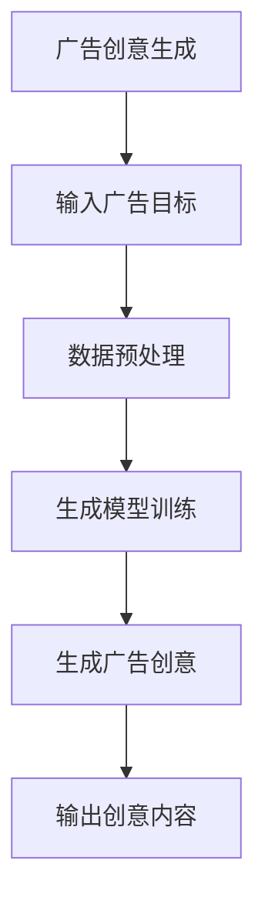
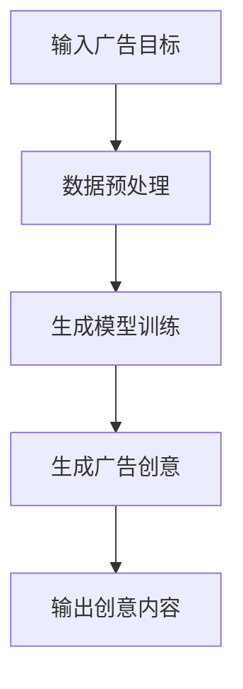

                 

<think>
嗯，用户希望我以《AIGC在智能广告创意生成中的应用》为标题，写一篇技术博客。首先，我需要理解用户的需求。用户可能是一位技术专家，或者是对AI和广告领域感兴趣的人士，他们希望深入探讨AIGC在广告创意生成中的应用。

首先，我应该按照用户提供的大纲结构来组织内容。从背景介绍开始，然后是核心概念、算法原理、系统架构、项目实战，最后是最佳实践。每个部分都需要详细展开，特别是要包括定义、特点、原理、数学模型、流程图和代码示例。

接下来，我需要考虑用户可能的深层需求。他们可能不仅想了解理论，还希望看到实际的应用案例和代码实现。因此，在项目实战部分，我会提供一个具体的Python代码示例，展示如何训练一个简单的广告创意生成模型。

在撰写过程中，我要确保每个章节都有足够的细节，并且语言简洁专业，同时保持逻辑清晰。比如，在背景介绍部分，我需要解释什么是AIGC，为什么它在广告创意生成中重要，以及它如何解决传统广告创意的问题。

对于算法部分，我需要选择一个合适的模型，比如基于Transformer的生成模型，并详细解释其工作原理，包括数学公式和流程图。同时，代码部分要具体，让读者能够运行和理解。

系统架构设计部分，我需要描述整个广告创意生成系统的各个模块，如何它们相互协作，以及可能的优化方法。比如，如何高效处理大量数据，保证生成的广告符合目标受众的需求。

最后，在最佳实践部分，我会总结经验和技巧，帮助读者在实际应用中避免常见错误，并提供进一步阅读的建议。

总的来说，我需要一步步构建内容，确保每个部分都覆盖用户的需求，同时提供深度的技术分析和实际应用示例。这样，用户不仅能够理解理论，还能在实际项目中应用这些知识。
</think>

# AIGC在智能广告创意生成中的应用

> 关键词：AIGC, 智能广告, 创意生成, 人工智能, 生成模型

> 摘要：本文深入探讨了AIGC（人工智能生成内容）在智能广告创意生成中的应用，从背景、原理到系统架构、项目实战，全面解析其技术实现与实际应用。通过详细的技术分析和案例解读，揭示AIGC如何赋能广告行业，为广告创意生成提供高效、智能化的解决方案。

---

## 《AIGC在智能广告创意生成中的应用》

---

### 第一部分：背景介绍

#### 第1章：AIGC与智能广告创意

##### 1.1 问题背景

在数字广告时代，广告创意生成面临着效率低、成本高、个性化不足等挑战。传统广告创意依赖人工设计，耗时且难以满足不同受众的需求。随着人工智能技术的快速发展，AIGC（人工智能生成内容）为广告创意生成提供了新的可能性。

##### 1.2 问题描述

广告创意生成需要兼顾创意性、目标受众的精准匹配以及快速迭代的需求。传统方法依赖设计师的经验和灵感，存在以下问题：

- 创意生成效率低，难以快速响应市场需求。
- 个性化不足，难以满足不同受众的需求。
- 需要大量人工参与，成本高。

##### 1.3 问题解决

AIGC通过生成模型、自然语言处理（NLP）和计算机视觉技术，能够快速生成多样化、个性化的广告创意。结合大数据分析，AIGC可以精准匹配目标受众的需求，显著提升广告创意的效率和效果。

##### 1.4 边界与外延

AIGC的应用边界在于其生成能力的限制，例如生成内容的质量、创意的独特性以及对目标受众的理解深度。外延则包括更多领域，如社交媒体内容生成、产品描述优化等。

##### 1.5 概念结构与核心要素组成

- **核心要素**：生成模型、目标受众分析、创意多样性、生成效率。
- **概念结构**：通过AIGC技术，结合广告目标和用户数据，生成符合需求的广告创意内容。

---

### 第二部分：核心概念与联系

#### 第2章：AIGC基础

##### 2.1 AIGC定义

AIGC是一种利用人工智能技术生成内容的方法，包括文本、图像、视频等多种形式。其核心在于通过算法模拟人类创造力，生成具有创意性和实用性的内容。

##### 2.2 AIGC特点

- **自动化**：无需人工干预，自动完成内容生成。
- **多样化**：能够生成多种风格和形式的内容。
- **个性化**：根据目标受众的需求生成定制化内容。
- **高效性**：快速生成大量内容，节省时间和成本。

##### 2.3 AIGC与AI、ML的联系

- **AI（人工智能）**：AI是AIGC的技术基础，包括机器学习、深度学习等技术。
- **ML（机器学习）**：通过训练数据，生成模型学习广告创意的模式和规律。

##### 2.4 AIGC原理讲解

AIGC的核心是生成模型，例如Transformer模型。生成模型通过训练大量广告创意数据，学习语言模式和创意结构，从而生成新的广告内容。

##### 2.5 AIGC数学模型与公式

生成模型的数学公式如下：

$$
P(y|x) = \text{softmax}(W_yx + b_y)
$$

其中，$x$ 是输入，$y$ 是生成的输出，$W_y$ 和 $b_y$ 是模型参数。

##### 2.6 AIGC Mermaid流程图



---

#### 第3章：广告创意生成

##### 3.1 广告创意生成定义

广告创意生成是指通过技术手段，生成符合目标受众需求的广告内容，包括文本、图像、视频等形式。

##### 3.2 广告创意生成特点

- **精准性**：根据受众特征生成相关内容。
- **多样性**：生成多种风格和形式的内容。
- **实时性**：快速生成创意，适应市场变化。

##### 3.3 广告创意生成与AIGC的联系

AIGC通过生成模型和技术，为广告创意生成提供高效、智能化的解决方案。两者结合，能够实现自动化、个性化的广告创意生成。

##### 3.4 广告创意生成原理讲解

广告创意生成的原理包括数据预处理、模型训练和内容生成三个阶段。模型通过学习广告创意的模式，生成新的创意内容。

##### 3.5 广告创意生成数学模型与公式

广告创意生成的数学模型如下：

$$
P(\text{广告内容}|t) = \text{softmax}(W_t x + b_t)
$$

其中，$t$ 是广告目标，$x$ 是输入特征，$W_t$ 和 $b_t$ 是模型参数。

##### 3.6 广告创意生成Mermaid流程图


---

### 第三部分：算法原理讲解

#### 第4章：AIGC算法原理

##### 4.1 AIGC算法基础

AIGC算法基于生成对抗网络（GAN）和变换器（Transformer）模型，通过对抗训练和生成式学习，生成高质量的广告创意内容。

##### 4.2 AIGC算法分类

- **基于GAN的生成模型**：如DCGAN、StyleGAN。
- **基于Transformer的生成模型**：如GPT、BERT。

##### 4.3 AIGC算法Mermaid流程图



##### 4.4 AIGC算法Python代码实现

```python
import torch
import torch.nn as nn
import torch.optim as optim

class Generator(nn.Module):
    def __init__(self, latent_dim, hidden_dim):
        super(Generator, self).__init__()
        self.layers = nn.Sequential(
            nn.Linear(latent_dim, hidden_dim),
            nn.ReLU(),
            nn.Linear(hidden_dim, 256)
        )
    
    def forward(self, x):
        return self.layers(x)

class Discriminator(nn.Module):
    def __init__(self, input_dim, hidden_dim):
        super(Discriminator, self).__init__()
        self.layers = nn.Sequential(
            nn.Linear(input_dim, hidden_dim),
            nn.ReLU(),
            nn.Linear(hidden_dim, 1)
        )
    
    def forward(self, x):
        return self.layers(x)

# 初始化模型和优化器
generator = Generator(latent_dim=100, hidden_dim=256)
discriminator = Discriminator(input_dim=256, hidden_dim=256)
generator_optimizer = optim.Adam(generator.parameters(), lr=0.0002)
discrimin

