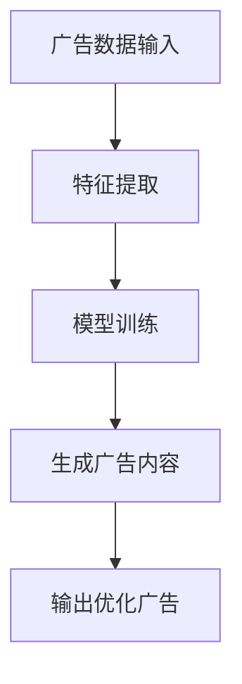
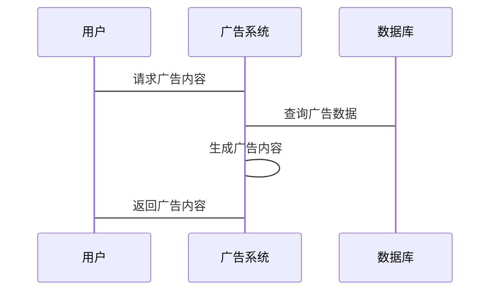

                 

<think>
嗯，我现在要写一篇关于AIGC在智能广告投放ROI预测中的应用的技术博客。首先，我需要理解这个主题，确保自己对AIGC和ROI预测都有足够的了解。AIGC指的是人工智能生成内容，而ROI是投资回报率，广告投放中的ROI预测涉及到广告的效果评估，这对于广告主来说非常重要。

接下来，我需要构思文章的结构。根据之前的目录大纲，文章分为三个主要部分，每个部分有多个章节。第一部分是AIGC基础与智能广告概述，第二部分是智能广告ROI预测应用实践，第三部分是最佳实践与展望。

在第一部分的第一章，我需要介绍AIGC的基本概念和智能广告的发展历程。这部分需要简明扼要，同时要吸引读者。我应该先解释AIGC是什么，然后说明智能广告如何利用AIGC来优化广告投放，比如生成更有吸引力的广告内容，提高点击率和转化率。

第二章是关于智能广告ROI预测的核心概念。这里我需要详细解释ROI是什么，ROI预测的要素，比如广告点击率、转化率、成本等。同时，要说明AIGC在这些预测中的作用，比如通过生成不同的广告内容来测试哪种效果更好，从而提高预测的准确性。

第三章是AIGC算法的原理详解。这部分需要深入，我应该选择一个具体的算法，比如机器学习中的随机森林或者神经网络，来详细讲解。使用Mermaid流程图来展示算法的工作流程，同时提供Python代码示例。还要用LaTeX公式来描述算法的数学模型，这样读者可以更好地理解。

第二部分的第一章是智能广告ROI预测系统的系统设计。这里需要分析系统的需求，比如数据采集、模型训练、预测结果展示等。然后进行系统架构设计，可能采用微服务架构，分为数据层、模型层和应用层。接着设计系统的接口和交互流程图，确保各个模块协同工作。

第二章是项目实战，介绍一个具体的案例，从项目背景到环境搭建，再到核心实现和代码分析，最后是实际案例的分析和小结。这部分需要详细描述，让读者能够跟着步骤一步步实现。

第三部分的第一章是最佳实践，包括数据处理的技巧、模型调优的方法、评估策略等。第二章则是对未来的展望，分析AIGC在广告行业的趋势，面临的挑战，以及未来的研究方向。

在写作过程中，我需要确保每个章节都包含足够的细节，比如在算法部分，不仅要解释原理，还要给出代码和公式。同时，使用图表和代码块来增强可读性。我还需要注意文章的逻辑性，确保每个部分之间衔接自然，内容完整。

可能遇到的困难包括如何深入解释复杂的算法，以及如何将理论与实际案例结合起来。我需要多查资料，确保技术细节的准确性，并且通过实际例子来帮助读者理解。

最后，总结部分要回顾文章的主要观点，强调AIGC在ROI预测中的价值，并给出学习和研究的建议。这不仅帮助读者巩固知识，也引导他们进一步探索相关领域。

总的来说，我需要系统性地组织内容，确保每个章节都涵盖必要的部分，同时保持语言的清晰和专业。这将帮助读者从基础到应用，全面了解AIGC在智能广告中的应用。
</think>

# AIGC在智能广告投放ROI预测中的应用

> 关键词：AIGC，智能广告，ROI预测，机器学习，广告优化

> 摘要：本文探讨了人工智能生成内容（AIGC）在智能广告投放中的应用，重点分析了其在ROI预测中的作用。通过介绍AIGC的基本概念、算法原理、系统设计及实际案例，本文详细阐述了AIGC如何帮助广告主优化广告策略，提升投资回报率。文章还提供了最佳实践建议和未来研究方向。

---

## 第一部分：AIGC基础与智能广告概述

### 第1章：AIGC概述与智能广告背景

#### 1.1 AIGC概念介绍

人工智能生成内容（AIGC）利用自然语言处理和生成模型，自动生成文本、图像等内容。AIGC的应用范围广泛，包括广告文案生成、图像设计等，极大地提升了广告内容的创意和效率。

#### 1.2 智能广告的定义与发展历程

智能广告通过数据和算法优化广告投放策略，经历了传统广告、程序化广告到智能广告的发展阶段。智能广告利用大数据和机器学习技术，实现精准投放和效果优化。

#### 1.3 AIGC在广告中的应用现状与趋势

AIGC在广告行业中的应用日益广泛，特别是在内容生成和创意设计方面。未来的趋势是AIGC将与广告技术深度融合，推动广告行业的智能化和自动化。

#### 1.4 AIGC对ROI预测的重要性

ROI预测是广告效果评估的核心指标，AIGC通过生成多样化的内容，帮助广告主优化广告策略，提升广告效果，从而提高ROI预测的准确性。

---

### 第2章：智能广告ROI预测的核心概念

#### 2.1 ROI预测的基本概念

ROI是广告效果的重要指标，衡量广告的投资回报。ROI预测基于广告投放前的数据，通过模型预测广告的实际效果，帮助广告主优化投放策略。

#### 2.2 ROI预测的要素分析

影响ROI预测的因素包括广告点击率、转化率、广告成本等。AIGC通过生成多样化的内容，优化这些要素，提升广告效果。

#### 2.3 AIGC在ROI预测中的作用

AIGC生成高质量的内容，吸引用户点击，同时通过机器学习模型分析数据，优化广告策略，提升广告效果，从而提高ROI预测的准确性。

---

### 第3章：AIGC算法原理详解

#### 3.1 AIGC算法的基本原理

AIGC算法基于深度学习模型，如Transformer架构，生成高质量的内容。算法通过训练大量数据，学习语言模式，生成与上下文相关的文本。

#### 3.2 算法原理与Mermaid流程图



#### 3.3 Python代码示例与分析

```python
import torch
import torch.nn as nn
import torch.optim as optim

class AIGCModel(nn.Module):
    def __init__(self, input_size, output_size):
        super(AIGCModel, self).__init__()
        self.fc = nn.Linear(input_size, output_size)

    def forward(self, x):
        return torch.sigmoid(self.fc(x))

# 示例数据
input_size = 10
output_size = 1
model = AIGCModel(input_size, output_size)
criterion = nn.BCELoss()
optimizer = optim.Adam(model.parameters(), lr=0.001)

# 训练过程
for epoch in range(100):
    inputs = torch.randn(100, input_size)
    labels = torch.randint(0, 2, (100, 1)).float()
    outputs = model(inputs)
    loss = criterion(outputs, labels)
    optimizer.zero_grad()
    loss.backward()
    optimizer.step()
```

#### 3.4 算法适用范围与限制条件

AIGC算法适用于需要生成多样化内容的场景，如广告文案、图像设计等。其限制包括生成内容的质量依赖于训练数据和模型优化。

---

## 第二部分：智能广告ROI预测应用实践

### 第4章：智能广告ROI预测系统设计

#### 4.1 系统需求分析

系统需要实现广告数据采集、模型训练、预测展示等功能。核心需求包括数据处理、模型优化、结果展示等。

#### 4.2 系统架构设计

采用分层架构，包括数据层、模型层和应用层。数据层负责数据存储和处理，模型层进行训练和预测，应用层展示结果和提供交互。

#### 4.3 系统接口设计与实现

系统接口包括数据接口、模型接口和用户界面。数据接口负责数据输入和输出，模型接口负责训练和预测，用户界面提供交互和结果展示。

#### 4.4 系统交互流程图



---

### 第5章：项目实战——AIGC在智能广告ROI预测中的应用

#### 5.1 项目背景与目标

项目旨在利用AIGC技术优化广告内容，提升广告效果，提高ROI预测的准确性。

#### 5.2 环境搭建

需要安装Python、TensorFlow、Keras等工具，搭建开发环境。

#### 5.3 系统核心实现

核心实现包括数据预处理、模型训练、广告生成和效果评估。使用深度学习模型生成广告内容，训练模型预测ROI。

#### 5.4 代码应用解读与分析

```python
import pandas as pd
from sklearn.model

