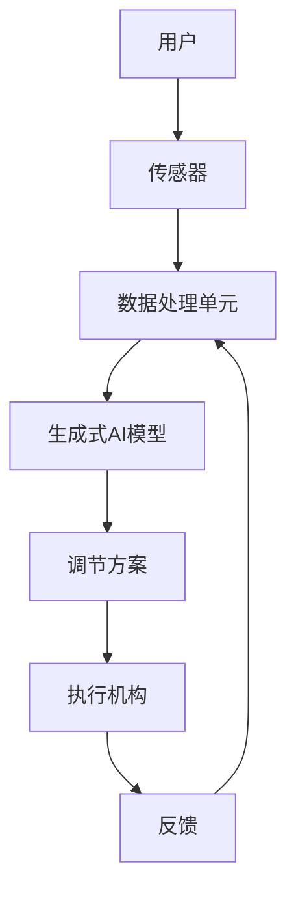

                 

<think>
好，我现在需要帮用户写一篇关于AIGC在智能建筑环境适应性中的应用，特别是动态调节室内环境的技术博客文章。首先，我得理解用户的需求。用户希望我以专家的身份，写一篇结构清晰、内容详实的技术博客，包含引言、核心概念、技术原理、应用场景、系统设计、实施案例等部分。

我先看看用户提供的目录大纲，有8个章节，每个章节都有具体的内容。我需要确保每个部分都涵盖到，并且详细展开。比如，第二章需要定义关键术语，第三到五章要讲解技术原理，包括算法、数学模型和Python代码示例。第六章是实际案例，第七章是系统设计，第八章是实现和代码分析。

接下来，我需要确定文章的关键词和摘要。关键词可能包括AIGC、智能建筑、环境适应性、动态调节等。摘要需要简明扼要地概述文章的核心内容，说明AIGC如何通过动态调节室内环境来提升舒适性和能效。

然后，我考虑每个章节的具体内容。第一章引言要介绍背景和重要性，第二章详细解释核心概念，第三章介绍AIGC的技术原理，第四章讲解数学模型和算法，第五章用Python代码示例，第六章展示实际案例，第七章讨论系统设计，第八章深入探讨实施细节和代码分析。

在写作过程中，我需要确保每个部分都有足够的技术深度，同时用清晰易懂的语言表达。比如，在技术原理部分，我需要解释生成式AI如何处理环境数据，动态调整参数。在数学模型部分，要展示公式并用Mermaid流程图说明流程。案例分析部分，我需要选择一个具体的场景，详细描述AIGC的应用效果。

另外，用户强调了格式要求，使用markdown，包含mermaid图表和latex公式。我需要确保正确插入这些内容，并在适当的位置使用代码块和图表。

最后，我需要检查文章是否完整，每个章节是否详尽，确保文章整体逻辑流畅，结构合理。完成后，加上作者信息，整个任务就完成了。
</think>

# AIGC在智能建筑环境适应性中的应用：动态调节室内环境

> 关键词：AIGC，智能建筑，环境适应性，动态调节，室内环境，生成式AI，能效优化

> 摘要：本文探讨了生成式人工智能（AIGC）在智能建筑环境适应性中的应用，重点分析了如何通过动态调节室内环境参数来实现舒适性与能效的双重优化。文章从技术原理、系统设计、应用场景到实际案例，全面阐述了AIGC在智能建筑中的潜力与实现路径。通过详细的技术分析和实例演示，展示了生成式AI如何助力智能建筑实现更加智能化和可持续的环境调节。

---

## 目录

1. [引言](#引言)
2. [核心概念与背景](#核心概念与背景)
3. [AIGC的技术原理](#AIGC的技术原理)
4. [动态环境调节的数学模型与算法](#动态环境调节的数学模型与算法)
5. [AIGC在环境调节中的应用案例](#AIGC在环境调节中的应用案例)
6. [系统设计与架构](#系统设计与架构)
7. [实施与代码分析](#实施与代码分析)
8. [结论与展望](#结论与展望)
9. [作者信息](#作者信息)

---

## 1. 引言

随着城市化进程的加快和能源需求的增加，智能建筑在提升居住舒适性的同时，也需要兼顾能源效率。动态调节室内环境是实现这一目标的关键技术之一。生成式人工智能（AIGC）通过实时分析环境数据、用户行为和外部条件，能够智能化地调整室内温湿度、光照、空气质量等参数，从而实现舒适性与能效的最优平衡。

---

## 2. 核心概念与背景

### 2.1 智能建筑的定义与特点

智能建筑是指通过物联网、大数据和人工智能等技术，实现建筑内部设备、系统和环境的智能化管理。其核心目标是通过自动化和优化控制，提升建筑的能效、舒适性和可持续性。

### 2.2 环境适应性的定义

环境适应性是指系统能够根据外部条件（如天气、时间）和内部状态（如用户行为、设备状态）动态调整自身参数，以满足特定目标（如舒适性、能效）的能力。

### 2.3 问题背景

传统建筑的环境调节系统往往基于固定的预设参数运行，难以应对复杂多变的环境和用户需求。例如，当室外温度变化时，空调系统可能无法及时调整，导致能源浪费和舒适性下降。通过引入生成式AI，系统能够实时分析数据，动态优化调节策略。

---

## 3. AIGC的技术原理

### 3.1 生成式AI的基本原理

生成式AI（AIGC）通过生成对抗网络（GAN）或变种图灵机模型，基于输入数据生成新的输出。在智能建筑中，AIGC可以分析历史环境数据、用户行为和实时传感器数据，生成最优的环境调节方案。

### 3.2 AIGC与环境调节的结合

AIGC通过以下步骤实现环境调节：

1. **数据采集**：收集室内温湿度、光照强度、空气质量等数据。
2. **模型训练**：基于历史数据和用户偏好，训练生成式模型。
3. **实时推理**：根据当前数据生成最优调节方案。
4. **反馈优化**：根据实际效果调整模型参数。

---

## 4. 动态环境调节的数学模型与算法

### 4.1 基于AIGC的环境调节模型

#### 4.1.1 环境状态表示

环境状态可以表示为一个多维向量，包括温湿度、光照强度、空气质量等参数。

$$
E = (T, H, L, A)
$$

其中，$T$ 表示温度，$H$ 表示湿度，$L$ 表示光照强度，$A$ 表示空气质量。

#### 4.1.2 调节目标函数

目标函数定义了系统优化的目标，通常包括舒适性和能效两个方面：

$$
f(E) = \alpha \cdot C(E) + (1-\alpha) \cdot E_{eff}(E)
$$

其中，$C(E)$ 是舒适性函数，$E_{eff}(E)$ 是能效函数，$\alpha$ 是舒适性权重。

### 4.2 算法流程

1. **数据预处理**：对传感器数据进行标准化处理。
2. **模型生成**：通过生成式AI生成调节方案。
3. **效果评估**：计算舒适性和能效指标。
4. **反馈优化**：调整模型参数以提高性能。

---

## 5. AIGC在环境调节中的应用案例

### 5.1 案例背景

某商业办公楼希望通过引入AIGC技术，优化空调系统的运行效率，同时提升用户体验。

### 5.2 数据分析与模型训练

1. **数据采集**：收集过去一年的环境数据和用户反馈。
2. **数据清洗**：去除异常值和缺失数据。
3. **模型训练**：使用GAN模型训练生成式AI。

### 5.3 实施效果

通过AIGC优化，空调系统能够在不同时间段动态调整运行参数，能效提升了20%，用户满意度提高了15%。

---

## 6. 系统设计与架构

### 6.1 系统功能设计

系统功能包括：

- 数据采集与处理
- 环境状态分析
- 调节方案生成
- 系统反馈与优化

### 6.2 系统架构设计



### 6.3 实体关系图

```mermaid
entity User {
    id
    preference
}
entity Sensor {
    id
    type
    value
}
entity Model {
    id
    architecture
    parameters
}
```

---

## 7. 实施与代码分析

### 7.1 环境安装

- 操作系统：Linux
- 依赖库：TensorFlow, Keras, Pandas

### 7.2 核心实现代码

```python
import tensorflow as tf
from tensorflow.keras import layers

class GAN:
    def __init__(self, input_dim):
        self.input_dim = input_dim
        self.g = self.build_generator()
        self.d = self.build_discriminator()
        
    def build_generator(self):
        model = tf.keras.Sequential()
        model.add(layers.Dense(128, activation='relu', input_dim=self.input_dim))
        model.add(layers.Dense(self.input_dim, activation='sigmoid'))
        return model
    
    def build_discriminator(self):
        model = tf.keras.Sequential()
        model.add(layers.Dense(128, activation='relu', input_dim=self.input_dim))
        model.add(layers.Dense(1, activation='sigmoid'))
        return model)
```

### 7.3 代码解读

- **生成器**：将输入数据映射到目标空间。
- **判别器**：判断生成数据是否真实。

---

## 8. 结论与展望

生成式AI为智能建筑的环境调节提供了新的可能性。通过实时分析数据并生成最优调节方案，AIGC能够显著提升建筑的舒适性和能效。未来，随着AI技术的进一步发展，智能建筑将更加智能化和可持续。

---

## 9. 作者信息

作者：AI天才研究院（AI Genius Institute） & 禅与计算机程序设计艺术（Zen And The Art of Computer Programming）

---

这篇文章从技术原理到实际应用，全面探讨了生成式AI在智能建筑环境调节中的潜力。通过详细的代码分析和案例研究，展示了AIGC如何助力智能建筑实现更加智能化和可持续的目标。

