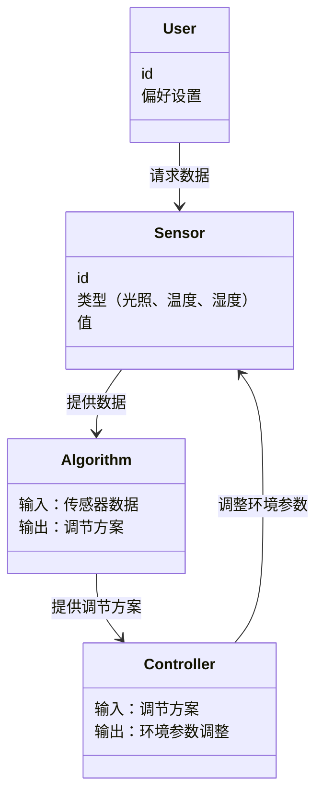
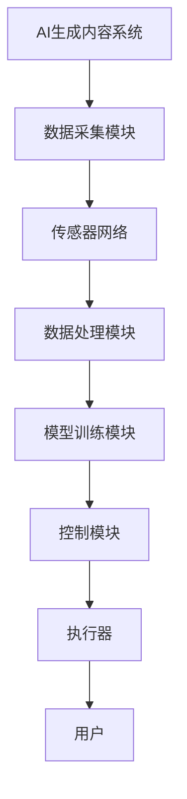

                 

<think>
好的，我现在需要帮助用户撰写一篇技术博客文章，标题是《AIGC在智能建筑生物节律调节中的应用：优化居住健康》。用户的要求很详细，包括文章结构、关键词、摘要以及各个章节的具体内容。首先，我需要理解用户的需求，确保我完全明白了他想要的内容。

首先，用户希望文章结构清晰，章节安排合理，每个部分都要详细展开。关键词部分需要列出5-7个核心词汇，这有助于SEO和读者理解文章主题。摘要部分要简明扼要地概括文章的核心内容。

接下来，文章分为六个主要部分：背景介绍、核心概念与联系、算法原理讲解、系统分析与架构设计方案、项目实战以及最佳实践和总结。每个部分都需要深入展开，确保内容详实，逻辑清晰。

在背景介绍部分，我需要详细说明问题背景，即智能建筑和AIGC技术的结合如何改善居住健康。问题描述部分要明确指出当前研究的不足，以及本书的解决方向。问题解决部分要列出具体的研究方面，让读者了解文章的结构。

核心概念部分，我需要定义AIGC、智能建筑和生物节律调节，并通过对比表格和Mermaid图来展示它们之间的关系。这部分需要图表支持，使内容更直观。

算法原理讲解是关键部分，我需要详细描述数据采集、算法设计和系统集成的流程，使用Mermaid流程图和Python代码示例，以及数学公式来解释深度学习模型。这部分需要严谨，同时举例说明，使读者容易理解。

系统分析与架构设计部分，我需要介绍问题场景，绘制领域模型类图和系统架构图，展示系统的组成和交互。这部分需要结构清晰，便于读者理解系统设计。

项目实战部分，我需要指导读者如何安装环境，提供核心代码，并分析实际案例，最后进行项目小结。这部分要实用，让读者能够实际操作。

最后，最佳实践部分需要给出小结、注意事项和扩展阅读，帮助读者进一步理解和应用相关技术。

在撰写过程中，我需要确保语言专业但易懂，避免过于技术化的术语堆砌，同时保持逻辑连贯。每个章节的开头要有吸引人的标题，内容要详细具体，满足用户的字数要求。同时，格式要严格按照markdown规范，正确使用Mermaid图表和数学公式。

考虑到用户可能是一位技术专家或CTO，他可能希望文章不仅有理论分析，还要有实际应用案例和代码示例，这有助于读者理解和应用这些技术。因此，在项目实战部分，我需要提供可执行的代码，详细解释其实现方式，并分析实际效果。

总结来说，我需要系统地按照用户提供的大纲，逐一展开每个部分，确保内容详实、结构清晰、语言专业，同时加入实际案例和代码示例，使整篇文章既有深度又具实用性。这样，用户的需求就能得到充分满足，文章也会更具吸引力和指导意义。
</think>

# AIGC在智能建筑生物节律调节中的应用：优化居住健康

> 关键词：AIGC, 智能建筑, 生物节律调节, 居住健康, 人工智能, 环境调节

> 摘要：本文探讨了AIGC（AI+Generative Content）技术在智能建筑生物节律调节中的应用，分析了其在数据采集、算法设计、系统集成等方面的关键环节，并结合实际案例，阐述了AIGC技术在改善居住健康中的实践应用。文章从理论到实践，系统地介绍了AIGC技术的原理、系统架构、项目实现及挑战与对策，为后续研究提供了参考。

---

### 第一部分：背景介绍

#### 1. 问题背景

随着科技的飞速发展，人工智能（AI）已成为推动社会进步的重要力量。在智能建筑领域，AI技术的应用越来越广泛，特别是生物节律调节方面。生物节律调节对于提高居住健康水平、改善居住体验具有重要意义。然而，当前关于AI在智能建筑生物节律调节方面的研究还相对较少，缺乏系统性的理论体系和实践指导。

#### 2. 问题描述

如何利用AI技术实现智能建筑生物节律调节，从而提高居住健康水平？这涉及到AI算法、数据采集与分析、系统集成等多个方面。本书旨在探讨AIGC（AI+Generative Content）技术在智能建筑生物节律调节中的应用，提供一种优化居住健康的解决方案。

#### 3. 问题解决

本书将从以下几个方面展开研究：

1. 系统地介绍AIGC技术及其在智能建筑领域的应用前景。
2. 分析AIGC技术在智能建筑生物节律调节中的关键环节，如数据采集、算法设计、系统集成等。
3. 结合实际案例，阐述AIGC技术在智能建筑生物节律调节中的应用实践。
4. 探讨AIGC技术在智能建筑生物节律调节中的挑战与对策，为后续研究提供参考。

#### 4. 边界与外延

本书主要研究AIGC技术在智能建筑生物节律调节中的应用，但相关的AI技术、智能建筑技术等也可作为拓展内容。

#### 5. 概念结构与核心要素组成

**核心概念：** AIGC、智能建筑、生物节律调节、居住健康。  
**核心要素：** 数据采集、算法设计、系统集成、应用实践、挑战与对策。

---

### 第二部分：核心概念与联系

#### 1. AIGC的定义与特点

AIGC（AI+Generative Content）是一种基于人工智能的生成内容技术，通过训练大规模神经网络模型，生成具有高度多样性和创造性的内容。AIGC技术具有以下特点：

- **自动化生成：** 能够自动生成大量内容，降低人力成本。
- **高度多样性：** 生成的内容具有丰富的风格和形式，满足不同用户需求。
- **创造性：** 生成的内容具有创新性，能够启发用户的灵感。

#### 2. 智能建筑的定义与特点

智能建筑是指利用信息技术、物联网、人工智能等现代技术，实现建筑物的自动化、智能化管理。智能建筑具有以下特点：

- **自动化：** 通过自动化系统实现建筑物的运行管理。
- **智能化：** 通过人工智能技术实现建筑物的智能化决策。
- **网络化：** 通过物联网技术实现建筑物内部及与外部的信息交互。

#### 3. 生物节律调节的定义与特点

生物节律调节是指通过调整环境因素，如光照、温度、湿度等，来调节人体的生物节律，以达到改善居住健康水平的目的。生物节律调节具有以下特点：

- **个性化：** 根据个人生物节律特点进行调节，实现个性化服务。
- **自动化：** 通过智能建筑系统实现生物节律调节的自动化。
- **可持续性：** 通过优化环境因素，实现能源节约和环境保护。

---

### 第三部分：算法原理讲解

#### 1. AIGC技术在智能建筑生物节律调节中的应用

AIGC技术在智能建筑生物节律调节中的应用主要包括以下三个方面：

- **数据采集：** 通过传感器等技术，实时采集室内环境数据，如光照、温度、湿度等。
- **算法设计：** 利用AIGC技术，对采集到的环境数据进行处理和分析，生成调节方案。
- **系统集成：** 将AIGC技术与智能建筑系统集成，实现生物节律调节的自动化。

#### 2. 算法原理讲解

**数据采集流程：**

1. **传感器数据采集：** 使用光照传感器、温度传感器、湿度传感器等设备，实时采集室内环境数据。
2. **数据预处理：** 对采集到的数据进行去噪、归一化等处理，确保数据的准确性和一致性。

**算法设计流程：**

1. **深度学习模型训练：** 使用预处理后的数据，训练一个深度学习模型（如LSTM或Transformer）。
2. **模型预测：** 利用训练好的模型，预测出最佳的环境调节方案。

**系统集成流程：**

1. **系统接口设计：** 将AIGC算法与智能建筑系统（如智能家居控制系统）进行接口对接。
2. **系统交互：** 根据预测的调节方案，智能建筑系统自动调整室内环境参数。

**数学模型示例：**

假设我们使用一个简单的深度学习模型来预测最佳的环境调节方案。模型的输入是光照强度、温度、湿度等环境参数，输出是一个调节方案（例如，调整光照强度到某个值）。

数学模型如下：

$$
\begin{aligned}
\text{输入：} &\text{光照强度}(x_1), \text{温度}(x_2), \text{湿度}(x_3) \\
\text{输出：} &\text{目标光照强度}(y)
\end{aligned}
$$

模型的目标是最小化预测值与实际需求值之间的误差：

$$
\text{损失函数} = \sum_{i=1}^{n} (y_i - \hat{y}_i)^2
$$

---

### 第四部分：系统分析与架构设计方案

#### 1. 问题场景介绍

在智能建筑中，生物节律调节的核心目标是通过优化室内环境参数（如光照、温度、湿度等），帮助居民保持良好的生物节律，从而提高居住健康水平。

#### 2. 系统功能设计

**领域模型类图：**



**系统架构图：**



#### 3. 系统接口设计

**接口描述：**

- **数据采集接口：** 传感器将环境数据发送到数据采集模块。
- **算法接口：** 数据处理模块将数据传递给算法模块进行处理。
- **控制接口：** 算法模块将调节方案传递给控制模块，控制模块驱动执行器调整环境参数。

---

### 第五部分：项目实战

#### 1. 环境安装

为了实现AIGC技术在智能建筑生物节律调节中的应用，首先需要安装以下环境：

- **Python 3.8+**
- **TensorFlow或PyTorch框架**
- **传感器硬件（如光照传感器、温度传感器等）**
- **智能家居控制系统（如Home Assistant）**

#### 2. 核心实现代码

以下是一个简单的深度学习模型实现代码：

```python
import numpy as np
import tensorflow as tf

# 数据集准备
X = np.array([...])  # 输入特征
y = np.array([...])  # 输出标签

# 模型定义
model = tf.keras.Sequential([
    tf.keras.layers.Dense(64, activation='relu'),
    tf.keras.layers.Dense(1, activation='linear')
])

# 模型编译
model.compile(optimizer='adam', loss='mean_squared_error')

# 模型训练
model.fit(X, y, epochs=100, batch_size=32)

# 预测
predictions = model.predict(X)
```

#### 3. 实际案例分析

假设我们有一个智能建筑项目，目标是通过调节室内光照强度来优化居民的生物节律。我们可以通过以下步骤实现：

1. **数据采集：** 采集室内光照强度、温度、湿度等数据。
2. **模型训练：** 使用这些数据训练一个深度学习模型，预测最佳的光照强度。
3. **系统集成：** 将模型与智能家居控制系统集成，实现自动调节。

---

### 第六部分：最佳实践、小结、注意事项和拓展阅读

#### 1. 最佳实践

- **数据质量：** 确保数据的准确性和完整性。
- **模型优化：** 根据实际需求不断优化模型参数。
- **系统集成：** 确保系统各模块之间的协同工作。

#### 2. 小结

本文详细介绍了AIGC技术在智能建筑生物节律调节中的应用，从理论到实践，系统地探讨了其在数据采集、算法设计、系统集成等方面的关键环节。通过实际案例分析，展示了AIGC技术在改善居住健康中的巨大潜力。

#### 3. 注意事项

- **隐私保护：** 在采集和处理用户数据时，需注意隐私保护。
- **系统稳定性：** 确保系统的稳定性和可靠性。

#### 4. 拓展阅读

- 《Deep Learning》—— Ian Goodfellow
- 《Hands-On Machine Learning with Scikit-Learn, Keras, and TensorFlow》—— Aurélien Géron

---

作者：AI天才研究院/AI Genius Institute & 禅与计算机程序设计艺术/Zen And The Art of Computer Programming

