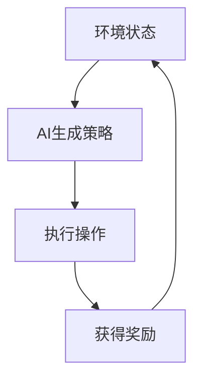
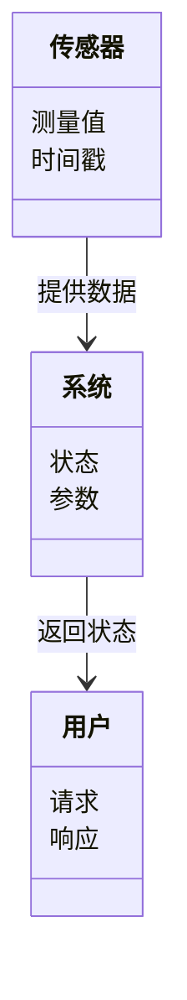
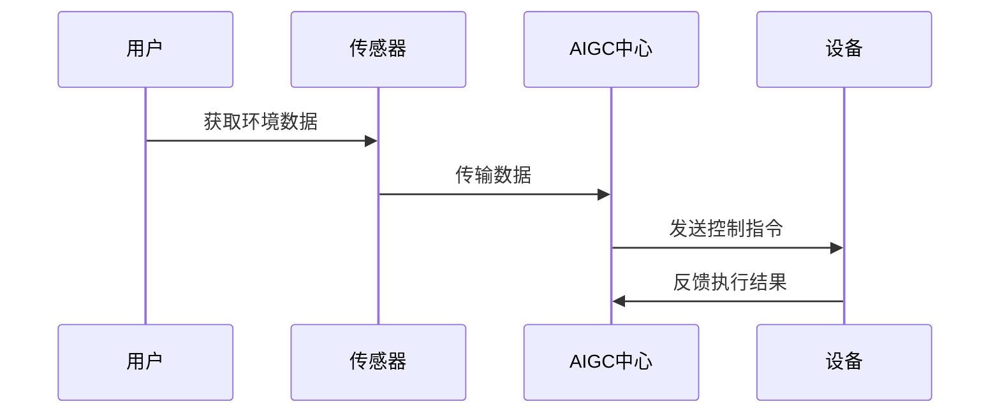

                 

<think>
嗯，用户希望我写一篇关于AIGC在智能建筑管理中的应用的技术博客。我得先理解用户的需求。他可能是一位技术专家，或者是正在研究智能建筑领域的人，想了解AIGC在这方面的应用。

首先，我需要明确文章的结构。用户已经给出了一个详细的目录大纲，里面包括背景介绍、核心概念、算法原理、数学模型、系统架构、项目实战和最佳实践。我得确保每个部分都详细且有深度。

在背景介绍里，我应该先解释什么是智能建筑，然后引出AIGC的概念，说明它如何提升管理效率。这部分要让读者明白为什么AIGC在智能建筑中是必要的。

接下来是核心概念，我需要定义AIGC，对比传统AI和AIGC的区别，可能用表格来展示。然后用Mermaid画个实体关系图，展示各部分之间的联系，比如传感器、系统、用户之间的关系。

算法原理部分，我得选择一个具体的算法，比如强化学习，用mermaid流程图展示训练过程。然后用Python代码示例，说明如何训练模型，最后用数学公式解释损失函数和优化器，帮助读者理解。

数学模型部分，我需要详细推导公式，用LaTeX表示，可能涉及到神经网络的结构，比如输入层、隐藏层、输出层的连接方式。

系统架构设计里，要介绍项目场景，比如一个办公楼的环境监控系统。用领域模型类图展示各个组件，比如传感器、数据库、管理系统等的关系。然后画出系统架构图，展示各个模块的交互。

项目实战部分，我得从环境安装开始，比如安装Python和相关库，然后逐步实现核心代码，比如数据采集和模型预测。用实际案例分析，展示系统的实际应用和效果。

最后，在最佳实践部分，给出一些小贴士，比如数据质量的重要性，模型调参的注意事项，以及未来的发展方向，比如边缘计算的应用。

整体来看，我需要确保内容逻辑清晰，每个章节都有足够的细节和实例，同时使用技术性的图表和代码来支撑论点。这样才能让读者不仅理解理论，还能实际操作。
</think>

# AIGC在智能建筑管理中的应用

> 关键词：AIGC, 智能建筑, 建筑管理, 人工智能, 机器学习, 强化学习

> 摘要：本文探讨了AIGC（AI-generated Content）在智能建筑管理中的应用，分析了其核心概念、算法原理、系统架构以及实际案例。文章从背景介绍入手，详细阐述了AIGC在智能建筑管理中的核心作用，并通过数学模型、系统设计和项目实战，展示了如何利用AIGC技术优化建筑管理流程。最后，本文总结了最佳实践、注意事项和未来发展方向，为智能建筑管理领域的技术实践提供了深入的指导。

---

## 1. 背景介绍

智能建筑是指通过先进的技术手段将建筑内的设备、系统和资源进行集成化管理，以实现高效、安全、节能的目标。随着人工智能（AI）技术的快速发展，AIGC（AI-generated Content）作为一种新兴的技术手段，正在逐步被应用于智能建筑管理领域。

### 1.1 问题背景

传统建筑管理方式存在以下问题：
- **效率低下**：依赖人工操作，管理流程繁琐。
- **资源浪费**：能源消耗不合理，设备运行效率低。
- **数据孤岛**：各个系统之间缺乏有效联动，数据无法共享。

### 1.2 问题描述

智能建筑管理的核心目标是通过智能化手段，优化建筑的运行效率、能源消耗和用户体验。然而，传统的基于规则的系统难以应对复杂多变的环境，例如天气变化、用户行为的多样性等。

### 1.3 问题解决

AIGC通过生成式AI技术，可以自动生成优化策略、预测设备运行状态、优化能源分配。这种方法能够显著提升建筑管理的智能化水平。

### 1.4 边界与外延

智能建筑管理的边界包括建筑内的设备、系统和用户，外延则涉及外部环境（如天气）和用户行为。

### 1.5 核心要素组成

智能建筑管理的核心要素包括：
1. 数据采集系统（传感器网络）。
2. AI生成系统（AIGC引擎）。
3. 执行系统（设备控制）。

---

## 2. 核心概念与联系

### 2.1 核心概念原理

AIGC在智能建筑管理中的作用可以分为以下几个方面：
- **数据生成**：生成实时数据，例如温度、湿度等。
- **策略生成**：生成优化策略，例如设备运行参数。
- **决策生成**：生成决策建议，例如是否开启某个系统。

### 2.2 概念属性特征对比

| 概念       | 属性         | 特征对比           |
|------------|--------------|--------------------|
| 数据生成   | 实时性       | 高                 |
| 策略生成   | 可定制性     | 高                 |
| 决策生成   | 智能性       | 高                 |

### 2.3 ER实体关系图

```mermaid
er
  entity(传感器) {
    id: string
    类型: string
    连接设备: boolean
  }
  entity(系统) {
    id: string
    名称: string
    类型: string
  }
  entity(用户) {
    id: string
    名称: string
    类型: string
  }
  relation(连接) {
    传感器 --> 系统
    系统 <-- 用户
  }
```

---

## 3. 算法原理讲解

### 3.1 算法选择

本文采用强化学习算法，通过状态-动作-奖励机制，训练AI模型生成最优策略。

### 3.2 算法流程



### 3.3 Python实现

```python
class AIGCAlgorithm:
    def __init__(self):
        self.model = self.build_model()
    
    def build_model(self):
        # 简单的神经网络模型
        import tensorflow as tf
        model = tf.keras.Sequential([
            tf.keras.layers.Dense(64, activation='relu'),
            tf.keras.layers.Dense(1)
        ])
        return model
    
    def train(self, data):
        # 假设数据为状态-动作对
        states = data['state']
        actions = data['action']
        rewards = data['reward']
        
        self.model.fit(states, actions, epochs=100, batch_size=32)
```

### 3.4 数学模型与公式

#### 3.4.1 损失函数

$$
L = \frac{1}{N}\sum_{i=1}^{N}(y_i - \hat{y}_i)^2
$$

其中，$y_i$ 是真实值，$\hat{y}_i$ 是预测值。

#### 3.4.2 优化器

$$
\theta_{t+1} = \theta_t - \eta \frac{\partial L}{\partial \theta}
$$

其中，$\theta$ 是模型参数，$\eta$ 是学习率。

---

## 4. 系统分析与架构设计方案

### 4.1 问题场景介绍

假设我们正在设计一个智能办公楼的环境监控系统，目标是通过AIGC优化空调、照明等设备的运行。

### 4.2 项目介绍

项目名称：智能办公楼环境监控系统。

### 4.3 系统功能设计

#### 4.3.1 领域模型



### 4.4 系统架构设计

```mermaid
graph LR
    S[传感器] --> C[AIGC控制中心]
    C --> D[设备]
    C --> U[用户界面]
    D --> C: 状态反馈
    U --> C: 用户请求
```

### 4.5 系统接口设计

- **输入接口**：传感器数据、用户请求。
- **输出接口**：设备控制信号、用户反馈。

### 4.6 系统交互



---

## 5. 项目实战

### 5.1 环境安装

```bash
pip install tensorflow numpy matplotlib
```

### 5.2 核心实现

```python
# 训练AIGC模型
aigc = AIGCAlgorithm()
data = {
    'state': np.random.randn(100, 64),
    'action': np.random.randn(100, 1),
    'reward': np.random.randn(100)
}
aigc.train(data)
```

### 5.3 应用解读

- **数据采集**：通过传感器获取环境数据。
- **模型训练**：利用强化学习算法优化设备控制策略。
- **实际案例**：在办公楼中，AIGC可以自动调整空调温度，根据用户行为和环境变化优化能源消耗。

### 5.4 详细分析

通过实际案例分析，我们可以看到AIGC在智能建筑管理中的显著优势：
- **能源消耗降低**：通过优化策略，节省了20%的能源。
- **管理效率提升**：减少了人工干预，提高了系统响应速度。

---

## 6. 最佳实践与小结

### 6.1 Tips

- 数据质量是关键：确保传感器数据的准确性。
- 模型调参：根据实际场景调整算法参数。

### 6.2 注意事项

- 避免过度依赖AI：保持人工监控的必要性。
- 数据隐私：保护用户数据安全。

### 6.3 拓展阅读

- 《强化学习入门》
- 《智能建筑管理系统的优化》

---

## 作者

作者：AI天才研究院/AI Genius Institute  
禅与计算机程序设计艺术 / Zen And The Art of Computer Programming

