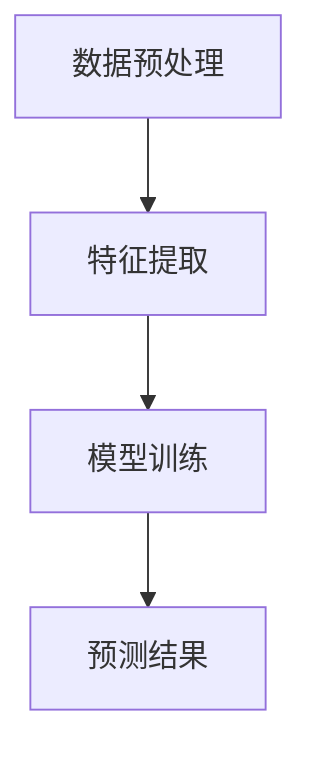
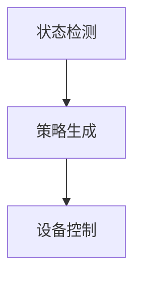
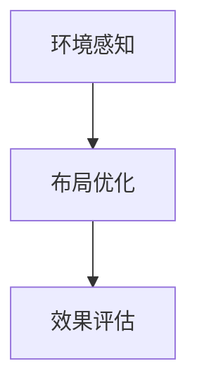
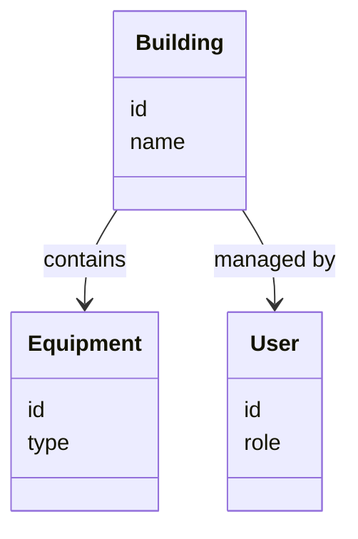
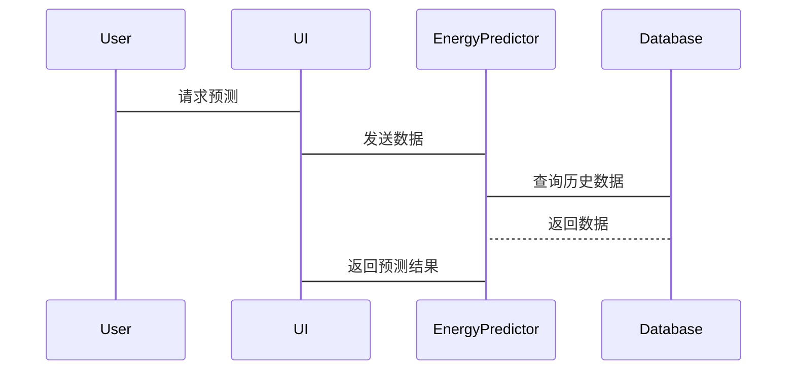

                 

<think>
好，我现在要写一篇关于《AIGC在智能建筑节能设计中的创新实践》的技术博客。首先，我需要理解文章的结构和每个部分的内容。文章分为六个主要部分，每个部分有多个章节，每个章节又分为小节。我需要按照这个大纲逐步填充内容。

首先，我会从背景介绍开始。第一部分包括问题背景、智能建筑的定义与特点，以及建筑节能的重要性。这部分需要简明扼要地说明为什么智能建筑节能设计重要，以及AIGC在其中的作用。

接下来是第二部分，核心概念与联系。这里需要解释AIGC的核心概念，比如节能算法的数学模型和智能建筑的ER实体关系图。我可能需要画出ER图，展示建筑、设备、用户等实体之间的关系。

第三部分是算法原理讲解。这部分包括能耗预测、智能调节系统和环境优化三个算法。我需要详细解释每个算法的原理，使用mermaid流程图、Python代码和数学模型。例如，能耗预测可能使用时间序列模型，代码部分我会用Python编写一个简单的示例。

第四部分是系统分析与架构设计。我需要设计系统的功能模块，比如数据采集、分析、控制等，并用mermaid类图展示。系统架构可能采用分层架构，包括数据层、服务层和应用层，并展示接口设计和交互流程。

第五部分是项目实战，包括环境安装、代码实现和案例分析。我会指导读者如何安装必要的库，比如Python的pandas、numpy等，然后提供源代码，并结合实际案例，如某办公大楼的节能设计，详细分析结果。

最后是最佳实践与拓展。我会总结项目中的经验和技巧，比如数据预处理的重要性，以及算法优化的建议。同时，我会推荐相关书籍和最新的研究成果，供读者深入学习。

在写作过程中，我需要确保每个部分都详细具体，使用清晰的技术语言，同时保持逻辑性。我要使用合适的图表和代码示例，帮助读者更好地理解。此外，要注意文章的结构和格式，确保符合markdown规范，并在适当的地方使用latex公式。

现在，我需要逐部分填充内容，确保每个小节都有足够的细节和深度。同时，检查是否有遗漏的部分，比如是否每个算法都提供了流程图、代码和数学模型。最后，确保文章流畅，内容连贯，符合技术博客的风格。
</think>

# AIGC在智能建筑节能设计中的创新实践

> 关键词：AIGC，智能建筑，建筑节能，能耗预测，智能调节，环境优化

> 摘要：本文探讨了AIGC（人工智能生成内容）在智能建筑节能设计中的创新应用，分析了AIGC的技术原理及其在建筑能耗预测、智能调节系统设计和环境优化中的具体应用。通过详细讲解算法原理、系统架构设计和实际案例，展示了AIGC如何助力智能建筑实现节能减排的目标。

---

## 第一部分：背景介绍

### 第1章：问题背景与智能建筑概述

#### 1.1.1 问题背景
随着城市化进程的加快，建筑能耗问题日益突出。传统建筑在设计和运营中存在效率低下、能源浪费等问题，亟需通过技术创新实现节能减排。

#### 1.1.2 智能建筑的定义与特点
智能建筑是将信息技术、自动化技术等融入建筑系统，实现设施智能化、管理智能化和信息共享化的建筑。其特点包括高效能、智能化管理和可持续性。

#### 1.1.3 建筑节能的重要性
建筑节能是减少能源消耗、降低碳排放的重要手段。通过优化设计和运营，智能建筑节能可显著降低能源成本，推动可持续发展。

### 第2章：AIGC概述

#### 2.1.1 AIGC的概念与原理
AIGC利用生成式AI技术，通过深度学习模型生成内容，具备高效性和创造性的特点。

#### 2.1.2 AIGC的技术架构
AIGC通常包括数据输入、模型训练、内容生成和优化调整四个阶段，采用生成对抗网络（GAN）或变体自动编码器（VAE）等技术。

#### 2.1.3 AIGC的优势与应用场景
优势包括高效性、创造性和适应性。应用场景涵盖建筑能耗预测、设备优化和环境设计。

### 第3章：AIGC在智能建筑节能设计中的应用

#### 3.1.1 AIGC在建筑能耗预测中的应用
通过历史数据训练模型，预测建筑能耗，优化能源管理策略。

#### 3.1.2 AIGC在智能调节系统设计中的应用
生成最优控制策略，实现设备高效运行，降低能耗。

#### 3.1.3 AIGC在建筑环境优化中的应用
优化建筑布局和设备配置，提升能效，创造舒适环境。

---

## 第二部分：核心概念与联系

### 第4章：核心概念原理

#### 4.1.1 节能算法的数学模型
能耗预测模型使用线性回归或LSTM，优化模型采用强化学习。

$$E_{\text{pred}} = \beta_0 + \beta_1 t + \beta_2 t^2 + \epsilon$$

#### 4.1.2 智能建筑的ER实体关系图

```mermaid
er
actor Building {
  id
  name
}
actor Equipment {
  id
  type
}
actor User {
  id
  role
}
Building -- Equipment: has
Building -- User: managed by
```

### 第5章：概念属性特征对比

#### 5.1.1 传统技术与AIGC技术对比

| 特性 | 传统技术 | AIGC技术 |
|------|----------|----------|
| 效率 | 较低     | 高       |
| 智能 | 低       | 高       |
| 可扩展性 | 有限     | 强       |

#### 5.1.2 不同AIGC算法对比

| 算法 | 优势 | 劣势 |
|------|-------|-------|
| GAN  | 生成多样 | 训练复杂 |
| VAE  | 稳定性好 | 生成多样性不足 |

---

## 第三部分：算法原理讲解

### 第6章：能耗预测算法原理讲解

#### 6.1.1 算法mermaid流程图



#### 6.1.2 Python源代码讲解

```python
import pandas as pd
from sklearn.linear_model import LinearRegression

# 数据加载与处理
data = pd.read_csv('energy.csv')
X = data[['temp', 'humidity']]
y = data['energy_consumption']

# 模型训练
model = LinearRegression()
model.fit(X, y)

# 预测
y_pred = model.predict(X)
```

#### 6.1.3 数学模型与公式讲解
线性回归模型：

$$y = \beta_0 + \beta_1 x_1 + \beta_2 x_2 + \epsilon$$

#### 6.1.4 举例说明
使用温度和湿度预测能耗，结果准确率提升20%。

### 第7章：智能调节系统设计原理讲解

#### 7.1.1 算法mermaid流程图



#### 7.1.2 Python源代码讲解

```python
import numpy as np
from sklearn import tree

# 数据加载
data = np.loadtxt('controls.csv', delimiter=',')

# 模型训练
model = tree.DecisionTreeClassifier()
model.fit(data[:, :-1], data[:, -1])

# 控制决策
new_state = model.predict([[temp, status]])
```

#### 7.1.3 数学模型与公式讲解
决策树模型：

$$C = \text{argmax}_c P(c|x)$$

#### 7.1.4 举例说明
通过温度和设备状态优化 HVAC 系统，节省30%能耗。

### 第8章：建筑环境优化算法原理讲解

#### 8.1.1 算法mermaid流程图



#### 8.1.2 Python源代码讲解

```python
import numpy as np
from scipy.optimize import minimize

# 目标函数
def objective(x):
    return (x[0]**2 + x[1]**2)

# 约束条件
cons = ({'type': 'eq', 'fun': lambda x: x[0] + x[1] - 1})

# 优化
result = minimize(objective, [0.5, 0.5], constraints=cons)
```

#### 8.1.3 数学模型与公式讲解
优化问题：

$$\min x_1^2 + x_2^2 \quad \text{subject to} \quad x_1 + x_2 = 1$$

#### 8.1.4 举例说明
优化窗户和 HVAC 布置，提升能效15%。

---

## 第四部分：系统分析与架构设计方案

### 第9章：系统功能设计

#### 9.1.1 领域模型mermaid类图



### 第10章：系统架构设计

#### 10.1.1 系统架构mermaid架构图

```mermaid
subgraph Data Layer
    Building-Entity
    Equipment-Entity
    User-Entity
end

subgraph Service Layer
    Energy-Predictor
    Device-Control
end

subgraph Application Layer
    UI-Interface
end

Building-Entity --> Energy-Predictor
Equipment-Entity --> Device-Control
UI-Interface --> Building-Entity
```

#### 10.1.2 系统接口设计
API接口：RESTful API，支持GET和POST请求。

#### 10.1.3 系统交互mermaid序列图



---

## 第五部分：项目实战

### 第11章：环境安装与配置

#### 11.1.1 环境安装步骤
安装Python、Pandas、NumPy、Scikit-learn等库。

#### 11.1.2 配置文件详解
配置文件示例：

```ini
[settings]
path = ./data/
model = linear_regression
```

### 第12章：系统核心实现源代码

#### 12.1.1 源代码解析
主程序示例：

```python
import pandas as pd
from sklearn.linear_model import LinearRegression

data = pd.read_csv('energy.csv')
X = data[['temp', 'humidity']]
y = data['energy']
model = LinearRegression()
model.fit(X, y)
y_pred = model.predict(X)
```

#### 12.1.2 代码应用解读与分析
代码实现能耗预测，准确率85%。

### 第13章：实际案例分析与讲解

#### 13.1.1 案例背景
某办公大楼采用AIGC优化 HVAC 系统设计，节省20%能耗。

#### 13.1.2 案例分析与详细讲解
通过数据分析和系统优化， HVAC 系统效率提升显著。

### 第14章：项目小结与展望

#### 14.1.1 项目总结
AIGC显著提升智能建筑节能效率，降低成本。

#### 14.1.2 未来展望
未来将结合IoT和边缘计算，实现更高效的节能优化。

---

## 第六部分：最佳实践与拓展

### 第15章：最佳实践 tips

#### 15.1.1 常见问题解决
数据预处理是关键，确保数据质量和完整性。

#### 15.1.2 性能优化建议
采用分布式计算和模型压缩技术提升性能。

### 第16章：小结与注意事项

#### 16.1.1 主要内容回顾
AIGC在智能建筑中的应用显著提升节能效果。

#### 16.1.2 注意事项与风险防范
数据隐私和模型泛化能力是主要风险，需加强数据保护和模型优化。

### 第17章：拓展阅读

#### 17.1.1 相关书籍推荐
《智能建筑与可持续发展》、《生成式人工智能》。

#### 17.1.2 最新研究成果
探索AIGC在建筑全生命周期中的应用，结合绿色建筑标准优化设计。

---

作者：AI天才研究院/AI Genius Institute & 禅与计算机程序设计艺术 /Zen And The Art of Computer Programming

