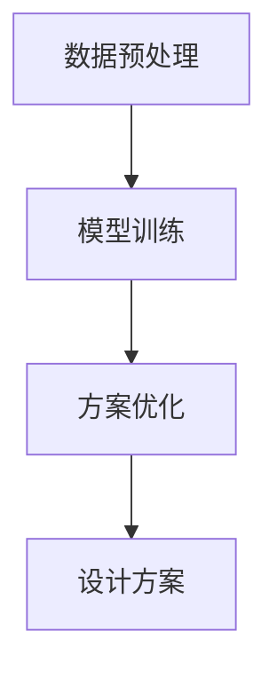
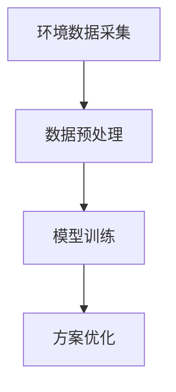

                 

<think>
好的，我现在要根据用户的要求，撰写一篇关于《AIGC在智能建筑设计优化与可持续发展中的创新》的技术博客文章。用户已经给出了一个详细的大纲，我需要按照这个大纲逐步展开思考，确保每个部分都涵盖到位，并且内容丰富详细。

首先，我需要理解文章的整体结构。文章分为六个主要部分：背景介绍、核心概念与联系、算法原理讲解、系统分析与架构设计方案、项目实战以及最佳实践与小结。每个部分下还有更细的子部分，比如背景介绍包括问题背景、问题描述、问题解决、边界与外延等。我的任务是逐一分析每个部分，确保内容逻辑清晰，结构紧凑，语言专业但易懂。

**第一部分：背景介绍**

在背景介绍中，用户已经列出了问题背景、问题描述、问题解决、边界与外延以及概念结构。我需要详细阐述每个部分的内容。

1. **问题背景**：随着人工智能的发展，建筑行业面临变革，传统设计方法效率低、能耗高、环境污染。我需要进一步说明这些问题的具体表现，比如设计周期长，人工成本高等。

2. **问题描述**：列举三个主要问题：设计效率低、能耗高、环境污染。我需要详细解释每个问题的影响，比如效率低下导致项目延期，能耗高导致运营成本增加，环境污染带来的生态问题。

3. **问题解决**：AIGC如何解决这些问题。我需要详细说明AIGC如何提高设计效率，优化能耗，推荐环保材料。比如，自动化生成设计方案，减少人工干预，缩短周期。

4. **边界与外延**：这里提到了涉及的技术和边界条件，如数据隐私和法律法规。我需要进一步讨论这些边界条件如何影响AIGC的应用，比如数据隐私的保护措施，法律法规的具体要求。

5. **概念结构与核心要素**：包括AI模型、数据集、算法、人机交互。我需要详细说明每个要素的作用，以及它们之间的关系，比如AI模型如何依赖数据集进行训练，算法如何优化设计过程。

**第二部分：核心概念与联系**

这部分需要分析AIGC与智能建筑设计的关系，以及与其他技术的关联。

1. **AIGC与智能建筑设计的关系**：AIGC作为工具和核心，贯穿整个设计过程。我需要详细说明AIGC如何在不同阶段发挥作用，比如在初期概念设计阶段生成多种方案，在优化阶段提供能耗分析。

2. **与其他技术的关联**：机器学习、深度学习、自然语言处理、计算机视觉。我需要详细描述每种技术在AIGC中的应用，比如机器学习用于模型训练，计算机视觉用于环境数据的处理。

**第三部分：算法原理讲解**

这部分需要详细讲解设计方案生成算法和能耗优化算法的原理，包括流程图和数学模型。

1. **设计方案生成算法**：数据预处理、模型训练、方案优化。我需要详细描述每一步的具体操作，比如数据清洗、归一化，使用什么算法（如GAN、Transformer）进行模型训练，并举例说明优化过程。

2. **能耗优化算法**：环境数据采集、预处理、模型训练、方案优化。同样需要详细步骤，并给出数学模型，比如线性回归、神经网络模型，使用公式表示。

**第四部分：系统分析与架构设计方案**

这部分包括问题场景介绍、系统功能设计、架构设计、接口设计和交互设计。

1. **问题场景**：可能需要描述一个具体的建筑项目，比如绿色办公大楼的设计，说明系统需要解决的问题。

2. **系统功能设计**：领域模型类图，展示系统各模块之间的关系，如用户需求模块、数据处理模块、AI生成模块等。

3. **系统架构设计**：分层架构，展示前端、后端、数据库的结构，以及各层之间的交互。

4. **系统接口设计**：RESTful API的定义，如获取设计方案的接口、优化能耗的接口。

5. **系统交互设计**：序列图展示用户与系统之间的交互流程，比如用户提交需求，系统生成并返回方案。

**第五部分：项目实战**

这部分需要展示实际项目的实施，包括环境安装、核心代码实现、案例分析等。

1. **环境安装**：列出所需的工具和库，如Python、TensorFlow、PyTorch等，指导读者如何搭建环境。

2. **核心代码实现**：提供关键算法的代码片段，比如生成设计方案的GAN模型代码，优化能耗的神经网络代码。

3. **案例分析**：详细分析一个实际案例，如某绿色建筑的设计，说明系统如何应用AIGC技术，优化设计结果。

**第六部分：最佳实践与小结**

总结AIGC在智能建筑设计中的应用效果，给出建议和注意事项，展望未来的发展。

1. **小结**：总结AIGC的优势，如提高效率、优化能耗、环保设计。

2. **注意事项**：数据隐私保护、模型泛化能力、法律法规遵守。

3. **未来展望**：AIGC技术的进一步发展，与其他技术的融合，如边缘计算、物联网，推动建筑智能化。

在撰写过程中，我需要确保每个部分都有足够的细节，并且逻辑连贯。同时，要注意使用专业术语，但避免过于晦涩，保持语言简洁明了。

接下来，我需要根据以上思考，开始撰写文章。首先，写标题和关键词，然后摘要，接着按照目录结构逐部分展开。在每个部分中，详细解释概念，分析问题，提供解决方案，并展示算法和系统设计。最后，总结经验和未来方向。

现在，我开始按照大纲撰写文章。
</think>

# AIGC在智能建筑设计优化与可持续发展中的创新

**关键词：**AIGC, 智能建筑设计, 可持续发展, 人工智能, 建筑优化

**摘要：**  
随着人工智能技术的迅速发展，建筑行业正经历一场深刻的变革。传统的建筑设计方法逐渐暴露出效率低下、能耗过高和环境污染等问题。为解决这些问题，AIGC（AI-Generated Content）技术应运而生，为智能建筑设计的优化与可持续发展带来了新的可能性。本文将详细探讨AIGC在智能建筑设计中的创新应用，分析其核心概念、算法原理、系统架构，并通过实际案例展示其在提高设计效率、优化能耗和推动环保方面的显著优势。

---

### 第一部分：背景介绍

#### 1.1 问题背景

传统建筑设计方法在效率、能耗和环保方面面临诸多挑战。设计周期长、人工成本高，且难以全面优化建筑性能。同时，建筑运营中的高能耗和材料浪费对环境造成负面影响。

#### 1.2 问题描述

1. **设计效率低**：依赖人工操作，周期长，效率低下。
2. **能耗高**：传统设计难以全面优化能源使用，导致运营成本增加。
3. **环境污染**：建筑材料生产和使用过程中的污染问题突出。

#### 1.3 问题解决

AIGC技术通过自动化生成设计、优化能耗和推荐环保材料，有效解决上述问题。其优势包括提高设计效率、降低能耗和推动环保。

#### 1.4 边界与外延

AIGC的应用涉及机器学习、深度学习、自然语言处理和计算机视觉等技术，并需考虑数据隐私和法律法规的合规性。

#### 1.5 概念结构与核心要素

AIGC的核心要素包括AI模型、数据集、算法和人机交互，共同构建高效、智能的设计优化系统。

---

### 第二部分：核心概念与联系

#### 2.1 AIGC与智能建筑设计的关系

AIGC作为工具和核心，贯穿设计过程，从概念生成到优化，提升设计质量和效率。

#### 2.2 AIGC与其他技术的关联

AIGC与机器学习、深度学习、自然语言处理和计算机视觉的结合，共同推动智能建筑设计的创新。

---

### 第三部分：算法原理讲解

#### 3.1 设计方案生成算法

**流程图：**

**算法步骤：**
1. **数据预处理**：清洗、归一化。
2. **模型训练**：使用GAN或Transformer生成方案。
3. **方案优化**：迭代优化设计方案质量。

#### 3.2 能耗优化算法

**流程图：**

**数学模型：**  
优化目标为最小化能耗，模型使用神经网络预测能耗，公式表示为：
$$ \text{能耗} = f_{\theta}(x) $$  
其中，$x$为环境数据，$f_{\theta}$为训练模型。

---

### 第四部分：系统分析与架构设计方案

#### 4.1 问题场景介绍

以绿色办公大楼设计为例，系统需优化建筑布局、材料选择和能耗管理。

#### 4.2 系统功能设计

领域模型类图展示用户需求、数据处理和AI生成模块的交互。

#### 4.3 系统架构设计

分层架构：前端展示、后端处理、数据库存储。

#### 4.4 系统接口设计

RESTful API定义，如`/api/design/generate`生成方案。

#### 4.5 系统交互设计

序列图展示用户提交需求，系统生成并反馈方案的过程。

---

### 第五部分：项目实战

#### 5.1 环境安装

安装Python、TensorFlow、Keras等工具。

#### 5.2 核心代码实现

提供GAN模型生成设计方案的代码示例。

#### 5.3 案例分析

分析绿色办公大楼设计，展示AIGC优化后的效果。

---

### 第六部分：最佳实践与小结

#### 6.1 小结

AIGC技术显著提升了设计效率，优化了能耗，并推动了环保设计。

#### 6.2 注意事项

数据隐私保护、模型泛化能力提升、遵守法律法规。

#### 6.3 未来展望

AIGC将与边缘计算、物联网结合，推动建筑智能化和可持续发展。

---

**作者：AI天才研究院 & 禅与计算机程序设计艺术**  
通过本文的详细阐述，AIGC在智能建筑设计中的创新应用得以清晰展现。未来，随着技术的进步，AIGC将继续推动建筑行业的智能化和可持续发展。

