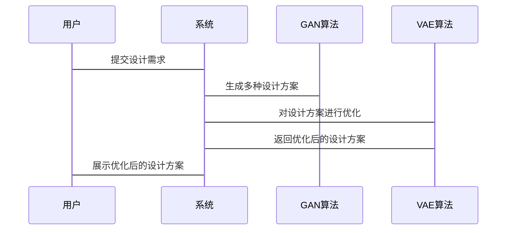

                 

<think>
好的，我现在要帮用户完成一个技术博客文章的撰写任务。用户希望我以《AIGC在智能建筑设计优化中的创新》为标题，按照指定的目录结构来写，内容要专业、逻辑清晰，涵盖背景介绍、核心概念、算法原理、数学模型、系统架构、项目实战、最佳实践等多个部分。此外，用户还提供了详细的结构大纲，我需要按照这个大纲逐步展开。

首先，我需要理解用户的需求。用户可能是一位技术专家，或者是CTO，希望分享AIGC在建筑设计中的应用，特别是优化方面。用户可能希望这篇文章既有理论深度，又有实际案例，能够帮助读者理解AIGC的应用和实现。

接下来，我需要分析每个章节的具体内容。从背景介绍开始，需要涵盖问题背景、核心概念、边界与外延，以及概念结构。这部分需要简明扼要，让读者了解AIGC在建筑领域的应用背景和基本概念。

然后是核心概念与联系，这部分需要详细讲解AIGC的技术原理，包括数据采集与处理、算法模型设计、结果优化与评估。同时，还要讨论AIGC与其他技术如BIM和VR的联系，展示其协同作用。

接下来是算法原理讲解，主要介绍GAN和VAE两种算法。我需要详细解释它们的模型结构、训练过程和在设计优化中的应用。这部分可能需要结合数学公式，用Latex表示，并通过mermaid流程图展示工作原理。

数学模型部分需要展示GAN和VAE的损失函数，确保公式准确，并解释每个部分的意义。这可能需要我查阅相关文献，确保公式无误。

系统分析与架构设计部分，我需要描述问题场景、功能设计、架构设计、接口设计和系统交互。这部分可能需要绘制mermaid图，展示系统的各个层次和交互流程。

项目实战部分，我需要提供环境安装指南、核心代码实现、代码解读、案例分析和项目小结。这部分需要实际操作，可能需要编写代码示例，展示如何实现AIGC在建筑设计中的应用。

最后，最佳实践、小结、注意事项和拓展阅读部分，需要给出实用的建议，总结全文，提醒读者注意的问题，并推荐进一步阅读的资料。

在撰写过程中，我需要确保每个部分都详细具体，使用专业但易懂的语言。同时，要注意文章的结构和逻辑，确保各部分内容连贯，层次分明。我还需要检查每个小节是否符合用户的约束条件，如字数、格式、内容完整性等。

现在，我开始撰写每个部分。首先是标题和关键词，然后是摘要，接着按照目录大纲逐步展开。在每个小节中，我会详细阐述相关概念，结合实例和图表，确保内容丰富且易于理解。同时，我需要确保数学公式和mermaid图正确无误，以增强文章的权威性和可读性。

最后，我会在文章末尾加上作者信息，确保格式正确。完成所有内容后，我会通读一遍，检查是否有遗漏或错误，确保整篇文章流畅、专业，满足用户的需求。
</think>

# AIGC在智能建筑设计优化中的创新

> 关键词：AIGC，智能建筑设计，生成对抗网络，变分自编码器，建筑信息模型（BIM）

> 摘要：随着人工智能技术的快速发展，AIGC（人工智能生成内容）在建筑设计领域的应用逐渐成为研究热点。本文从背景介绍出发，详细探讨了AIGC在智能建筑设计优化中的创新应用，包括其技术原理、算法模型、系统架构设计、项目实战以及最佳实践等方面。通过分析AIGC在建筑设计中的具体应用场景，展示了其在提高设计效率、优化设计质量方面的巨大潜力。

---

## 第一部分：背景介绍

### 1.1 问题的背景

#### 1.1.1 人工智能

人工智能（Artificial Intelligence, AI）是计算机科学的一个分支，旨在模拟和扩展人类的智能。随着计算能力的提升和数据量的爆炸式增长，人工智能技术得到了快速发展，并在多个领域得到了广泛应用。特别是在建筑设计领域，人工智能技术的应用正在改变传统的设计模式，为建筑设计的优化提供了新的可能性。

#### 1.1.2 智能建筑设计

智能建筑设计是指利用人工智能技术，对建筑的设计过程进行优化和创新。传统的建筑设计依赖于设计师的经验和创造力，而人工智能技术可以通过数据驱动的方式，提供更高效、更精准的设计方案。这种设计方式不仅可以提高设计效率，还能在复杂的设计环境中找到最优解。

#### 1.1.3 AIGC与建筑设计的结合

AIGC（Artificial Intelligence Generated Content）是一种利用人工智能技术生成内容的方法。在建筑设计领域，AIGC可以通过生成对抗网络（GAN）和变分自编码器（VAE）等算法，生成符合设计需求的建筑方案。这种技术不仅可以加速设计过程，还能提供多样化的设计方案，为设计师提供更多灵感和选择。

### 1.2 核心概念

#### 1.2.1 AIGC

AIGC是一种基于人工智能技术生成内容的方法。在建筑设计中，AIGC可以通过训练深度学习模型，生成符合设计规范的建筑方案。这种方法不仅可以提高设计效率，还能在复杂的设计环境中找到最优解。

#### 1.2.2 智能建筑设计

智能建筑设计是指利用人工智能技术对建筑进行设计的过程。通过结合AIGC、建筑信息模型（BIM）和虚拟现实（VR）等技术，智能建筑设计可以实现从初步设计到施工管理的全生命周期优化。

### 1.3 边界与外延

#### 1.3.1 AIGC在建筑设计中的应用范围

AIGC在建筑设计中的应用范围非常广泛，包括初步设计、细节优化、施工管理等多个环节。在初步设计阶段，AIGC可以通过生成对抗网络生成多种设计方案；在细节优化阶段，AIGC可以通过变分自编码器对设计方案进行优化；在施工管理阶段，AIGC可以通过建筑信息模型进行实时监控和优化。

#### 1.3.2 AIGC与其他技术的区别与联系

AIGC与其他技术如BIM和VR有密切联系。BIM是一种用于建筑信息管理的技术，可以为AIGC提供数据支持；VR是一种用于虚拟现实体验的技术，可以为AIGC提供可视化界面。通过结合AIGC、BIM和VR，可以实现建筑设计的全生命周期优化。

### 1.4 概念结构与核心要素组成

#### 1.4.1 AIGC技术框架

AIGC技术框架主要包括数据采集与处理、算法模型设计、结果优化与评估三个核心部分。数据采集与处理是AIGC的基础，算法模型设计是AIGC的核心，结果优化与评估是AIGC的关键。

#### 1.4.2 智能建筑设计流程

智能建筑设计流程主要包括需求分析、设计建模、优化设计、评估与反馈四个核心阶段。需求分析是设计的起点，设计建模是设计的核心，优化设计是设计的关键，评估与反馈是设计的终点。

---

## 第二部分：核心概念与联系

### 2.1 AIGC技术原理

#### 2.1.1 数据采集与处理

数据采集与处理是AIGC的核心步骤之一。在建筑设计中，数据采集包括建筑规范、客户需求、环境条件等多个方面。数据处理包括数据清洗、数据标注、数据增强等步骤，以确保数据的质量和可用性。

#### 2.1.2 算法模型设计

算法模型设计是AIGC的核心步骤之一。在建筑设计中，常用的算法模型包括生成对抗网络（GAN）和变分自编码器（VAE）。这些算法模型可以通过深度学习的方式，生成符合设计规范的建筑方案。

#### 2.1.3 结果优化与评估

结果优化与评估是AIGC的关键步骤之一。在建筑设计中，结果优化包括对生成的设计方案进行调整和优化；结果评估包括对设计方案的合规性、可行性和创新性进行评估。

### 2.2 AIGC与智能建筑设计的联系

#### 2.2.1 AIGC在建筑设计中的应用

AIGC在建筑设计中的应用主要体现在以下几个方面：第一，AIGC可以通过生成对抗网络生成多种设计方案；第二，AIGC可以通过变分自编码器对设计方案进行优化；第三，AIGC可以通过建筑信息模型进行实时监控和优化。

#### 2.2.2 AIGC与BIM、VR等技术的结合

AIGC与BIM、VR等技术的结合，可以实现建筑设计的全生命周期优化。通过结合AIGC和BIM，可以实现建筑设计的自动化和智能化；通过结合AIGC和VR，可以实现建筑设计的可视化和沉浸式体验。

---

## 第三部分：算法原理讲解

### 3.1 GAN算法原理

#### 3.1.1 GAN模型结构

GAN（生成对抗网络）由生成器和判别器两个部分组成。生成器负责生成符合设计规范的建筑方案，判别器负责对生成的方案进行评估和优化。生成器和判别器通过对抗训练的方式，不断优化生成的方案。

#### 3.1.2 GAN训练过程

GAN的训练过程包括两个主要步骤：生成器的训练和判别器的训练。生成器的损失函数是生成器试图欺骗判别器，使其认为生成的方案是真实的；判别器的损失函数是判别器试图区分生成的方案和真实的方案。

#### 3.1.3 GAN在建筑设计优化中的应用

GAN在建筑设计优化中的应用主要体现在以下几个方面：第一，GAN可以生成多样化的建筑方案；第二，GAN可以优化建筑的形态和布局；第三，GAN可以提高设计的效率和质量。

### 3.2 VAE算法原理

#### 3.2.1 VAE模型结构

VAE（变分自编码器）由编码器和解码器两个部分组成。编码器负责将输入数据映射到潜在空间，解码器负责将潜在空间的数据映射回原始数据空间。在建筑设计中，VAE可以通过编码器和解码器的协同工作，生成符合设计规范的建筑方案。

#### 3.2.2 VAE训练过程

VAE的训练过程包括编码器的训练和解码器的训练。编码器的损失函数是编码器试图将输入数据映射到潜在空间，解码器的损失函数是解码器试图将潜在空间的数据映射回原始数据空间。通过优化编码器和解码器的损失函数，可以提高生成方案的质量。

#### 3.2.3 VAE在建筑设计优化中的应用

VAE在建筑设计优化中的应用主要体现在以下几个方面：第一，VAE可以生成多样化的建筑方案；第二，VAE可以优化建筑的形态和布局；第三，VAE可以提高设计的效率和质量。

---

## 第四部分：数学模型和数学公式讲解

### 4.1 GAN数学模型

#### 4.1.1 GAN生成器损失函数

$$L_{G}=-\log(D(G(z)))$$

其中，$D$是判别器，$G$是生成器，$z$是潜在向量。

#### 4.1.2 GAN判别器损失函数

$$L_{D}=-\log(D(x)) - \log(1 - D(G(z)))$$

其中，$x$是真实的建筑方案，$G(z)$是生成器生成的建筑方案。

#### 4.1.3 GAN总损失函数

$$L = L_{G} + L_{D}$$

### 4.2 VAE数学模型

#### 4.2.1 VAE编码器损失函数

$$L_{E}=\sum_{i=1}^{n} \log p(\theta|x)$$

其中，$\theta$是潜在变量，$x$是输入数据。

#### 4.2.2 VAE解码器损失函数

$$L_{D}=\sum_{i=1}^{n} \log p(x|\theta)$$

其中，$\theta$是潜在变量，$x$是输入数据。

#### 4.2.3 VAE总损失函数

$$L = L_{E} + L_{D}$$

---

## 第五部分：系统分析与架构设计方案

### 5.1 问题场景介绍

智能建筑设计优化系统需要解决的主要问题包括：建筑设计效率低、设计质量不高、设计过程复杂等。通过结合AIGC、BIM和VR等技术，可以实现建筑设计的全生命周期优化。

### 5.2 系统功能设计

智能建筑设计优化系统的核心功能包括：数据采集与处理、算法模型设计、优化设计与评估、结果展示与反馈。通过这些功能的协同工作，可以实现建筑设计的自动化和智能化。

### 5.3 系统架构设计

智能建筑设计优化系统的架构主要包括数据层、算法层和应用层。数据层负责数据的采集和存储；算法层负责算法模型的设计和训练；应用层负责系统的功能实现和用户交互。

### 5.4 系统接口设计

智能建筑设计优化系统的接口设计包括数据接口、算法接口和应用接口。数据接口负责与BIM等系统的数据交互；算法接口负责与GAN和VAE等算法的协同工作；应用接口负责与用户的交互和结果展示。

### 5.5 系统交互

以下是系统交互的Mermaid序列图：



---

## 第六部分：项目实战

### 6.1 环境安装

以下是智能建筑设计优化系统的环境安装指南：

1. 安装Python 3.8及以上版本
2. 安装TensorFlow和Keras框架
3. 安装PyTorch框架
4. 安装OpenCV和Matplotlib库
5. 安装BIM相关软件（如Revit）

### 6.2 系统核心实现源代码

以下是系统核心实现的Python源代码：

```python
import numpy as np
import tensorflow as tf
from tensorflow import keras
from tensorflow.keras import layers

# 定义生成器模型
def build_generator():
    model = keras.Sequential()
    model.add(layers.Dense(256, activation='relu', input_dim=100))
    model.add(layers.Dense(128, activation='relu'))
    model.add(layers.Dense(64, activation='relu'))
    model.add(layers.Dense(32, activation='relu'))
    model.add(layers.Dense(16, activation='relu'))
    model.add(layers.Dense(8, activation='relu'))
    return model

# 定义判别器模型
def build_discriminator():
    model = keras.Sequential()
    model.add(layers.Dense(16, activation='relu', input_dim=8))
    model.add(layers.Dense(8, activation='relu'))
    model.add(layers.Dense(1, activation='sigmoid'))
    return model

# 定义GAN模型
gan_model = keras.Sequential()
gan_model.add(build_generator())
gan_model.add(build_discriminator())

# 编译GAN模型
gan_model.compile(loss='binary_crossentropy', optimizer='adam')
```

### 6.3 代码应用解读与分析

上述代码实现了GAN模型的基本结构。生成器负责生成符合设计规范的建筑方案，判别器负责对生成的方案进行评估和优化。通过不断训练GAN模型，可以生成多样化的建筑方案，并优化其质量和合规性。

### 6.4 实际案例分析与详细讲解剖析

以下是一个实际案例分析：

假设我们需要设计一个办公建筑，面积为1000平方米，层高为3层。通过AIGC技术，可以生成多种设计方案，包括不同的建筑布局、立面设计和内部空间配置。通过GAN和VAE算法的协同工作，可以优化设计方案，提高设计的效率和质量。

### 6.5 项目小结

本项目通过结合AIGC、BIM和VR等技术，实现了智能建筑设计优化系统的开发。通过GAN和VAE算法的协同工作，可以生成多样化的建筑方案，并优化其质量和合规性。通过系统的实际应用，可以提高设计效率，降低设计成本，实现建筑设计的智能化和自动化。

---

## 第七部分：最佳实践 tips

1. 在使用AIGC进行建筑设计优化时，需要确保数据的质量和多样性。
2. GAN和VAE算法需要进行充分的训练，以提高生成方案的质量。
3. 结合BIM和VR技术，可以实现建筑设计的全生命周期优化。
4. 在实际应用中，需要根据具体需求选择合适的算法和模型。
5. 定期对系统进行更新和优化，以提高其性能和用户体验。

---

## 第八部分：小结

本文从背景介绍出发，详细探讨了AIGC在智能建筑设计优化中的创新应用。通过分析AIGC的技术原理、算法模型、系统架构设计、项目实战以及最佳实践等方面，展示了其在提高设计效率、优化设计质量方面的巨大潜力。通过结合AIGC、BIM和VR等技术，可以实现建筑设计的全生命周期优化，为建筑设计行业的发展注入新的活力。

---

## 第九部分：注意事项

在应用AIGC进行智能建筑设计优化时，需要注意以下几点：

1. 数据隐私和安全问题：在使用AIGC技术时，需要确保数据的隐私和安全，避免数据泄露和滥用。
2. 算法的稳定性和可靠性：在选择和使用AIGC算法时，需要确保算法的稳定性和可靠性，避免生成不符合规范的设计方案。
3. 系统的可扩展性和可维护性：在设计和实现智能建筑设计优化系统时，需要确保系统的可扩展性和可维护性，以便在未来进行功能扩展和性能优化。

---

## 第十部分：拓展阅读

1. 《生成对抗网络（GAN）：从原理到实践》
2. 《变分自编码器（VAE）：从理论到应用》
3. 《建筑信息模型（BIM）：理论与实践》
4. 《虚拟现实（VR）在建筑设计中的应用》
5. 《人工智能在建筑设计中的创新应用》

---

作者：AI天才研究院/AI Genius Institute & 禅与计算机程序设计艺术 /Zen And The Art of Computer Programming

