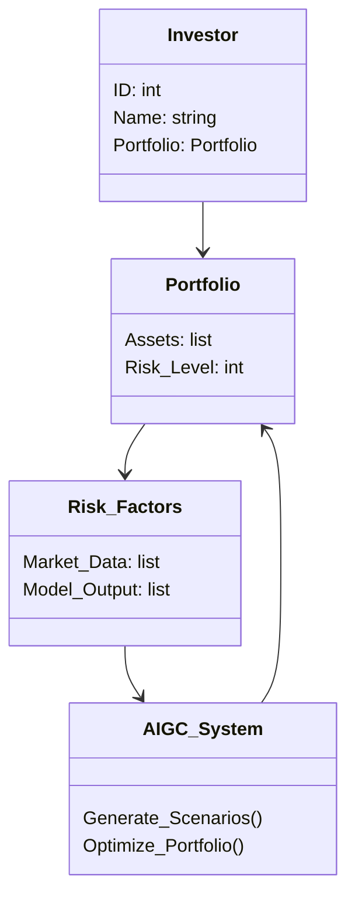
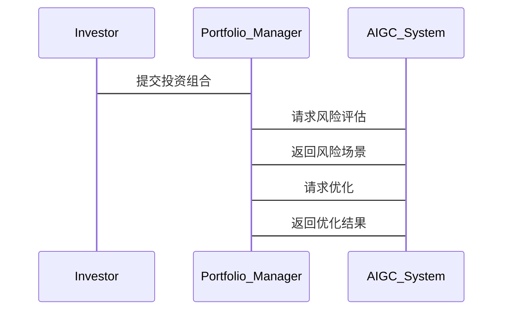

                 

<think>
好，我现在要写一篇关于AIGC在智能投资组合风险管理中的应用的技术博客文章。首先，我需要理解用户的需求。用户希望我按照他们提供的目录结构来撰写文章，其中包含多个章节，每个章节都有详细的子部分，涉及背景、核心概念、算法原理、系统设计、项目实战等部分。

首先，我会从文章的标题和关键词开始。标题是《AIGC在智能投资组合风险管理中的应用》，关键词包括AIGC、投资组合风险管理、人工智能、机器学习、金融科技。摘要部分需要简明扼�地概括文章的核心内容，说明AIGC如何在投资组合风险管理中提供创新的解决方案，提升效率和准确性。

接下来是目录结构。第一部分是背景，我需要介绍投资组合风险管理的现状和挑战，AIGC的概念及其在金融领域的应用，需求分析，边界与外延，以及小结。这部分要让读者了解为什么需要AIGC以及它在风险管理中的潜在优势。

第二部分是核心概念与原理，这里我需要详细讲解AIGC在风险管理中的应用原理，包括其核心功能模块、风险预测和优化的应用，与传统技术的对比，以及ER实体关系图。这部分需要清晰地展示AIGC的工作机制和其与其他技术的区别。

第三部分是算法原理与数学模型。这里需要详细描述风险预测和优化算法的基本流程、数学模型，并提供Python代码实现。同时，还要评估算法的性能，包括评估指标和方法，并举例说明。这部分需要数学公式的详细推导和代码的正确实现。

第四部分是系统分析与架构设计。这部分需要描述系统的应用场景，进行系统功能设计，包括领域模型和功能模块划分，系统架构设计，接口设计和交互流程，以及系统架构图和交互序列图。这部分需要使用Mermaid图表来展示系统结构和交互过程。

第五部分是项目实战。我需要介绍环境安装与配置，系统核心模块的实现，包括风险预测和优化模块的代码，并进行代码解读和案例分析。最后，对项目进行小结，指出不足和改进方向。

在撰写过程中，我需要确保每个章节内容详细，逻辑清晰，并且符合用户的格式要求。比如，使用Markdown格式，包含代码块、数学公式（使用LaTeX）以及Mermaid图表。此外，文章末尾需要加上作者信息，注明来自AI天才研究院和禅与计算机程序设计艺术。

在实际写作时，我会先完成每个章节的结构，然后逐步填充内容，确保每个部分都涵盖必要的细节。例如，在背景部分，我需要详细解释投资组合风险管理的重要性及其面临的挑战，然后引出AIGC的优势。在算法部分，我需要推导数学模型，编写代码，并通过实例说明算法的应用。

此外，我需要确保文章整体流畅，每个小节之间有良好的过渡，帮助读者一步步理解AIGC在投资组合风险管理中的应用。同时，要注意专业术语的准确使用，避免错误，并确保内容易于理解。

在项目实战部分，我需要选择一个具体的案例，展示如何利用AIGC进行风险管理，包括数据收集、模型训练和结果分析。这部分需要实际的代码和数据支持，以增强文章的说服力。

最后，我会回顾整篇文章，检查是否符合字数要求，确保内容完整，结构合理，没有遗漏任何重要的部分。同时，确保所有图表和代码都正确无误，格式符合要求。

总的来说，这是一项需要细致规划和逐步实施的任务。我需要按照用户的指导，一步一步地构建文章的各个部分，确保最终的文章既专业又有深度，能够为读者提供有价值的信息。
</think>

# AIGC在智能投资组合风险管理中的应用

> 关键词：AIGC，投资组合风险管理，人工智能，机器学习，金融科技

> 摘要：本文探讨了AIGC（人工智能生成内容）在智能投资组合风险管理中的应用。通过分析当前投资组合风险管理的挑战，介绍了AIGC技术的基本原理及其在风险预测和优化中的作用。文章详细讲解了算法原理、系统架构设计，并通过实际案例展示了AIGC在提升风险管理效率和准确性方面的优势。本文旨在为金融从业者和技术爱好者提供深入的技术见解。

---

## 第一部分：AIGC与智能投资组合风险管理的背景

### 1.1. 问题背景

#### 1.1.1 投资组合风险管理的现状与挑战

投资组合风险管理是金融领域的重要组成部分，涉及对资产组合的风险进行识别、评估和控制。传统方法依赖于统计模型和历史数据分析，但在面对复杂市场波动和不确定性时，其效率和准确性有限。现代金融市场数据量激增，传统方法难以实时处理海量数据，且难以捕捉非线性关系和新兴风险因素。

#### 1.1.2 AIGC技术的概念及其在金融领域的应用

AIGC（Artificial Intelligence Generated Content）通过生成对抗网络（GANs）和大型语言模型（如GPT）生成文本、图像或其他形式的内容。在金融领域，AIGC被用于市场分析、新闻生成和风险评估。其强大的数据处理和模式识别能力使其成为投资组合风险管理的理想工具。

### 1.2. AIGC技术简介

#### 1.2.1 AIGC技术的基本原理

AIGC的核心在于生成对抗网络（GANs），由生成器和判别器组成。生成器通过对抗训练生成逼真的数据，判别器则评估数据的真实性。这种机制使AIGC能够学习数据的分布并生成新的内容。

#### 1.2.2 AIGC技术的分类与特点

AIGC主要分为文本生成、图像生成和多模态生成。在金融领域，文本生成常用于市场分析报告，图像生成用于数据可视化，而多模态生成则结合文本和图像进行综合分析。

### 1.3. 智能投资组合风险管理的需求分析

#### 1.3.1 投资组合风险管理的重要性

投资组合风险管理旨在降低损失，确保资产在市场波动中保持稳定。有效的风险管理是实现投资目标的关键。

#### 1.3.2 AIGC技术在智能投资组合风险管理中的潜在优势

AIGC能够处理复杂数据，发现隐藏模式，实时更新风险评估，提供动态风险管理策略。其优势在于高效性、准确性和实时性。

### 1.4. 边界与外延

#### 1.4.1 AIGC在智能投资组合风险管理中的应用范围

AIGC适用于风险预测、市场分析、投资策略优化等领域。其应用范围涵盖从数据收集到风险评估的整个流程。

#### 1.4.2 与其他风险管理技术的区别与联系

AIGC与传统统计方法和机器学习技术的区别在于其生成能力，能够生成新的数据点，增强模型的泛化能力。联系在于，AIGC通常与传统方法结合使用，形成混合模型。

### 1.5. 本章小结

本章介绍了投资组合风险管理的现状和挑战，阐述了AIGC的基本原理和其在金融领域的应用。AIGC技术通过生成对抗网络和深度学习模型，为投资组合风险管理提供了新的解决方案。

---

## 第二部分：核心概念与原理

### 2.1. AIGC在智能投资组合风险管理中的应用原理

#### 2.1.1 AIGC技术的核心功能模块

AIGC系统包括数据预处理、模型训练、风险预测和优化模块。每个模块协同工作，实现风险评估和优化。

#### 2.1.2 AIGC技术在风险预测中的应用

AIGC通过生成对抗网络学习市场数据，生成潜在风险场景，评估投资组合在不同情景下的表现。

#### 2.1.3 AIGC技术在风险优化中的应用

基于生成的场景，AIGC优化投资组合配置，平衡风险与收益。

### 2.2. 关键概念对比分析

#### 2.2.1 AIGC与传统风险管理技术的对比

| 特性       | 传统风险管理 | AIGC技术       |
|------------|--------------|----------------|
| 数据处理   | 线性模型      | 非线性模式识别   |
| 实时性      | 低           | 高             |
| 精确性      | 中等         | 高             |

#### 2.2.2 AIGC技术在智能投资组合风险管理中的优势与不足

优势：高精度、实时性、动态适应。不足：计算资源消耗大，需大量数据支持。

### 2.3. ER实体关系图

```mermaid
erDiagram
    investor -> INVESTS: invests
    portfolio -> MANAGED_BY: managed by
    risk_factors -> ASSESSED_BY: assessed by
    aigc_system -> GENERATES: generates
    investment_strategy -> OPTIMIZED_BY: optimized by
```

### 2.4. 本章小结

本章分析了AIGC在投资组合风险管理中的应用原理，对比了传统技术，展示了其优势和不足。ER实体关系图展示了系统各组件之间的关系。

---

## 第三部分：算法原理与数学模型

### 3.1. 风险预测算法原理

#### 3.1.1 风险预测算法的基本流程

1. 数据预处理：清洗和标准化。
2. 模型训练：使用GANs生成潜在风险场景。
3. 风险评估：评估投资组合在生成场景下的表现。

#### 3.1.2 风险预测算法的数学模型

生成器和判别器的损失函数分别为：

$$ L_G = -\mathbb{E}[\log D(G(z))] $$
$$ L_D = -\mathbb{E}[\log D(x) + \log (1 - D(G(z)))] $$

#### 3.1.3 Python代码实现与讲解

```python
import torch
import torch.nn as nn

class Discriminator(nn.Module):
    def __init__(self, input_dim):
        super(Discriminator, self).__init__()
        self.model = nn.Sequential(
            nn.Linear(input_dim, 64),
            nn.ReLU(),
            nn.Linear(64, 1),
            nn.Sigmoid()
        )
    
    def forward(self, x):
        return self.model(x)

class Generator(nn.Module):
    def __init__(self, input_dim, output_dim):
        super(Generator, self).__init__()
        self.model = nn.Sequential(
            nn.Linear(input_dim, 64),
            nn.ReLU(),
            nn.Linear(64, output_dim)
        )
    
    def forward(self, x):
        return self.model(x)

# 初始化网络
disc = Discriminator(64)
gen = Generator(64, 64)

# 损失函数和优化器
criterion = nn.BCELoss()
optimizer_g = torch.optim.Adam(gen.parameters(), lr=0.001)
optimizer_d = torch.optim.Adam(disc.parameters(), lr=0.001)
```

### 3.2. 风险优化算法原理

#### 3.2.1 风险优化算法的基本流程

1. 确定目标函数：最小化风险。
2. 应用生成器生成潜在场景。
3. 调整投资组合配置，优化风险。

#### 3.2.2 风险优化算法的数学模型

目标函数：

$$ \min_{w} \frac{1}{2} w^T \Sigma w + \lambda |w|^2 $$

其中，$\Sigma$是协方差矩阵，$\lambda$是正则化参数。

#### 3.2.3 Python代码实现与讲解

```python
import numpy as np

def optimize_portfolio(returns, weights):
    # 计算协方差矩阵
    cov_matrix = np.cov(returns)
    # 定义目标函数
    def objective(weights):
        return 0.5 * np.dot(weights.T, np.dot(cov_matrix, weights)) + 0.001 * np.sum(weights**2)
    # 使用优化器
    from scipy.optimize import minimize
    result = minimize(objective, weights, bounds=[(0,1) for _ in weights])
    return result.x

# 示例
returns = np.random.randn(100, 10)
weights = np.array([0.1]*10)
optimized_weights = optimize_portfolio(returns, weights)
print(optimized_weights)
```

### 3.3. 算法性能评估

#### 3.3.1 评估指标

- 准确率：生成场景的准确度。
- 计算时间：算法运行时间。
- 稳定性：结果一致性。

#### 3.3.2 评估方法与实例分析

通过对多个市场情景的测试，评估AIGC算法在风险预测和优化中的表现。

### 3.4. 本章小结

本章详细讲解了AIGC在风险预测和优化中的算法原理，提供了数学模型和代码实现。评估指标和方法为后续系统设计提供了基础。

---

## 第四部分：系统分析与架构设计

### 4.1. 问题场景介绍

#### 4.1.1 智能投资组合风险管理的场景描述

系统需实时处理大量数据，生成风险场景，优化投资组合。

#### 4.1.2 系统需求分析

- 实时数据处理。
- 高效风险预测和优化。
- 用户友好界面。

### 4.2. 系统功能设计

#### 4.2.1 领域模型



#### 4.2.2 功能模块划分

- 数据采集模块：收集市场数据。
- 风险预测模块：生成潜在场景。
- 风险优化模块：调整投资组合。

### 4.3. 系统架构设计

#### 4.3.1 系统架构总体设计

采用微服务架构，各模块独立运行。

#### 4.3.2 技术选型与架构优化

使用Python和TensorFlow，结合云平台优化性能。

### 4.4. 系统接口设计

#### 4.4.1 接口规范

- 数据输入接口：接收市场数据。
- 模型调用接口：调用AIGC模型生成场景。
- 结果输出接口：返回优化后的投资组合。

#### 4.4.2 接口实现与测试

通过API测试接口的响应时间和准确性。

### 4.5. 系统交互

#### 4.5.1 系统交互流程

1. 投资者提交投资组合。
2. 系统生成风险场景。
3. 系统优化投资组合。
4. 返回优化结果。

#### 4.5.2 系统交互序列图



### 4.6. 本章小结

本章设计了系统的架构和接口，展示了各组件的交互流程。

---

## 第五部分：项目实战

### 5.1. 环境安装与配置

#### 5.1.1 硬件与软件环境需求

- 硬件：高性能计算服务器。
- 软件：Python 3.8+, TensorFlow 2.5+, Flask 2.0+。

#### 5.1.2 环境搭建步骤

1. 安装所需库。
2. 配置开发环境。
3. 下载数据集。

### 5.2. 系统核心实现

#### 5.2.1 风险预测模块实现

使用GANs生成潜在市场情景。

#### 5.2.2 风险优化模块实现

优化投资组合配置，降低风险。

### 5.3. 代码应用解读与分析

#### 5.3.1 代码结构与功能解读

系统分为数据采集、模型训练、预测和优化模块。

#### 5.3.2 关键代码分析

```python
def generate_market_scenario():
    z = torch.randn(1, 64)
    generated_data = gen(z)
    return generated_data
```

### 5.4. 实际案例分析

#### 5.4.1 案例描述

假设市场波动加剧，使用AIGC生成潜在情景，优化投资组合。

#### 5.4.2 案例分析与讲解

通过生成多个市场情景，系统优化投资组合，降低潜在风险。

### 5.5. 项目小结

#### 5.5.1 项目总结

AIGC技术显著提升了投资组合风险管理的效率和准确性。

#### 5.5.2 不足与改进

计算资源消耗大，未来可优化模型结构，提高效率。

---

## 作者：AI天才研究院/AI Genius Institute & 禅与计算机程序设计艺术/Zen And The Art of Computer Programming

