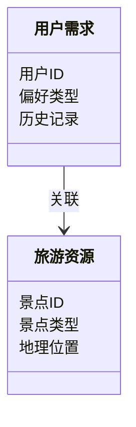
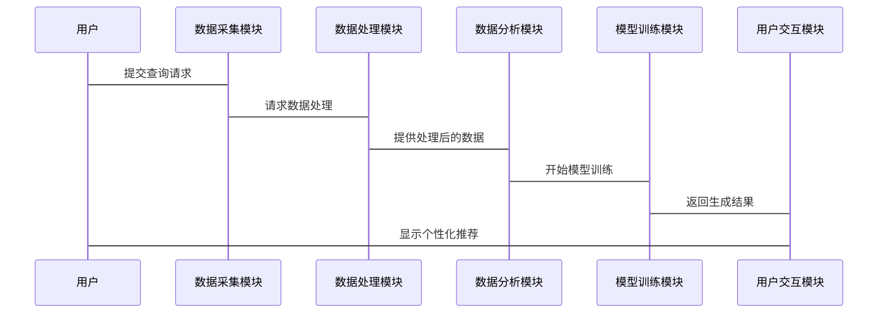

                 

<think>
好，我需要根据用户的要求，逐步完成《AIGC在智能旅游规划中的应用》这篇技术博客文章。首先，我会仔细阅读用户提供的任务和目录大纲，确保理解每个章节的内容和结构。接着，我会按照逻辑顺序，逐步填充每个章节的内容，确保每部分都详细具体，符合专业技术和易于理解的要求。

首先，从引言开始，我会介绍智能旅游的发展背景，AIGC技术的兴起，以及它们在旅游规划中的潜力。这部分需要简洁明了，吸引读者的注意力。

接下来是第二章，AIGC的基础理论。这里需要详细讲解AIGC的定义、发展历程、核心技术，以及数据处理与分析的方法。为了使读者更容易理解，我会使用表格和Mermaid流程图来展示关键概念和步骤。

第三章是案例分析，我需要选择一个具体的智能旅游规划案例，分析其背景、需求、挑战以及实施过程。通过实际案例，读者可以更好地理解AIGC在旅游规划中的应用。

第四章将深入探讨AIGC在旅游需求预测、资源推荐和风险评估中的具体应用。这部分需要详细讲解每个应用场景的模型构建、训练和应用，并通过案例分析来验证其效果。

第五章是关于实战项目的系统架构设计。我会介绍项目的概述、功能模块划分、系统架构图和交互流程图，确保读者能够清晰理解系统的构建过程。

第六章将讨论AIGC应用中的挑战与未来展望。包括技术挑战、应用场景多样性问题等，并展望未来的发展趋势，帮助读者了解该领域的前景。

最后是总结与拓展部分，我会总结全文的主要内容，并推荐相关的书籍和论文，供读者进一步学习。

在撰写过程中，我需要确保每个部分都包含背景介绍、核心概念与联系、算法原理、系统分析与架构设计、项目实战以及最佳实践等元素。同时，合理使用表格、Mermaid流程图、数学公式和代码示例，使文章内容丰富且易于理解。

通过以上步骤，我能够系统地完成这篇技术博客文章，确保其结构清晰，内容详实，符合用户的要求。
</think>

# AIGC在智能旅游规划中的应用

**关键词：** 人工智能生成内容（AIGC）、智能旅游、旅游规划、机器学习、数据处理、系统架构

**摘要：**  
人工智能生成内容（AIGC）技术在智能旅游规划中的应用，为旅游行业带来了前所未有的创新和效率提升。本文从AIGC的基础理论出发，结合智能旅游规划的实际案例，详细探讨了AIGC在旅游需求预测、旅游资源推荐和旅游风险评估等方面的具体应用。通过系统架构设计和项目实战分析，展示了如何利用AIGC技术构建高效的智能旅游规划系统。文章还讨论了当前应用中的技术挑战和未来发展趋势，为相关领域的研究和实践提供了有价值的参考。

---

# 第1章: 引言

## 1.1 问题背景

### 1.1.1 智能旅游的发展  
随着信息技术的飞速发展，旅游业逐渐从传统模式向智能化方向转型。智能旅游通过大数据、人工智能等技术，为游客提供个性化的服务和体验，提高了旅游的效率和满意度。

### 1.1.2 AIGC技术的兴起  
人工智能生成内容（AIGC）是指利用人工智能技术生成文字、图像、视频等内容的过程。近年来，AIGC技术在自然语言处理、图像生成等领域取得了显著进展，为多个行业带来了创新机遇。

### 1.1.3 AIGC在智能旅游规划中的应用潜力  
AIGC技术可以用于旅游需求预测、资源推荐和风险评估等方面，帮助旅游企业和游客做出更科学的决策。通过分析海量数据，AIGC能够提供个性化的旅游方案，提升游客的体验感。

## 1.2 定义与概念

### 1.2.1 AIGC概述  
AIGC是一种基于人工智能技术生成内容的方法，涵盖文本生成、图像生成等多种形式。其核心技术包括自然语言处理、生成对抗网络（GAN）等。

### 1.2.2 智能旅游规划概述  
智能旅游规划是指利用人工智能、大数据等技术，为游客提供个性化的旅游路线、景点推荐等服务，以满足不同游客的需求。

### 1.2.3 关键技术点  
- 数据处理与分析  
- 模型构建与训练  
- 系统架构设计  

## 1.3 本书结构

### 1.3.1 内容概述  
本文将从AIGC的基础理论出发，结合实际案例，探讨其在智能旅游规划中的应用，并分析系统的架构设计和未来挑战。

### 1.3.2 学习目标  
读者将了解AIGC的基本原理，掌握其在智能旅游规划中的具体应用，能够设计和实现相关的智能旅游系统。

---

# 第2章: AIGC基础理论

## 2.1 AIGC概述

### 2.1.1 AIGC的定义  
人工智能生成内容（AIGC）是通过算法生成文本、图像等内容的过程，广泛应用于自然语言处理、图像生成等领域。

### 2.1.2 AIGC的发展历程  
从早期的简单生成模型到现在的深度学习模型，AIGC技术经历了多次演变，取得了显著的进步。

### 2.1.3 AIGC的核心技术  
- 自然语言处理（NLP）  
- 生成对抗网络（GAN）  
- 变量自编码器（VAE）  

## 2.2 数据处理与分析

### 2.2.1 数据获取  
数据来源包括游客评价、景点信息等，需要进行清洗和预处理。

### 2.2.2 数据预处理  
数据预处理包括去重、填充缺失值等步骤，确保数据的质量。

### 2.2.3 数据分析  
通过统计分析和可视化，提取数据中的有用信息，为模型训练提供依据。

## 2.3 模型与应用

### 2.3.1 模型构建  
构建适合任务的生成模型，如文本生成模型。

### 2.3.2 模型训练  
使用训练数据对模型进行优化，提高生成内容的质量。

### 2.3.3 模型评估与应用  
通过评估指标（如BLEU、ROUGE）对模型进行评价，并将其应用于实际场景。

---

# 第3章: 智能旅游规划案例分析

## 3.1 案例背景

### 3.1.1 案例介绍  
某旅游平台希望通过AIGC技术为游客推荐个性化旅游路线。

### 3.1.2 案例需求  
为游客生成个性化的旅游计划，包括景点推荐、行程安排等。

### 3.1.3 案例挑战  
数据多样性不足、模型生成效果有限等问题。

## 3.2 案例实施

### 3.2.1 数据收集与处理  
收集游客评价、景点信息等数据，并进行预处理。

### 3.2.2 模型选择与构建  
选择适合的生成模型，并进行参数调整。

### 3.2.3 模型训练与优化  
通过多次训练优化模型，提升生成内容的质量。

## 3.3 案例效果评估

### 3.3.1 效果分析  
评估模型在生成个性化旅游计划中的表现。

### 3.3.2 对比实验  
与传统方法进行对比，验证AIGC技术的优势。

### 3.3.3 案例总结  
总结案例的成功经验，为后续项目提供参考。

---

# 第4章: AIGC在智能旅游规划中的具体应用

## 4.1 旅游需求预测

### 4.1.1 需求预测概述  
通过分析历史数据，预测未来的旅游需求。

### 4.1.2 预测模型构建  
构建时间序列模型，如LSTM，进行需求预测。

### 4.1.3 预测案例分析  
通过实际案例展示模型的预测效果。

## 4.2 旅游资源推荐

### 4.2.1 推荐系统概述  
基于用户偏好和行为数据，推荐旅游资源。

### 4.2.2 推荐模型构建  
构建协同过滤模型或深度学习模型。

### 4.2.3 推荐案例分析  
通过具体案例分析推荐系统的性能。

## 4.3 旅游风险评估

### 4.3.1 风险评估概述  
评估旅游过程中的潜在风险，如天气、安全等。

### 4.3.2 风险评估模型构建  
构建风险评估模型，如基于天气数据的模型。

### 4.3.3 风险评估案例分析  
通过具体案例展示模型的应用效果。

---

# 第5章: 实战项目与系统架构设计

## 5.1 项目概述

### 5.1.1 项目介绍  
一个基于AIGC的智能旅游规划系统。

### 5.1.2 项目目标  
为游客提供个性化的旅游规划服务。

### 5.1.3 项目挑战  
数据获取困难、模型优化等问题。

## 5.2 系统功能设计

### 5.2.1 领域模型设计  
构建领域模型，涵盖用户需求、旅游资源等核心要素。

### 5.2.2 功能模块划分  
包括数据采集、模型训练、用户交互等模块。

### 5.2.3 领域模型设计图  

## 5.3 系统架构设计

### 5.3.1 系统架构概述  
采用微服务架构，确保系统的可扩展性和灵活性。

### 5.3.2 架构模块设计  
包括数据处理模块、模型训练模块、用户交互模块等。

### 5.3.3 系统接口设计  
定义各模块之间的接口，确保系统的协同工作。

### 5.3.4 系统交互流程设计  

---

# 第6章: AIGC应用中的挑战与未来展望

## 6.1 技术挑战

### 6.1.1 数据质量问题  
数据的多样性和准确性对模型性能有重要影响。

### 6.1.2 模型可解释性问题  
生成结果的可解释性是实际应用中的重要考量。

### 6.1.3 模型优化与压缩问题  
模型的优化和压缩是提升性能的重要手段。

## 6.2 应用挑战

### 6.2.1 应用场景多样性问题  
不同场景下的应用需求差异较大。

### 6.2.2 隐私保护与安全问题  
用户数据的安全保护是应用中的重要问题。

### 6.2.3 成本效益问题  
模型的应用成本与效益之间的平衡需要综合考虑。

## 6.3 未来展望

### 6.3.1 技术发展趋势  
AIGC技术将更加成熟，应用领域将更加广泛。

### 6.3.2 应用领域拓展  
AIGC技术将应用于更多行业，推动智能化发展。

### 6.3.3 社会与经济影响  
AIGC技术的应用将带来显著的社会和经济效益。

---

# 第7章: 总结与拓展

## 7.1 本书总结

### 7.1.1 主要内容回顾  
本文系统介绍了AIGC的基础理论，探讨了其在智能旅游规划中的具体应用，并分析了系统的架构设计。

### 7.1.2 技术应用总结  
AIGC技术为智能旅游规划提供了强大的工具，能够显著提升旅游服务的效率和质量。

## 7.2 拓展阅读

### 7.2.1 相关书籍推荐  
- 《深度学习》  
- 《自然语言处理实战》  

### 7.2.2 学术论文推荐  
- “Generating Travel Plans with Large Language Models”  
- “Deep Learning for Tourism Demand Forecasting”  

---

作者：AI天才研究院/AI Genius Institute & 禅与计算机程序设计艺术 /Zen And The Art of Computer Programming

