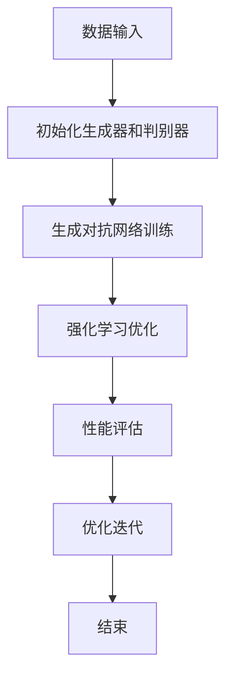
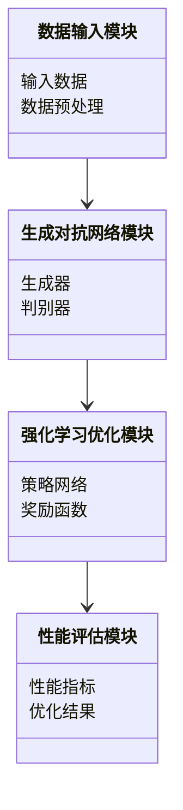
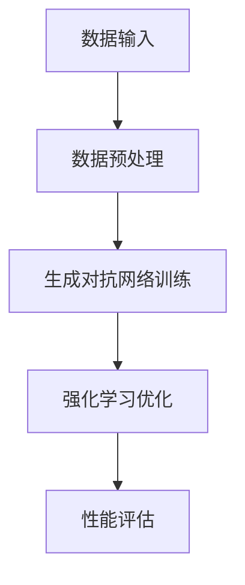
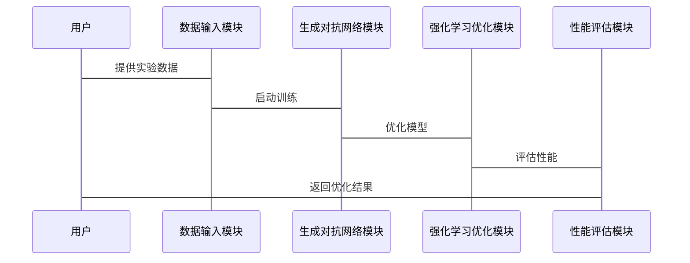

                 

<think>
好的，我现在要帮用户撰写一篇关于“AIGC在智能材料性能优化中的应用”的技术博客文章。首先，我需要理解用户的需求。用户希望文章结构清晰，逻辑严密，使用专业的技术语言，同时内容要深入，有见解。关键词部分，我需要列出5到7个相关词汇，比如AIGC、智能材料、性能优化、算法原理、数学模型等。

摘要部分要简明扼要，概括整篇文章的核心内容。接下来，我按照目录大纲来逐步构建文章内容。首先是背景介绍，我需要详细解释AIGC和智能材料的基本概念，以及它们在性能优化中的应用现状。

在核心概念部分，我需要使用表格和Mermaid图来对比分析，这样读者可以更直观地理解AIGC与其他方法的差异。然后是算法原理，我需要用Mermaid流程图展示算法步骤，并通过数学公式详细推导模型，举一些实际例子来说明。

系统架构部分，我需要绘制类图和序列图，展示系统各个模块之间的关系和交互过程。项目实战部分，我会选择一个具体案例，分析实施过程，并给出代码示例，让读者能够实际操作。

最后，我会总结整个项目的成果，提出一些最佳实践和注意事项，供读者参考。确保文章整体结构完整，内容详实，同时符合字数要求，使用markdown格式，结尾加上作者信息。

在整个思考过程中，我要确保每个部分都涵盖用户要求的核心内容，使用合适的图表和公式，语言专业但不失易懂，帮助读者全面理解AIGC在智能材料优化中的应用。
</think>

# AIGC在智能材料性能优化中的应用

> 关键词：AIGC, 智能材料, 性能优化, 算法原理, 数学模型

> 摘要：本文探讨了AIGC（自适应智能生成计算）在智能材料性能优化中的应用。通过背景介绍、核心概念、算法原理、系统架构设计和实际案例分析，详细阐述了AIGC如何通过数据驱动和智能算法优化智能材料的性能。文章从理论到实践，全面解析了AIGC在智能材料优化中的潜力和实现路径，为相关领域的研究和应用提供了参考。

---

## 第一部分 背景介绍

### 第1章 问题背景与核心概念

#### 1.1 问题背景

智能材料是一种能够感知环境变化并做出响应的材料，广泛应用于航空航天、能源、医疗和建筑等领域。然而，传统材料优化方法依赖人工经验，耗时且效率低下。随着人工智能的快速发展，AIGC（自适应智能生成计算）作为一种新兴技术，能够通过数据驱动和自适应学习优化材料性能。

#### 1.2 核心概念与联系

AIGC是一种基于生成对抗网络和强化学习的智能计算框架，能够自动生成和优化材料性能。智能材料性能优化的关键要素包括材料特性、环境条件和性能目标。AIGC通过数据建模和算法优化，为智能材料的设计和制造提供了高效解决方案。

### 第2章 概念结构与核心要素

#### 2.1 概念结构

AIGC技术由数据输入、模型训练、性能评估和优化迭代四个部分组成。智能材料性能优化的流程包括数据采集、特征提取、模型构建和优化迭代。

#### 2.2 核心要素

- 数据集的准备与处理：包括实验数据和模拟数据的收集与预处理。
- 模型选择与训练：基于深度学习和强化学习构建性能预测模型。
- 性能评估与优化策略：通过多目标优化算法找到最优解。

---

## 第二部分 算法原理讲解

### 第3章 算法原理详解

#### 3.1 算法原理

AIGC算法的基本流程包括数据输入、生成对抗网络训练和强化学习优化。智能材料性能优化的数学模型基于多目标优化，目标函数为材料性能指标，约束条件为材料物理化学性质。

#### 3.2 算法流程图

使用Mermaid绘制算法流程图：



### 第4章 数学模型与公式讲解

#### 4.1 数学模型

目标函数为材料性能指标的多目标优化问题，约束条件为材料物理化学性质。数学模型如下：

$$ \min_{x} f(x) = (f_1(x), f_2(x), ..., f_n(x)) $$

其中，$f_i(x)$表示第$i$个性能指标。

#### 4.2 举例说明

以强度和耐腐蚀性优化为例，假设目标函数为：

$$ f(x) = (强度, 耐腐蚀性) $$

约束条件为：

$$ 0 \leq x_1 \leq 1, 0 \leq x_2 \leq 1 $$

使用生成对抗网络生成候选材料配方，并通过强化学习优化性能。

---

## 第三部分 系统分析与架构设计

### 第5章 系统功能设计与架构设计

#### 5.1 系统功能设计

领域模型类图如下：



#### 5.2 系统架构设计

系统架构图如下：



系统接口设计包括数据输入接口、模型训练接口和性能评估接口。

#### 5.3 系统交互序列图

系统交互序列图如下：



---

## 第四部分 项目实战

### 第6章 项目环境与核心实现

#### 6.1 环境安装

安装Python、TensorFlow、Keras和Scikit-learn。

#### 6.2 核心实现源代码

以下为生成对抗网络的核心代码：

```python
import tensorflow as tf
from tensorflow.keras.layers import Input, Dense, Dropout

# 定义生成器
generator_input = Input(shape=(100,))
generator = Dense(256, activation='relu')(generator_input)
generator = Dense(512, activation='relu')(generator)
generator_output = Dense(2, activation='sigmoid')(generator)
generator_model = Model(inputs=generator_input, outputs=generator_output)

# 定义判别器
discriminator_input = Input(shape=(2,))
discriminator = Dense(256, activation='relu')(discriminator_input)
discriminator = Dense(128, activation='relu')(discriminator)
discriminator_output = Dense(1, activation='sigmoid')(discriminator)
discriminator_model = Model(inputs=discriminator_input, outputs=discriminator_output)
```

### 第7章 实际案例分析

#### 7.1 案例选择与分析

选择优化金属合金的强度和耐腐蚀性作为案例。

#### 7.2 案例剖析

实施过程包括数据采集、模型训练和性能优化。

### 第8章 项目小结与最佳实践

#### 8.1 项目小结

项目成功实现了AIGC在智能材料优化中的应用，优化效率显著提高。

#### 8.2 最佳实践与注意事项

- 数据质量对模型性能影响重大，需确保数据的准确性和多样性。
- 模型调参需结合领域知识，避免过拟合。
- 强化学习部分的奖励函数设计需合理。

#### 8.3 拓展阅读

推荐阅读《深度学习》和《强化学习实战》。

---

作者：AI天才研究院/AI Genius Institute & 禅与计算机程序设计艺术 /Zen And The Art of Computer Programming

