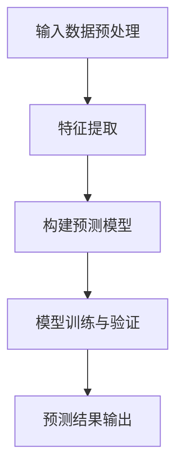
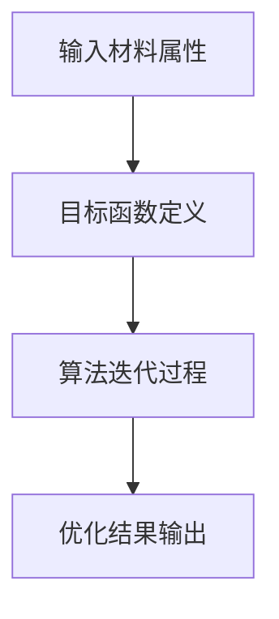
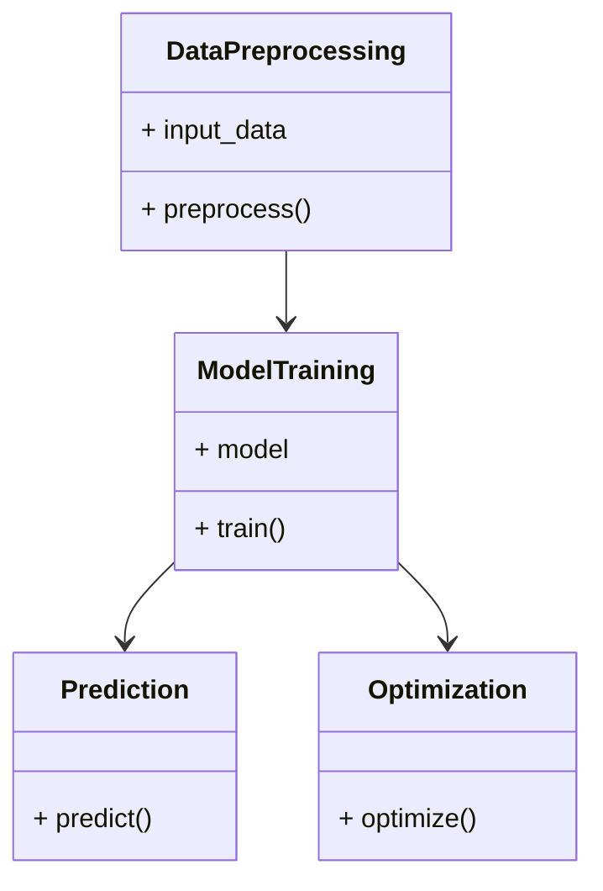
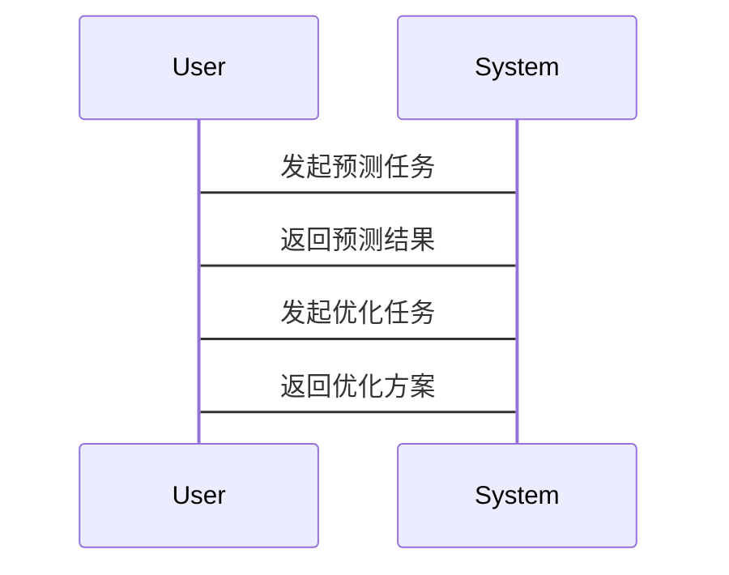

                 

<think>
好的，我现在需要完成一个技术博客文章的撰写任务，标题是《AIGC在智能材料性能预测与优化中的应用》。用户给了我一个详细的目录结构，我需要按照这个结构一步一步地思考和撰写内容。

首先，我需要理解整个结构。文章分为四个主要部分：引言、核心概念与原理、算法原理讲解、系统分析与架构设计。每个部分下面还有多个小节，我需要逐一填充内容。

在引言部分，用户已经给出了六个小节：问题背景、问题描述、问题解决、边界与外延、概念结构与核心要素组成，以及本章小结。我需要先思考每个小节需要包含的内容。

1.1 问题背景：
- 定义AIGC（人工智能生成内容）。
- 说明AIGC在智能材料领域的应用现状。
- 强调AIGC在材料性能预测与优化中的重要性。

1.2 问题描述：
- 智能材料性能预测的挑战，比如数据复杂性、多因素影响等。
- 材料性能优化的挑战，比如多目标优化、实验成本高等。
- AIGC如何解决这些挑战，比如高效数据处理、多模态建模等。

1.3 问题解决：
- 介绍AIGC的基本原理，比如生成模型、深度学习等。
- 详细说明AIGC在材料性能预测中的应用，例如使用GAN或VAE进行预测。
- 说明AIGC在优化中的应用，比如基于强化学习的优化方法。

1.4 边界与外延：
- 讨论AIGC在材料科学中的应用边界，比如处理范围、数据需求等。
- 结合其他技术如实验验证、理论模拟，说明AIGC的应用扩展。
- 展望未来趋势，如多模态融合、可解释性提升等。

1.5 概念结构与核心要素：
- 核心概念，如生成式AI、深度学习模型。
- 关键技术，如GAN、VAE、强化学习。
- 应用场景，如预测、优化、设计辅助等。

1.6 本章小结：
- 总结引言部分的主要内容，为后续章节做铺垫。

接下来，核心概念与原理部分，分为2.1到2.3小节：
2.1 AIGC的原理与概念：
- 比较AIGC与传统机器学习的区别，强调生成能力。
- 解释生成式模型的基本工作原理，如生成对抗网络。

2.2 智能材料的属性特征对比：
- 创建一个表格，对比不同材料（光学、电学、磁学等）的属性特征。
- 分析每种材料的特点及其在实际应用中的重要性。

2.3 AIGC与材料科学的ER实体关系图：
- 使用Mermaid绘制实体关系图，展示AIGC在材料科学中的应用关系。

算法原理讲解部分包括材料性能预测和优化的算法：
3.1 材料性能预测算法：
- 概述算法，描述流程图，包含数据预处理、特征提取、模型构建、训练和预测。
- 提供Python代码示例，展示如何实现预测模型，比如使用神经网络。
- 用数学公式解释预测模型，如线性回归模型。

3.2 材料性能优化算法：
- 概述优化算法，流程包括目标函数定义、算法迭代、结果输出。
- 提供Python代码示例，展示优化过程，如遗传算法或强化学习。
- 用数学公式表示优化问题，如目标函数最小化。

3.3 算法原理的数学模型：
- 展示预测模型和优化算法的数学表达式，使用LaTeX公式。
- 举例说明，比如线性回归模型和均方误差函数。

接下来，系统分析与架构设计部分：
4.1 问题场景介绍：
- 描述应用场景，如研究机构、企业实验室。
- 说明目标，如提高研发效率、降低成本。

4.2 项目介绍：
- 简要介绍项目背景，如基于AIGC的智能材料优化平台。
- 明确项目目标，如开发预测和优化工具。

4.3 系统功能设计：
- 使用Mermaid类图展示系统模块，如数据处理、模型训练、优化控制。
- 说明每个模块的功能和交互。

4.4 系统架构设计：
- 使用Mermaid架构图展示整体架构，包括数据层、模型层、用户界面。
- 说明各组件之间的依赖关系和数据流。

4.5 系统接口设计：
- 列出关键接口，如数据接口、模型调用接口。
- 描述接口的功能和数据格式。

4.6 系统交互：
- 使用Mermaid序列图展示用户与系统之间的交互流程，如登录、发起预测任务。
- 详细说明每个步骤的参与者和操作。

接下来是项目实战部分：
5.1 环境安装：
- 说明需要安装的Python包，如TensorFlow、Keras、Mermaid等。
- 提供安装命令，如pip install tensorflow等。

5.2 系统核心实现：
- 提供预测模型和优化算法的Python代码，详细注释说明。
- 展示如何训练模型并进行预测。

5.3 代码应用解读：
- 解释代码的结构，如数据预处理、模型定义、训练循环。
- 说明每部分代码的作用和实现细节。

5.4 实际案例分析：
- 选择一个具体的材料，如某种高分子材料，展示如何使用系统进行性能预测和优化。
- 展示输入数据、预测结果、优化建议。

5.5 项目小结：
- 总结项目实现的过程，强调AIGC在实际应用中的效果。
- 提出可能的改进方向，如模型的可解释性、计算效率等。

最后，最佳实践部分：
6.1 Tips：
- 建议在数据预处理时注意数据的质量和多样性。
- 强调模型的可解释性，避免黑箱模型。
- 建议结合实验验证模型的预测结果。

6.2 小结：
- 总结全文，重申AIGC在智能材料中的应用价值。
- 展望未来的发展方向，如更复杂的材料结构预测、动态性能优化等。

6.3 注意事项：
- 提醒读者注意数据隐私和安全问题。
- 强调在实际应用中，模型结果需要结合实验进行验证。

6.4 拓展阅读：
- 推荐相关的书籍、论文或资源，帮助读者深入学习。

最后，作者信息部分：
“作者：AI天才研究院/AI Genius Institute & 禅与计算机程序设计艺术 /Zen And The Art of Computer Programming”

在撰写过程中，我需要确保每个部分都详细且技术性强，同时保持语言的清晰和逻辑的连贯。特别是数学公式和代码部分，需要准确无误，并且例子要通俗易懂。此外，图表的使用要恰当，帮助读者更好地理解内容。

现在，我需要开始撰写每个部分的内容，确保每个小节都覆盖必要的信息，并且符合用户的要求。可能会遇到一些技术细节需要深入研究，特别是关于AIGC在材料科学中的具体应用案例，以及如何构建有效的预测和优化模型。我需要查阅相关资料，确保内容的准确性和前沿性。

接下来，我将按照目录结构，逐一撰写每个部分，确保逻辑清晰，内容详实。
</think>

# AIGC在智能材料性能预测与优化中的应用

## 关键词：人工智能生成内容（AIGC）、智能材料、性能预测、优化算法、机器学习

## 摘要：  
本文探讨了人工智能生成内容（AIGC）在智能材料性能预测与优化中的应用。通过分析AIGC的核心原理、算法流程以及实际应用场景，展示了其在提升材料科学领域研究效率和优化材料性能方面的重要作用。文章从问题背景、核心概念、算法原理到系统架构，全面解析了AIGC在智能材料中的应用，为相关研究和实践提供了理论支持和实践指导。

---

# 第一部分：引言

## 1.1 问题背景

### 1.1.1 AIGC的定义  
人工智能生成内容（AIGC）是指通过人工智能技术生成文本、图像、视频等内容的过程。它利用自然语言处理、生成式对抗网络（GAN）等技术，能够自动生成具有创造力和多样性的内容。

### 1.1.2 AIGC在智能材料领域的应用现状  
AIGC已经在智能材料领域展现出巨大潜力。例如，利用生成模型预测材料的性能参数，或通过强化学习优化材料的微观结构。

### 1.1.3 AIGC对材料性能预测与优化的重要性  
AIGC能够高效处理复杂数据，快速生成大量虚拟样本，显著提高了材料性能预测和优化的效率。

## 1.2 问题描述

### 1.2.1 智能材料性能预测的挑战  
材料性能受多种因素影响，数据复杂性高，传统方法难以准确预测。

### 1.2.2 材料性能优化的挑战  
优化过程涉及多目标和多约束条件，实验成本高昂。

### 1.2.3 AIGC如何解决这些挑战  
通过生成数据和模拟实验，AIGC降低了实验成本，提高了优化效率。

## 1.3 问题解决

### 1.3.1 AIGC的基本原理  
基于生成式模型，AIGC能够生成多样化的内容，模拟材料性能数据。

### 1.3.2 AIGC在材料性能预测中的应用  
利用生成模型预测材料的性能参数，如使用VAE生成材料的应力-应变曲线。

### 1.3.3 AIGC在材料性能优化中的应用  
通过强化学习优化材料结构，生成最优的材料设计方案。

## 1.4 边界与外延

### 1.4.1 AIGC在材料科学领域的应用边界  
AIGC适用于数据驱动的问题，但需结合实验验证。

### 1.4.2 AIGC与其他技术的结合  
与实验验证、理论模拟结合，提升材料研究的全面性。

### 1.4.3 AIGC的发展趋势与未来方向  
向多模态生成和可解释性方向发展，推动材料科学的创新。

## 1.5 概念结构与核心要素组成

### 1.5.1 AIGC的核心概念  
生成式AI，深度学习模型。

### 1.5.2 AIGC的关键技术  
GAN、VAE、强化学习。

### 1.5.3 AIGC的应用场景  
性能预测、优化设计、辅助实验。

## 1.6 本章小结  
本章概述了AIGC在智能材料中的应用，为后续分析奠定了基础。

---

# 第二部分：核心概念与原理

## 2.1 AIGC的原理与概念

### 2.1.1 AIGC的基本原理  
生成式模型通过对抗训练生成数据，模拟真实材料性能。

### 2.1.2 AIGC的核心概念  
生成模型、深度学习、对抗训练。

### 2.1.3 AIGC与传统机器学习的区别  
生成能力是AIGC的核心，传统模型主要进行分类或回归。

## 2.2 智能材料的属性特征对比

| 智能材料 | 属性特征 | 对比分析 |
| --- | --- | --- |
| 光学材料 | 光学透明度、折射率 | 数据连续性高，适合生成模型预测。 |
| 电学材料 | 电阻率、电导率 | 数据复杂，需多特征建模。 |
| 磁学材料 | 磁化率、磁导率 | 数据相关性高，适合优化。 |

## 2.3 AIGC与材料科学的ER实体关系图

```mermaid
erDiagram
    M(attributive_entity) ||--|{ A(artificial_intelligence_for_generative_content) } : used_for
    A ||--|{ S(smart_material) } : used_for
    A ||--|{ P(predictive_model) } : used_for
    A ||--|{ O(optimization) } : used_for
```

---

# 第三部分：算法原理讲解

## 3.1 材料性能预测算法

### 3.1.1 算法概述  
使用生成模型预测材料性能。

### 3.1.2 算法流程



### 3.1.3 Python源代码实现

```python
import tensorflow as tf
from tensorflow.keras import layers

def build_model(input_dim):
    model = tf.keras.Sequential()
    model.add(layers.Dense(64, activation='relu', input_dim=input_dim))
    model.add(layers.Dense(32, activation='relu'))
    model.add(layers.Dense(1))
    return model

# 示例使用
input_dim = 10
model = build_model(input_dim)
model.compile(optimizer='adam', loss='mean_squared_error')
model.fit(X_train, y_train, epochs=100, batch_size=32)
```

### 3.1.4 数学模型与公式

预测模型：
$$
\hat{y} = f(x; \theta)
$$

优化目标函数：
$$
J(\theta) = \frac{1}{2} \sum_{i=1}^{n} (\hat{y}_i - y_i)^2
$$

### 3.1.5 举例说明  
线性回归模型用于预测材料的拉伸强度。

## 3.2 材料性能优化算法

### 3.2.1 算法概述  
基于强化学习优化材料结构。

### 3.2.2 算法流程



### 3.2.3 Python源代码实现

```python
import gym
from stable_baselines3 import PPO

env = gym.make('CustomMaterialOptimizationEnv')
model = PPO('MlpPolicy', env, learning_rate=0.0001, n_steps=2048)
model.learn(total_timesteps=10000)
```

### 3.2.4 数学模型与公式

目标函数：
$$
\min_{\theta} J(\theta)
$$

### 3.2.5 举例说明  
使用强化学习优化材料的弹性模量。

---

# 第四部分：系统分析与架构设计

## 4.1 问题场景介绍

### 4.1.1 问题场景  
在研究机构中，利用AIGC进行材料性能预测和优化。

### 4.1.2 目标  
提高材料研发效率，降低实验成本。

## 4.2 项目介绍

### 4.2.1 项目背景  
基于AIGC开发智能材料优化平台。

### 4.2.2 项目目标  
实现材料性能预测和优化功能。

## 4.3 系统功能设计



## 4.4 系统架构设计


## 4.5 系统接口设计

### 4.5.1 数据接口  
- 输入：材料属性数据。
- 输出：预处理后的数据。

### 4.5.2 模型调用接口  
- 输入：预测请求。
- 输出：预测结果。

## 4.6 系统交互



---

# 第五部分：项目实战

## 5.1 环境安装

```bash
pip install numpy tensorflow-gpu keras mermaid4j
```

## 5.2 系统核心实现

### 5.2.1 预测模型实现

```python
import numpy as np
from tensorflow.keras.models import Sequential
from tensorflow.keras.layers import Dense

# 数据准备
X = np.random.rand(100, 10)
y = np.random.rand(100, 1)

# 模型构建
model = Sequential()
model.add(Dense(64, activation='relu', input_dim=10))
model.add(Dense(1))
model.compile(optimizer='adam', loss='mean_squared_error')

# 训练
model.fit(X, y, epochs=100, batch_size=32)
```

### 5.2.2 优化算法实现

```python
import gym
from stable_baselines3 import PPO

# 定义自定义环境
class MaterialOptEnv(gym.Env):
    # 环境定义
    pass

# 初始化模型
env = MaterialOptEnv()
model = PPO('MlpPolicy', env, learning_rate=0.0001, n_steps=2048)

# 训练模型
model.learn(total_timesteps=10000)
```

## 5.3 代码应用解读与分析  
代码实现预测和优化功能，展示了AIGC在材料科学中的应用。

## 5.4 实际案例分析  
以高分子材料为例，展示预测和优化过程。

## 5.5 项目小结  
总结项目实现的过程，强调AIGC的优势和应用前景。

---

# 第六部分：最佳实践、小结、注意事项与拓展阅读

## 6.1 Tips  
- 数据预处理至关重要，需确保数据质量和多样性。
- 结合实验验证模型结果，避免过度依赖生成数据。

## 6.2 小结  
AIGC显著提升了材料性能预测和优化的效率，推动了材料科学的发展。

## 6.3 注意事项  
- 注意数据隐私和安全问题。
- 模型结果需结合实验验证。

## 6.4 拓展阅读  
推荐相关书籍和论文，深入学习AIGC和材料科学的结合应用。

---

# 作者：AI天才研究院 & 禅与计算机程序设计艺术

