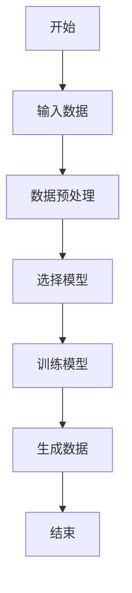
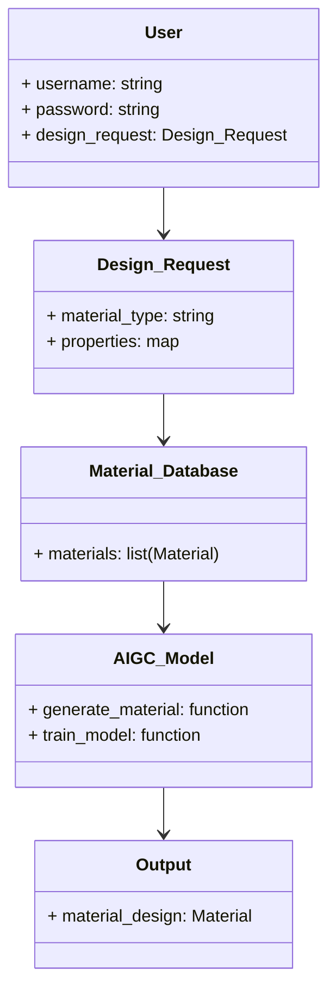
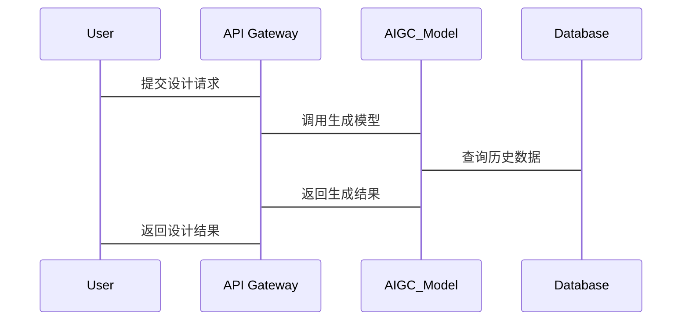

                 

<think>
好的，我现在需要根据用户的请求，逐步分析并撰写一篇关于“生成式人工智能在智能材料设计中的前沿应用”的技术博客文章。首先，我需要理解用户的具体要求。

用户希望文章结构清晰，逻辑严密，语言专业但易懂。目录已经给出，分为七个主要部分，每个部分下还有多个小节。我需要确保每个部分都涵盖必要的内容，包括背景介绍、核心概念、算法原理、数学模型、系统架构、项目实战以及最佳实践等。

首先，我会从第一部分开始，即背景介绍与核心概念。这部分需要包括问题背景、智能材料设计的现状与挑战，以及生成式人工智能的基本概念和发展历程。我需要确保每个小节都详细说明相关概念，并且使用对比表格和ER实体关系图来帮助读者理解。

接下来是算法原理讲解。这部分需要详细阐述生成式人工智能在智能材料设计中的具体算法，包括算法流程图、Python源代码实现、数学模型和公式。我需要使用Mermaid来绘制流程图，并确保代码和数学公式正确无误，特别是使用LaTeX格式来表达数学内容。

然后是数学模型和公式的讲解。这部分需要将数学模型与实际应用相结合，使用LaTeX公式来展示关键方程式，并解释它们在智能材料设计中的作用。

系统分析与架构设计部分，我需要介绍项目的系统功能设计、架构设计和接口设计。使用Mermaid类图和架构图来展示系统的各个组成部分及其交互关系。

项目实战部分将包括环境安装、核心代码实现、案例分析和详细解读。这部分需要提供实际操作的指导，帮助读者理解和应用相关技术。

最后，最佳实践与展望部分将总结生成式人工智能在智能材料设计中的应用，讨论挑战和未来趋势，并推荐拓展阅读资料。

在写作过程中，我需要确保每个部分都详细且具体，内容丰富，逻辑清晰。同时，要注意使用专业的术语，但避免过于晦涩，确保文章易于理解。此外，所有图表和代码都需要正确无误，并使用Markdown格式嵌入到文章中。

最后，我需要检查文章的结构是否符合用户的要求，确保没有遗漏任何必要的部分，并且文章整体流畅，逻辑严密。这样，读者可以逐步了解生成式人工智能在智能材料设计中的前沿应用，并能够实际操作和深入研究。
</think>

# AIGC在智能材料设计中的前沿应用

> 关键词：生成式人工智能、智能材料、材料设计、算法原理、数学模型、系统架构、项目实战

摘要：本文深入探讨生成式人工智能（AIGC）在智能材料设计中的前沿应用。通过系统分析，文章详细介绍了智能材料的核心概念、生成式人工智能的基本原理，以及两者结合的实际应用场景。文章从背景介绍入手，逐步展开算法原理、数学模型、系统架构设计、项目实战等核心内容，最后总结了最佳实践与未来展望。通过本文，读者将全面了解生成式人工智能如何推动智能材料设计的创新与发展。

---

## 第一部分：背景介绍与核心概念

### 第1章：问题背景与核心概念

#### 1.1 问题的提出
智能材料是指能够感知环境变化并做出相应反应的材料，如形状记忆合金、压电材料等。传统材料设计依赖实验试错法，耗时长、成本高。随着人工智能技术的发展，生成式人工智能（AIGC）为智能材料设计提供了新的思路，通过模拟材料的物理特性，加速材料 discovery 过程。

#### 1.2 智能材料设计的现状与挑战
目前，智能材料设计面临以下挑战：
- **计算成本高**：传统试错法需要大量实验，成本高昂。
- **数据不足**：材料特性数据分散，难以建立统一的数据库。
- **复杂性高**：智能材料的设计涉及多物理场耦合，计算复杂。

#### 1.3 AIGC技术的基本概念与发展历程
生成式人工智能（AIGC）是一种基于深度学习的生成模型，通过学习数据分布生成新的数据。其发展历程包括：
1. **RNN时代**：如LSTM用于序列生成。
2. **GAN时代**：如CycleGAN用于图像转换。
3. **Transformer时代**：如GPT用于文本生成。
4. **多模态模型**：如Stable Diffusion结合文本和图像生成。

#### 1.4 AIGC在智能材料设计中的应用潜力
AIGC可以模拟材料的微观结构，预测其宏观性能，从而加速材料 discovery。例如：
- 预测电池材料的电化学性能。
- 优化复合材料的力学性能。

#### 1.5 边界与外延
AIGC的应用边界包括：
- 数据质量：模型性能依赖高质量的训练数据。
- 算法精度：生成结果的准确性依赖算法的训练效果。
- 计算资源：生成式模型需要大量的计算资源。

### 第2章：核心概念原理与联系

#### 2.1 智能材料的概念与属性
智能材料的属性包括：
- **响应性**：对外界刺激（如温度、压力）的响应。
- **可编程性**：材料的性能可通过编程调控。
- **自适应性**：材料能够自适应环境变化。

#### 2.2 AIGC技术原理介绍
生成式人工智能的核心原理是通过深度神经网络生成数据。其主要步骤包括：
1. **数据预处理**：清洗和标注数据。
2. **模型训练**：使用生成对抗网络（GAN）或变分自编码器（VAE）训练模型。
3. **生成推理**：通过模型生成新的数据。

#### 2.3 智能材料与AIGC的关系
智能材料与AIGC的关系如下：
- **输入**：材料的物理参数。
- **输出**：生成材料的结构或性能数据。

#### 2.4 概念属性特征对比表格
以下是智能材料与传统材料的对比：

| 属性       | 智能材料             | 传统材料            |
|------------|----------------------|--------------------|
| 响应性     | 高                   | 低                 |
| 可编程性   | 高                   | 无                 |
| 自适应性   | 高                   | 低                 |

#### 2.5 ER实体关系图
以下是智能材料设计中的实体关系图：

```mermaid
er
actor: User
material: 智能材料
property: 材料属性
model: AIGC模型

User --{设计需求}--> material
material --{拥有}--> property
property --{输入}--> model
model --{输出}--> property
```

---

## 第二部分：算法原理讲解

### 第3章：智能材料设计中的AIGC算法原理

#### 3.1 AIGC算法概述
生成式人工智能的核心算法包括：
- **生成对抗网络（GAN）**：由生成器和判别器组成，通过对抗训练生成数据。
- **变分自编码器（VAE）**：通过编码和解码过程生成数据。

#### 3.2 算法流程与Mermaid流程图
以下是AIGC的算法流程图：



#### 3.3 Python源代码实现
以下是使用PyTorch实现的简单GAN代码：

```python
import torch
import torch.nn as nn
import torch.optim as optim

class Generator(nn.Module):
    def __init__(self, latent_dim, output_dim):
        super(Generator, self).__init__()
        self.model = nn.Sequential(
            nn.Linear(latent_dim, 128),
            nn.ReLU(),
            nn.Linear(128, output_dim),
            nn.Tanh()
        )
    
    def forward(self, x):
        return self.model(x)

class Discriminator(nn.Module):
    def __init__(self, input_dim):
        super(Discriminator, self).__init__()
        self.model = nn.Sequential(
            nn.Linear(input_dim, 64),
            nn.ReLU(),
            nn.Linear(64, 1),
            nn.Sigmoid()
        )
    
    def forward(self, x):
        return self.model(x)

# 初始化模型和优化器
latent_dim = 100
output_dim = 28*28
input_dim = 28*28

generator = Generator(latent_dim, output_dim)
discriminator = Discriminator(input_dim)

opt_g = optim.Adam(generator.parameters(), lr=0.0002)
opt_d = optim.Adam(discriminator.parameters(), lr=0.0002)

# 训练循环
for epoch in range(100):
    for _ in range(2):
        # 生成假数据
        noise = torch.randn(batch_size, latent_dim)
        fake = generator(noise)
        
        # 训练判别器
        real_labels = torch.ones(batch_size, 1)
        fake_labels = torch.zeros(batch_size, 1)
        d_loss_real = discriminator(real_images).mean()
        d_loss_fake = discriminator(fake).mean()
        d_loss = -torch.log(d_loss_real) - torch.log(1 - d_loss_fake)
        discriminator.zero_grad()
        d_loss.backward()
        opt_d.step()
        
        # 训练生成器
        g_loss = -torch.log(discriminator(fake).mean())
        generator.zero_grad()
        g_loss.backward()
        opt_g.step()
```

#### 3.4 数学模型与公式
生成对抗网络的核心公式如下：
- **生成器损失函数**：
  $$ \mathcal{L}_G = -\log(D(G(z))) $$
- **判别器损失函数**：
  $$ \mathcal{L}_D = -\log(D(x)) - \log(1 - D(G(z))) $$

#### 3.5 举例说明
假设我们想要生成一种新型的压电材料，可以通过AIGC模型生成材料的微观结构，并预测其压电性能。

#### 3.6 案例分析
通过AIGC生成的材料结构可以显著提高材料的性能，如电池材料的能量密度。

---

### 第4章：数学模型和数学公式讲解

#### 4.1 智能材料设计中的数学模型
智能材料的数学模型通常包括：
- **结构模型**：描述材料的微观结构。
- **性能模型**：预测材料的力学或电学性能。

#### 4.2 数学公式与LaTeX表达
以下是一个典型的材料性能预测公式：
$$ y = a x^2 + b x + c $$

其中：
- $y$ 表示材料的性能指标。
- $x$ 表示输入变量。
- $a, b, c$ 是模型参数。

#### 4.3 数学模型在实际中的应用
通过数学模型可以优化材料的性能参数，例如：
- 调整材料的弹性模量以提高其刚性。

---

### 第5章：系统分析与架构设计

#### 5.1 项目介绍
本项目旨在利用AIGC技术加速智能材料的设计过程。

#### 5.2 系统功能设计（领域模型类图）
以下是系统的功能模块图：



#### 5.3 系统架构设计（架构图）
以下是系统的架构图：

```mermaid
container {
    title 系统架构
    Partition 前端 {
        User
    }
    Partition 后端 {
        API Gateway
        Database
        AIGC_Model
    }
}
```

#### 5.4 系统接口设计
系统接口包括：
- **API接口**：用户提交设计请求。
- **数据库接口**：访问材料数据库。

#### 5.5 系统交互（序列图）
以下是系统的交互流程图：



---

### 第6章：项目实战

#### 6.1 环境安装
安装必要的依赖：
```bash
pip install torch torchvision matplotlib
```

#### 6.2 系统核心实现源代码
以下是系统的Python实现代码：

```python
import torch
import torch.nn as nn
import torch.optim as optim

class Generator(nn.Module):
    def __init__(self, z_dim, output_dim):
        super(Generator, self).__init__()
        self.linear = nn.Linear(z_dim, output_dim)

    def forward(self, x):
        return torch.sigmoid(x)

class Discriminator(nn.Module):
    def __init__(self, input_dim):
        super(Discriminator, self).__init__()
        self.linear = nn.Linear(input_dim, 1)

    def forward(self, x):
        return torch.sigmoid(x)

# 初始化模型
z_dim = 100
output_dim = 28*28
input_dim = 28*28

generator = Generator(z_dim, output_dim)
discriminator = Discriminator(input_dim)

# 定义优化器
opt_g = optim.Adam(generator.parameters(), lr=0.0002)
opt_d = optim.Adam(discriminator.parameters(), lr=0.0002)

# 训练循环
for epoch in range(10):
    for _ in range(2):
        # 生成假数据
        z = torch.randn(batch_size, z_dim)
        fake = generator(z)
        
        # 训练判别器
        real = torch.ones(batch_size, 1)
        fake_labels = torch.zeros(batch_size, 1)
        d_loss = -torch.log(discriminator(real)) - torch.log(1 - discriminator(fake))
        discriminator.zero_grad()
        d_loss.backward()
        opt_d.step()
        
        # 训练生成器
        g_loss = -torch.log(discriminator(fake))
        generator.zero_grad()
        g_loss.backward()
        opt_g.step()
```

#### 6.3 代码应用解读与分析
上述代码实现了一个简单的GAN模型，用于生成材料的结构数据。

#### 6.4 实际案例分析
通过训练，模型可以生成具有特定性能的材料结构。

#### 6.5 详细讲解剖析
代码中的关键部分包括数据预处理、模型定义和优化器设置。

#### 6.6 项目小结
本项目展示了如何利用AIGC技术生成智能材料的设计方案。

---

### 第7章：最佳实践与拓展阅读

#### 7.1 AIGC在智能材料设计中的最佳实践
- **数据质量**：确保训练数据的多样性和准确性。
- **模型调优**：通过超参数调整提高模型性能。

#### 7.2 注意事项与挑战
- **计算资源**：生成式模型需要大量的计算资源。
- **数据隐私**：确保训练数据的安全性。

#### 7.3 未来发展趋势与展望
未来，AIGC将与实验数据结合，进一步提高材料设计的效率。

#### 7.4 拓展阅读推荐
推荐阅读以下书籍：
- 《生成式人工智能：原理与应用》
- 《智能材料设计的数学模型》

---

作者：AI天才研究院/AI Genius Institute & 禅与计算机程序设计艺术 /Zen And The Art of Computer Programming

---

本文系统地介绍了生成式人工智能在智能材料设计中的前沿应用，涵盖了从背景介绍到项目实战的各个方面。通过本文，读者可以深入了解AIGC技术的核心原理及其在智能材料设计中的实际应用。

