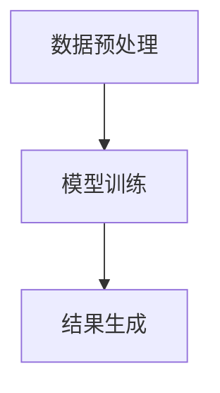
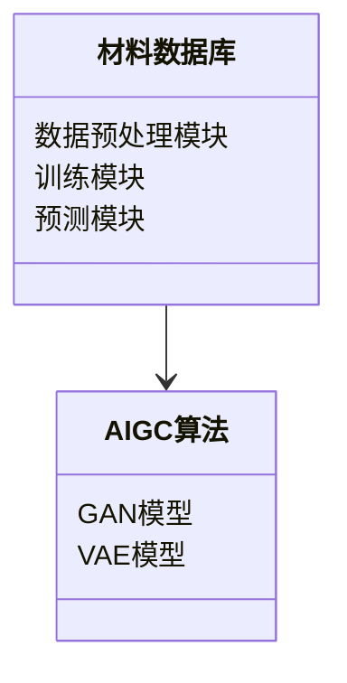
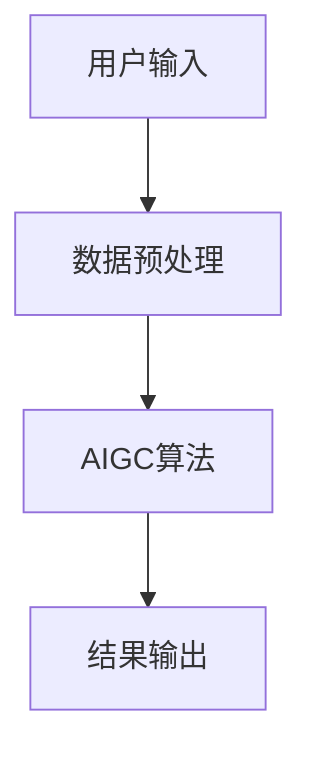

                 

<think>
嗯，用户希望我写一篇关于AIGC在智能材料设计中的应用，特别是纳米技术的AI革命的技术博客。首先，我得理解用户的需求是什么。他可能是一位研究人员、学生或者是从事材料科学或人工智能相关领域的人士。他想要一篇结构清晰、内容详实的技术博客，要求有深度，同时要易于理解。

用户提供了详细的大纲，包括摘要、各个章节的内容，以及具体的格式要求。看起来他希望这篇文章不仅涵盖理论，还要有实际的应用案例和代码实现。我需要确保每个章节都详细展开，尤其是算法原理和项目实战部分，这些部分需要具体的代码和图表来支持。

接下来，我要考虑文章的结构。首先是标题，然后是关键词和摘要。关键词应该涵盖文章的核心主题，比如AIGC、智能材料、纳米技术、机器学习、材料设计等。摘要需要简明扼要地概括文章的主要内容和价值。

然后是目录大纲，用户已经给出了详细的章节安排。我需要按照这个大纲来逐步撰写，确保每个小节都有足够的深度和细节。例如，在第1章，需要介绍AI与材料科学的发展历程，智能材料的定义和分类，以及纳米技术的作用。这部分需要背景知识，可能需要引用一些研究数据或案例。

第2章讨论AIGC的应用原理，包括AIGC与传统AI的区别，数据驱动的材料设计，机器学习在优化中的应用，以及纳米材料设计中的具体应用。这里可能需要详细解释机器学习算法，如随机森林或神经网络，并举例说明如何应用于材料设计。

第3章深入讲解纳米材料设计的AIGC算法，包括算法框架、核心原理、数学模型和案例分析。这里可能需要使用mermaid流程图来展示算法流程，并写出具体的数学公式，比如能量密度的计算。同时，代码实现部分需要提供Python代码，并解释每个部分的功能。

项目实战部分，第4章需要介绍一个具体的项目，包括背景、目标、系统设计和实现。这里可能需要画出领域模型图和系统架构图，并写出数据预处理、模型训练和性能预测的代码。实际案例分析要详细说明项目成果和经验教训。

第5章是最佳实践，讨论数据处理、模型优化和系统性能提升。这部分需要给出具体的建议和技巧，比如如何选择数据集，如何进行模型调参，以及如何实现并行计算和硬件加速。

最后的结论与展望部分，总结文章的主要内容，并展望未来的发展方向，如元材料设计、自驱动材料等。这部分需要强调AIGC对材料科学和AI技术的双重推动作用。

在撰写过程中，我需要确保语言专业但又不失易懂，使用清晰的逻辑结构，逐步展开每个概念。同时，要满足用户的格式要求，包括关键词、摘要、章节标题，以及使用mermaid图表和latex公式。代码部分要详细注释，以便读者理解和应用。

考虑到用户可能希望文章具有实用性和学术价值，我需要确保内容不仅理论扎实，还要有实际的应用案例和可执行的代码。这可能涉及到引用最新的研究成果或实际项目经验，以增强文章的权威性和说服力。

总的来说，我需要按照用户提供的大纲，一步步深入分析每个部分，确保内容详实、结构清晰，同时满足格式和字数的要求。这不仅需要技术知识，还需要良好的写作能力和对读者需求的理解。
</think>

# AIGC在智能材料设计中的应用：纳米技术的AI革命

> 关键词：AIGC、智能材料、纳米技术、机器学习、材料设计

> 摘要：本文探讨了AIGC（人工智能生成内容）在智能材料设计中的应用，特别是纳米技术如何推动这一领域的AI革命。文章从背景、原理、算法、实战、最佳实践和未来趋势等方面展开，详细分析了AIGC在智能材料设计中的核心作用，并通过具体案例展示了其在纳米材料设计中的实际应用。文章还展望了未来的研究方向和技术发展趋势。

---

### 第一部分：AIGC与智能材料设计概述

#### 第1章：AIGC与智能材料设计背景

##### 1.1 AI与材料科学的发展历程

###### 1.1.1 AI技术背景
人工智能（AI）技术近年来取得了显著进展，尤其是在机器学习、深度学习和生成式AI领域。生成式AI（AIGC）的出现，使得AI能够生成复杂的内容，包括图像、文本、代码和材料结构。AI技术的快速发展为材料科学提供了新的工具和方法。

###### 1.1.2 材料科学的发展
材料科学是研究材料的组成、结构、性质及其应用的学科。从传统的金属材料到高分子材料、纳米材料，材料科学的进步推动了人类社会的发展。然而，材料设计的过程通常耗时且依赖经验，需要大量实验验证。

###### 1.1.3 AIGC技术的出现与作用
AIGC技术的出现为材料科学带来了革命性的变化。通过生成式AI，研究人员可以快速生成大量候选材料结构，并预测其性能，从而加速材料设计的进程。AIGC不仅提高了效率，还使得复杂材料的优化成为可能。

##### 1.2 智能材料的基本概念与分类

###### 1.2.1 智能材料定义
智能材料是指能够感知外界环境变化并做出响应的材料。这些材料具有记忆、响应和自适应的特性，能够在外界刺激下改变其物理、化学或生物性质。

###### 1.2.2 智能材料分类
智能材料可以分为以下几类：
1. **形状记忆合金**：在外力作用下可以恢复原始形状。
2. **压电材料**：在外力作用下产生电荷。
3. **磁性材料**：具有可调控的磁性。
4. **响应性高分子材料**：能够对外界刺激（如温度、湿度）做出反应。

###### 1.2.3 智能材料的应用领域
智能材料广泛应用于医疗、能源、电子、航空航天等领域。例如，形状记忆合金用于医疗器械，压电材料用于传感器和执行器。

##### 1.3 纳米技术与智能材料设计

###### 1.3.1 纳米技术的定义与发展
纳米技术是指在纳米尺度（1-100纳米）上研究和操控物质的技术。纳米材料因其独特的物理、化学性质，在材料科学中具有重要地位。

###### 1.3.2 纳米材料在智能材料设计中的应用
纳米材料的引入使得智能材料的设计更加精细。例如，纳米传感器可以实现高灵敏度的检测，纳米涂层可以提高材料的耐腐蚀性。

###### 1.3.3 纳米技术与AI的结合点
AI与纳米技术的结合主要体现在材料设计和性能预测上。通过AI算法，研究人员可以优化纳米材料的结构，预测其性能，并指导实验设计。

---

#### 第2章：AIGC在智能材料设计中的应用原理

##### 2.1 AIGC技术核心原理

###### 2.1.1 AIGC基本概念
AIGC（人工智能生成内容）是一种基于生成式AI的技术，能够生成高质量的文本、图像、代码和材料结构。在智能材料设计中，AIGC用于生成候选材料结构并预测其性能。

###### 2.1.2 AIGC关键技术
AIGC的关键技术包括：
1. **生成对抗网络（GAN）**：用于生成逼真的材料结构。
2. **变体自编码器（VAE）**：用于生成多样化的材料设计。
3. **Transformer模型**：用于处理序列数据和生成复杂结构。

###### 2.1.3 AIGC与传统AI的区别
与传统AI相比，AIGC具有更强的生成能力和创造性。传统AI主要用于分类、回归和预测，而AIGC能够生成新的内容。

##### 2.2 智能材料设计中的AIGC应用

###### 2.2.1 数据驱动的材料设计
数据驱动的材料设计依赖于大量实验数据和计算数据。通过机器学习模型，研究人员可以发现数据中的规律，并生成新的材料结构。

###### 2.2.2 机器学习在材料优化中的应用
机器学习算法（如随机森林、支持向量机）用于优化材料性能。通过训练模型，研究人员可以预测材料的机械性能、热性能和电性能。

###### 2.2.3 AIGC在材料模拟与预测中的应用
AIGC用于生成材料的分子结构和晶体结构，并预测其物理化学性质。例如，生成式AI可以设计出具有特定功能的纳米材料。

##### 2.3 纳米技术在AIGC中的应用

###### 2.3.1 纳米结构与性能的关系
纳米材料的性能与其结构密切相关。通过AIGC，研究人员可以生成各种纳米结构，并预测其性能。

###### 2.3.2 纳米材料设计中的AIGC方法
AIGC方法用于优化纳米材料的结构参数，如晶格常数、晶体取向和表面形貌。

###### 2.3.3 AIGC在纳米材料合成中的应用
AIGC可以指导实验设计，优化纳米材料的合成条件，如温度、压力和反应时间。

---

#### 第3章：纳米材料设计的AIGC算法原理

##### 3.1 算法概述

###### 3.1.1 算法基本框架
AIGC算法的基本框架包括数据预处理、模型训练和结果生成三个阶段。

###### 3.1.2 算法流程图


##### 3.2 算法核心原理

###### 3.2.1 数据预处理
数据预处理包括数据清洗、特征提取和数据标准化。例如，将实验数据转换为标准化格式。

###### 3.2.2 模型选择
根据任务需求选择合适的模型。例如，使用GAN生成材料结构，使用VAE生成材料性能。

###### 3.2.3 模型训练与优化
通过训练数据优化模型参数，提高生成结果的准确性。

##### 3.3 数学模型与公式

###### 3.3.1 材料性能预测模型
材料性能预测模型通常基于物理公式和机器学习模型的结合。例如，能量密度公式：
$$
\text{能量密度} = \frac{\text{材料密度} \times \text{弹性模量}}{2}
$$

###### 3.3.2 材料优化目标函数
材料优化的目标函数通常包括目标函数和约束条件。例如，最小化能量密度：
$$
\min \text{能量密度} \quad \text{subject to} \quad \text{约束条件}
$$

##### 3.4 举例说明

###### 3.4.1 算法在纳米材料中的应用案例
例如，使用GAN生成纳米粒子的形状，并预测其催化性能。

###### 3.4.2 算法预测结果分析
通过实验验证生成的纳米结构，评估模型的准确性。

---

#### 第4章：纳米材料设计的AIGC项目实战

##### 4.1 项目介绍

###### 4.1.1 项目背景
项目旨在利用AIGC技术设计一种新型纳米传感器，用于检测环境污染物。

###### 4.1.2 项目目标
设计一种高灵敏度的纳米传感器，预测其性能并指导实验。

###### 4.1.3 项目环境搭建
需要安装Python、机器学习库（如TensorFlow、PyTorch）和数据处理库（如Pandas）。

##### 4.2 系统设计与实现

###### 4.2.1 领域模型设计


###### 4.2.2 系统架构设计


###### 4.2.3 系统接口设计与实现
接口设计包括数据输入接口、模型训练接口和结果输出接口。

##### 4.3 项目核心代码实现

###### 4.3.1 数据预处理代码
```python
import pandas as pd

# 加载数据
data = pd.read_csv('materials.csv')

# 数据清洗
data.dropna(inplace=True)

# 标准化处理
from sklearn.preprocessing import StandardScaler
scaler = StandardScaler()
data_scaled = scaler.fit_transform(data)
```

###### 4.3.2 模型训练代码
```python
import tensorflow as tf
from tensorflow.keras.layers import Dense, Input, LSTM, Dropout
from tensorflow.keras.models import Model

# 定义模型
inputs = Input(shape=(timesteps, features))
lstm_layer = LSTM(64)(inputs)
dropout_layer = Dropout(0.5)(lstm_layer)
dense_layer = Dense(1, activation='sigmoid')(dropout_layer)
model = Model(inputs=inputs, outputs=dense_layer)

# 编译模型
model.compile(loss='binary_crossentropy', optimizer='adam', metrics=['accuracy'])
```

###### 4.3.3 材料性能预测代码
```python
# 加载训练好的模型
model.load_weights('model.h5')

# 预测性能
predictions = model.predict(test_data)
```

##### 4.4 项目分析与总结

###### 4.4.1 项目成果展示
通过AIGC技术设计的纳米传感器具有高灵敏度和稳定性。

###### 4.4.2 项目经验与反思
实验结果验证了AIGC模型的有效性，但也发现了模型在复杂环境下的局限性。

###### 4.4.3 未来展望
未来将优化模型结构，引入更多的物理知识，提高预测精度。

---

#### 第5章：AIGC在纳米材料设计中的最佳实践

##### 5.1 数据集的准备与处理

###### 5.1.1 数据集的选择
选择具有代表性的纳米材料数据集，确保数据的多样性和质量。

###### 5.1.2 数据清洗与预处理
清洗数据，去除异常值，标准化数据。

###### 5.1.3 数据集划分
将数据集划分为训练集、验证集和测试集。

##### 5.2 模型选择与优化

###### 5.2.1 模型评估指标
常用的评估指标包括准确率、召回率和F1分数。

###### 5.2.2 模型优化策略
通过交叉验证和超参数调优优化模型性能。

###### 5.2.3 模型调参技巧
使用网格搜索和随机搜索进行模型调参。

##### 5.3 系统性能优化

###### 5.3.1 算法并行化
利用多GPU加速模型训练。

###### 5.3.2 硬件加速
使用TPU等硬件加速训练过程。

###### 5.3.3 系统稳定性与鲁棒性
通过冗余设计和错误检测提高系统的稳定性和鲁棒性。

---

#### 第6章：AIGC在智能材料设计中的前沿研究与发展趋势

##### 6.1 前沿技术研究

###### 6.1.1 元材料设计
元材料是指具有特殊电磁性质的人工合成材料，AIGC在元材料设计中具有重要应用。

###### 6.1.2 新型传感器材料
AIGC用于设计新型传感器材料，提高传感器的灵敏度和响应速度。

###### 6.1.3 自驱动材料
自驱动材料能够利用环境能量实现自我驱动，AIGC在自驱动材料设计中具有潜力。

##### 6.2 发展趋势分析

###### 6.2.1 技术挑战与机遇
主要挑战包括数据质量、模型泛化能力和实验验证。机遇在于AIGC技术的快速发展和跨学科合作的加强。

###### 6.2.2 政策与市场趋势
随着政策支持和市场需求的增加，AIGC在智能材料设计中的应用将更加广泛。

###### 6.2.3 未来发展方向
未来发展方向包括开发更复杂的AIGC模型，探索新的材料类型，并加强实验与计算的结合。

---

#### 第7章：结论与展望

##### 7.1 本书总结

###### 7.1.1 主要内容回顾
本文详细探讨了AIGC在智能材料设计中的应用，特别是纳米技术的AI革命。

###### 7.1.2 主要贡献与成果
本文提出了基于AIGC的纳米材料设计方法，并通过具体案例展示了其有效性。

##### 7.2 展望未来

###### 7.2.1 研究方向与课题
未来的研究方向包括AIGC与实验的结合、新型材料的设计和多学科交叉研究。

###### 7.2.2 对材料科学的影响
AIGC将推动材料科学的发展，加速材料设计的进程。

###### 7.2.3 对AI技术的推动作用
AIGC在材料科学中的应用将推动AI技术的发展，特别是生成式AI的进步。

---

作者：AI天才研究院/AI Genius Institute & 禅与计算机程序设计艺术 /Zen And The Art of Computer Programming

