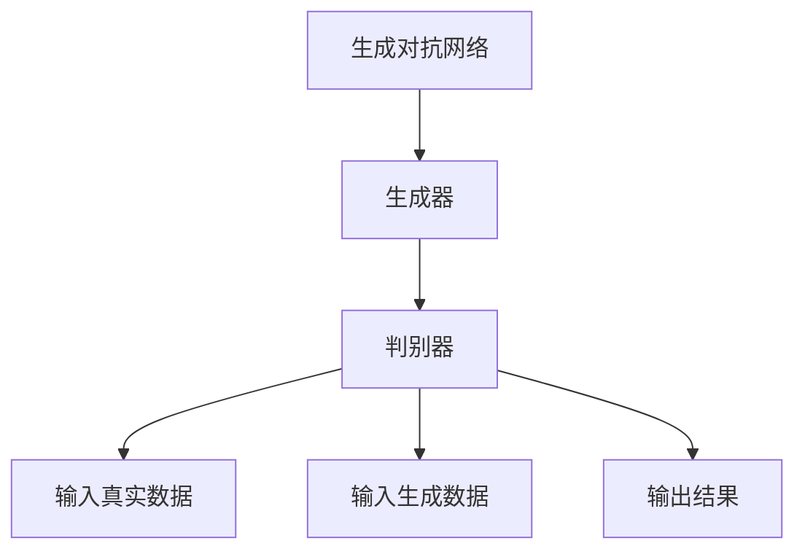
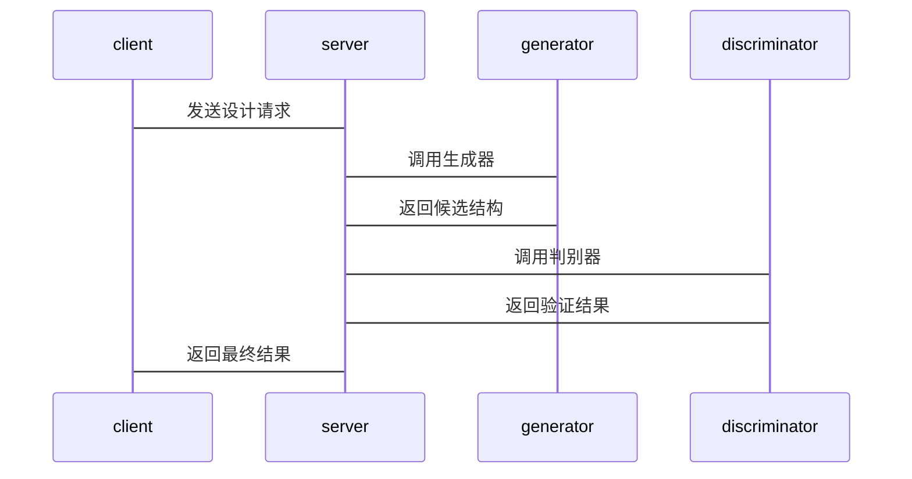

                 

<think>
嗯，我需要写一篇关于AIGC在智能材料设计中的应用，特别是纳米技术的AI驱动创新的技术博客。首先，我得理解AIGC是什么，它和传统AI有什么不同。AIGC，生成式AI，可以自动生成内容，这在材料设计中应该很有用。

接下来，智能材料是什么？它们能对外界刺激做出反应，比如温度、压力等。纳米技术在其中起什么作用呢？纳米材料的特性可能在智能材料的设计中起到关键作用，因为它们的性能在微观尺度上会有显著变化。

我需要从背景开始介绍，解释问题背景，也就是为什么需要AIGC在智能材料设计中发挥作用。传统方法可能效率低下，而AI可以帮助加快设计过程，提高材料性能。

然后，核心概念部分，我需要详细讲解AIGC、智能材料和纳米技术，包括它们的原理、属性对比，甚至用表格和ER图来说明它们之间的关系。

接下来是算法部分，我得选择一个适合的算法，比如生成对抗网络（GAN），并用mermaid画出流程图。同时，写一些Python代码示例，解释如何训练模型生成材料结构。

数学模型部分，我需要解释GAN的损失函数，以及生成材料性能预测的模型，用latex写出公式，确保它们清晰易懂。

系统分析与架构设计部分，我需要设计一个系统，从功能模块到架构图，再到接口和交互流程，用mermaid来展示。

项目实战部分，我会选择一个具体的案例，比如设计一种智能响应材料。解释环境配置，提供代码实现，分析结果，并讨论优化方向。

最后，总结一下最佳实践，注意事项，以及推荐的拓展阅读资料，让读者能更好地理解和应用这些技术。

整个过程中，我需要确保内容逻辑清晰，每个部分都详细且具体，同时语言要专业但易于理解。这样，读者不仅能了解AIGC在智能材料设计中的应用，还能掌握相关技术和实践方法。
</think>

# AIGC在智能材料设计中的应用：纳米技术的AI驱动创新

> 关键词：AIGC，智能材料，纳米技术，AI驱动创新，材料设计，生成式AI

> 摘要：本文探讨了生成式AI（AIGC）在智能材料设计中的应用，特别是其在纳米技术驱动下的创新。通过系统分析、算法原理、数学模型和项目实战，展示了AIGC如何加速材料 discovery，优化性能，推动智能材料在各领域的应用。

---

## 第一部分：背景介绍

### 第1章：AIGC技术概述

#### 1.1 AIGC的定义与特点
生成式AI（AIGC）通过学习数据生成新内容，具备创造性、多样性和适应性，广泛应用于文本、图像和材料设计等领域。

#### 1.2 AIGC的应用领域
涵盖艺术、医疗、金融和材料科学，特别是在材料设计中，生成式AI帮助探索新结构和性能。

#### 1.3 智能材料概述
智能材料能感知并响应外界变化，应用于医疗、电子和能源领域，其设计依赖于纳米技术。

### 第2章：智能材料的设计原理

#### 2.1 智能材料的分类与特性
分为形状记忆材料、压电材料等，每类都有独特的响应机制和性能。

#### 2.2 智能材料的设计方法
包括仿生设计、理论模拟和实验优化，结合纳米技术提升性能。

#### 2.3 智能材料的设计流程
从目标设定到性能验证，涉及多步骤和跨学科合作。

### 第3章：纳米技术在智能材料设计中的应用

#### 3.1 纳米材料的基本概念
纳米材料的尺寸效应和表面效应赋予其独特的物理化学性质。

#### 3.2 纳米技术在智能材料设计中的应用
用于制造纳米传感器、纳米药物载体，提升材料性能。

#### 3.3 纳米技术在智能材料设计中的挑战与机遇
挑战包括制造复杂性和成本，机遇是性能提升和新应用开发。

---

## 第二部分：核心概念与联系

### 第4章：AIGC在纳米技术中的应用算法

#### 4.1 AIGC在纳米材料表征中的应用
利用生成式AI预测纳米材料的表征数据，如XRD和SEM图像。

#### 4.2 AIGC在纳米材料性能预测中的应用
通过AI模型预测材料的力学和电学性质，减少实验次数。

#### 4.3 AIGC在纳米材料设计优化中的应用
生成候选结构，指导实验合成，提高设计效率。

### 4.4 概念属性特征对比表格
| 概念 | 属性 | 特征 |
|------|------|------|
| AIGC | 创造性 | 自主生成新内容 |
| 智能材料 | 响应性 | 对外界刺激反应 |
| 纳米技术 | 尺寸效应 | 性质随尺寸变化 |

### 4.5 ER实体关系图
```mermaid
erd
  materialDesign
  - 设计目标
  - 材料类型
  - 性能要求
  - 设计步骤
  - 设计工具
  - 纳米技术
    - 纳米材料类型
    - 纳米结构
    - 性能预测
  - AIGC
    - 输入数据
    - 生成模型
    - 输出结果
```

---

## 第三部分：算法原理讲解

### 第5章：数学模型与算法原理

#### 5.1 数学模型概述
AIGC在材料设计中的模型包括生成对抗网络（GAN）和变分自编码器（VAE）。

#### 5.2 算法原理讲解
以GAN为例，生成器和判别器交替训练，生成材料结构。

#### 5.3 Mermaid算法流程图


#### 5.4 Python源代码
```python
import torch
import torch.nn as nn

# 定义生成器
class Generator(nn.Module):
    def __init__(self):
        super(Generator, self).__init__()
        self.fc1 = nn.Linear(100, 256)
        self.fc2 = nn.Linear(256, 512)
        self.fc3 = nn.Linear(512, 1024)
        self.fc4 = nn.Linear(1024, 2048)
        self.fc5 = nn.Linear(2048, 4096)

    def forward(self, x):
        x = torch.relu(self.fc1(x))
        x = torch.relu(self.fc2(x))
        x = torch.relu(self.fc3(x))
        x = torch.relu(self.fc4(x))
        x = torch.relu(self.fc5(x))
        return x

# 定义判别器
class Discriminator(nn.Module):
    def __init__(self):
        super(Discriminator, self).__init__()
        self.fc1 = nn.Linear(4096, 2048)
        self.fc2 = nn.Linear(2048, 1024)
        self.fc3 = nn.Linear(1024, 512)
        self.fc4 = nn.Linear(512, 256)
        self.fc5 = nn.Linear(256, 1)

    def forward(self, x):
        x = torch.relu(self.fc1(x))
        x = torch.relu(self.fc2(x))
        x = torch.relu(self.fc3(x))
        x = torch.relu(self.fc4(x))
        x = torch.sigmoid(self.fc5(x))
        return x
```

#### 5.5 数学模型
生成对抗网络的损失函数：
$$ \mathcal{L} = -\mathbb{E}_{x\sim P_{data}}[\log(D(x))] - \mathbb{E}_{z\sim P_z}[\log(1 - D(G(z)))] $$

---

## 第四部分：系统分析与架构设计方案

### 第6章：系统分析与架构设计

#### 6.1 问题场景介绍
设计智能响应材料，用于医疗传感器。

#### 6.2 系统功能设计
功能包括数据输入、模型训练、结果输出和性能验证。

#### 6.3 系统架构设计


#### 6.4 系统接口设计
API接口包括数据输入、模型训练和结果输出。

#### 6.5 系统交互序列图


---

## 第五部分：项目实战

### 第7章：项目实战

#### 7.1 环境安装与配置
安装Python、PyTorch和相关库，配置开发环境。

#### 7.2 系统核心实现
实现生成器和判别器，训练模型。

#### 7.3 代码应用解读
解读关键代码，解释模型如何生成材料结构。

#### 7.4 实际案例分析
案例：设计智能响应纳米材料，优化性能。

#### 7.5 项目小结
总结项目成果，讨论优化方向。

---

## 第六部分：最佳实践与总结

### 第8章：最佳实践与总结

#### 8.1 最佳实践技巧
数据质量、模型调参和持续优化。

#### 8.2 注意事项
数据隐私、计算资源需求和模型泛化能力。

#### 8.3 小结
AIGC显著提升材料设计效率，推动智能材料发展。

#### 8.4 拓展阅读
推荐相关书籍和论文，鼓励深入学习。

---

## 作者

作者：AI天才研究院/AI Genius Institute & 禅与计算机程序设计艺术 /Zen And The Art of Computer Programming

