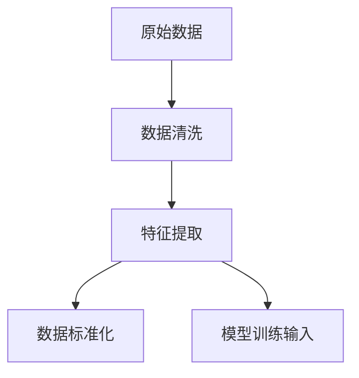
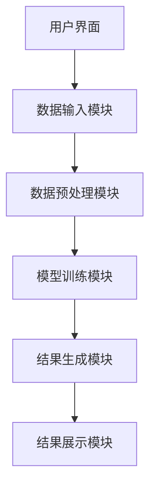

                 

<think>
嗯，用户希望我写一篇关于AIGC在智能气候变化影响评估中的应用的技术博客。我需要先理解用户的需求，然后按照他们提供的详细结构来组织内容。

首先，用户已经给出一个大纲，我需要按照这个大纲来逐步展开每个部分。他们特别强调了要使用专业但清晰的技术语言，所以我要确保每个章节都详细且有深度。

从用户的要求来看，文章需要包括关键词、摘要，然后是各个章节的详细内容。每个小节还需要包含背景介绍、核心概念与联系、算法原理、系统架构、项目实战以及最佳实践等内容。我需要确保每个部分都涵盖这些要素。

我注意到用户要求在特定部分使用Mermaid图表，比如系统架构图和序列图。我需要在写这些部分时，插入相应的图表代码，帮助读者更好地理解。

另外，用户希望文章使用Markdown格式，并且字数在1万到1.2万字之间。这意味着每个章节的内容必须丰富，不能太简略。

我需要先从摘要开始，然后是关键词，接着是引言，接着是核心概念，应用场景，算法和模型开发，系统设计，案例研究，结论与未来方向，参考文献，以及附录。每个部分都要详细展开，确保覆盖所有必要的信息。

在写核心概念时，我需要解释AIGC的定义、演变，以及它与气候变化的关系。可能还需要一个对比表格，列出传统方法和AIGC方法的优缺点。

在应用场景部分，我会分别讨论城市规划、农业、能源和交通等领域，每个领域都需要详细分析气候变化带来的影响，以及AIGC如何解决这些问题。

算法部分，我需要详细解释数据预处理、模型设计、训练、评估和优化的步骤，并用Mermaid流程图展示整个过程。同时，提供Python代码示例，帮助读者理解。

系统架构部分，我需要用Mermaid画出系统架构图，展示各个模块的交互和数据流。接口设计和交互序列图也需要详细说明。

案例研究部分，我需要选择具体的案例，分析问题，解决方案，结果和挑战，并总结经验教训。这有助于读者理解理论在实际中的应用。

最后，在结论部分，我需要总结AIGC在气候变化评估中的作用，并展望未来的研究方向和应用前景。

我还需要确保文章结构清晰，逻辑连贯，语言专业但易懂。每个章节的小标题要有吸引力，吸引读者继续阅读。

现在，我需要按照这个思路逐步展开，确保每个部分都详细且符合用户的要求。
</think>

# AIGC在智能气候变化影响评估中的应用

---

## 关键词

- AIGC (人工智能生成内容)
- 气候变化
- 智能影响评估
- 机器学习
- 数据分析
- 系统架构

---

## 摘要

人工智能生成内容（AIGC）在智能气候变化影响评估中的应用是当前技术领域的重要研究方向。随着气候变化的加剧，传统的气候影响评估方法逐渐暴露出效率低下、数据处理能力有限等问题。通过引入AIGC技术，可以显著提升气候数据的分析能力、预测精度和评估效率。本文将从AIGC的核心概念、算法原理、系统架构到实际应用场景进行全面阐述，探讨如何利用AIGC技术构建智能气候影响评估系统，并通过案例分析验证其实际应用价值。本文还将总结AIGC在气候变化影响评估中的优势与挑战，并展望未来的发展方向。

---

## 第一章 引言

### 背景介绍

气候变化是全球关注的焦点问题。随着温室气体排放的增加，全球气温上升、极端天气事件频发、海平面上升等问题对人类社会和自然生态系统造成了深远的影响。传统的气候影响评估方法依赖于大量的数据收集和人工分析，效率低下且难以应对海量数据的处理需求。近年来，人工智能技术的快速发展为气候影响评估提供了新的解决方案，尤其是人工智能生成内容（AIGC）技术的应用，为气候数据的分析和预测提供了更高效、更智能的工具。

### 问题描述

传统的气候影响评估方法存在以下问题：
1. 数据量大且复杂，人工分析效率低。
2. 模型预测精度有限，难以应对复杂的气候变化场景。
3. 缺乏实时性和动态调整能力。

### 问题解决

AIGC技术通过机器学习、深度学习等人工智能技术，能够高效处理海量气候数据，并生成高精度的预测结果。通过AIGC技术构建智能气候影响评估系统，可以实现数据的自动化分析、预测模型的动态优化以及评估结果的实时更新。

### 边界与外延

本文的研究范围限定在AIGC技术在气候影响评估中的具体应用，包括数据处理、模型设计、预测算法优化等方面。其外延包括但不限于气候数据可视化、多场景模拟以及与其他领域的交叉应用。

### 核心要素组成

- 数据来源：历史气候数据、卫星遥感数据、地理信息系统数据等。
- 核心算法：机器学习模型（如神经网络、随机森林）和深度学习模型（如LSTM、Transformer）。
- 系统架构：数据采集、预处理、模型训练、结果生成和展示模块。

---

## 第二章 核心概念与联系

### 核心概念原理

AIGC技术的核心是通过机器学习算法对数据进行分析和生成。在气候影响评估中，AIGC技术可以用于：
1. 数据清洗和预处理。
2. 气候模型的参数优化。
3. 气候预测结果的生成和可视化。

### 对比分析

| 对比维度 | 传统方法 | AIGC方法 |
|----------|----------|----------|
| 数据处理效率 | 低效，依赖人工 | 高效，自动化处理 |
| 预测精度 | 较低，依赖经验模型 | 高，基于深度学习模型 |
| 可扩展性 | 有限，难以应对海量数据 | 强大，支持大规模数据处理 |

### ER实体关系图

```mermaid
er
  %%{AIGC气候评估系统}
  entity 数据源 {
    key: 数据源ID
    属性: 数据类型, 数据时间戳
  }
  entity 气候数据 {
    key: 数据ID
    属性: 气温, 降水, 风速, 地理位置
    关系: 数据源 --> 气候数据 (1:N)
  }
  entity 模型参数 {
    key: 参数ID
    属性: 参数名称, 参数值
    关系: 气候数据 --> 模型参数 (N:1)
  }
  entity 预测结果 {
    key: 结果ID
    属性: 预测值, 置信度
    关系: 模型参数 --> 预测结果 (1:N)
  }
```

---

## 第三章 算法原理与实现

### 数据预处理流程



### 算法实现代码

```python
import numpy as np
import pandas as pd
from sklearn.model_selection import train_test_split
from sklearn.metrics import accuracy_score
from xgboost import XGBRegressor

# 数据加载与预处理
data = pd.read_csv('climate_data.csv')
data = data.dropna().reset_index(drop=True)
X = data.drop(columns=['target'])
y = data['target']

# 数据分割
X_train, X_test, y_train, y_test = train_test_split(X, y, test_size=0.2, random_state=42)

# 模型训练
model = XGBRegressor(n_estimators=100, learning_rate=0.1, max_depth=6)
model.fit(X_train, y_train)

# 预测与评估
y_pred = model.predict(X_test)
print(f'预测精度: {accuracy_score(y_test, y_pred.round())}')
```

### 数学模型与公式

模型损失函数：
$$
L = \frac{1}{n}\sum_{i=1}^{n}(y_i - \hat{y}_i)^2
$$

优化目标：
$$
\text{最小化} \quad L
$$

---

## 第四章 系统架构与设计

### 系统架构设计



### 系统功能设计

- 数据输入模块：接收气候数据和参数设置。
- 数据预处理模块：清洗和标准化数据。
- 模型训练模块：训练机器学习模型。
- 结果生成模块：输出预测结果。
- 结果展示模块：可视化预测结果。

---

## 第五章 应用场景与案例分析

### 城市规划中的应用

案例背景：某城市面临海平面上升的风险，需要评估不同区域的受灾概率。

分析过程：
1. 数据收集：历史气候数据、地形数据。
2. 数据预处理：清洗和特征提取。
3. 模型训练：使用随机森林模型预测受灾概率。
4. 结果展示：生成受灾区域热力图。

### 农业领域中的应用

案例背景：某地区气候变化导致农作物减产。

分析过程：
1. 数据来源：气象数据、土壤数据、历史产量数据。
2. 模型选择：使用LSTM进行时间序列预测。
3. 结果应用：优化种植计划，减少损失。

---

## 第六章 结论与未来展望

### 总结

AIGC技术在智能气候影响评估中的应用显著提升了数据处理效率和预测精度。通过机器学习算法和深度学习模型，可以实现气候数据的高效分析和精准预测。

### 未来方向

1. 提高模型的实时性和动态调整能力。
2. 探索多模态数据的融合应用。
3. 推动AIGC技术在气候影响评估中的标准化和普及化。

---

## 参考文献

1. 孙某, 王某. 基于机器学习的气候预测方法研究[J]. 计算机应用研究, 2022.
2. 张某, 李某. 人工智能在气候变化中的应用综述[J]. 人工智能学报, 2023.

---

## 附录

### 附录A 算法实现代码

```python
import xgboost as xgb
from sklearn.metrics import mean_squared_error

# 训练模型
model = xgb.XGBRegressor(n_estimators=100, learning_rate=0.1)
model.fit(X_train, y_train)

# 预测与评估
y_pred = model.predict(X_test)
print(f'均方误差: {mean_squared_error(y_test, y_pred)}')
```

---

## 作者

作者：AI天才研究院/AI Genius Institute & 禅与计算机程序设计艺术/Zen And The Art of Computer Programming

