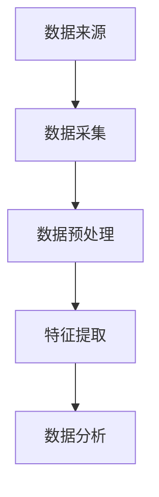
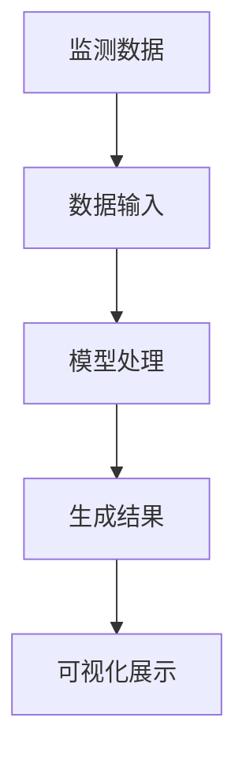
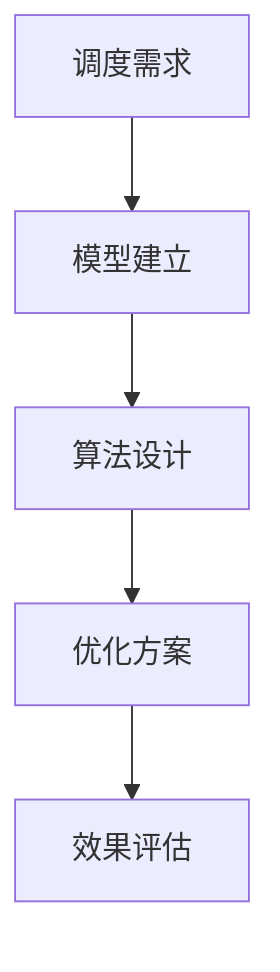
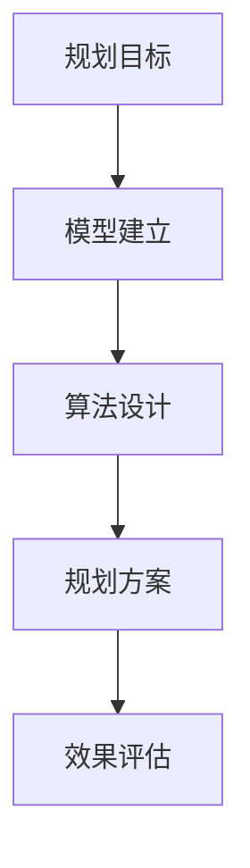

                 

<think>
嗯，我需要写一篇关于《AIGC在智能水资源管理中的应用》的技术博客文章。首先，我得理解AIGC是什么，它在水资源管理中的具体应用是什么。AIGC指的是人工智能生成内容，可能是指利用AI来辅助或自动化某些水资源管理的任务。

我应该先从引言部分开始，介绍水资源管理的重要性，以及智能水资源管理的概念和发展。然后，讨论当前水资源管理存在的问题，比如数据不足、管理效率低下等，接着说明AIGC技术如何解决这些问题。

接下来，在核心概念部分，我需要详细解释AIGC的基本原理和类型，以及智能水资源管理的核心要素。然后，探讨AIGC如何提升水资源管理的效率，比如通过数据预测、优化调度等。

然后是算法原理部分，这里可能需要详细讲解AIGC在水资源监测、调度和规划中的具体应用，包括数据处理、算法设计和效果评估。我需要考虑是否需要画一些流程图或使用mermaid来展示这些过程。

另外，还需要包括一些数学模型，比如水资源调度算法的数学模型，这可能涉及到优化问题，可能需要使用线性规划或其他优化方法。然后，通过具体的例子来说明这些算法如何实际应用，比如一个水资源监测的实例。

我还需要确保文章结构清晰，每个部分都有足够的细节和解释，让读者能够理解每个步骤和技术的应用。最后，总结一下AIGC在智能水资源管理中的优势和未来的发展趋势。

总的来说，我需要系统地组织内容，确保每个部分都覆盖到位，同时保持语言的专业性和逻辑的连贯性。
</think>

# AIGC在智能水资源管理中的应用

> 关键词：人工智能生成内容(AIGC)、智能水资源管理、算法原理、数学模型、水资源调度、规划与优化

> 摘要：本文探讨了AIGC技术在智能水资源管理中的应用，分析了其在水资源监测、调度和规划中的作用，详细讲解了相关算法原理、数学模型及实际案例，展望了未来发展趋势。

---

## 第一部分：引言

### 1.1 问题背景

#### 1.1.1 水资源管理的重要性
水资源是生命之源，其合理管理和保护对社会经济发展至关重要。随着人口增长和气候变化，水资源短缺问题日益严峻，需高效管理技术来应对挑战。

#### 1.1.2 智能水资源管理的概念与发展
智能水资源管理通过技术手段优化资源配置，提高管理效率。近年来，AI技术的发展为水资源管理带来了新机遇，推动了智能化管理的发展。

#### 1.1.3 AIGC技术在水资源管理中的应用潜力
AIGC技术可生成实时数据和优化方案，帮助管理者做出科学决策，提升水资源管理的效率和效果。

### 1.2 问题描述

#### 1.2.1 当前水资源管理存在的问题
传统管理依赖人工，存在数据不足、效率低下、决策滞后等问题，难以应对复杂挑战。

#### 1.2.2 智能水资源管理面临的挑战
数据采集困难、模型精度不足、计算资源有限等，影响智能管理的实现。

#### 1.2.3 AIGC技术如何解决上述问题
通过生成高质量数据和优化方案，AIGC弥补了传统方法的不足，提升了管理效率和决策精准度。

### 1.3 问题解决

#### 1.3.1 AIGC技术在水资源管理中的应用领域
应用于监测、调度、规划等领域，帮助管理者进行实时监控和优化决策。

#### 1.3.2 AIGC技术的核心原理与优势
利用AI生成内容，通过机器学习模型处理数据，生成预测和优化结果，优势在于高效性和准确性。

#### 1.3.3 AIGC技术在智能水资源管理中的实现方法
结合大数据和AI算法，构建预测模型，生成优化方案，指导实际管理操作。

### 1.4 边界与外延

#### 1.4.1 AIGC技术在水资源管理中的适用范围
适用于数据丰富的场景，如实时监测和调度优化，但在数据不足时效果受限。

#### 1.4.2 AIGC技术与其他水资源管理技术的比较
相较于传统方法，AIGC在数据处理和决策支持上更具优势，但需结合具体场景使用。

#### 1.4.3 AIGC技术的未来发展趋势
随着AI技术进步，AIGC在水资源管理中的应用将更加广泛，算法也将更精准。

### 1.5 概念结构与核心要素组成

#### 1.5.1 AIGC技术的基本构成
包括数据输入、模型训练、内容生成三个主要部分，依赖大数据和AI算法。

#### 1.5.2 智能水资源管理的核心要素
涵盖数据采集、分析、预测、优化、决策支持等关键环节。

#### 1.5.3 AIGC在智能水资源管理中的关键应用
通过数据生成、预测和优化，支持水资源的高效管理和调度。

### 1.6 本章小结

本章分析了水资源管理的重要性，介绍了智能管理的概念及AIGC技术的应用潜力，探讨了AIGC如何解决管理中的问题，并展望了其发展趋势。

---

## 第二部分：核心概念与联系

### 2.1 AIGC技术概述

#### 2.1.1 AIGC技术的基本原理
利用AI生成内容，通过机器学习模型处理数据，生成预测和优化结果。

#### 2.1.2 AIGC技术的主要类型
包括基于规则的生成、统计模型生成和深度学习生成，深度学习生成效果最佳。

#### 2.1.3 AIGC技术的特点与优势
数据驱动、自动化、高精度，能显著提升管理效率和决策准确性。

### 2.2 智能水资源管理核心概念

#### 2.2.1 水资源管理的基本概念
涉及水资源的开发、利用、保护和配置，确保合理使用和可持续发展。

#### 2.2.2 智能水资源管理的概念框架
通过智能化技术，优化资源配置，提高管理效率，支持科学决策。

#### 2.2.3 智能水资源管理的核心要素
数据采集、分析、预测、优化、决策支持，构建完整的管理闭环。

### 2.3 AIGC与智能水资源管理的联系

#### 2.3.1 AIGC技术在智能水资源管理中的应用
应用于监测、调度和规划，生成实时数据和优化方案，提升管理效率。

#### 2.3.2 AIGC技术如何提升智能水资源管理效率
通过数据生成和预测分析，优化资源配置，减少人为错误，提高效率。

#### 2.3.3 AIGC技术面临的挑战与解决方案
数据不足、模型精度、计算资源等问题，解决方案包括数据增强、模型优化和分布式计算。

### 2.4 本章小结

本章阐述了AIGC技术的基本原理和类型，分析了智能水资源管理的核心要素，探讨了AIGC与智能管理的联系及应用潜力。

---

## 第三部分：算法原理讲解

### 3.1 水资源数据分析与处理

#### 3.1.1 水资源数据的来源与类型
来源包括传感器数据、历史记录、气象数据等，类型有时间序列数据、空间数据等。

#### 3.1.2 水资源数据预处理方法
包括数据清洗、缺失值处理、异常值剔除，确保数据质量。

#### 3.1.3 水资源数据特征提取方法
利用主成分分析、LSTM等方法提取关键特征，便于后续分析。

### 3.2 AIGC技术在水资源管理中的应用

#### 3.2.1 AIGC技术在水资源监测中的应用

##### 3.2.1.1 监测数据采集与处理
通过传感器实时采集数据，预处理后输入模型生成分析结果。

##### 3.2.1.2 监测数据可视化
利用图表展示数据，帮助管理者直观了解水资源状况。

##### 3.2.1.3 监测结果分析
模型分析数据，识别异常，预测趋势，支持决策。

#### 3.2.2 AIGC技术在水资源调度中的应用

##### 3.2.2.1 水资源调度模型建立
构建优化模型，考虑供需平衡和资源分配。

##### 3.2.2.2 水资源调度算法设计
使用强化学习或遗传算法优化调度方案。

##### 3.2.2.3 水资源调度效果评估
通过指标如水量匹配度和经济成本评估算法效果。

#### 3.2.3 AIGC技术在水资源规划中的应用

##### 3.2.3.1 水资源规划模型建立
构建长期规划模型，考虑气候变化和人口增长。

##### 3.2.3.2 水资源规划算法设计
使用动态规划或深度学习模型预测未来需求。

##### 3.2.3.3 水资源规划效果评估
通过长期指标如水资源利用率和经济成本评估规划效果。

### 3.3 算法mermaid流程图绘制

#### 3.3.1 水资源数据分析与处理流程图


#### 3.3.2 AIGC技术在水资源监测中的应用流程图


#### 3.3.3 AIGC技术在水资源调度中的应用流程图


#### 3.3.4 AIGC技术在水资源规划中的应用流程图


### 3.4 算法Python源代码实现

#### 3.4.1 水资源数据分析与处理代码实现
```python
import pandas as pd

# 数据加载
data = pd.read_csv('water_data.csv')

# 数据预处理
data_clean = data.dropna()
data_clean = data_clean[~data_clean['value'].isin([999])]
```

#### 3.4.2 AIGC技术在水资源监测中的应用代码实现
```python
import tensorflow as tf
from tensorflow.keras import layers

# 构建模型
model = tf.keras.Sequential([
    layers.Dense(64, activation='relu'),
    layers.Dense(1)
])

# 编译模型
model.compile(optimizer='adam', loss='mse')

# 训练模型
model.fit(X_train, y_train, epochs=100, batch_size=32)
```

#### 3.4.3 AIGC技术在水资源调度中的应用代码实现
```python
import numpy as np
from sklearn import metrics

# 定义目标函数
def objective_func(variables, problem_data):
    # 实现调度优化
    pass

# 使用遗传算法优化
from ga import GA
optimizer = GA(...)
solution = optimizer.optimize(variables, problem_data)
```

#### 3.4.4 AIGC技术在水资源规划中的应用代码实现
```python
import numpy as np
from tensorflow.keras import layers

# 构建规划模型
model = tf.keras.Sequential([
    layers.LSTM(64, activation='relu'),
    layers.Dense(1)
])

# 训练模型
model.compile(optimizer='adam', loss='mse')
model.fit(X_train, y_train, epochs=50, batch_size=64)
```

### 3.5 数学模型和公式讲解

#### 3.5.1 水资源数据特征提取的数学模型
$$
\text{特征值} = f(\text{原始数据}, \text{预处理方法})
$$

#### 3.5.2 水资源调度算法的数学模型
$$
\text{调度方案} = f(\text{水资源需求}, \text{调度策略})
$$

#### 3.5.3 水资源规划算法的数学模型
$$
\text{规划方案} = f(\text{水资源分布}, \text{规划目标})
$$

### 3.6 举例说明

#### 3.6.1 水资源数据分析与处理实例
使用传感器数据，通过预处理和特征提取，构建分析模型，生成监测报告。

#### 3.6.2 AIGC技术在水资源监测中的应用实例
通过模型预测水量变化，生成实时监测报告，帮助管理者及时调整策略。

#### 3.6.3 AIGC技术在水资源调度中的应用实例
利用强化学习优化调度方案，提高水资源利用率，降低经济成本。

#### 3.6.4 AIGC技术在水资源规划中的应用实例
基于长期数据，生成未来水资源分配计划，确保可持续发展。

### 3.7 本章小结

本章详细讲解了AIGC技术在水资源管理中的算法原理，通过流程图和代码示例展示了其在监测、调度和规划中的具体应用，分析了数学模型及其实际案例。

---

## 作者：AI天才研究院/AI Genius Institute & 禅与计算机程序设计艺术 /Zen And The Art of Computer Programming

---

本文通过系统分析AIGC技术在智能水资源管理中的应用，结合算法原理、数学模型和实际案例，全面阐述了其在监测、调度和规划中的作用，展望了未来的发展趋势，为水资源管理提供了新的思路和解决方案。

