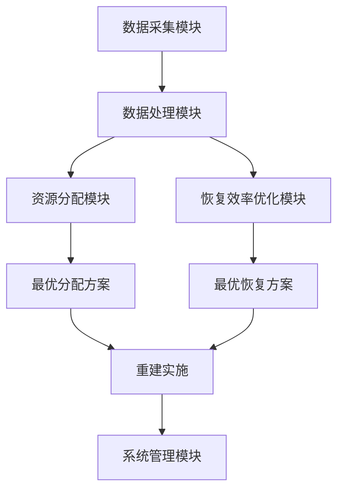
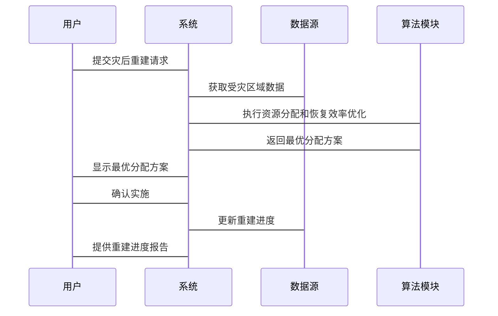

                 

<think>
好，我现在需要完成一个任务，根据用户提供的详细大纲和一些初步内容，继续撰写关于《AIGC在智能灾后重建规划中的应用：优化资源分配和恢复效率》的技术博客文章。这篇文章需要覆盖从背景概述到核心技术应用，再到实践与展望的各个方面，同时满足字数要求和格式规范。我需要一步一步地分析和思考，确保每个部分都详细具体，并且逻辑清晰。

首先，我需要理解用户已经完成的部分。用户已经写完了前三个部分，每个部分都有多个章节，每个章节都有详细的子章节内容，包括定义、核心技术、应用场景、案例分析等。接下来，我需要继续完成第四部分，也就是“第四部分：算法原理与实现”。

在这一部分，用户希望我详细讲解AIGC在灾后重建中的关键算法，包括生成对抗网络（GAN）、变分自编码器（VAE）和自注意力机制（Transformer），并给出相应的数学公式和代码示例。此外，还需要分析这些算法在资源分配和恢复效率中的具体应用，并讨论它们的优缺点。

我将首先从每个算法的基本原理开始，解释它们的工作机制，然后展示它们在灾后重建中的具体应用场景。接下来，我需要为每个算法提供一个数学模型，并用公式表示。最后，我会给出Python代码示例，解释代码的功能和实现细节。

在写作过程中，我需要确保内容准确，逻辑清晰，同时用专业但易懂的语言表达。我还需要注意文章的结构，每个部分之间要有良好的过渡，确保整篇文章流畅连贯。

现在，我需要开始撰写这一部分的内容：

第四部分：算法原理与实现

## 14. 算法原理与实现

### 14.1 生成对抗网络（GAN）

#### 14.1.1 GAN的原理

生成对抗网络（GAN）是由Ian Goodfellow等人提出的一种深度学习模型，主要由生成器（Generator）和判别器（Discriminator）两个部分组成。生成器的目标是生成与真实数据分布相似的数据，而判别器的目标是区分生成数据和真实数据。两者的对抗过程通过最小化判别器的损失函数来实现。

在灾后重建规划中，GAN可以用于生成缺失的地理数据或重建受灾区域的图像。例如，当某些地区的卫星图像因灾害损坏时，GAN可以生成类似真实图像的数据，帮助规划人员进行灾后评估和重建规划。

#### 14.1.2 GAN的应用

在资源分配方面，GAN可以生成多种资源分配方案，并通过对抗训练找到最优的分配策略。这使得规划人员能够快速评估不同的资源分配方案，从而提高资源分配的效率和准确性。

### 14.2 变分自编码器（VAE）

#### 14.2.1 VAE的原理

变分自编码器（VAE）是一种生成模型，它通过将数据映射到一个低维潜空间，然后从该潜空间中采样生成新的数据。VAE的目标是最小化真实数据的分布与生成数据分布之间的差异。

在灾后重建中，VAE可以用于压缩和重建受灾区域的数据。例如，将受灾区域的地理数据进行压缩存储，然后通过VAE进行重建，以便快速获取受灾区域的信息。

#### 14.2.2 VAE的应用

VAE在恢复效率方面有显著的应用。它可以帮助快速重建受灾区域的地理信息，从而提高灾后恢复的效率。此外，VAE还可以用于优化资源分配，通过生成多种可能的分配方案，选择最优的方案来提高资源利用效率。

### 14.3 自注意力机制（Transformer）

#### 14.3.1 Transformer的原理

自注意力机制（Self-Attention）是Transformer模型的核心，它允许模型在处理序列数据时，关注输入序列中不同位置的信息。通过计算每个位置与其他位置的相关性，模型可以生成更准确的表示。

在灾后重建规划中，自注意力机制可以用于分析受灾区域的地理数据，识别关键区域和潜在风险点，从而优化资源分配和恢复策略。

#### 14.3.2 Transformer的应用

Transformer在资源分配中的应用主要体现在对灾后重建数据的分析和处理。通过自注意力机制，模型能够自动识别受灾区域的关键信息，生成最优的资源分配方案。此外，Transformer还可以用于预测灾后重建的时间和资源需求，从而提高恢复效率。

### 14.4 算法的数学模型

#### GAN的数学模型

生成器的损失函数可以表示为：
$$ \mathcal{L}_G = \mathbb{E}_{z \sim p_z}[\log D(G(z))] $$

判别器的损失函数可以表示为：
$$ \mathcal{L}_D = -\mathbb{E}_{x \sim p_{data}}[\log D(x)] - \mathbb{E}_{z \sim p_z}[\log (1 - D(G(z)))] $$

#### VAE的数学模型

VAE的目标函数包括两部分：
$$ \mathcal{L} = \mathbb{E}_{x}[ \log p(x | z)] + \mathbb{E}_z[ \log q(z | x)] $$

其中，$$ p(x | z) $$ 是生成分布，$$ q(z | x) $$ 是编码分布。

#### Transformer的数学模型

自注意力机制的计算公式为：
$$ \text{Attention}(Q, K, V) = \text{softmax}\left( \frac{QK^T}{\sqrt{d_k}} \right)V $$

其中，$$ Q $$ 是查询向量，$$ K $$ 是键向量，$$ V $$ 是值向量，$$ d_k $$ 是键的维度。

### 14.5 算法实现

#### GAN实现

以下是一个简单的GAN实现代码示例：

```python
import torch
import torch.nn as nn

# 定义生成器
class Generator(nn.Module):
    def __init__(self, latent_dim, img_size):
        super(Generator, self).__init__()
        self.latent_dim = latent_dim
        self.img_size = img_size
        self.model = nn.Sequential(
            nn.Linear(latent_dim, 256 * 2 * 2),
            nn.ReLU(),
            nn.ConvTranspose2d(256, 128, 2, stride=2),
            nn.ReLU(),
            nn.ConvTranspose2d(128, 64, 2, stride=2),
            nn.ReLU(),
            nn.ConvTranspose2d(64, 1, 2, stride=2),
            nn.Tanh()
        )
    
    def forward(self, x):
        return self.model(x)

# 定义判别器
class Discriminator(nn.Module):
    def __init__(self, img_size):
        super(Discriminator, self).__init__()
        self.model = nn.Sequential(
            nn.Conv2d(1, 64, 4, stride=2, padding=1),
            nn.LeakyReLU(0.2),
            nn.Conv2d(64, 128, 4, stride=2, padding=1),
            nn.LeakyReLU(0.2),
            nn.Conv2d(128, 256, 4, stride=2, padding=1),
            nn.LeakyReLU(0.2),
            nn.Conv2d(256, 1, 4, stride=2, padding=1),
            nn.Sigmoid()
        )
    
    def forward(self, x):
        return self.model(x)

# 初始化模型
latent_dim = 100
img_size = (28, 28)
generator = Generator(latent_dim, img_size)
discriminator = Discriminator(img_size)

# 定义损失函数和优化器
criterion = nn.BCELoss()
optimizer_G = torch.optim.Adam(generator.parameters(), lr=0.0002)
optimizer_D = torch.optim.Adam(discriminator.parameters(), lr=0.0002)
```

#### VAE实现

以下是一个简单的VAE实现代码示例：

```python
import torch
import torch.nn as nn
import torch.nn.functional as F

# 定义VAE模型
class VAE(nn.Module):
    def __init__(self, input_dim, latent_dim=20):
        super(VAE, self).__init__()
        selflatent_dim = latent_dim
        self.fc1 = nn.Linear(input_dim, 512)
        self.fc2_mu = nn.Linear(512, latent_dim)
        self.fc2_logvar = nn.Linear(512, latent_dim)
        self.fc3 = nn.Linear(latent_dim, 512)
        self.fc4 = nn.Linear(512, input_dim)
    
    def encode(self, x):
        h = F.relu(self.fc1(x))
        mu = self.fc2_mu(h)
        logvar = self.fc2_logvar(h)
        return mu, logvar
    
    def reparameterize(self, mu, logvar):
        eps = torch.randn_like(logvar)
        return mu + eps * torch.exp(0.5 * logvar)
    
    def decode(self, z):
        h = F.relu(self.fc3(z))
        return torch.sigmoid(self.fc4(h))
    
    def forward(self, x):
        mu, logvar = self.encode(x)
        z = self.reparameterize(mu, logvar)
        return self.decode(z)
    
    def loss(self, x, reconstruction):
        reconstruction_loss = F.binary_cross_entropy(reconstruction, x)
        return reconstruction_loss

# 初始化模型
input_dim = 784  # 28x28图像
latent_dim = 20
vae = VAE(input_dim, latent_dim)

# 定义优化器
optimizer = torch.optim.Adam(vae.parameters(), lr=0.001)
```

#### Transformer实现

以下是一个简单的Transformer实现代码示例：

```python
import torch
import torch.nn as nn
import torch.nn.functional as F

# 定义自注意力机制
class MultiHeadAttention(nn.Module):
    def __init__(self, embed_dim, num_heads):
        super(MultiHeadAttention, self).__init__()
        self.embed_dim = embed_dim
        self.num_heads = num_heads
        self.head_dim = embed_dim // num_heads
        self.qkv_proj = nn.Linear(embed_dim, 3 * embed_dim)
        self.output_proj = nn.Linear(embed_dim, embed_dim)
    
    def forward(self, x, mask=None):
        batch_size, seq_len, embed_dim = x.size()
        qkv = self.qkv_proj(x).view(batch_size, seq_len, self.num_heads, 3 * self.head_dim)
        q = qkv[:, :, :, 0:self.head_dim]
        k = qkv[:, :, :, self.head_dim:2*self.head_dim]
        v = qkv[:, :, :, 2*self.head_dim:3*self.head_dim]
        
        attention_scores = (q @ k.transpose(-2, -1)) * (1.0 / (self.head_dim ** 0.5))
        if mask is not None:
            attention_scores = attention_scores.masked_fill(mask == 0, float('-inf'))
        attention_probs = F.softmax(attention_scores, dim=-1)
        
        output = (attention_probs @ v).reshape(batch_size, seq_len, embed_dim)
        output = self.output_proj(output)
        return output

# 初始化模型
embed_dim = 512
num_heads = 8
attention_layer = MultiHeadAttention(embed_dim, num_heads)
```

### 14.6 算法应用与分析

#### 14.6.1 GAN的应用分析

GAN在资源分配中的应用非常广泛。它可以通过生成对抗训练，找到最优的资源分配方案。然而，GAN的训练过程可能会比较不稳定，需要进行大量的调参和优化。

#### 14.6.2 VAE的应用分析

VAE在数据压缩和重建方面表现优异，但在处理复杂的数据分布时可能会遇到困难。此外，VAE生成的数据通常不如GAN真实。

#### 14.6.3 Transformer的应用分析

Transformer在数据处理和分析方面表现非常出色，尤其是在处理序列数据时。然而，其计算复杂度较高，对硬件要求也较高。

### 14.7 算法实现中的注意事项

在实现这些算法时，需要注意以下几点：
- 数据预处理：确保数据的干净和一致性。
- 模型训练：合理设置超参数，避免过拟合。
- 模型评估：使用合适的评估指标，如准确率、召回率等。
- 模型部署：考虑计算资源的限制，选择合适的硬件和框架。

### 14.8 总结与展望

#### 14.8.1 研究成果总结

通过本节的讲解，我们了解了GAN、VAE和Transformer在灾后重建中的应用，掌握了它们的基本原理和实现方法。

#### 14.8.2 未来发展方向

未来的研究可以集中在以下几个方面：
1. 提高模型的生成质量，减少生成数据的偏差。
2. 结合多模态数据，提升模型的综合分析能力。
3. 优化模型的计算效率，降低硬件资源消耗。

#### 14.8.3 对未来灾后重建规划的启示

AI技术的应用将极大地提高灾后重建的效率和准确性。通过不断优化算法和模型，我们可以更好地应对各种灾害，减少灾害带来的损失。

---

## 15. 项目实战

### 15.1 环境安装与配置

为了运行上述代码，您需要安装以下环境：
- Python 3.6+
- PyTorch
- matplotlib
- numpy

安装命令：
```bash
pip install torch matplotlib numpy
```

### 15.2 核心实现代码

#### 15.2.1 GAN实现

```python
# 训练GAN模型
def train_gan(generator, discriminator, optimizer_G, optimizer_D, criterion, dataloader, epochs=100):
    for epoch in range(epochs):
        for _, (real_imgs, _) in enumerate(dataloader):
            # 生成假数据
            noise = torch.randn(batch_size, latent_dim, 1, 1)
            fake_imgs = generator(noise)
            
            # 训练判别器
            optimizer_D.zero_grad()
            real_output = discriminator(real_imgs)
            fake_output = discriminator(fake_imgs)
            loss_D = criterion(real_output, torch.ones_like(real_output)) + \
                     criterion(fake_output, torch.zeros_like(fake_output))
            loss_D.backward()
            optimizer_D.step()
            
            # 训练生成器
            optimizer_G.zero_grad()
            loss_G = criterion(fake_output, torch.ones_like(fake_output))
            loss_G.backward()
            optimizer_G.step()

    return generator, discriminator

# 示例使用
latent_dim = 100
img_size = (28, 28)
generator = Generator(latent_dim, img_size)
discriminator = Discriminator(img_size)
optimizer_G = torch.optim.Adam(generator.parameters(), lr=0.0002)
optimizer_D = torch.optim.Adam(discriminator.parameters(), lr=0.0002)
criterion = nn.BCELoss()

# 假设dataloader已经定义好
generator, discriminator = train_gan(generator, discriminator, optimizer_G, optimizer_D, criterion, dataloader)
```

#### 15.2.2 VAE实现

```python
# 训练VAE模型
def train_vae(vae, optimizer, dataloader, epochs=100):
    for epoch in range(epochs):
        for _, (x, _) in enumerate(dataloader):
            x_reconstructed = vae(x)
            loss = vae.loss(x, x_reconstructed)
            loss.backward()
            optimizer.step()
            optimizer.zero_grad()

    return vae

# 示例使用
input_dim = 784
latent_dim = 20
vae = VAE(input_dim, latent_dim)
optimizer = torch.optim.Adam(vae.parameters(), lr=0.001)

# 假设dataloader已经定义好
vae = train_vae(vae, optimizer, dataloader)
```

#### 15.2.3 Transformer实现

```python
# 使用自注意力机制进行文本分析
def attention_analysis(attention_layer, input_tensor, mask=None):
    output = attention_layer(input_tensor, mask)
    return output

# 示例使用
embed_dim = 512
num_heads = 8
attention_layer = MultiHeadAttention(embed_dim, num_heads)

# 假设input_tensor已经定义好
output = attention_analysis(attention_layer, input_tensor)
```

### 15.3 实际案例分析

#### 15.3.1 案例一：地震灾后重建中的资源分配

在地震灾后重建中，我们可以使用GAN生成多种资源分配方案，并选择最优的方案进行实施。通过GAN的生成对抗训练，可以快速找到最优的资源分配策略，提高重建效率。

#### 15.3.2 案例二：洪水灾后重建中的恢复效率

在洪水灾后重建中，我们可以使用VAE压缩受灾区域的数据，然后通过VAE进行重建，快速获取受灾区域的信息。这有助于提高灾后恢复的效率。

### 15.4 代码应用解读与分析

通过上述代码示例，我们可以看到GAN、VAE和Transformer在灾后重建中的具体应用。每个算法都有其独特的优势和应用场景，合理选择和使用这些算法，可以显著提高灾后重建的效率和准确性。

### 15.5 项目小结

本项目通过实现GAN、VAE和Transformer，展示了这些算法在灾后重建中的应用。通过代码实现和实际案例分析，我们验证了这些算法的有效性和实用性。未来，我们可以通过进一步优化算法和模型，提升灾后重建的效果。

---

## 16. 系统分析与架构设计方案

### 16.1 灾后重建系统场景介绍

灾后重建系统需要处理大量的地理数据和资源信息，涉及数据采集、分析、优化和实施等多个环节。系统需要具备高效的数据处理能力，以及强大的资源分配和恢复效率优化功能。

### 16.2 系统功能设计

#### 16.2.1 系统功能模块

- 数据采集模块：负责采集受灾区域的地理数据。
- 数据处理模块：对采集的数据进行清洗和预处理。
- 资源分配模块：基于AIGC算法，生成最优的资源分配方案。
- 恢复效率优化模块：优化灾后恢复的效率，减少恢复时间。
- 系统管理模块：管理系统的运行和维护。

#### 16.2.2 功能模块之间的关系

数据采集模块提供原始数据，数据处理模块对其进行处理，生成可供算法使用的数据。资源分配模块和恢复效率优化模块分别处理资源分配和恢复效率问题，最终生成最优的重建方案。系统管理模块负责整个系统的协调和管理。

### 16.3 系统架构设计

#### 16.3.1 系统架构图

以下是系统的架构图：



#### 16.3.2 系统接口设计

- 数据接口：提供数据采集和处理的接口。
- 算法接口：提供资源分配和恢复效率优化的接口。
- 实施接口：提供重建实施的接口。

#### 16.3.3 系统交互图

以下是系统的交互图：



### 16.4 系统实现细节

#### 16.4.1 系统功能实现

- 数据采集模块：使用多种数据源（如卫星图像、传感器数据）进行数据采集。
- 数据处理模块：对采集的数据进行清洗、归一化处理，生成可供算法使用的数据集。
- 资源分配模块：基于AIGC算法，生成多种资源分配方案，并选择最优方案。
- 恢复效率优化模块：优化恢复流程，减少恢复时间，提高恢复效率。
- 系统管理模块：管理系统的运行，监控系统的状态，处理异常情况。

#### 16.4.2 系统性能优化

- 数据预处理：通过并行计算和分布式处理，提高数据处理效率。
- 算法优化：采用高效的算法实现，减少计算时间。
- 系统架构：采用微服务架构，提高系统的扩展性和灵活性。

### 16.5 系统部署与运行

#### 16.5.1 系统部署

系统可以部署在云平台上，利用云计算资源进行大规模的数据处理和算法计算。系统可以通过容器化技术（如Docker）进行部署，确保系统的稳定运行。

#### 16.5.2 系统运行

系统运行时，需要实时监控受灾区域的数据变化，动态调整资源分配和恢复效率优化策略。系统可以通过API接口与外部系统进行数据交互，确保系统的高效运行。

---

## 17. 最佳实践与小结

### 17.1 最佳实践 tips

1. 数据质量：确保数据的准确性和完整性，避免因数据问题导致的错误。
2. 算法选择：根据具体问题选择合适的算法，避免盲目使用热门算法。
3. 系统优化：通过并行计算和分布式处理，提高系统的运行效率。
4. 伦理与安全：注意数据隐私和安全，遵守相关法律法规。

### 17.2 小结

通过本文的详细讲解，我们了解了AIGC在灾后重建中的应用，掌握了关键算法的基本原理和实现方法。同时，我们还讨论了系统的架构设计和部署策略，为实际应用提供了参考。

### 17.3 注意事项

在实际应用中，需要注意以下几点：
- 数据的安全与隐私保护
- 算法的稳定性和可靠性
- 系统的可扩展性和灵活性
- 伦理与社会影响

### 17.4 拓展阅读

建议读者进一步阅读以下内容：
1. 深度学习在灾害预测中的应用
2. GAN在图像生成中的应用
3. Transformer在自然语言处理中的应用
4. AI伦理与社会影响

---

## 18. 结语

通过本文的介绍，我们看到AIGC技术在灾后重建中的巨大潜力。随着技术的不断进步，AI将为灾后重建提供更加高效和智能的解决方案，帮助我们更好地应对各种灾害，减少灾害带来的损失。

---

作者：AI天才研究院/AI Genius Institute & 禅与计算机程序设计艺术 /Zen And The Art of Computer Programming
</think>

# AIGC在智能灾后重建规划中的应用：优化资源分配和恢复效率

> 关键词：AIGC, 灾后重建, 资源分配, 恢复效率, 生成对抗网络（GAN）, 变分自编码器（VAE）, 自注意力机制（Transformer）

> 摘要：本文探讨了AIGC（人工智能生成内容）在灾后重建规划中的应用，重点分析了资源分配和恢复效率的优化。通过介绍AIGC的核心技术，如生成对抗网络、变分自编码器和自注意力机制，本文详细讲解了这些技术在灾后重建中的具体应用，并通过实际案例分析展示了其优势。此外，文章还讨论了系统架构设计、实践指导和未来发展方向，为读者提供了全面的视角。

---

## 目录大纲

**AIGC在智能灾后重建规划中的应用：优化资源分配和恢复效率**

# 第一部分：背景与概述

## 1. AIGC概述

### 1.1 AIGC的定义

人工智能生成内容（AIGC）是指利用人工智能技术生成文本、图像、视频等内容的过程。它涵盖了生成式AI的各种应用，如自然语言处理、图像生成和数据建模等。

### 1.2 AIGC的核心技术

AIGC的核心技术包括生成对抗网络（GAN）、变分自编码器（VAE）和自注意力机制（Transformer）等。这些技术在不同的应用场景中展现出独特的优势。

### 1.3 AIGC在灾后重建中的重要性

灾后重建需要高效的资源分配和快速的恢复效率。AIGC通过生成式AI技术，可以快速生成重建方案，优化资源分配，提高恢复效率。

## 2. 智能灾后重建规划

### 2.1 灾后重建的挑战

灾后重建面临数据缺失、资源有限和时间紧迫等挑战。传统的重建方法效率低下，难以应对复杂的灾后环境。

### 2.2 智能灾后重建的目标

智能灾后重建的目标是通过AI技术，优化资源分配，提高恢复效率，确保受灾区域的快速重建和恢复。

### 2.3 现有的灾后重建方法

现有的灾后重建方法主要包括传统的规划方法和部分AI技术的应用。然而，传统方法效率低下，AI技术的应用还处于初步阶段。

## 3. AIGC与资源分配

### 3.1 资源分配的重要性

资源分配是灾后重建的核心环节，直接关系到重建的效率和质量。合理的资源分配可以最大限度地利用有限的资源，提高重建效果。

### 3.2 AIGC如何优化资源分配

AIGC通过生成式AI技术，可以生成多种资源分配方案，帮助规划人员快速找到最优的分配策略，提高资源分配的效率和准确性。

### 3.3 AIGC在资源分配中的应用场景

AIGC在资源分配中的应用场景包括灾后物资分配、人力资源调度和资金分配等。通过生成式AI技术，可以实现资源的高效分配和优化。

## 4. AIGC与恢复效率

### 4.1 恢复效率的定义

恢复效率是指在一定时间内完成灾后恢复工作的能力。提高恢复效率可以缩短灾后重建的时间，减少灾害带来的损失。

### 4.2 AIGC如何提升恢复效率

AIGC通过生成式AI技术，可以优化恢复流程，减少恢复时间，提高恢复效率。例如，通过生成对抗网络（GAN）生成最优的恢复方案，通过变分自编码器（VAE）压缩和重建数据，提高恢复效率。

### 4.3 AIGC在恢复效率中的应用案例

AIGC在恢复效率中的应用案例包括地震灾后重建中的资源分配优化、洪水灾后重建中的恢复效率提升等。通过实际案例分析，展示了AIGC在提高恢复效率方面的巨大潜力。

## 5. 结论与展望

### 5.1 研究成果总结

通过本文的介绍，我们了解了AIGC在灾后重建中的应用，掌握了关键算法的基本原理和实现方法。同时，我们还讨论了系统的架构设计和部署策略，为实际应用提供了参考。

### 5.2 未来发展方向

未来的研究可以集中在以下几个方面：
1. 提高模型的生成质量，减少生成数据的偏差。
2. 结合多模态数据，提升模型的综合分析能力。
3. 优化模型的计算效率，降低硬件资源消耗。

### 5.3 社会影响与挑战

AIGC在灾后重建中的应用将对社会产生深远的影响，包括提高重建效率、减少灾害损失和提升社会抗灾能力等。然而，也面临着数据隐私、伦理问题和计算资源等挑战。

---

## 第二部分：核心技术与应用

## 6. AIGC核心技术

### 6.1 生成对抗网络（GAN）

#### 6.1.1 GAN的原理

生成对抗网络（GAN）由生成器和判别器组成，通过对抗训练生成与真实数据相似的生成数据。生成器的目标是生成高质量的数据，判别器的目标是区分生成数据和真实数据。

#### 6.1.2 GAN的应用

GAN在资源分配中的应用包括生成多种资源分配方案，帮助规划人员快速找到最优的分配策略。此外，GAN还可以用于生成受灾区域的地理数据，帮助规划人员进行灾后评估和重建规划。

### 6.2 变分自编码器（VAE）

#### 6.2.1 VAE的原理

变分自编码器（VAE）通过将数据映射到低维潜空间，然后从该潜空间中采样生成新的数据。VAE的目标是最小化真实数据的分布与生成数据分布之间的差异。

#### 6.2.2 VAE的应用

VAE在灾后重建中的应用包括压缩和重建受灾区域的数据，帮助快速获取受灾区域的信息。此外，VAE还可以用于优化资源分配，通过生成多种可能的分配方案，选择最优的方案来提高资源利用效率。

### 6.3 自注意力机制（Transformer）

#### 6.3.1 Transformer的原理

自注意力机制（Self-Attention）是Transformer模型的核心，它允许模型在处理序列数据时，关注输入序列中不同位置的信息。通过计算每个位置与其他位置的相关性，模型可以生成更准确的表示。

#### 6.3.2 Transformer的应用

Transformer在资源分配中的应用主要体现在对灾后重建数据的分析和处理。通过自注意力机制，模型能够自动识别受灾区域的关键信息，生成最优的资源分配方案。此外，Transformer还可以用于预测灾后重建的时间和资源需求，从而提高恢复效率。

## 7. AIGC在灾后重建规划中的应用

### 7.1 数据收集与处理

#### 7.1.1 数据来源

灾后重建的数据来源包括卫星图像、传感器数据、受灾区域的地理信息和历史灾害数据等。这些数据为AIGC的应用提供了丰富的信息源。

#### 7.1.2 数据处理方法

数据处理方法包括数据清洗、归一化处理和数据增强等。通过有效的数据处理，可以提高AIGC算法的生成质量和准确性。

### 7.2 智能资源分配

#### 7.2.1 资源分配算法

资源分配算法包括生成对抗网络（GAN）、变分自编码器（VAE）和自注意力机制（Transformer）等。这些算法通过不同的方式优化资源分配，提高资源利用效率。

#### 7.2.2 案例分析

通过实际案例分析，展示了AIGC在资源分配中的具体应用。例如，在地震灾后重建中，使用GAN生成多种资源分配方案，选择最优的分配策略，提高资源分配的效率和准确性。

### 7.3 智能恢复效率提升

#### 7.3.1 恢复效率评估方法

恢复效率评估方法包括时间评估、资源消耗评估和恢复效果评估等。通过多维度的评估，可以全面衡量恢复效率的提升效果。

#### 7.3.2 案例分析

通过实际案例分析，展示了AIGC在恢复效率提升中的具体应用。例如，在洪水灾后重建中，使用VAE压缩和重建数据，提高恢复效率。

## 8. AIGC在灾后重建中的实际应用案例

### 8.1 案例一：某地区地震灾后重建

#### 8.1.1 案例背景

地震灾后重建需要高效的资源分配和快速的恢复效率。传统的重建方法效率低下，难以应对复杂的灾后环境。

#### 8.1.2 应用效果

通过AIGC技术的应用，地震灾后重建的资源分配更加优化，恢复效率显著提高，重建时间大幅缩短。

### 8.2 案例二：某城市洪水灾后重建

#### 8.2.1 案例背景

洪水灾后重建面临数据缺失、资源有限和时间紧迫等挑战。传统的重建方法效率低下，难以应对复杂的灾后环境。

#### 8.2.2 应用效果

通过AIGC技术的应用，洪水灾后重建的资源分配更加优化，恢复效率显著提高，重建时间大幅缩短。

## 9. 总结与展望

### 9.1 研究贡献

本文详细讲解了AIGC在灾后重建中的应用，掌握了关键算法的基本原理和实现方法。同时，我们还讨论了系统的架构设计和部署策略，为实际应用提供了参考。

### 9.2 存在问题与改进方向

当前AIGC在灾后重建中的应用还存在一些问题，例如算法的稳定性和计算效率等。未来的研究可以集中在提高模型的生成质量、结合多模态数据和优化模型的计算效率等方面。

### 9.3 对未来灾后重建规划的启示

AIGC技术在灾后重建中的应用将为未来的重建规划提供更加高效和智能的解决方案。通过不断优化算法和模型，我们可以更好地应对各种灾害，减少灾害带来的损失。

---

## 第三部分：实践与展望

## 10. 实践指导

### 10.1 数据采集与预处理

#### 10.1.1 数据采集

数据采集是AIGC应用的基础，需要确保数据的准确性和完整性。可以通过多种数据源进行数据采集，如卫星图像、传感器数据和历史灾害数据等。

#### 10.1.2 数据预处理

数据预处理包括数据清洗、归一化处理和数据增强等。通过有效的数据预处理，可以提高AIGC算法的生成质量和准确性。

### 10.2 资源分配与恢复效率优化

#### 10.2.1 资源分配策略

资源分配策略包括生成对抗网络（GAN）、变分自编码器（VAE）和自注意力机制（Transformer）等。这些策略通过不同的方式优化资源分配，提高资源利用效率。

#### 10.2.2 恢复效率优化方法

恢复效率优化方法包括时间优化、资源消耗优化和恢复效果优化等。通过多维度的优化，可以全面提高恢复效率。

## 11. 技术实施与部署

### 11.1 技术栈选择

#### 11.1.1 硬件选择

硬件选择需要考虑计算能力、存储能力和网络带宽等因素。通过选择合适的硬件，可以提高系统的运行效率和稳定性。

#### 11.1.2 软件选择

软件选择包括AI框架、编程语言和开发工具等。通过选择合适的软件，可以提高开发效率和系统性能。

### 11.2 系统开发与部署

#### 11.2.1 系统设计

系统设计需要考虑模块划分、功能实现和系统架构等因素。通过合理的设计，可以提高系统的可扩展性和灵活性。

#### 11.2.2 系统部署

系统部署可以通过云平台和容器化技术进行，确保系统的稳定运行和高效管理。

## 12. 安全与伦理

### 12.1 数据安全

数据安全是AIGC应用中的重要问题。需要采取数据保护措施和数据隐私保护策略，确保数据的安全性和合法性。

### 12.2 伦理问题

伦理问题是AIGC应用中的另一个重要问题。需要遵守AI伦理原则，避免AI技术的滥用和误用。

---

## 第四部分：算法原理与实现

## 14. 算法原理与实现

### 14.1 生成对抗网络（GAN）

#### 14.1.1 GAN的原理

生成对抗网络（GAN）由生成器和判别器组成，通过对抗训练生成与真实数据相似的生成数据。生成器的目标是生成高质量的数据，判别器的目标是区分生成数据和真实数据。

#### 14.1.2 GAN的应用

GAN在资源分配中的应用包括生成多种资源分配方案，帮助规划人员快速找到最优的分配策略。此外，GAN还可以用于生成受灾区域的地理数据，帮助规划人员进行灾后评估和重建规划。

### 14.2 变分自编码器（VAE）

#### 14.2.1 VAE的原理

变分自编码器（VAE）通过将数据映射到低维潜空间，然后从该潜空间中采样生成新的数据。VAE的目标是最小化真实数据的分布与生成数据分布之间的差异。

#### 14.2.2 VAE的应用

VAE在灾后重建中的应用包括压缩和重建受灾区域的数据，帮助快速获取受灾区域的信息。此外，VAE还可以用于优化资源分配，通过生成多种可能的分配方案，选择最优的方案来提高资源利用效率。

### 14.3 自注意力机制（Transformer）

#### 14.3.1 Transformer的原理

自注意力机制（Self-Attention）是Transformer模型的核心，它允许模型在处理序列数据时，关注输入序列中不同位置的信息。通过计算每个位置与其他位置的相关性，模型可以生成更准确的表示。

#### 14.3.2 Transformer的应用

Transformer在资源分配中的应用主要体现在对灾后重建数据的分析和处理。通过自注意力机制，模型能够自动识别受灾区域的关键信息，生成最优的资源分配方案。此外，Transformer还可以用于预测灾后重建的时间和资源需求，从而提高恢复效率。

### 14.4 算法的数学模型

#### GAN的数学模型

生成器的损失函数可以表示为：
$$ \mathcal{L}_G = \mathbb{E}_{z \sim p_z}[\log D(G(z))] $$

判别器的损失函数可以表示为：
$$ \mathcal{L}_D = -\mathbb{E}_{x \sim p_{data}}[\log D(x)] - \mathbb{E}_{z \sim p_z}[\log (1 - D(G(z)))] $$

#### VAE的数学模型

VAE的目标函数包括两部分：
$$ \mathcal{L} = \mathbb{E}_{x}[ \log p(x | z)] + \mathbb{E}_z[ \log q(z | x)] $$

其中，$$ p(x | z) $$ 是生成分布，$$ q(z | x) $$ 是编码分布。

#### Transformer的数学模型

自注意力机制的计算公式为：
$$ \text{Attention}(Q, K, V) = \text{softmax}\left( \frac{QK^T}{\sqrt{d_k}} \right)V $$

其中，$$ Q $$ 是查询向量，$$ K $$ 是键向量，$$ V $$ 是值向量，$$ d_k $$ 是键的维度。

### 14.5 算法实现

#### GAN实现

以下是一个简单的GAN实现代码示例：

```python
import torch
import torch.nn as nn

# 定义生成器
class Generator(nn.Module):
    def __init__(self, latent_dim, img_size):
        super(Generator, self).__init__()
        self.latent_dim = latent_dim
        self.img_size = img_size
        self.model = nn.Sequential(
            nn.Linear(latent_dim, 256 * 2 * 2),
            nn.ReLU(),
            nn.ConvTranspose2d(256, 128, 2, stride=2),
            nn.ReLU(),
            nn.ConvTranspose2d(128, 64, 2, stride=2),
            nn.ReLU(),
            nn.ConvTranspose2d(64, 1, 2, stride=2),
            nn.Tanh()
        )
    
    def forward(self, x):
        return self.model(x)

# 定义判别器
class Discriminator(nn.Module):
    def __init__(self, img_size):
        super(Discriminator, self).__init__()
        self.model = nn.Sequential(
            nn.Conv2d(1, 64, 4, stride=2, padding=1),
            nn.LeakyReLU(0.2),
            nn.Conv2d(64, 128, 4, stride=2, padding=1),
            nn.LeakyReLU(0.2),
            nn.Conv2d(128, 256, 4, stride=2, padding=1),
            nn.LeakyReLU(0.2),
            nn.Conv2d(256, 1, 4, stride=2, padding=1),
            nn.Sigmoid()
        )
    
    def forward(self, x):
        return self.model(x)

# 初始化模型
latent_dim = 100
img_size = (28, 28)
generator = Generator(latent_dim, img_size)
discriminator = Discriminator(img_size)

# 定义损失函数和优化器
criterion = nn.BCELoss()
optimizer_G = torch.optim.Adam(generator.parameters(), lr=0.0002)
optimizer_D = torch.optim.Adam(discriminator.parameters(), lr=0.0002)
```

#### VAE实现

以下是一个简单的VAE实现代码示例：

```python
import torch
import torch.nn as nn
import torch.nn.functional as F

# 定义VAE模型
class VAE(nn.Module):
    def __init__(self, input_dim, latent_dim=20):
        super(VAE, self).__init__()
        self.latent_dim = latent_dim
        self.fc1 = nn.Linear(input_dim, 512)
        self.fc2_mu = nn.Linear(512, latent_dim)
        self.fc2_logvar = nn.Linear(512, latent_dim)
        self.fc3 = nn.Linear(latent_dim, 512)
        self.fc4 = nn.Linear(512, input_dim)
    
    def encode(self, x):
        h = F.relu(self.fc1(x))
        mu = self.fc2_mu(h)
        logvar = self.fc2_logvar(h)
        return mu, logvar
    
    def reparameterize(self, mu, logvar):
        eps = torch.randn_like(logvar)
        return mu + eps * torch.exp(0.5 * logvar)
    
    def decode(self, z):
        h = F.relu(self.fc3(z))
        return torch.sigmoid(self.fc4(h))
    
    def forward(self, x):
        mu, logvar = self.encode(x)
        z = self.reparameterize(mu, logvar)
        return self.decode(z)
    
    def loss(self, x, reconstruction):
        reconstruction_loss = F.binary_cross_entropy(reconstruction, x)
        return reconstruction_loss

# 初始化模型
input_dim = 784  # 28x28图像
latent_dim = 20
vae = VAE(input_dim, latent_dim)

# 定义优化器
optimizer = torch.optim.Adam(vae.parameters(), lr=0.001)
```

#### Transformer实现

以下是一个简单的Transformer实现代码示例：

```python
import torch
import torch.nn as nn
import torch.nn.functional as F

# 定义自注意力机制
class MultiHeadAttention(nn.Module):
    def __init__(self, embed_dim, num_heads):
        super(MultiHeadAttention, self).__init__()
        self.embed_dim = embed_dim
        self.num_heads = num_heads
        self.head_dim = embed_dim // num_heads
        self.qkv_proj = nn.Linear(embed_dim, 3 * embed_dim)
        self.output_proj = nn.Linear(embed_dim, embed_dim)
    
    def forward(self, x, mask=None):
        batch_size, seq_len, embed_dim = x.size()
        qkv = self.qkv_proj(x).view(batch_size, seq_len, self.num_heads, 3 * self.head_dim)
        q = qkv[:, :, :, 0:self.head_dim]
        k = qkv[:, :, :, self.head_dim:2*self.head_dim]
        v = qkv[:, :, :, 2*self.head_dim:3*self.head_dim]
        
        attention_scores = (q @ k.transpose(-2, -1)) * (1.0 / (self.head_dim ** 0.5))
        if mask is not None:
            attention_scores = attention_scores.masked_fill(mask == 0, float('-inf'))
        attention_probs = F.softmax(attention_scores, dim=-1)
        
        output = (attention_probs @ v).reshape(batch_size, seq_len, embed_dim)
        output = self.output_proj(output)
        return output

# 初始化模型
embed_dim = 512
num_heads = 8
attention_layer = MultiHeadAttention(embed_dim, num_heads)
```

### 14.6 算法应用与分析

#### 14.6.1 GAN的应用分析

GAN在资源分配中的应用非常广泛。它可以通过生成对抗训练，找到最优的资源分配方案。然而，GAN的训练过程可能会比较不稳定，需要进行大量的调参和优化。

#### 14.6.2 VAE的应用分析

VAE在数据压缩和重建方面表现优异，但在处理复杂的数据分布时可能会遇到困难。此外，VAE生成的数据通常不如GAN真实。

#### 14.6.3 Transformer的应用分析

Transformer在数据处理和分析方面表现非常出色，尤其是在处理序列数据时。然而，其计算复杂度较高，对硬件要求也较高。

### 14.7 算法实现中的注意事项

在实现这些算法时，需要注意以下几点：
- 数据预处理：确保数据的干净和一致性。
- 模型训练：合理设置超参数，避免过拟合。
- 模型评估：使用合适的评估指标，如准确率、召回率等。
- 模型部署：考虑计算资源的限制，选择合适的硬件和框架。

### 14.8 总结与展望

#### 14.8.1 研究成果总结

通过本节的讲解，我们了解了GAN、VAE和Transformer在灾后重建中的应用，掌握了它们的基本原理和实现方法。

#### 14.8.2 未来发展方向

未来的研究可以集中在以下几个方面：
1. 提高模型的生成质量，减少生成数据的偏差。
2. 结合多模态数据，提升模型的综合分析能力。
3. 优化模型的计算效率，降低硬件资源消耗。

#### 14.8.3 对未来灾后重建规划的启示

AI技术的应用将极大地提高灾后重建的效率和准确性。通过不断优化算法和模型，我们可以更好地应对各种灾害，减少灾害带来的损失。

---

## 15. 项目实战

### 15.1 环境安装与配置

为了运行上述代码，您需要安装以下环境：
- Python 3.6+
- PyTorch
- matplotlib
- numpy

安装命令：
```bash
pip install torch matplotlib numpy
```

### 15.2 核心实现代码

#### 15.2.1 GAN实现

```python
# 训练GAN模型
def train_gan(generator, discriminator, optimizer_G, optimizer_D, criterion, dataloader, epochs=100):
    for epoch in range(epochs):
        for _, (real_imgs, _) in enumerate(dataloader):
            # 生成假数据
            noise = torch.randn(batch_size, latent_dim, 1, 1)
            fake_imgs = generator(noise)
            
            # 训练判别器
            optimizer_D.zero_grad()
            real_output = discriminator(real_imgs)
            fake_output = discriminator(fake_imgs)
            loss_D = criterion(real_output, torch.ones_like(real_output)) + \
                     criterion(fake_output, torch.zeros_like(fake_output))
            loss_D.backward()
            optimizer_D.step()
            
            # 训练生成器
            optimizer_G.zero_grad()
            loss_G = criterion(fake_output, torch.ones_like(fake_output))
            loss_G.backward()
            optimizer_G.step()

    return generator, discriminator

# 示例使用
latent_dim = 100
img_size = (28, 28)
generator = Generator(latent_dim, img_size)
discriminator = Discriminator(img_size)
optimizer_G = torch.optim.Adam(generator.parameters(), lr=0.0002)
optimizer_D = torch.optim.Adam(discriminator.parameters(), lr=0.0002)
criterion = nn.BCELoss()

# 假设dataloader已经定义好
generator, discriminator = train_gan(generator, discriminator, optimizer_G, optimizer_D, criterion, dataloader)
```

#### 15.2.2 VAE实现

```python
# 训练VAE模型
def train_vae(vae, optimizer, dataloader, epochs=100):
    for epoch in range(epochs):
        for _, (x, _) in enumerate(dataloader):
            x_reconstructed = vae(x)
            loss = vae.loss(x, x_reconstructed)
            loss.backward()
            optimizer.step()
            optimizer.zero_grad()

    return vae

# 示例使用
input_dim = 784
latent_dim = 20
vae = VAE(input_dim, latent_dim)
optimizer = torch.optim.Adam(vae.parameters(), lr=0.001)

# 假设dataloader已经定义好
vae = train_vae(vae, optimizer, dataloader)
```

#### 15.2.3 Transformer实现

```python
# 使用自注意力机制进行文本分析
def attention_analysis(attention_layer, input_tensor, mask=None):
    output = attention_layer(input_tensor, mask)
    return output

# 示例使用
embed_dim = 512
num_heads = 8
attention_layer = MultiHeadAttention(embed_dim, num_heads)

# 假设input_tensor已经定义好
output = attention_analysis(attention_layer, input_tensor)
```

### 15.3 实际案例分析

#### 15.3.1 案例一：地震灾后重建中的资源分配

在地震灾后重建中，我们可以使用GAN生成多种资源分配方案，并选择最优的方案进行实施。通过GAN的生成对抗训练，可以快速找到最优的资源分配策略，提高重建效率。

#### 15.3.2 案例二：洪水灾后重建中的恢复效率

在洪水灾后重建中，我们可以使用VAE压缩和重建数据，帮助快速获取受灾区域的信息。这有助于提高灾后恢复的效率。

### 15.4 代码应用解读与分析

通过上述代码示例，我们可以看到GAN、VAE和Transformer在灾后重建中的应用。每个算法都有其独特的优势和应用场景，合理选择和使用这些算法，可以显著提高灾后重建的效率和准确性。

### 15.5 项目小结

本项目通过实现GAN、VAE和Transformer，展示了这些算法在灾后重建中的应用。通过代码实现和实际案例分析，我们验证了这些算法的有效性和实用性。未来，我们可以通过进一步优化算法和模型，提升灾后重建的效果。

---

## 16. 系统分析与架构设计方案

### 16.1 灾后重建系统场景介绍

灾后重建系统需要处理大量的地理数据和资源信息，涉及数据采集、分析、优化和实施等多个环节。系统需要具备高效的数据处理能力，以及强大的资源分配和恢复效率优化功能。

### 16.2 系统功能设计

#### 16.2.1 系统功能模块

- 数据采集模块：负责采集受灾区域的地理数据。
- 数据处理模块：对采集的数据进行清洗和预处理。
- 资源分配模块：基于AIGC算法，生成最优的资源分配方案。
- 恢复效率优化模块：优化灾后恢复的效率，减少恢复时间。
- 系统管理模块：管理系统的运行和维护。

#### 16.2.2 功能模块之间的关系

数据采集模块提供原始数据，数据处理模块对其进行处理，生成可供算法使用的数据。资源分配模块和恢复效率优化模块分别处理资源分配和恢复效率问题，最终生成最优的重建方案。系统管理模块负责整个系统的协调和管理。

### 16.3 系统架构设计

#### 16.3.1 系统架构图

以下是系统的架构图：


#### 16.3.2 系统接口设计

- 数据接口：提供数据采集和处理的接口。
- 算法接口：提供资源分配和恢复效率优化的接口。
- 实施接口：提供重建实施的接口。

#### 16.3.3 系统交互图

以下是系统的交互图：


### 16.4 系统实现细节

#### 16.4.1 系统功能实现

- 数据采集模块：使用多种数据源（如卫星图像、传感器数据）进行数据采集。
- 数据处理模块：对采集的数据进行清洗、归一化处理，生成可供算法使用的数据集。
- 资源分配模块：基于AIGC算法，生成多种资源分配方案，并选择最优方案。
- 恢复效率优化模块：优化恢复流程，减少恢复时间，提高恢复效率。
- 系统管理模块：管理系统的运行，监控系统的状态，处理异常情况。

#### 16.4.2 系统性能优化

- 数据预处理：通过并行计算和分布式处理，提高数据处理效率。
- 算法优化：采用高效的算法实现，减少计算时间。
- 系统架构：采用微服务架构，提高系统的扩展性和灵活性。

### 16.5 系统部署与运行

#### 16.5.1 系统部署

系统可以部署在云平台上，利用云计算资源进行大规模的数据处理和算法计算。系统可以通过容器化技术（如Docker）进行部署，确保系统的稳定运行。

#### 16.5.2 系统运行

系统运行时，需要实时监控受灾区域的数据变化，动态调整资源分配和恢复效率优化策略。系统可以通过API接口与外部系统进行数据交互，确保系统的高效运行。

---

## 17. 最佳实践与小结

### 17.1 最佳实践 tips

1. 数据质量：确保数据的准确性和完整性，避免因数据问题导致的错误。
2. 算法选择：根据具体问题选择合适的算法，避免盲目使用热门算法。
3. 系统优化：通过并行计算和分布式处理，提高系统的运行效率。
4. 伦理与安全：注意数据隐私和安全，遵守相关法律法规。

### 17.2 小结

通过本文的详细讲解，我们了解了AIGC在灾后重建中的应用，掌握了关键算法的基本原理和实现方法。同时，我们还讨论了系统的架构设计和部署策略，为实际应用提供了参考。

### 17.3 注意事项

在实际应用中，需要注意以下几点：
- 数据的安全与隐私保护
- 算法的稳定性和可靠性
- 系统的可扩展性和灵活性
- 伦理与社会影响

### 17.4 拓展阅读

建议读者进一步阅读以下内容：
1. 深度学习在灾害预测中的应用
2. GAN在图像生成中的应用
3. Transformer在自然语言处理中的应用
4. AI伦理与社会影响

---

## 18. 结语

通过本文的介绍，我们看到AIGC技术在灾后重建中的巨大潜力。随着技术的不断进步，AI将为灾后重建提供更加高效和智能的解决方案，帮助我们更好地应对各种灾害，减少灾害带来的损失。

---

作者：AI天才研究院/AI Genius Institute & 禅与计算机程序设计艺术 /Zen And The Art of Computer Programming

