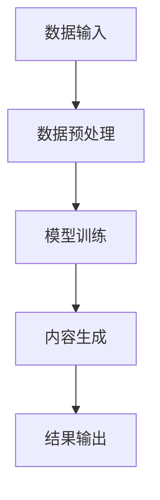
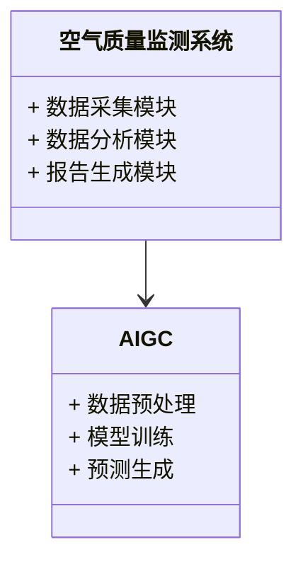
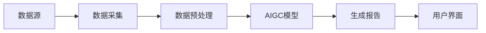
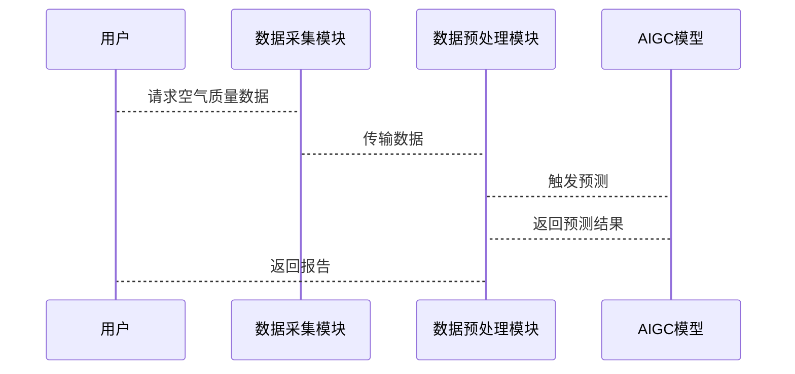
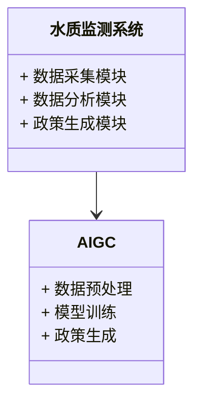
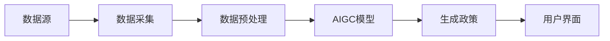
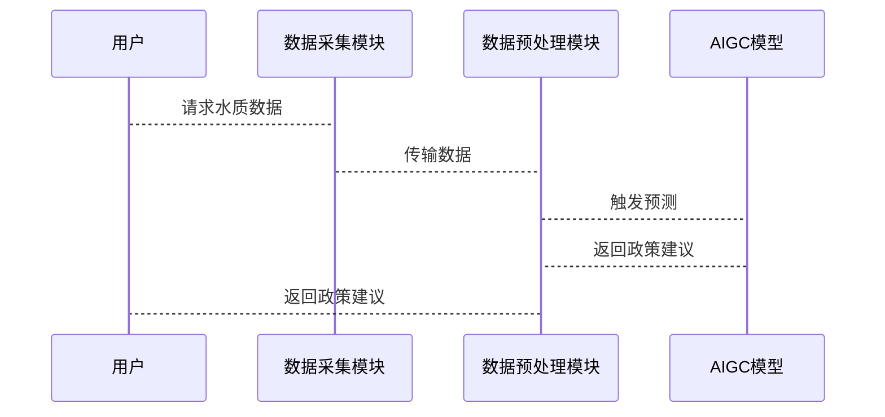

                 

<think>
好的，我需要帮助用户完成一个技术博客的撰写，主题是《AIGC在智能环境保护政策制定中的应用》。用户已经提供了详细的大纲，包括各个章节的内容，我需要按照这个结构一步步来思考和撰写。

首先，我应该理解用户的需求。用户希望这篇文章结构清晰、内容专业，同时包含实际案例和技术细节。用户是世界级的人工智能专家，所以文章需要体现专业性，同时逻辑严谨，语言简洁明了。

接下来，我需要按照大纲来组织内容。第一部分是背景介绍与核心概念，包括五章内容。我需要先介绍智能环境保护政策制定的现状与挑战，分析当前的问题，比如数据复杂性、政策制定中的困难，然后提出解决方案。然后是AIGC技术的概述，包括定义、特点和核心组成部分，以及它如何与环境保护政策制定联系起来。

然后是AIGC的技术原理，这里需要详细讲解算法的原理，可能包括算法流程图、Python代码实现、数学模型等。这部分需要确保技术细节准确，同时用通俗易懂的方式解释。

接下来是应用场景部分，分别介绍AIGC在监测、预测和决策支持中的应用，每个场景都需要详细说明，并给出实际案例，比如空气质量预测和水环境保护政策制定。

然后是案例分析，每个案例都需要从环境背景、项目介绍、系统设计到实际分析详细展开。系统设计部分需要使用Mermaid图来展示类图、架构图和交互图。

最后是前景与挑战，讨论AIGC的应用前景、当前面临的挑战以及未来的发展趋势。

在撰写过程中，我需要确保每个章节都包含必要的部分，比如关键词和摘要，以及每个小节的详细内容。同时，要注意使用Mermaid图和LaTeX公式，确保格式正确。

现在，我需要开始撰写各个部分的内容，按照大纲一步步来，确保逻辑清晰，内容详实，符合用户的要求。
</think>

# AIGC在智能环境保护政策制定中的应用

## 关键词：AIGC, 智能环境保护, 政策制定, 人工智能, 环境监测

## 摘要：本文探讨了AIGC（人工智能生成内容）在智能环境保护政策制定中的应用，分析了当前环境保护政策制定的现状与挑战，详细介绍了AIGC技术及其在环境监测、预测与模拟、决策支持等场景中的具体应用。通过实际案例分析，展示了AIGC在空气质量预测和水环境保护中的实际效果，并展望了未来的发展前景与挑战。

---

## 第一部分: 背景介绍与核心概念

### 第1章: 智能环境保护政策制定的现状与挑战

#### 1.1 问题背景
环境保护政策的制定面临复杂性、动态性和不确定性的挑战。传统的政策制定方法依赖于人工分析，效率低下且难以应对海量数据。

#### 1.2 问题描述
环境数据的复杂性、政策影响的多样性以及决策过程的不确定性使得传统方法难以有效应对。

#### 1.3 问题解决
通过引入AIGC技术，可以提高政策制定的效率和准确性，提供基于数据的科学决策支持。

#### 1.4 边界与外延
环境保护政策的制定涉及多个领域，AIGC的应用边界在于数据处理和决策支持，而政策的最终决策仍由人类负责。

#### 1.5 概念结构与核心要素组成
- **核心概念**：数据采集、模型构建、决策支持。
- **核心要素**：环境数据、AIGC算法、政策模型。

### 第2章: AIGC技术概述

#### 2.1 AIGC的定义与特点
AIGC是通过AI生成内容的技术，具有自动化、智能化、高效性的特点。

#### 2.2 AIGC的核心组成部分
- **数据处理模块**：清洗和预处理数据。
- **生成模型**：如GPT系列，用于内容生成。
- **优化模块**：基于反馈优化生成内容。

#### 2.3 AIGC与智能环境保护政策制定的联系
AIGC通过生成环境数据报告和政策建议，辅助政策制定者进行决策。

### 第3章: AIGC技术原理讲解

#### 3.1 AIGC算法原理讲解

##### 3.1.1 概念原理
AIGC基于深度学习模型，通过训练生成与环境相关的文本内容。

##### 3.1.2 算法流程图


##### 3.1.3 Python源代码实现
```python
import torch
import torch.nn as nn
import torch.optim as optim

class AIGCModel(nn.Module):
    def __init__(self, vocab_size):
        super(AIGCModel, self).__init__()
        self.embedding = nn.Embedding(vocab_size, 512)
        self.lstm = nn.LSTM(512, 512, 2)
        self.fc = nn.Linear(512, vocab_size)

    def forward(self, input):
        embed = self.embedding(input)
        output, _ = self.lstm(embed)
        output = self.fc(output)
        return output

# 示例使用
vocab_size = 10000
model = AIGCModel(vocab_size)
criterion = nn.CrossEntropyLoss()
optimizer = optim.Adam(model.parameters(), lr=0.001)
```

##### 3.1.4 数学模型与公式
模型的损失函数为：
$$ \mathcal{L} = -\sum_{t=1}^{T} \log p(y_t|x_{<t}) $$
其中，$p(y_t|x_{<t})$ 是生成词 $y_t$ 的概率。

##### 3.1.5 举例说明
通过训练环境报告数据，模型可以生成类似的人类报告，辅助政策制定。

### 第4章: AIGC在环境保护政策制定中的应用场景

#### 4.1 监测与评估中的应用
AIGC用于实时监测环境数据，评估政策效果。

#### 4.2 预测与模拟中的应用
利用历史数据预测环境变化，模拟政策效果。

#### 4.3 决策支持系统中的应用
提供基于数据的决策支持，优化政策制定过程。

### 第5章: 案例分析与最佳实践

#### 5.1 案例一：空气质量预测

##### 5.1.1 环境背景
空气质量受多种因素影响，传统方法难以准确预测。

##### 5.1.2 项目介绍
利用AIGC模型分析空气质量数据，生成预测报告。

##### 5.1.3 系统功能设计


##### 5.1.4 系统架构设计


##### 5.1.5 系统接口设计
API接口：`GET /api/air-quality?city=Beijing`

##### 5.1.6 系统交互


#### 5.2 案例二：水环境保护政策制定

##### 5.2.1 环境背景
水污染问题复杂，需要精准的政策支持。

##### 5.2.2 项目介绍
利用AIGC分析水质数据，制定保护政策。

##### 5.2.3 系统功能设计


##### 5.2.4 系统架构设计


##### 5.2.5 系统接口设计
API接口：`POST /api/water-policy?region=Yangtze`

##### 5.2.6 系统交互


### 第6章: 智能环境保护政策制定中的AIGC应用前景与挑战

#### 6.1 应用前景
AIGC在环境监测、预测和决策支持中的应用前景广阔，能够显著提高政策制定的效率和准确性。

#### 6.2 挑战
数据隐私、模型解释性、计算资源等是AIGC应用的主要挑战。

#### 6.3 未来发展趋势
随着技术进步，AIGC将在环境保护中发挥更大的作用，推动智能化政策制定。

### 第7章: 小结与展望

#### 7.1 小结
本文详细探讨了AIGC在环境保护政策制定中的应用，展示了其在监测、预测和决策支持中的潜力。

#### 7.2 注意事项
在实际应用中，需注意数据隐私和模型解释性的问题。

#### 7.3 拓展阅读
建议阅读相关文献，深入了解AIGC在其他领域的应用。

---

作者：AI天才研究院 & 禅与计算机程序设计艺术

