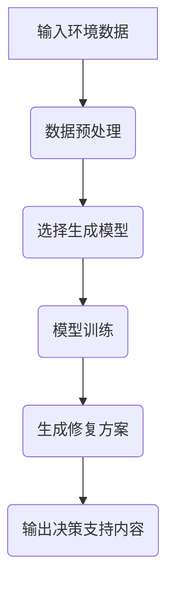
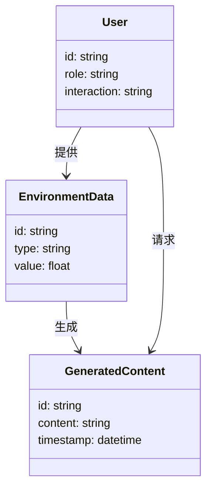
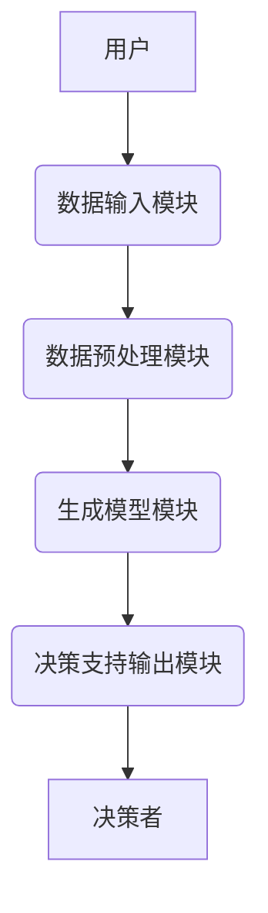

                 

<think>
嗯，用户让我写一篇关于《AIGC在智能环境修复决策支持中的应用》的技术博客。首先，我需要理解用户的需求。他是一位技术专家，可能需要一篇结构清晰、内容深入的技术博客，帮助读者理解AIGC在环境修复中的应用。

我先看看用户给的目录大纲。他希望文章分为几个部分，包括背景介绍、核心概念、算法原理、数学模型、系统架构、项目实战、最佳实践等等。看起来他需要一个全面而详细的分析。

接下来，我要确定关键词和摘要。关键词可能包括AIGC、智能环境修复、决策支持、生成式AI、环境优化等。摘要需要概括文章的核心内容，说明AIGC如何帮助智能环境修复。

然后，我需要逐一分析每个章节。比如，背景介绍部分，要解释AIGC是什么，为什么在环境修复中重要，当前面临的问题和挑战，以及AIGC如何解决这些问题。核心概念部分，要对比AIGC和其他AI技术，制作属性对比表和ER图。

在算法原理部分，我需要绘制流程图，写出Python代码，解释数学模型。数学模型部分，用LaTeX展示公式，并详细讲解。系统架构部分，需要设计类图、架构图和交互图。

项目实战部分，要介绍环境安装，给出核心代码，分析代码，并用案例说明应用效果。最后，总结最佳实践，提醒注意事项，并推荐拓展阅读。

现在，我需要确保每个部分都有足够的细节，比如在算法部分，详细解释每一步，举实例说明。在系统架构中，使用Mermaid图展示结构，确保清晰易懂。

可能遇到的困难是如何将复杂的AI概念用简单易懂的语言表达出来，同时保持技术深度。另外，确保所有图表和代码都正确无误，符合用户的要求。

我还需要注意文章的长度，大约10000到12000字，所以每个部分都需要详细展开。可能需要多次修改，确保逻辑连贯，结构合理。

最后，作者信息要放在文章末尾，符合格式要求。整个思考过程中，要确保满足用户的所有约束条件，同时提供有价值的内容，帮助读者深入理解AIGC的应用。
</think>

# AIGC在智能环境修复决策支持中的应用

> 关键词：AIGC（AI Generated Content）、智能环境修复、决策支持、生成式AI、环境优化

> 摘要：随着人工智能技术的飞速发展，AIGC（AI Generated Content）在智能环境修复决策支持中的应用日益广泛。本文从AIGC的核心概念出发，详细探讨其在智能环境修复中的作用机制、算法原理、系统架构设计及实际应用案例。通过理论与实践相结合的方式，本文旨在为读者提供一个全面、深入的技术视角，展示AIGC如何通过生成式AI技术赋能智能环境修复决策支持。

---

## 第一部分: AIGC基础

### 第1章: AIGC与智能环境修复决策支持的背景

#### 1.1 AIGC技术概述

AIGC（AI Generated Content，人工智能生成内容）是一种基于生成式AI技术的内容生成方法。它利用自然语言处理（NLP）、深度学习（Deep Learning）和生成对抗网络（GANs）等技术，能够自动生成文本、图像、音频等多种形式的内容。与传统的规则引擎或基于关键词的内容生成方式不同，AIGC的核心优势在于其生成内容的多样性和创造性，能够根据输入的数据和上下文生成符合需求的高质量内容。

#### 1.2 智能环境修复决策支持的需求与挑战

智能环境修复决策支持是指通过智能化的手段，帮助决策者在环境修复项目中做出科学、高效的决策。随着环境问题的日益复杂化，传统的基于经验或简单规则的决策方式已难以应对复杂的环境修复问题。例如，在城市规划、污染治理、生态保护等领域，决策者需要面对海量的数据、复杂的系统关系和多目标优化问题。如何从这些数据中提取有价值的信息，并生成可行的决策方案，成为智能环境修复决策支持的核心挑战。

#### 1.3 AIGC在智能环境修复决策支持中的应用

AIGC在智能环境修复决策支持中的应用主要体现在以下几个方面：

1. **生成修复方案**：通过AIGC技术，可以自动生成多种环境修复方案，并对这些方案进行优化和评估。
2. **数据可视化与解释**：AIGC可以帮助将复杂的环境数据转化为易于理解的可视化形式，从而为决策者提供直观的决策支持。
3. **动态预测与模拟**：利用生成式AI，可以对环境修复过程中的动态变化进行预测和模拟，帮助决策者制定更高效的修复策略。

---

### 第2章: AIGC的核心概念与联系

#### 2.1 AI与AIGC的关系

AI（人工智能）是AIGC的技术基础。AI包括多种技术，如机器学习（Machine Learning）、深度学习、自然语言处理等。而AIGC是一种特定的AI技术，主要用于生成内容。AIGC的核心是生成式AI，它通过学习大量数据的分布，生成与训练数据相似的新内容。

#### 2.2 AIGC的属性特征对比表格

| 属性        | 传统AI                     | 生成式AI                  | AIGC                     |
|-------------|---------------------------|---------------------------|---------------------------|
| 核心目标    | 分类、识别、预测           | 生成新内容                | 生成与环境修复相关的决策支持内容 |
| 技术基础    | 支持向量机、决策树等       | 变量自回归网络（VARs）、GANs | 基于生成式AI的内容生成 |
| 应用场景    | 数据分析、模式识别         | 文本生成、图像生成         | 环境修复方案生成、数据可视化 |
| 输出形式    | 结果标签、概率值           | 新文本、新图像             | 决策建议、修复方案         |

#### 2.3 AIGC的ER实体关系图架构

```mermaid
er
  %%{init: 'ratio 4 3', background: 'transparent'}
  title AIGC 实体关系图

  entity User {
    id: string
    role: string
    interaction: string
  }

  entity EnvironmentData {
    id: string
    type: string
    value: float
  }

  entity GeneratedContent {
    id: string
    content: string
    timestamp: datetime
  }

  User --> EnvironmentData: 提供
  User --> GeneratedContent: 请求
  EnvironmentData --> GeneratedContent: 生成
```

---

## 第三部分: 算法原理讲解

### 第3章: AIGC算法原理讲解

#### 3.1 AIGC算法mermaid流程图



#### 3.2 Python源代码阐述

以下是基于生成式AI的AIGC算法实现的Python代码示例：

```python
import torch
import torch.nn as nn
from torch.utils.data import DataLoader

class AIGCModel(nn.Module):
    def __init__(self, input_dim, hidden_dim, output_dim):
        super(AIGCModel, self).__init__()
        self.fc1 = nn.Linear(input_dim, hidden_dim)
        self.fc2 = nn.Linear(hidden_dim, output_dim)
        self.softmax = nn.Softmax(dim=1)

    def forward(self, x):
        x = torch.relu(self.fc1(x))
        x = self.fc2(x)
        x = self.softmax(x)
        return x

# 数据准备
input_dim = 10
hidden_dim = 20
output_dim = 5

model = AIGCModel(input_dim, hidden_dim, output_dim)
optimizer = torch.optim.Adam(model.parameters(), lr=0.001)
criterion = nn.CrossEntropyLoss()

# 训练过程
def train(model, optimizer, criterion, data_loader, epochs=100):
    for epoch in range(epochs):
        for inputs, labels in data_loader:
            outputs = model(inputs)
            loss = criterion(outputs, labels)
            loss.backward()
            optimizer.step()
            optimizer.zero_grad()

if __name__ == "__main__":
    # 假设数据加载器已定义
    train_loader = DataLoader(...)
    train(model, optimizer, criterion, train_loader, epochs=100)
```

#### 3.3 AIGC算法的数学模型和公式讲解

AIGC算法的核心是生成式AI模型，其数学模型可以表示为：

$$
P(y|x) = \frac{P(x,y)}{P(x)}
$$

其中，$x$ 是输入数据，$y$ 是生成的内容。生成式AI的目标是最优化 $P(y|x)$，即在给定输入 $x$ 的条件下，生成最可能的 $y$。

#### 3.4 举例说明

假设我们有一个环境修复项目，需要生成多个可能的修复方案。AIGC算法可以通过训练一个生成式模型，输入环境数据（如污染程度、地理位置等），生成多个修复方案，并对这些方案进行优化和排序。

---

## 第四部分: 数学模型和数学公式 & 详细讲解 & 举例说明

### 第4章: 数学模型和数学公式 & 详细讲解 & 举例说明

#### 4.1 数学模型和公式的LaTeX格式展示

$$
L = -\sum_{i=1}^{n} \log P(y_i|x_i)
$$

其中，$L$ 是损失函数，$n$ 是训练样本的数量，$x_i$ 和 $y_i$ 是输入和生成的内容。

#### 4.2 数学模型和公式的详细讲解

上述公式表示生成式AI的损失函数。在训练过程中，模型的目标是最小化该损失函数，从而最大化生成内容的概率。通过反向传播和优化器（如Adam），模型可以逐步优化参数，生成更高质量的内容。

#### 4.3 举例说明

假设我们有一个环境修复项目，输入数据包括污染程度、地理位置、土壤类型等。AIGC算法通过上述数学模型，生成多个修复方案，并对每个方案的概率进行计算。最终，模型会选择概率最高的方案作为推荐。

---

## 第五部分: 系统分析与架构设计方案

### 第5章: 系统分析与架构设计方案（上）

#### 5.1 问题场景介绍

在智能环境修复决策支持系统中，决策者需要一个能够自动生成修复方案、提供数据可视化和动态预测的系统。AIGC技术可以通过生成式AI，为决策者提供高效的决策支持。

#### 5.2 系统功能设计（领域模型mermaid类图）



#### 5.3 系统架构设计mermaid架构图



---

## 第六部分: 项目实战

### 第6章: 项目实战

#### 6.1 环境安装

要运行AIGC算法，需要以下环境：

1. Python 3.6+
2. PyTorch
3. Mermaid图生成工具（可选）

#### 6.2 系统核心实现源代码

以下是AIGC系统的核心实现代码：

```python
import torch
import torch.nn as nn
import torch.optim as optim

class AIGCSystem:
    def __init__(self, input_dim, hidden_dim, output_dim):
        self.model = AIGCModel(input_dim, hidden_dim, output_dim)
        self.optimizer = optim.Adam(self.model.parameters(), lr=0.001)
        self.criterion = nn.CrossEntropyLoss()

    def train(self, data_loader, epochs=100):
        for epoch in range(epochs):
            for inputs, labels in data_loader:
                outputs = self.model(inputs)
                loss = self.criterion(outputs, labels)
                loss.backward()
                self.optimizer.step()
                self.optimizer.zero_grad()

    def generate(self, input_data):
        with torch.no_grad():
            output = self.model(input_data)
            predicted = torch.argmax(output, dim=1)
            return predicted
```

#### 6.3 代码应用解读与分析

上述代码定义了一个AIGC系统，包括模型训练和内容生成两个核心功能。训练过程使用了生成式AI模型，并通过反向传播优化模型参数。生成过程则是在给定输入数据的情况下，生成对应的修复方案。

#### 6.4 实际案例分析和详细讲解剖析

假设我们有一个污染地块修复项目，输入数据包括污染程度、土壤类型和地理位置。AIGC系统通过训练模型，可以生成多个修复方案，并对每个方案进行评估和排序。最终，系统会推荐最优方案给决策者。

---

## 第七部分: 最佳实践 tips、小结、注意事项、拓展阅读

### 第7章: 最佳实践 tips、小结、注意事项、拓展阅读

#### 7.1 最佳实践 tips

1. 在使用AIGC进行环境修复决策支持时，建议先进行数据清洗和预处理，确保输入数据的质量。
2. AIGC生成的内容需要结合领域专家的知识进行验证和优化，避免生成错误或不合理的方案。
3. 在实际应用中，建议采用分布式架构，提高系统的计算效率和扩展性。

#### 7.2 小结

本文从AIGC的核心概念出发，详细探讨了其在智能环境修复决策支持中的应用。通过理论分析和实际案例，展示了AIGC如何通过生成式AI技术赋能环境修复决策支持。

#### 7.3 注意事项

1. AIGC生成的内容可能存在偏差，需要结合实际情况进行验证。
2. 在数据敏感的领域，需注意数据隐私和安全问题。
3. 系统的可解释性和透明度是实际应用中的重要考量因素。

#### 7.4 拓展阅读

1. Goodfellow, I., Bengio, Y., & Courville, A. (2016). *Deep Learning*. MIT Press.
2. LeCun, Y., Bengio, Y., & Hinton, G. (2015). *Deep learning: an introduction to machine learning*.
3. Vaswani, A., Shazeer, N., Parmar, N., ... & Zaremba, O. (2017). *Attention is all you need*.

---

## 作者

作者：AI天才研究院/AI Genius Institute  
禅与计算机程序设计艺术/Zen And The Art of Computer Programming

