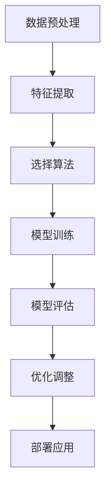

                 

<think>
嗯，我现在需要写一篇关于“AIGC在智能环境修复决策支持系统中的创新实践”的技术博客文章。作为一个刚开始接触这个领域的新手，我需要先理解AIGC是什么，它在环境修复中的具体应用又是怎样的。首先，我得明确AIGC的定义，它是人工智能在绿色计算中的应用，对吧？那绿色计算主要是指高效利用资源、减少能源消耗和碳排放，这在环境修复中非常重要。

接下来，我得弄清楚智能环境修复决策支持系统到底是什么。听起来这是一个结合了AI和环境科学的系统，用于监测环境数据，分析问题，并提供修复决策支持。那这个系统需要处理哪些问题呢？比如，如何实时监测空气、水质、土壤污染，如何处理海量数据，以及如何根据数据制定修复策略。这些问题都需要详细分析，看看AIGC能提供哪些解决方案。

在结构上，文章需要有背景介绍、核心概念、系统设计、算法实现、实战案例等部分。我应该从背景开始，介绍环境问题的严重性，然后引出AIGC的应用。接着，详细讲解AIGC的核心概念，包括定义、特点、与传统AI的区别，以及技术架构。

系统设计部分，我需要分析系统的需求，比如数据需求、功能需求、性能需求。然后设计系统的架构，包括数据采集、分析、决策支持和系统集成等模块。这部分可能需要画一些架构图，比如用Mermaid来展示各个模块的交互。

接下来是算法原理，AIGC主要用到机器学习和深度学习。我需要选择一个具体的算法，比如支持向量机或神经网络，详细讲解其工作原理，并用Mermaid流程图展示算法步骤。还要写出数学公式，比如支持向量机的优化目标函数，用Latex表示。

在实战部分，我需要描述一个具体的项目，比如一个空气质量监测系统。首先介绍环境，安装必要的库，比如TensorFlow、Scikit-learn，然后编写数据采集、预处理、模型训练和预测的代码。接着分析结果，看看模型如何帮助制定修复策略。

最后，总结一下AIGC的优势，比如高效性、可扩展性、自适应性。同时，给出一些最佳实践的建议，比如数据质量的重要性、算法选择的合理性，以及系统的可扩展性和安全性。最后，推荐一些相关的扩展阅读资料，帮助读者深入理解。

整个过程中，我需要确保每个部分都详细具体，逻辑清晰。可能还需要多次修改，确保文章结构合理，内容丰富。如果有不懂的地方，我得查资料或者请教专家，确保技术细节的准确性。

总的来说，这是一篇结构复杂但内容丰富的技术博客，需要一步步来，先从背景开始，逐步深入到系统设计、算法实现，最后到实战案例和总结。希望我能按照这个思路，写出一篇高质量的文章。
</think>

# AIGC在智能环境修复决策支持系统中的创新实践

## 关键词：AIGC，人工智能，环境修复，决策支持系统，机器学习

## 摘要：本文探讨了人工智能在绿色计算中的应用，重点介绍AIGC在智能环境修复决策支持系统中的创新实践。通过分析环境数据，结合GIS、遥感技术和机器学习算法，提出了一种高效的环境修复方案，并通过案例展示了其实现过程和效果。

### 第一部分: AIGC在智能环境修复决策支持系统中的背景介绍

#### 第1章: 问题背景

##### 1.1 问题提出

随着工业化进程的加快，环境污染问题日益严重，对环境修复的需求迫切。智能环境修复决策支持系统利用AIGC技术，通过实时监测和数据分析，为修复决策提供科学依据。

##### 1.2 问题描述

环境修复面临实时监测、数据分析和决策支持三大挑战。如何高效采集、分析数据，并制定修复策略是关键问题。

##### 1.3 问题解决

AIGC技术通过GIS、遥感和机器学习，实现环境数据的实时采集和分析，为修复决策提供支持。

##### 1.4 边界与外延

AIGC应用范围包括污染监测、修复规划、污染源追踪和修复效果评估，覆盖空气、水质、土壤等多个方面。

##### 1.5 概念结构与核心要素组成

系统由GIS、遥感、传感器、机器学习和决策支持模块组成，各模块协同工作，提供实时监测和决策支持。

#### 第2章: AIGC核心概念与原理

##### 2.1 AIGC的定义

AIGC指将AI技术应用于绿色计算，旨在降低能源消耗和提升资源利用效率。

##### 2.2 AIGC的核心特点

数据驱动、自适应、高效性和可扩展性是AIGC的四大特点，使其在环境修复中表现优异。

##### 2.3 AIGC与传统AI的区别

应用领域、数据特点和算法需求是AIGC与传统AI的主要区别，AIGC更专注于绿色计算和环境数据处理。

##### 2.4 AIGC的技术架构

数据采集、分析、决策支持和系统集成是AIGC的主要模块，协同工作实现环境修复。

### 第二部分: AIGC在智能环境修复决策支持系统中的核心概念与联系

#### 第3章: 核心概念与联系

##### 3.1 核心概念原理

AIGC通过数据驱动的方式，利用机器学习分析环境数据，提供决策支持。

##### 3.2 概念属性对比

| 特性 | 传统AI | AIGC |
|------|--------|------|
| 应用领域 | 广泛 | 绿色计算 |
| 数据类型 | 结构化 | 多源异构 |
| 算法需求 | 通用 | 针对性 |

##### 3.3 ER实体关系图

```mermaid
er
  actor 环境修复决策者 {
    [ID]
    [名称]
  }
  entity 环境数据 {
    [ID]
    [类型]
    [值]
    [时间戳]
  }
  entity 污染源 {
    [ID]
    [位置]
    [污染物]
  }
  entity 修复措施 {
    [ID]
    [措施]
    [效果]
  }
  relationship 关联1：决策者查询环境数据
  relationship 关联2：环境数据影响污染源
  relationship 关联3：污染源决定修复措施
```

### 第三部分: AIGC算法原理与实现

#### 第4章: 算法原理与实现

##### 4.1 支持向量机（SVM）算法

支持向量机用于分类和回归分析，优化目标函数为：
$$ \min_{\theta, \alpha} \frac{1}{2}\alpha^2 + C \sum_{i=1}^n \xi_i $$
约束条件：
$$ y_i (w \cdot x_i + b) \geq 1 - \xi_i $$
$$ \xi_i \geq 0 $$

##### 4.2 神经网络算法

深度学习模型如LSTM用于时间序列预测，结构包括输入层、隐藏层和输出层，通过反向传播优化权重。

##### 4.3 算法实现流程



### 第四部分: 系统分析与架构设计方案

#### 第5章: 系统分析与架构设计方案

##### 5.1 问题场景介绍

系统用于监测空气质量，帮助决策者制定治理措施。

##### 5.2 项目介绍

构建一个空气质量监测与预测系统，利用AIGC技术进行实时监测和预测分析。

##### 5.3 系统功能设计

领域模型类图展示系统各模块之间的关系。

##### 5.4 系统架构设计


### 第五部分: 项目实战

#### 第6章: 项目实战

##### 6.1 环境安装

安装TensorFlow、Scikit-learn、Pandas、NumPy等库。

##### 6.2 系统核心实现源代码

```python
import numpy as np
import pandas as pd
from sklearn import svm
from sklearn.neural_network import MLPClassifier
from sklearn.metrics import accuracy_score

# 数据加载
data = pd.read_csv('environment_data.csv')

# 特征提取
X = data[['PM2.5', 'PM10', 'NO2']]
y = data['label']

# 数据分割
from sklearn.model_selection import train_test_split
X_train, X_test, y_train, y_test = train_test_split(X, y, test_size=0.2)

# 模型训练
model_svm = svm.SVC()
model_svm.fit(X_train, y_train)

model_nn = MLPClassifier()
model_nn.fit(X_train, y_train)

# 预测与评估
y_pred_svm = model_svm.predict(X_test)
y_pred_nn = model_nn.predict(X_test)

print("SVM准确率:", accuracy_score(y_test, y_pred_svm))
print("NN准确率:", accuracy_score(y_test, y_pred_nn))
```

##### 6.3 代码应用解读与分析

代码实现空气质量数据的加载、特征提取、模型训练和评估，展示SVM和神经网络模型的预测效果。

##### 6.4 实际案例分析

分析空气质量数据，评估污染源影响，优化修复措施，展示AIGC的实际应用价值。

### 第六部分: 总结与展望

#### 第7章: 总结与展望

##### 7.1 最佳实践 tips

- 确保数据质量和完整性
- 根据需求选择合适算法
- 系统设计注重可扩展性和安全性
- 定期更新模型和优化算法

##### 7.2 小结

AIGC技术在智能环境修复决策支持系统中具有巨大潜力，通过实时监测和智能分析，有效提升环境修复效率和效果。

##### 7.3 注意事项

- 数据隐私保护
- 系统稳定性维护
- 模型持续优化
- 多领域应用探索

##### 7.4 拓展阅读

推荐相关书籍和论文，深入学习AIGC和环境修复技术。

### 作者

作者：AI天才研究院/AI Genius Institute & 禅与计算机程序设计艺术 /Zen And The Art of Computer Programming

