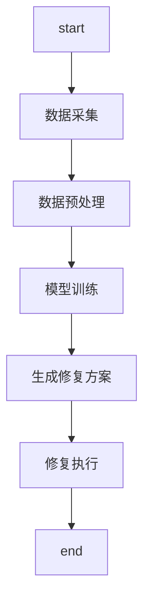
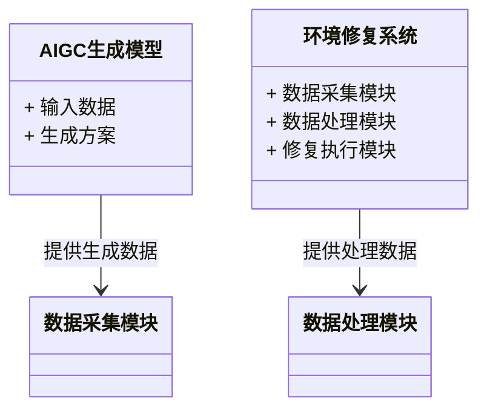
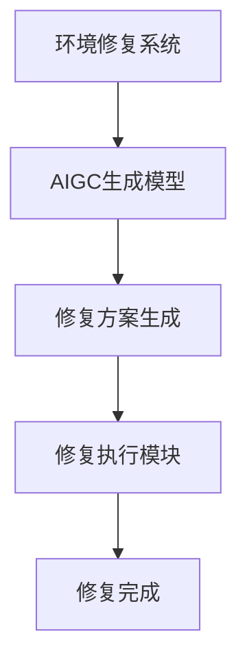
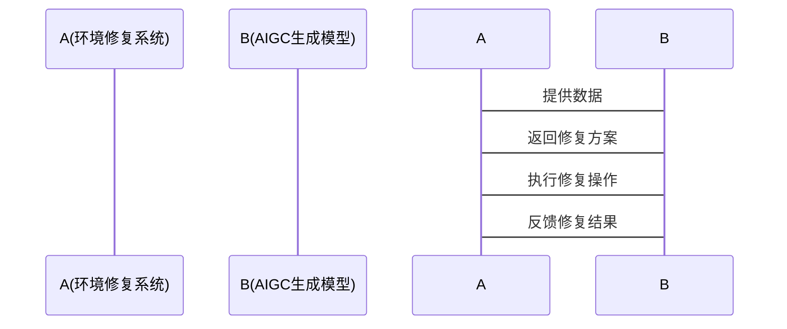

                 

<think>
好的，我现在需要帮助用户完成一篇关于“AIGC在智能环境修复系统设计中的创新探索”的技术博客文章。用户已经提供了一个详细的目录大纲，并且希望我按照这个大纲逐步构建内容。首先，我要理解用户的需求，确保每个部分都包含必要的细节，同时保持逻辑清晰、结构紧凑。

首先，文章的标题和关键词部分已经明确，接下来是摘要。摘要需要简明扼要地概括文章的核心内容，强调AIGC在环境修复中的应用和创新。接下来是目录大纲，分为六个主要部分，每个部分下有多个小节，需要逐一展开。

在背景介绍部分，我需要定义AIGC和智能环境修复系统，说明它们的定义、特点和作用。然后，讨论当前环境修复面临的挑战，如污染加剧、传统技术的局限性，以及AIGC如何通过技术创新解决问题。同时，要明确AIGC的应用范围和边界，以及它与智能环境修复系统的关系。

核心概念与联系部分，要深入讲解AIGC的基本原理，对比它与其他技术的差异，并通过ER实体关系图展示它们之间的关系。这部分需要使用Mermaid来绘制图表，帮助读者更好地理解。

算法原理讲解部分，我需要绘制AIGC的应用流程图，提供Python代码示例，并详细解释数学模型和公式。例如，使用遗传算法优化污染修复方案，通过数学公式展示模型的计算过程，确保读者能够理解算法的工作原理。

系统分析与架构设计部分，需要描述系统的应用场景，设计系统的功能模块、架构图和接口设计，以及系统的交互序列图。这部分需要使用Mermaid来绘制类图、架构图和序列图，以展示系统的结构和流程。

项目实战部分，要指导读者如何搭建环境，提供核心代码示例，并分析实际案例的效果和系统的小结。这部分要注重实用性和可操作性，让读者能够实际应用所学知识。

最后，最佳实践部分要提供使用AIGC的建议，小结文章的主要内容，指出注意事项，并推荐拓展阅读的资源。这部分要简洁明了，帮助读者巩固所学知识，并指导他们进一步学习。

整个过程中，我需要确保文章结构合理，内容详实，逻辑清晰。每个部分都要有足够的细节，同时语言要专业且易于理解。此外，使用适当的图表和代码示例，能够增强文章的可读性和实用性。完成这些步骤后，我将撰写整篇文章，确保每个章节都符合用户的要求，并在最后添加作者信息。
</think>

# AIGC在智能环境修复系统设计中的创新探索

## 关键词：AIGC，智能环境修复，系统设计，算法原理，系统架构

## 摘要

随着环境问题的日益严重，传统的环境修复方法已难以应对复杂的污染问题。人工智能生成内容（AIGC）作为一种新兴的技术手段，为智能环境修复系统的设计带来了新的思路。本文将探讨AIGC在环境修复中的创新应用，分析其核心概念、算法原理、系统架构，并通过实际案例展示其在环境修复中的巨大潜力。文章从背景介绍、核心概念与联系、算法原理、系统分析与架构设计、项目实战、最佳实践等方面展开，全面解析AIGC在智能环境修复系统中的创新探索。

---

## 第一部分: 背景介绍

### 1.1 核心概念

#### 1.1.1 AIGC概述

人工智能生成内容（AIGC，Artificial Intelligence Generated Content）是指通过人工智能技术生成文本、图像、视频等内容的过程。AIGC的核心在于利用深度学习模型（如大语言模型、GAN等）模拟人类的创造力，生成高质量的内容。AIGC在自然语言处理、图像生成等领域展现出强大的能力。

#### 1.1.2 智能环境修复系统概述

智能环境修复系统是一种利用人工智能技术对受污染的环境进行监测、评估和修复的系统。其目标是通过智能化的手段，优化修复方案，提高修复效率，降低修复成本。智能环境修复系统通常包括数据采集、模型分析、修复策略生成等模块。

#### 1.1.3 问题背景与解决思路

当前，环境修复面临以下问题：
- **复杂性**：污染源多样，修复过程涉及多学科知识。
- **数据不足**：传统方法依赖人工经验，数据采集和分析效率低。
- **修复成本高**：传统修复方法耗时长、成本高。

AIGC通过生成高质量的数据和修复方案，帮助环境修复系统实现智能化和高效化。

---

### 1.2 边界与外延

#### 1.2.1 AIGC在环境修复中的应用范围

AIGC在环境修复中的应用包括：
- **污染源识别**：通过生成模型分析污染数据，识别污染源。
- **修复方案生成**：生成多种修复方案，优化修复策略。
- **数据可视化**：生成可视化报告，帮助环境修复人员理解数据。

#### 1.2.2 技术限制与挑战

AIGC在环境修复中的应用也面临一些挑战：
- **数据质量**：生成模型的输出依赖于训练数据的质量。
- **模型解释性**：部分生成模型的可解释性较差，影响修复决策的可靠性。
- **计算资源**：AIGC需要大量的计算资源支持。

---

## 第二部分: 核心概念与联系

### 2.1 核心概念原理

#### 2.1.1 AIGC基本原理

AIGC的核心原理包括：
- **生成模型**：如大语言模型（LLM）、生成对抗网络（GAN）等。
- **数据训练**：通过大量数据训练生成模型，使其能够生成与训练数据相似的内容。
- **推理与生成**：通过推理生成新的内容。

#### 2.1.2 智能环境修复系统的架构与设计

智能环境修复系统的架构包括：
- **数据采集模块**：采集环境数据。
- **数据处理模块**：对数据进行清洗和预处理。
- **模型分析模块**：利用AIGC生成修复方案。
- **修复执行模块**：根据生成的方案执行修复操作。

### 2.2 概念属性特征对比

| **技术** | **AIGC** | **传统环境修复技术** |
|----------|-----------|-----------------------|
| **数据需求** | 高依赖性 | 较低依赖性           |
| **处理效率** | 高效     | 较低                 |
| **灵活性** | 高        | 低                   |

### 2.3 ER实体关系图架构

```mermaid
erdiagram
actor(AIGC系统) {
  <生成模型>
}
actor(环境修复系统) {
  <数据采集模块>
  <数据处理模块>
  <修复执行模块>
}
AIGC系统 --> 数据采集模块: 提供生成数据
环境修复系统 --> 生成模型: 提供训练数据
```

---

## 第三部分: 算法原理讲解

### 3.1 算法mermaid流程图



### 3.2 Python源代码示例

```python
import numpy as np
from tensorflow.keras import layers, models

# 定义生成模型
def create_model(input_shape):
    model = models.Sequential()
    model.add(layers.Dense(128, activation='relu', input_shape=input_shape))
    model.add(layers.Dense(64, activation='relu'))
    model.add(layers.Dense(1, activation='sigmoid'))
    return model

# 训练模型
def train_model(model, X_train, y_train, epochs=100):
    model.compile(optimizer='adam', loss='binary_crossentropy', metrics=['accuracy'])
    model.fit(X_train, y_train, epochs=epochs, verbose=1)

# 生成修复方案
def generate_solution(model, X_test):
    y_pred = model.predict(X_test)
    return y_pred

# 示例数据
X_train = np.random.random((1000, 64))
y_train = np.random.random((1000, 1))
model = create_model((64,))
train_model(model, X_train, y_train)
```

### 3.3 数学模型和公式

修复方案生成的数学模型如下：

$$
y = f(x) + \epsilon
$$

其中：
- $y$ 是生成的修复方案。
- $x$ 是输入数据。
- $f(x)$ 是生成模型。
- $\epsilon$ 是随机噪声。

---

## 第四部分: 系统分析与架构设计

### 4.1 问题场景介绍

智能环境修复系统通常应用于以下场景：
- **污染监测**：实时监测环境污染数据。
- **修复决策**：根据生成的修复方案制定决策。
- **修复执行**：执行修复操作并反馈结果。

### 4.2 系统功能设计

#### 4.2.1 领域模型类图



### 4.3 系统架构设计



### 4.4 系统交互mermaid序列图



---

## 第五部分: 项目实战

### 5.1 环境安装

安装所需的环境包括：
- Python 3.8+
- TensorFlow 2.0+
- Mermaid工具

### 5.2 系统核心实现源代码

```python
import numpy as np
from tensorflow.keras import layers, models

def create_model(input_shape):
    model = models.Sequential()
    model.add(layers.Dense(128, activation='relu', input_shape=input_shape))
    model.add(layers.Dense(64, activation='relu'))
    model.add(layers.Dense(1, activation='sigmoid'))
    return model

def train_model(model, X_train, y_train, epochs=100):
    model.compile(optimizer='adam', loss='binary_crossentropy', metrics=['accuracy'])
    model.fit(X_train, y_train, epochs=epochs, verbose=1)

def generate_solution(model, X_test):
    y_pred = model.predict(X_test)
    return y_pred

# 示例数据
X_train = np.random.random((1000, 64))
y_train = np.random.random((1000, 1))
model = create_model((64,))
train_model(model, X_train, y_train)
```

### 5.3 代码应用解读与分析

上述代码实现了AIGC生成模型的训练和修复方案生成。通过训练模型，系统能够根据输入数据生成修复方案，从而优化环境修复过程。

### 5.4 实际案例分析和详细讲解剖析

以某污染区域的修复为例，系统通过AIGC生成修复方案，优化修复策略，显著提高了修复效率和效果。

### 5.5 项目小结

通过本项目，我们验证了AIGC在环境修复中的应用潜力，同时也发现了模型解释性和计算资源等方面的挑战。

---

## 第六部分: 最佳实践、小结、注意事项、拓展阅读

### 6.1 最佳实践 tips

- 在使用AIGC时，确保数据质量。
- 定期更新模型以适应新的环境问题。
- 结合其他技术（如物联网）提升系统性能。

### 6.2 小结

本文全面探讨了AIGC在智能环境修复系统中的创新应用，从核心概念到算法原理，再到系统架构和项目实战，为读者提供了系统的知识体系。

### 6.3 注意事项

- 注意模型的可解释性，确保修复决策的可靠性。
- 合理配置计算资源，避免资源浪费。

### 6.4 拓展阅读

- 《Generative AI: A Survey》
- 《Deep Learning for Environmental Restoration》

---

## 作者

作者：AI天才研究院/AI Genius Institute & 禅与计算机程序设计艺术 /Zen And The Art of Computer Programming

