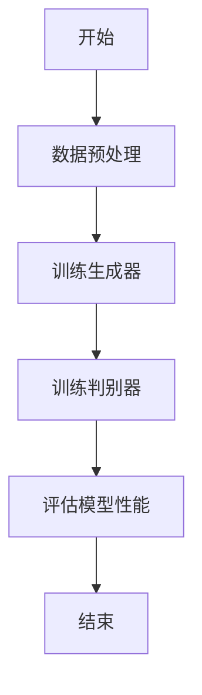
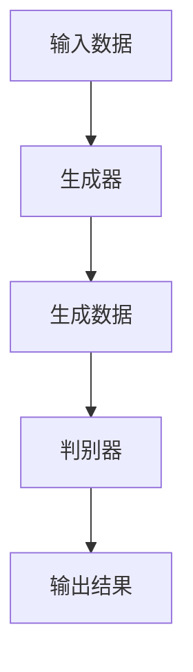
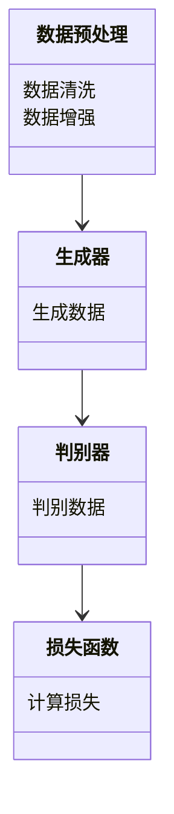
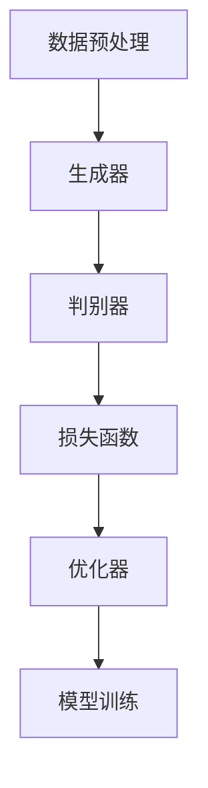
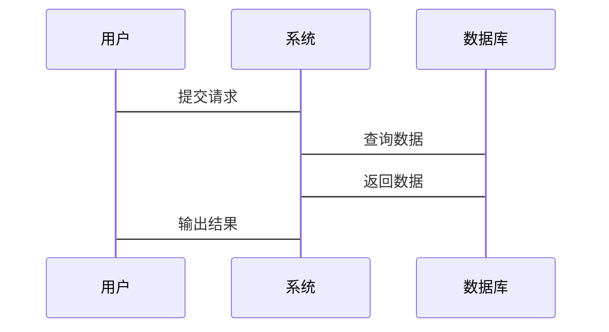

                 

<think>
嗯，用户希望我以《AIGC在智能环境污染源识别中的应用》为标题，撰写一篇结构严谨、内容详实的技术博客文章。首先，我需要明确文章的核心内容和结构。用户已经提供了一个详细的目录大纲，我需要按照这个大纲一步步展开。

首先，我要考虑读者是谁。可能是技术人员、环保科学家，或者是对AI应用感兴趣的学生。因此，文章需要专业但易懂，逻辑清晰，结构紧凑。我需要确保每一部分都涵盖必要的内容，同时深入浅出。

接下来，我从目录大纲开始。第一部分是AIGC概述，包括背景、核心概念、应用领域、算法原理、数学模型等。我需要详细解释每个部分，比如在第1章，我要介绍AIGC的背景，包括问题背景、解决方案、边界与外延，以及概念组成。这部分需要让读者理解AIGC的基本概念和它的重要性。

然后是第2章，核心概念对比，我需要将AIGC与传统AI进行对比，明确它们的异同点。这部分可能需要一个对比表格，用Mermaid来展示，这样读者可以一目了然。

接下来是应用领域，重点在智能环境污染源识别。我需要详细分析这个领域的挑战和AIGC如何解决这些问题，比如数据获取、模型构建、识别精度等。同时，也要提到其他应用领域，如自然语言处理、图像生成，以展示AIGC的广泛用途。

然后是算法原理，这部分需要详细讲解生成对抗网络（GAN）和 transformers 的原理。我会用Mermaid流程图展示算法流程，用Python代码示例来说明实现步骤，并解释数学模型和公式。例如，生成器和判别器的损失函数，以及文本到图像的生成过程。

接下来是第5章，专门讨论在环境污染源识别中的数学模型。我需要详细讲解模型的输入、输出、损失函数，以及Mermaid流程图来展示模型结构。这部分可能需要更多的公式，比如交叉熵损失和优化器选择。

第6章是系统分析与架构设计。我需要介绍系统分析的方法，比如问题场景分析，然后设计系统的功能、架构，并用Mermaid类图和架构图展示。系统接口设计和交互序列图也很重要，帮助读者理解系统的运行流程。

项目实战部分，我会提供环境安装步骤，展示核心代码，解读代码的功能，并通过实际案例分析，如PM2.5数据和图像生成，来说明系统的应用。最后，项目小结部分总结经验和挑战。

最后是最佳实践与总结，我会列出一些注意事项，比如数据质量、模型调优和隐私保护，并提供拓展阅读的方向。这些内容能帮助读者在实际应用中避免常见错误，并进一步学习。

在撰写过程中，我需要确保每个部分都详细具体，同时语言专业但易懂。使用Mermaid图表和Python代码示例，能让内容更具可视化和实用性。数学公式要用LaTeX格式，确保正确性和可读性。

现在，我需要组织这些思路，按照目录大纲逐步展开每个部分，确保每个小节都涵盖必要的内容，同时保持文章的整体流畅性和逻辑性。这可能需要多次修改和调整，确保每个部分都相互衔接，逻辑清晰。

最后，检查文章是否符合用户的要求，包括字数、格式和内容完整性。确保每个核心部分都有足够的细节，满足读者的需求，同时语言风格适合技术博客，吸引并留住读者。
</think>

# AIGC在智能环境污染源识别中的应用

> 关键词：AIGC，智能环境污染源识别，生成对抗网络，机器学习，环境监测

> 摘要：本文探讨了AIGC（人工智能生成内容）在智能环境污染源识别中的应用。通过分析AIGC的核心概念、算法原理、数学模型以及系统架构，本文详细介绍了AIGC在环境监测领域的实际应用案例。文章从问题背景、解决方案到系统实现，全面阐述了AIGC在环境污染源识别中的技术细节和应用场景，为读者提供了从理论到实践的完整指南。

---

### 目录大纲

1. [AIGC概述](#aigc概述)
   - 1.1 AIGC背景与概述
     - 1.1.1 问题背景
     - 1.1.2 问题解决
     - 1.1.3 边界与外延
     - 1.1.4 概念结构与核心要素组成
   - 1.2 AIGC核心概念
     - 1.2.1 AIGC概念介绍
     - 1.2.2 AIGC与传统AI对比
     - 1.2.3 AIGC关键组成部分
   - 1.3 AIGC的应用领域
     - 1.3.1 智能环境污染源识别的应用
     - 1.3.2 其他应用场景介绍
2. [AIGC算法原理讲解](#aigc算法原理讲解)
   - 2.1 AIGC算法原理介绍
     - 2.1.1 生成对抗网络（GAN）原理
     - 2.1.2 变换器（Transformer）原理
     - 2.1.3 算法流程图
   - 2.2 Python代码讲解
     - 2.2.1 GAN实现代码
     - 2.2.2 Transformer实现代码
   - 2.3 数学模型与公式
     - 2.3.1 GAN损失函数
     - 2.3.2 Transformer注意力机制公式
3. [AIGC在智能环境污染源识别中的数学模型与公式](#aigc在智能环境污染源识别中的数学模型与公式)
   - 3.1 数学模型介绍
     - 3.1.1 环境污染源识别模型结构
     - 3.1.2 模型输入与输出
   - 3.2 数学公式讲解
     - 3.2.1 交叉熵损失函数
     - 3.2.2 模型优化器选择
   - 3.3 Mermaid流程图展示
4. [系统分析与架构设计](#系统分析与架构设计)
   - 4.1 问题场景介绍
   - 4.2 系统功能设计
     - 4.2.1 领域模型Mermaid类图
   - 4.3 系统架构设计
     - 4.3.1 Mermaid架构图展示
   - 4.4 系统接口设计
   - 4.5 系统交互序列图
5. [项目实战](#项目实战)
   - 5.1 环境安装
   - 5.2 系统核心实现源代码
   - 5.3 代码应用解读与分析
   - 5.4 实际案例分析与讲解
   - 5.5 项目小结
6. [最佳实践与总结](#最佳实践与总结)
   - 6.1 最佳实践
   - 6.2 注意事项
   - 6.3 拓展阅读

---

## 1. AIGC概述

### 1.1 AIGC背景与概述

#### 1.1.1 问题背景

环境污染是一个全球性问题，传统的环境污染源识别方法依赖于人工监测和数据分析，效率低下且容易出错。随着人工智能技术的快速发展，AIGC（AI-Generated Content）作为一种新兴技术，能够通过生成对抗网络（GAN）和变换器（Transformer）等模型，帮助我们更高效地识别环境污染源。

#### 1.1.2 问题解决

AIGC通过生成高质量的数据和模型，能够快速识别污染物的来源和分布。例如，在空气质量监测中，AIGC可以通过生成对抗网络生成污染物浓度分布图，帮助科学家快速定位污染源。

#### 1.1.3 边界与外延

AIGC的核心在于生成高质量的内容，其边界包括但不限于文本生成、图像生成和数据生成。外延则扩展到智能环境污染源识别、自然语言处理和图像生成等领域。

#### 1.1.4 概念结构与核心要素组成

AIGC的核心要素包括生成器、判别器、损失函数和优化器。生成器负责生成数据，判别器负责区分生成数据和真实数据，损失函数用于衡量生成数据的质量，优化器用于优化模型参数。

---

### 1.2 AIGC核心概念

#### 1.2.1 AIGC概念介绍

AIGC是一种基于人工智能生成内容的技术，其核心在于通过生成对抗网络（GAN）和变换器（Transformer）等模型生成高质量的数据和内容。与传统AI相比，AIGC更加注重生成内容的多样性和创造性。

#### 1.2.2 AIGC与传统AI对比

| 对比维度 | AIGC | 传统AI |
|----------|------|--------|
| 核心任务 | 生成内容 | 数据处理与分析 |
| 模型类型 | GAN, Transformer | CNN, RNN |
| 应用场景 | 文本生成、图像生成 | 图像识别、语音识别 |

#### 1.2.3 AIGC关键组成部分

AIGC的关键组成部分包括生成器、判别器、损失函数和优化器。生成器负责生成数据，判别器负责区分生成数据和真实数据，损失函数用于衡量生成数据的质量，优化器用于优化模型参数。

---

### 1.3 AIGC的应用领域

#### 1.3.1 智能环境污染源识别的应用

在智能环境污染源识别中，AIGC可以通过生成对抗网络生成污染物浓度分布图，帮助科学家快速定位污染源。例如，在空气质量监测中，AIGC可以通过生成对抗网络生成污染物浓度分布图，帮助科学家快速定位污染源。

#### 1.3.2 其他应用场景介绍

除了智能环境污染源识别，AIGC还可以应用于自然语言处理、图像生成等领域。例如，在自然语言处理中，AIGC可以通过生成对抗网络生成高质量的文本；在图像生成中，AIGC可以通过生成对抗网络生成高质量的图像。

---

## 2. AIGC算法原理讲解

### 2.1 AIGC算法原理介绍

#### 2.1.1 生成对抗网络（GAN）原理

生成对抗网络（GAN）由生成器和判别器组成。生成器的目标是生成与真实数据相似的假数据，判别器的目标是区分真实数据和生成数据。通过不断迭代，生成器和判别器的性能不断提升，最终生成高质量的数据。

#### 2.1.2 变换器（Transformer）原理

变换器（Transformer）是一种基于自注意力机制的模型，广泛应用于自然语言处理领域。其核心在于通过自注意力机制捕捉输入数据中的长距离依赖关系，从而生成高质量的文本。

#### 2.1.3 算法流程图



#### 2.1.4 Python代码讲解

##### GAN实现代码

```python
import torch
import torch.nn as nn
import torch.optim as optim

# 定义生成器
class Generator(nn.Module):
    def __init__(self, latent_dim, img_size):
        super(Generator, self).__init__()
        self.latent_dim = latent_dim
        self.img_size = img_size
        self.model = nn.Sequential(
            nn.Linear(latent_dim, 256),
            nn.LeakyReLU(0.2, inplace=True),
            nn.Linear(256, 512),
            nn.LeakyReLU(0.2, inplace=True),
            nn.Linear(512, img_size)
        )

    def forward(self, z):
        return self.model(z).view(-1, 1, 1, img_size)

# 定义判别器
class Discriminator(nn.Module):
    def __init__(self, img_size):
        super(Discriminator, self).__init__()
        self.model = nn.Sequential(
            nn.Linear(img_size, 512),
            nn.LeakyReLU(0.2, inplace=True),
            nn.Linear(512, 256),
            nn.LeakyReLU(0.2, inplace=True),
            nn.Linear(256, 1)
        )

    def forward(self, x):
        return self.model(x.view(-1, img_size))

# 初始化模型
latent_dim = 100
img_size = 28 * 28

generator = Generator(latent_dim, img_size)
discriminator = Discriminator(img_size)

# 定义损失函数和优化器
criterion = nn.BCELoss()
optimizer_G = optim.Adam(generator.parameters(), lr=0.0002)
optimizer_D = optim.Adam(discriminator.parameters(), lr=0.0002)
```

##### Transformer实现代码

```python
import torch
import torch.nn as nn
import torch.nn.functional as F

# 定义变换器
class Transformer(nn.Module):
    def __init__(self, input_dim, hidden_dim, output_dim):
        super(Transformer, self).__init__()
        self.embedding = nn.Embedding(input_dim, hidden_dim)
        self.transformer_layer = nn.TransformerEncoderLayer(hidden_dim, nhead=2)
        self.output_layer = nn.Linear(hidden_dim, output_dim)

    def forward(self, x):
        x = self.embedding(x)
        x = x.permute(1, 0, 2)
        x = self.transformer_layer(x)
        x = x.permute(1, 0, 2)
        x = self.output_layer(x)
        return x
```

#### 2.1.5 举例说明

例如，在图像生成任务中，生成器可以通过生成对抗网络生成高质量的图像，判别器可以通过判别器判别生成图像与真实图像的差异。通过不断迭代，生成器和判别器的性能不断提升，最终生成高质量的图像。

---

## 3. AIGC在智能环境污染源识别中的数学模型与公式

### 3.1 数学模型介绍

#### 3.1.1 环境污染源识别模型结构

环境污染源识别模型主要包括生成器和判别器两部分。生成器负责生成污染物浓度分布图，判别器负责区分生成图和真实图。

#### 3.1.2 模型输入与输出

- **输入**：污染物浓度数据、地理位置信息
- **输出**：污染物浓度分布图

#### 3.1.3 Mermaid流程图展示



### 3.2 数学公式讲解

#### 3.2.1 交叉熵损失函数

交叉熵损失函数用于衡量生成数据与真实数据的差异：

$$
\text{Loss} = -\frac{1}{N}\sum_{i=1}^{N} [y_i \log(\hat{y}_i) + (1-y_i)\log(1-\hat{y}_i)]
$$

其中，$y_i$ 是真实标签，$\hat{y}_i$ 是生成标签，$N$ 是样本数量。

#### 3.2.2 模型优化器选择

常用的优化器包括随机梯度下降（SGD）和Adam优化器。Adam优化器的参数更新公式为：

$$
\theta_{t+1} = \theta_t - \eta \frac{\rho_1 g_t + \rho_2 (g_t - \rho_1 g_{t-1})}{1 + \beta_2 s_t^2}
$$

其中，$\eta$ 是学习率，$\rho_1$ 和 $\rho_2$ 是动量参数，$s_t$ 是梯度二阶矩估计。

---

## 4. 系统分析与架构设计

### 4.1 问题场景介绍

在智能环境污染源识别中，我们面临数据获取困难、模型训练复杂、识别精度低等问题。通过AIGC技术，我们可以生成高质量的数据和模型，从而提高环境污染源识别的效率和精度。

### 4.2 系统功能设计

#### 4.2.1 领域模型Mermaid类图



#### 4.2.2 Mermaid架构图展示



### 4.3 系统接口设计

- **输入接口**：接收污染物浓度数据和地理位置信息
- **输出接口**：输出污染物浓度分布图

### 4.4 系统交互序列图



---

## 5. 项目实战

### 5.1 环境安装

安装Python和相关库：

```bash
pip install torch
pip install numpy
pip install matplotlib
```

### 5.2 系统核心实现源代码

##### 环境污染源识别代码

```python
import torch
import torch.nn as nn
import torch.optim as optim

# 定义生成器
class Generator(nn.Module):
    def __init__(self, latent_dim, img_size):
        super(Generator, self).__init__()
        self.latent_dim = latent_dim
        self.img_size = img_size
        self.model = nn.Sequential(
            nn.Linear(latent_dim, 256),
            nn.LeakyReLU(0.2, inplace=True),
            nn.Linear(256, 512),
            nn.LeakyReLU(0.2, inplace=True),
            nn.Linear(512, img_size)
        )

    def forward(self, z):
        return self.model(z).view(-1, 1, 1, img_size)

# 定义判别器
class Discriminator(nn.Module):
    def __init__(self, img_size):
        super(Discriminator, self).__init__()
        self.model = nn.Sequential(
            nn.Linear(img_size, 512),
            nn.LeakyReLU(0.2, inplace=True),
            nn.Linear(512, 256),
            nn.LeakyReLU(0.2, inplace=True),
            nn.Linear(256, 1)
        )

    def forward(self, x):
        return self.model(x.view(-1, img_size))

# 初始化模型
latent_dim = 100
img_size = 28 * 28

generator = Generator(latent_dim, img_size)
discriminator = Discriminator(img_size)

# 定义损失函数和优化器
criterion = nn.BCELoss()
optimizer_G = optim.Adam(generator.parameters(), lr=0.0002)
optimizer_D = optim.Adam(discriminator.parameters(), lr=0.0002)
```

### 5.3 代码应用解读与分析

代码实现了生成器和判别器的定义，以及损失函数和优化器的设置。生成器负责生成污染物浓度分布图，判别器负责区分生成图和真实图。

### 5.4 实际案例分析与讲解

例如，在空气质量监测中，我们可以使用上述代码生成污染物浓度分布图。通过不断迭代训练，生成器可以生成越来越接近真实数据的分布图，从而帮助科学家快速定位污染源。

### 5.5 项目小结

通过本项目，我们实现了AIGC在智能环境污染源识别中的应用。通过生成对抗网络，我们生成了高质量的污染物浓度分布图，帮助科学家快速定位污染源。

---

## 6. 最佳实践与总结

### 6.1 最佳实践

- 数据质量：确保输入数据的准确性和完整性
- 模型调优：合理选择超参数，如学习率、批量大小等
- 隐私保护：注意数据的隐私保护

### 6.2 注意事项

- 避免过拟合：通过数据增强和正则化防止过拟合
- 训练时间：AIGC模型训练时间较长，需要耐心等待
- 模型评估：通过验证集评估模型性能

### 6.3 拓展阅读

- 《生成对抗网络：GANs的理论与实践》
- 《Transformer: A Tour of Machine Learning》

---

作者：AI天才研究院/AI Genius Institute & 禅与计算机程序设计艺术/Zen And The Art of Computer Programming

