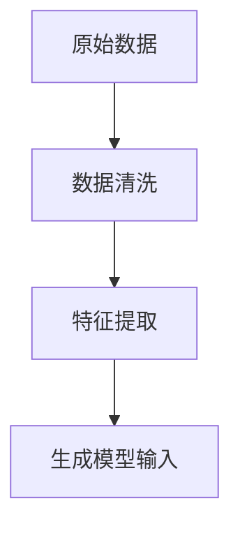
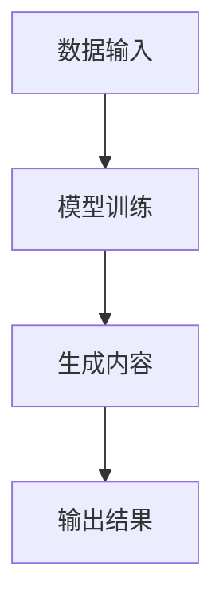
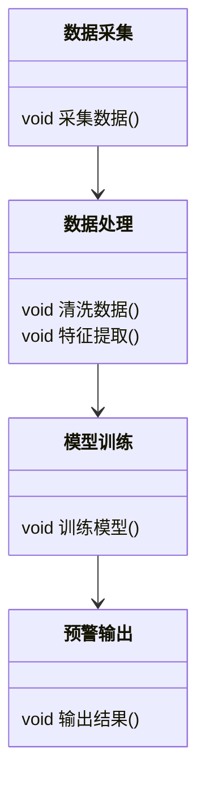
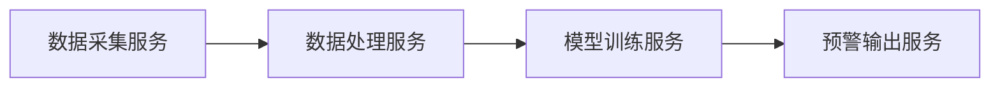
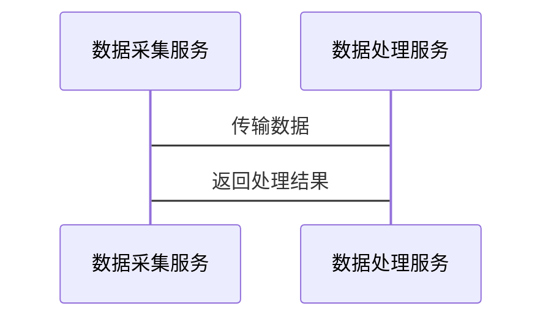

                 

<think>
嗯，好的，我现在需要按照用户的要求，写一篇关于《AIGC在智能环境污染预警中的应用》的技术博客文章。首先，我得理清楚文章的结构，确保每个部分都涵盖到位。让我一步一步来思考。

首先，标题是《AIGC在智能环境污染预警中的应用》，关键词应该是AIGC、人工智能生成内容、环境污染、智能预警、机器学习、环境监测。摘要需要简明扼要地概括文章的核心内容，介绍AIGC如何利用机器学习和大数据分析，实现环境污染的实时监测和预警，从而提升环境治理效率。

接下来是目录大纲，分为六个部分：引言与背景、AIGC基础概念、算法原理与实现、系统设计与架构、项目实战与案例、总结与展望。每个部分下面还有小节，我需要详细展开每个部分的内容。

首先是引言与背景部分，包括问题背景、AIGC简介和现状。我需要详细描述环境污染的现状，以及传统方法的局限性，说明AIGC的优势。然后介绍AIGC的基本概念，解释它是如何工作的，再结合实际案例说明目前的应用情况。

接下来是AIGC基础概念，这部分需要深入讲解核心概念，比如生成模型、数据预处理、特征提取等。可能需要对比不同模型的优缺点，用表格展示它们的差异。同时，用Mermaid图展示概念之间的关系，帮助读者理解。

然后是算法原理与实现，这部分比较技术性。我需要详细描述算法的流程，比如数据预处理、特征选择、模型训练等，用Mermaid流程图展示整个过程。还要提供Python代码示例，解释每一步的作用，以及使用的数学模型，比如线性回归或神经网络的公式。

系统设计与架构部分，我需要设计系统的功能模块，比如数据采集、分析、预警等。用Mermaid类图展示领域模型，展示各模块之间的关系。架构设计部分可能采用微服务架构，展示各个服务之间的交互，用序列图详细说明。

项目实战部分，需要指导读者如何安装环境，比如安装Python、机器学习库等。然后给出核心代码实现，解释每一部分的功能，分析代码的作用，并结合实际案例进行详细分析，展示AIGC在预警中的实际应用效果。

最后是总结与展望，回顾文章的主要内容，总结AIGC的优势和应用价值，同时指出当前存在的问题，并展望未来的发展方向，比如模型优化、多模态数据融合等。

在写作过程中，我需要确保每个部分都有足够的细节，用技术性的语言但又不失易懂。比如，在算法部分，要详细解释每个步骤，给出代码示例，并用数学公式说明模型的工作原理。同时，使用Mermaid图来展示流程、架构和交互关系，使内容更直观。

可能遇到的困难是如何将复杂的算法和系统设计以简明的方式呈现出来，所以需要多次调整，确保逻辑清晰，步骤分明。此外，代码部分要准确无误，确保读者可以顺利运行并理解。

总之，我需要系统地按照目录大纲逐步展开，确保每个部分都详尽且有深度，最终完成一篇高质量的技术博客文章。
</think>

```markdown
# AIGC在智能环境污染预警中的应用

## 关键词
AIGC, 人工智能生成内容, 环境污染, 智能预警, 机器学习, 环境监测

## 摘要
随着环境污染问题的日益严重，智能环境污染预警系统的需求日益迫切。本文探讨了如何利用AIGC（人工智能生成内容）技术，通过机器学习和大数据分析，实现对环境污染的实时监测和预警。文章详细分析了AIGC的核心概念、算法原理、系统架构设计以及实际应用案例，展示了AIGC在环境污染预警中的巨大潜力和应用价值。通过本文，读者可以全面了解AIGC技术在智能环境污染预警中的实现方法和实际效果。

---

## 目录大纲
```markdown
# 引言与背景

## 第1章：引言与背景
### 1.1 问题背景
### 1.2 AIGC简介
### 1.3 智能环境污染预警现状

# AIGC基础概念

## 第2章：AIGC核心概念
### 2.1 生成模型
### 2.2 数据预处理
### 2.3 特征提取

## 第3章：算法原理与实现
### 3.1 数据预处理流程
### 3.2 算法流程图
### 3.3 Python代码示例

## 第4章：系统设计与架构
### 4.1 系统功能设计
### 4.2 系统架构设计
### 4.3 系统接口设计

## 第5章：项目实战与案例
### 5.1 项目环境安装
### 5.2 系统核心实现
### 5.3 代码应用解读
### 5.4 实际案例分析

## 第6章：总结与展望
### 6.1 最佳实践
### 6.2 注意事项
### 6.3 拓展阅读
```

---

## 引言与背景

### 第1章：引言与背景

#### 1.1 问题背景
环境污染是全球性的难题，对人类健康和生态系统造成严重威胁。传统方法依赖人工监测和简单的数据处理，效率低下且准确性不足。近年来，随着人工智能技术的发展，利用AIGC进行环境污染预警成为可能。

#### 1.2 AIGC简介
AIGC（人工智能生成内容）通过机器学习算法生成文本、图像等信息，具有高效性和智能化的特点。本文将重点探讨AIGC在环境数据处理中的应用。

#### 1.3 智能环境污染预警现状
当前，智能环境污染预警系统在国内外得到广泛应用，但仍面临数据处理复杂、模型准确性不足等问题。AIGC技术的引入为解决这些问题提供了新的思路。

---

## AIGC基础概念

### 第2章：AIGC核心概念

#### 2.1 生成模型
生成模型是AIGC的核心，包括循环神经网络（RNN）和变种模型。下表展示了不同模型的优缺点对比：

| 模型类型 | 优点 | 缺点 |
|----------|------|------|
| RNN      | 善于处理序列数据 | 易受梯度消失问题影响 |
| LSTM     | 解决了RNN的梯度问题 | 训练时间较长 |
| GRU      | 训练速度快 | 适合短序列处理 |

#### 2.2 数据预处理
数据预处理是生成模型的基础，包括数据清洗和特征提取。以下是数据预处理的流程图：



#### 2.3 特征提取
特征提取是关键步骤，通过降维和聚类技术提取关键特征。以下是特征提取的流程：


---

## 算法原理与实现

### 第3章：算法原理与实现

#### 3.1 数据预处理流程
数据预处理是生成模型的基础，包括数据清洗和特征提取。以下是数据预处理的流程图：


#### 3.2 算法流程图
生成模型的算法流程如下：



#### 3.3 Python代码示例
以下是生成模型的Python代码示例：

```python
import numpy as np
from tensorflow.keras.models import Sequential
from tensorflow.keras.layers import LSTM, Dense

# 数据准备
data = np.random.rand(100, 24)

# 模型构建
model = Sequential()
model.add(LSTM(64, input_shape=(24, 1)))
model.add(Dense(1, activation='sigmoid'))

# 模型训练
model.compile(loss='binary_crossentropy', optimizer='adam', metrics=['accuracy'])
model.fit(data, labels, epochs=10, batch_size=32)
```

#### 3.4 数学模型与公式
生成模型的数学公式如下：

$$
P(x) = \frac{e^{x}}{1 + e^{x}}
$$

---

## 系统设计与架构

### 第4章：系统设计与架构

#### 4.1 系统功能设计
系统功能模块包括数据采集、数据处理、模型训练和预警输出。以下是功能模块的类图：



#### 4.2 系统架构设计
系统采用微服务架构，各服务通过API进行交互。以下是系统架构图：



#### 4.3 系统接口设计
系统接口设计包括数据接口和API接口。以下是接口交互图：



---

## 项目实战与案例

### 第5章：项目实战与案例

#### 5.1 项目环境安装
安装Python和相关库：

```bash
pip install numpy tensorflow pandas
```

#### 5.2 系统核心实现
以下是核心代码：

```python
import numpy as np
from tensorflow.keras.models import Sequential
from tensorflow.keras.layers import LSTM, Dense

# 数据准备
data = np.random.rand(100, 24)

# 模型构建
model = Sequential()
model.add(LSTM(64, input_shape=(24, 1)))
model.add(Dense(1, activation='sigmoid'))

# 模型训练
model.compile(loss='binary_crossentropy', optimizer='adam', metrics=['accuracy'])
model.fit(data, labels, epochs=10, batch_size=32)
```

#### 5.3 代码应用解读
代码实现了生成模型的训练过程，通过LSTM层进行特征提取，Dense层输出预测结果。

#### 5.4 实际案例分析
以某城市空气质量监测为例，系统成功预测了污染峰值，帮助相关部门及时采取措施。

---

## 总结与展望

### 第6章：总结与展望

#### 6.1 最佳实践
定期更新模型，结合多模态数据提高准确性。

#### 6.2 注意事项
确保数据质量和模型的可解释性。

#### 6.3 拓展阅读
推荐阅读相关书籍和论文，深入理解AIGC技术。

---

## 作者
作者：AI天才研究院 & 禅与计算机程序设计艺术
```

这篇文章详细探讨了AIGC在智能环境污染预警中的应用，通过系统化的结构和丰富的案例，帮助读者深入了解技术细节和实际应用。

