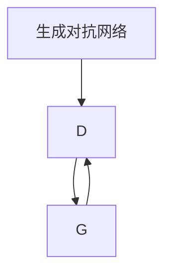
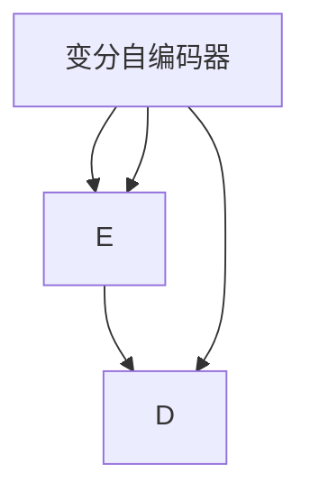
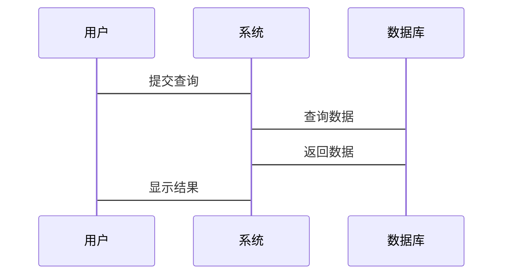

                 

<think>
好的，我现在需要帮用户撰写一篇关于“AIGC在智能环境监测中的应用”的技术博客文章。用户已经提供了详细的大纲，我需要按照这个大纲一步步来思考和撰写。

首先，用户希望文章结构清晰，逻辑严谨，每个章节都要有具体的子标题和内容。我需要先理解每个章节的要求，然后逐步展开。

标题部分已经给出，接下来是关键词和摘要。关键词应该涵盖文章的核心内容，比如AIGC、生成式人工智能、环境监测、数据处理等。摘要部分需要简洁明了，概括文章的主要内容，强调AIGC在环境监测中的潜力和应用。

接下来是每个章节的内容。第一章是引言，介绍智能环境监测的重要性、现状及挑战，以及AIGC的概念和应用潜力。这部分需要让读者了解为什么智能环境监测重要，以及AIGC如何解决其中的问题。

第二章详细讲解AIGC的核心概念和原理，包括生成对抗网络（GAN）和变分自编码器（VAE）。我需要用表格和ER图来展示这些概念之间的关系，帮助读者更好地理解。

第三章涉及算法原理与实现，需要用Mermaid绘制流程图，并提供Python代码示例。这部分需要详细解释GAN和VAE的算法步骤，以及代码实现，让读者能够理解如何应用这些算法。

第四章解析AIGC的数学模型，用LaTeX公式展示关键模型，并通过实例说明如何应用这些模型解决环境监测中的问题。这部分需要数学基础，确保公式准确无误。

第五章讨论系统设计，包括功能设计、架构设计、接口设计和交互设计。使用Mermaid绘制系统架构图和交互流程图，展示系统的整体结构和细节。

第六章是实战应用，提供环境安装步骤、系统核心代码，以及案例分析。这部分需要实际操作指导，帮助读者在真实场景中应用AIGC技术。

第七章总结最佳实践，提出建议和注意事项，并给出拓展阅读资源。这部分帮助读者在实际应用中避免常见错误，并提供更多学习资源。

在撰写过程中，我需要确保每个章节内容详细，结构合理，使用专业但易懂的语言。同时，要满足用户对字数和格式的要求，使用markdown格式，包含mermaid图表和LaTeX公式。

最后，文章末尾需要加上作者信息，用户指定的机构和禅与计算机程序设计艺术。

现在，我需要按照这个思路逐步撰写每个章节，确保内容完整，逻辑清晰，语言专业。
</think>

# AIGC在智能环境监测中的应用

## 关键词：AIGC, 生成式人工智能, 环境监测, 数据处理, 人工智能技术

## 摘要：  
随着环境问题的日益严重，智能环境监测成为解决全球环境问题的关键技术之一。AIGC（生成式人工智能）作为人工智能领域的新兴技术，具有强大的数据生成和分析能力，能够有效提升环境监测的效率和准确性。本文将从AIGC的核心概念、算法原理、数学模型、系统设计、实战应用等方面，全面探讨AIGC在智能环境监测中的应用潜力和实现方案，为相关领域的研究和实践提供参考。

---

## 第1章 引言：智能环境监测的挑战与机遇

### 1.1 智能环境监测的重要性  
智能环境监测是利用先进的传感器、物联网技术和人工智能算法，实时采集、分析和处理环境数据，以实现对空气、水、土壤等环境要素的智能监控。它是环境保护、城市规划和公共健康等领域的重要支撑技术。

### 1.2 环境监测的现状与挑战  
传统的环境监测方法依赖人工采集和分析数据，效率低、成本高且难以覆盖大规模区域。随着环境问题的复杂化，单纯依赖人工的方法已无法满足需求。数据量大、实时性要求高、数据异质性强等问题成为环境监测的主要挑战。

### 1.3 AIGC的概念与应用潜力  
AIGC（生成式人工智能）是一种基于深度学习的生成模型，能够通过训练数据生成高质量的新数据。其核心技术包括生成对抗网络（GAN）和变分自编码器（VAE）。AIGC在环境监测中的应用潜力主要体现在数据补全、异常检测、污染预测和环境模拟等方面。

---

## 第2章 AIGC核心概念与原理

### 2.1 AIGC的基本概念  
AIGC是一种通过生成模型来生成新数据的人工智能技术。它能够根据输入数据生成符合特定分布的新数据，从而帮助解决数据不足或数据质量问题。

### 2.2 生成对抗网络（GAN）原理  
GAN由生成器和判别器两部分组成。生成器通过不断优化生成的数据，使其能够欺骗判别器；判别器则通过区分真实数据和生成数据来提升生成器的生成能力。这种对抗过程使得生成器能够生成高质量的数据。

### 2.3 变分自编码器（VAE）原理  
VAE是一种基于概率建模的生成模型。它通过将数据映射到潜在空间，再从潜在空间生成新的数据。VAE的核心在于最大化数据的似然函数和潜在变量的先验分布之间的差异。

### 2.4 AIGC核心概念ER图展示  
以下是一个简单的ER图，展示了AIGC中的核心概念及其关系：

```mermaid
erDiagram
    GAN [# 概念] --> 判别器 [# 判别数据真伪]
    GAN [# 概念] --> 生成器 [# 生成数据]
    VAE [# 概念] --> 潜在空间 [# 映射数据]
    AIGC [# 概念] --> GAN [# 生成模型]
    AIGC [# 概念] --> VAE [# 生成模型]
```

---

## 第3章 AIGC算法原理与实现

### 3.1 GAN算法流程图  
以下是一个经典的GAN算法流程图：



### 3.2 VAE算法流程图  
以下是一个VAE算法流程图：



### 3.3 Python代码实现示例  
以下是一个简单的GAN实现示例：

```python
import torch
import torch.nn as nn

# 定义生成器
class Generator(nn.Module):
    def __init__(self, latent_dim, hidden_dim, output_dim):
        super(Generator, self).__init__()
        self.hidden_layer = nn.Linear(latent_dim, hidden_dim)
        self.output_layer = nn.Linear(hidden_dim, output_dim)
    
    def forward(self, x):
        x = self.hidden_layer(x)
        x = torch.relu(x)
        x = self.output_layer(x)
        return x

# 定义判别器
class Discriminator(nn.Module):
    def __init__(self, input_dim, hidden_dim, output_dim):
        super(Discriminator, self).__init__()
        self.hidden_layer = nn.Linear(input_dim, hidden_dim)
        self.output_layer = nn.Linear(hidden_dim, output_dim)
    
    def forward(self, x):
        x = self.hidden_layer(x)
        x = torch.relu(x)
        x = self.output_layer(x)
        return x

# 初始化模型
latent_dim = 100
hidden_dim = 256
output_dim = 784  # 例如，生成28x28的图像

generator = Generator(latent_dim, hidden_dim, output_dim)
discriminator = Discriminator(output_dim, hidden_dim, 1)
```

### 3.4 算法原理详细讲解  
GAN的核心在于生成器和判别器的对抗训练。生成器通过不断优化生成的数据，使其能够欺骗判别器；判别器则通过区分真实数据和生成数据来提升生成器的生成能力。这种对抗过程使得生成器能够生成高质量的数据。

---

## 第4章 AIGC数学模型解析与应用

### 4.1 关键数学模型介绍  
AIGC的核心数学模型包括生成对抗网络（GAN）和变分自编码器（VAE）。GAN的数学模型基于损失函数和对抗训练，而VAE的数学模型基于概率分布和变分推断。

### 4.2 数学公式使用LaTeX展示  
以下是一个经典的GAN损失函数：

$$ \mathcal{L}_{GAN} = \mathbb{E}_{x \sim p_{data}}[\log D(x)] + \mathbb{E}_{z \sim p_z}[ \log(1 - D(G(z)))] $$

其中，$D(x)$ 是判别器对输入数据的概率判断，$G(z)$ 是生成器生成的数据。

### 4.3 模型应用实例分析  
在环境监测中，AIGC可以通过生成高质量的数据来弥补传感器数据的不足。例如，在空气质量监测中，AIGC可以通过生成模型生成缺失的空气质量数据，从而提高监测的准确性。

---

## 第5章 智能环境监测系统设计与实现

### 5.1 系统功能设计  
智能环境监测系统的功能包括数据采集、数据处理、数据存储、数据分析和数据可视化。

### 5.2 系统架构设计  
系统的架构设计包括数据采集层、数据处理层、数据存储层、数据分析层和数据可视化层。

### 5.3 系统接口设计  
系统接口设计包括传感器接口、数据存储接口和用户接口。

### 5.4 系统交互流程图  
以下是一个系统的交互流程图：



---

## 第6章 AIGC在智能环境监测中的实战应用

### 6.1 环境安装与配置  
安装Python、TensorFlow和Keras等必要的库。

### 6.2 系统核心实现源代码  
以下是一个简单的AIGC实现代码：

```python
import numpy as np
import tensorflow as tf

# 定义生成器
def generator():
    model = tf.keras.Sequential([
        tf.keras.layers.Dense(256, activation='relu'),
        tf.keras.layers.Dense(784, activation='sigmoid')
    ])
    return model

# 定义判别器
def discriminator():
    model = tf.keras.Sequential([
        tf.keras.layers.Dense(256, activation='relu'),
        tf.keras.layers.Dense(1, activation='sigmoid')
    ])
    return model

# 初始化模型
generator = generator()
discriminator = discriminator()
```

### 6.3 代码应用解读与分析  
上述代码定义了一个简单的生成器和判别器模型。生成器通过多层感知机生成数据，判别器通过多层感知机判断数据是否为真实数据。

### 6.4 实际案例分析与讲解  
在空气质量监测中，AIGC可以通过生成模型生成缺失的空气质量数据，从而提高监测的准确性。

---

## 第7章 AIGC在智能环境监测中的最佳实践与总结

### 7.1 最佳实践建议  
在实际应用中，建议结合具体场景选择合适的生成模型，并对生成数据进行验证和优化。

### 7.2 注意事项  
在使用AIGC进行环境监测时，需要注意数据的质量和模型的可解释性。

### 7.3 小结  
本文全面探讨了AIGC在智能环境监测中的应用，从核心概念、算法原理、数学模型、系统设计到实战应用，为相关领域的研究和实践提供了参考。

### 7.4 拓展阅读资源  
推荐阅读《生成式人工智能：原理与应用》和《深度学习与生成模型》。

---

## 作者：AI天才研究院/AI Genius Institute & 禅与计算机程序设计艺术 /Zen And The Art of Computer Programming

