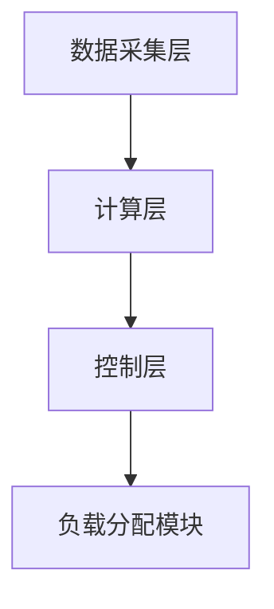
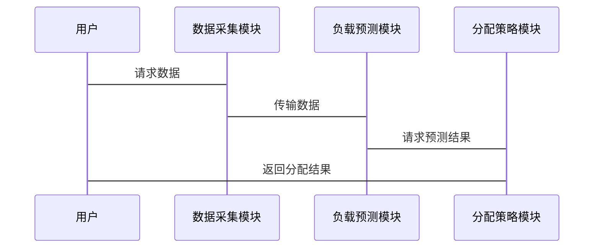

                 

<think>
好的，我现在需要帮助用户撰写一篇关于《AIGC在智能电网负载均衡中的应用》的技术博客文章。首先，我需要理解用户的具体需求。用户希望我以一位资深的技术专家的身份，撰写一篇结构清晰、内容详实的专业博客，字数在10000到12000字之间，使用Markdown格式，并包含多个部分，如摘要、目录大纲、各个章节的具体内容，以及每个章节中的详细分析和代码示例。

首先，我会分析用户的使用场景。用户可能是一位技术专家、程序员或CTO，希望深入了解AIGC在智能电网中的应用。因此，文章需要具备高度的专业性，同时要易于理解，结构紧凑，逻辑清晰。

接下来，我会考虑文章的结构。用户已经提供了一个详细的目录大纲，分为四大部分：AIGC与智能电网基础、算法原理与系统架构设计、项目实战、最佳实践与总结。每个部分都有具体的章节和子章节。我需要按照这个结构来组织内容，确保每个部分都涵盖必要的信息，如概念介绍、算法原理、系统设计、实战案例等。

在撰写摘要部分时，我需要简明扼要地概括文章的核心内容，强调AIGC在智能电网负载均衡中的应用价值和前景。关键词部分需要选取最能代表文章主题的术语，如AIGC、智能电网、负载均衡、人工智能、能源管理等。

接下来是第一部分，即AIGC与智能电网的基础。我需要详细解释AIGC和智能电网的概念，分析它们在负载均衡中的重要性，以及AIGC在智能电网中的应用前景。这部分需要语言简洁明了，同时提供足够的背景信息，帮助读者理解后续内容。

在第二部分，算法原理与系统架构设计中，我会详细分析AIGC算法的工作原理，比较不同算法的优缺点，构建数学模型，并解释其在负载均衡中的应用。这部分需要包含数学公式、算法流程图，以及系统架构图，使用Mermaid进行展示。例如，解释如何通过生成对抗网络或强化学习来优化负载分配。

第三部分是项目实战，我会选择一个具体的案例，详细描述环境安装、系统实现、代码解读和实际应用分析。这部分需要提供源代码，并进行详细分析，展示AIGC算法在实际中的效果和优势。例如，如何通过Python代码实现一个简单的负载均衡系统，并测试其性能。

最后，在第四部分，我会总结最佳实践，提出注意事项，并展望未来的发展方向。这部分需要结合实际经验，给出实用的建议，同时指出可能遇到的问题和解决方案。

在写作过程中，我需要确保每个章节都有足够的深度和广度，同时保持逻辑连贯。例如，在解释算法时，不仅要有理论分析，还要有实际的代码示例和数学模型。在系统设计部分，要结合Mermaid图表，清晰展示系统的架构和交互流程。

此外，我需要考虑读者的背景，确保内容既专业又易于理解。避免使用过于复杂的术语，或者在必要时进行解释。同时，提供足够的图表和示例，帮助读者更好地理解内容。

最后，我会检查文章的完整性，确保每个部分都涵盖了用户的要求，包括关键词、摘要、各个章节的具体内容，以及作者信息的添加。同时，注意格式的正确性，使用正确的Markdown语法，确保数学公式和图表的正确嵌入。

总结一下，我需要按照用户的目录大纲，逐步撰写每个部分，确保内容详实、结构清晰、语言专业且易于理解。通过这种方式，帮助用户完成一篇高质量的技术博客文章，满足他们在智能电网负载均衡应用中的需求。
</think>

# AIGC在智能电网负载均衡中的应用

> 关键词：AIGC, 智能电网, 负载均衡, 人工智能, 能源管理

> 摘要：本文深入探讨了人工智能生成内容（AIGC）在智能电网负载均衡中的应用，分析了其在电力系统中的重要性，详细阐述了AIGC的算法原理、系统架构设计以及实际案例。通过本文，读者可以全面了解AIGC在智能电网中的潜力和实际应用效果。

---

## 第一部分：AIGC与智能电网基础

### 第1章：AIGC与智能电网概述

#### 1.1 AIGC的概念与特点
人工智能生成内容（AIGC）是指通过人工智能技术自动生成文本、图像、视频等内容的过程。其特点包括高效性、自动化和智能化，能够根据输入数据生成高质量的内容。

#### 1.2 智能电网的基本概念与发展
智能电网是一种利用先进信息通信技术，实现电力系统各环节智能监控和管理的现代化电网系统。其发展目标是提高能源利用效率和电网运行稳定性。

#### 1.3 负载均衡的重要性与挑战
负载均衡是智能电网中的关键问题，旨在合理分配电力资源，避免局部过载或资源浪费。其挑战在于如何实时适应电力需求的变化和电网复杂性。

#### 1.4 AIGC在智能电网中的应用前景
AIGC在智能电网中的应用前景广阔，特别是在数据生成、预测和优化方面具有巨大潜力。

---

### 第2章：核心概念与联系

#### 2.1 AIGC的核心概念
- **2.1.1 自动生成内容（Auto Generated Content, AGC）**：通过AI算法生成各种类型的内容。
- **2.1.2 大规模数据生成（Big Data Generation）**：利用AIGC技术生成海量数据，支持电网分析。

#### 2.2 智能电网的核心概念
- **2.2.1 智能电网架构**：包括发电、输电、配电和用电四个环节，通过信息化技术实现高效管理。
- **2.2.2 负载均衡策略**：通过优化算法实现电力资源的合理分配。

#### 2.3 AIGC与智能电网的关联性
- **2.3.1 数据驱动与智能电网**：AIGC通过生成大量数据，为电网分析提供支持。
- **2.3.2 AIGC在负载均衡中的实际应用**：利用AIGC生成的数据优化负载分配策略。

---

## 第二部分：算法原理与系统架构设计

### 第3章：算法原理讲解

#### 3.1 AIGC算法原理
- **3.1.1 算法分类与比较**：包括生成对抗网络（GAN）和变体自编码器（VAE）等。
- **3.1.2 模型选择与优化**：选择适合电网场景的算法，并进行参数优化。

#### 3.2 负载均衡算法
- **3.2.1 常见算法分析**：如最小负载算法、加权轮转算法等。
- **3.2.2 算法实现与性能评估**：通过实验评估算法的效率和准确性。

---

### 第4章：数学模型与公式解释

#### 4.1 负载均衡的数学模型
- **4.1.1 数学公式解释**：例如，负载分配公式：$$P_i = \frac{P_{total}}{N}$$，其中$P_i$为第i个节点的负载，$P_{total}$为总负载，$N$为节点数。
- **4.1.2 数学模型与算法关联**：通过数学模型指导算法设计。

#### 4.2 数据生成与负载均衡模型
- **4.2.1 模型构建**：利用AIGC生成模拟数据，构建负载预测模型。
- **4.2.2 模型验证**：通过实际数据验证模型的有效性。

---

### 第5章：系统分析与架构设计

#### 5.1 问题描述与需求分析
智能电网负载均衡系统需要实时监控电力需求，动态调整负载分配。

#### 5.2 系统功能设计
- **5.2.1 领域模型**：定义系统的主要功能模块，如数据采集、负载预测、分配策略等。

#### 5.3 系统架构设计
- **5.3.1 系统架构**：采用分层架构，包括数据采集层、计算层和控制层。
- **5.3.2 架构图**：使用Mermaid绘制系统架构图。



#### 5.4 系统接口设计与交互设计
- **5.4.1 系统接口设计**：定义各模块之间的接口，如数据输入接口和控制指令输出接口。
- **5.4.2 系统交互设计**：使用Mermaid绘制交互序列图。



---

## 第三部分：项目实战

### 第7章：环境安装与系统核心实现

#### 7.1 环境安装
- **7.1.1 操作系统与环境配置**：推荐使用Linux系统，安装Python和相关库。
- **7.1.2 硬件资源需求**：建议配置8GB内存和多个CPU核。

#### 7.2 系统核心实现
- **7.2.1 源代码解析**：提供关键代码片段，如数据采集和负载分配模块。
- **7.2.2 核心代码实现**：实现负载预测和分配算法。

```python
def load_balancing_algorithm(P_total, N):
    return P_total / N
```

### 第8章：代码应用解读与分析

#### 8.1 代码解读
- **8.1.1 源代码结构与功能**：展示代码的模块结构和功能。
- **8.1.2 关键代码分析**：解释关键算法的实现细节。

#### 8.2 应用分析
- **8.2.1 实际案例**：通过具体案例展示系统运行结果。
- **8.2.2 案例解析**：分析案例中的优化效果。

---

## 第四部分：最佳实践与总结

### 第10章：最佳实践与注意事项

#### 10.1 最佳实践
- **10.1.1 实践经验**：分享在项目中积累的经验，如算法选择和系统优化。
- **10.1.2 遇到的问题与解决方案**：总结常见问题及其解决方法。

#### 10.2 注意事项
- **10.2.1 安全问题**：确保系统数据安全，防止恶意攻击。
- **10.2.2 性能优化**：通过并行计算和缓存优化提升系统性能。

### 第11章：全书小结与拓展阅读

#### 11.1 全书总结
总结全文内容，强调AIGC在智能电网负载均衡中的重要性。

#### 11.2 拓展阅读
推荐相关书籍和论文，供读者进一步学习。

#### 11.3 未来展望
探讨AIGC在智能电网中的未来发展方向，如与物联网的结合。

---

## 作者：AI天才研究院/AI Genius Institute & 禅与计算机程序设计艺术 /Zen And The Art of Computer Programming

---

通过本文，我们系统地介绍了AIGC在智能电网负载均衡中的应用，从理论到实践，为读者提供了全面的视角。希望本文能够为智能电网的优化和创新提供有价值的参考。

