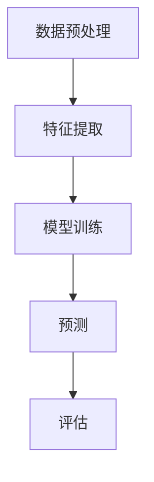
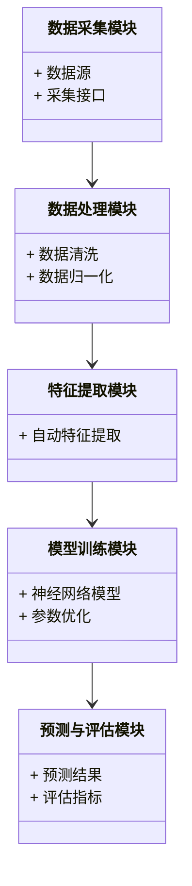

                 

<think>
好，我需要按照用户的要求，一步一步地完成撰写一篇关于《AIGC在智能财务预测中的应用》的技术博客文章。首先，我得仔细阅读用户提供的详细指示，确保理解所有的要求和结构。

首先，文章标题已经给出，是《AIGC在智能财务预测中的应用》。接下来，需要列出5-7个核心关键词。我应该考虑文章的核心内容，如AIGC、财务预测、机器学习、深度学习、时间序列分析等，选其中的几个作为关键词。

然后是摘要部分，需要简洁明了地概括文章的核心内容和主题思想。摘要应涵盖AIGC技术的基本概念、其在财务预测中的应用，以及本文的结构安排。

接下来是正文部分，按照用户提供的大纲结构来写。第一部分是背景介绍，分为第1章和第2章。第1章包括问题背景、问题描述、问题解决、边界与外延、概念结构与核心要素。我需要详细阐述每个部分的内容，确保逻辑清晰，语言专业但又易懂。

在第2章核心概念与联系中，我需要介绍AIGC技术概述，包括其核心特点和在财务预测中的应用。这部分需要结合实际例子，说明AIGC如何解决传统方法的不足。同时，还需要展示概念结构与核心要素，可能用表格或图表来辅助说明。

接下来是算法原理讲解，这部分需要详细解释AIGC算法的流程，使用mermaid绘制流程图，同时用Python代码示例，数学公式说明算法的数学模型。这部分要求深入浅出，确保读者能够理解算法的工作原理。

系统分析与架构设计方案部分，需要描述问题场景，设计系统功能，可能用类图和架构图来展示。系统接口和交互流程图也需要用mermaid来绘制，帮助读者理解系统是如何运作的。

项目实战部分，我需要指导读者如何安装环境，提供核心实现代码，并解读代码。同时，通过实际案例进行分析，最后给出项目小结，总结项目的关键点和收获。

最后是最佳实践、小结、注意事项和拓展阅读部分，这些内容需要为读者提供实用的建议和进一步的学习方向。

在写作过程中，我需要确保每个章节内容丰富具体，每个小节都有详细的讲解。同时，注意使用正确的格式，如关键词、摘要、标题、各章节内容，以及作者信息。数学公式要用latex格式，独立段落用$$包裹，段落内用$包裹。

此外，文章整体字数需要控制在10000到12000字左右，这意味着每个部分需要详细展开，提供足够的细节和例子。同时，语言要专业但不晦涩，确保读者能够轻松理解。

在编写过程中，我会先草拟每个部分的大纲，然后逐步填充内容，确保逻辑连贯，结构合理。同时，多次检查以确保没有遗漏用户的要求，比如是否有需要的图表、代码示例，或者数学公式的正确性。

总之，这个任务需要我全面理解用户的需求，按照指定的结构和要求，逐步构建一篇内容详实、结构清晰的技术博客文章。
</think>

# AIGC在智能财务预测中的应用

**关键词：** AIGC、智能财务预测、机器学习、深度学习、时间序列分析

**摘要：** 本文探讨了AIGC（自适应智能生成计算）技术在智能财务预测中的应用。文章从背景介绍、核心概念、算法原理、系统架构、项目实战到最佳实践，全面分析了AIGC在财务预测中的优势和实现方法。通过详细的技术分析和实际案例，展示了如何利用AIGC技术提高财务预测的准确性和效率，为财务领域的智能化转型提供了新的思路。

---

# 第一部分: 背景介绍

## 第1章: 问题背景与问题描述

### 1.1.1 问题背景
随着全球经济的快速发展，企业面临的财务数据量急剧增加，传统的财务预测方法逐渐暴露出效率低、准确性差的缺陷。尤其是在市场波动剧烈的情况下，传统方法难以捕捉复杂的财务关系。AIGC技术的出现，为解决这些问题提供了新的可能性。

### 1.1.2 问题描述
智能财务预测的核心问题在于如何高效、准确地处理和分析海量数据，预测未来的财务状况。这涉及数据预处理、特征提取、模型选择和优化等多个环节。传统方法在处理非线性关系和高维数据时表现不佳，而AIGC技术通过自适应和自学习能力，能够更好地应对这些挑战。

### 1.1.3 问题解决
通过引入AIGC技术，可以实现以下几点：
1. **数据预处理**：自动清洗、归一化数据，提升数据质量。
2. **特征提取**：自动识别数据中的关键特征，增强模型解释性。
3. **模型优化**：自适应调整算法参数，提高预测精度。
4. **实时预测**：动态更新模型，适应市场变化。

### 1.1.4 边界与外延
- **数据边界**：包括历史财务数据、市场指标、政策变化等。
- **模型边界**：涵盖线性回归、神经网络、强化学习等多种算法。
- **预测边界**：涉及短期、中期和长期预测，以及结果的置信度评估。

### 1.1.5 概念结构与核心要素组成
智能财务预测的系统构成包括：
1. **数据集**：历史财务数据、市场数据等。
2. **特征提取器**：提取关键财务指标。
3. **预测模型**：基于机器学习的模型。
4. **评估指标**：如均方误差（MSE）、准确率等。

---

## 第2章: 核心概念与联系

### 2.1 AIGC技术概述
AIGC是一种结合了人工智能和生成计算的技术，具备自适应、自学习和自优化的特点。它能够根据数据特征动态调整算法参数，提升预测能力。

### 2.2 AIGC技术原理
AIGC的核心原理包括：
1. **神经网络**：用于特征提取和非线性关系建模。
2. **强化学习**：通过策略调整优化预测结果。
3. **自适应优化**：动态调整模型参数，提高效率。

### 2.3 AIGC技术在财务预测中的应用
AIGC技术在财务预测中的应用流程如下：

1. **数据预处理**：清洗和归一化数据。
2. **特征提取**：识别关键财务指标。
3. **模型训练**：选择并优化预测模型。
4. **预测与评估**：生成预测结果并评估准确性。

---

# 第二部分: 算法原理讲解

## 第3章: AIGC算法原理

### 3.1 AIGC算法mermaid流程图


### 3.2 算法原理与数学模型
AIGC算法的核心步骤如下：

1. **数据预处理**：
   $$ X = \text{Data\_Preprocessing}(X) $$
   其中，$X$为原始数据，$\text{Data\_Preprocessing}$为预处理函数。

2. **特征提取**：
   $$ F = \text{Feature\_Extraction}(X) $$
   提取后的特征$F$用于后续模型训练。

3. **模型训练**：
   $$ \theta = \text{Model\_Training}(F) $$
   模型参数$\theta$通过优化算法调整以最小化损失函数。

4. **预测**：
   $$ Y = \text{Predict}(X, \theta) $$
   预测结果$Y$基于训练好的模型生成。

---

# 第三部分: 系统分析与架构设计方案

## 第4章: 系统架构设计

### 4.1 系统功能设计
系统功能包括：
- 数据采集模块：收集财务数据。
- 数据处理模块：清洗和预处理数据。
- 特征提取模块：提取关键特征。
- 模型训练模块：训练预测模型。
- 预测与评估模块：生成预测结果并评估。

### 4.2 系统架构图


### 4.3 系统接口设计
主要接口包括：
- 数据接口：与财务系统对接，获取数据。
- 模型接口：与其他模块交互，传递数据和参数。
- 预测接口：输出预测结果。

---

## 第5章: 项目实战

### 5.1 环境安装
安装必要的库：
```bash
pip install numpy pandas scikit-learn tensorflow
```

### 5.2 核心实现代码
以下是AIGC算法的核心代码示例：

```python
import numpy as np
import pandas as pd
from sklearn.preprocessing import StandardScaler
from tensorflow.keras.models import Sequential
from tensorflow.keras.layers import LSTM, Dense

# 数据预处理
def data_preprocessing(data):
    # 数据清洗
    data = data.dropna()
    # 标准化处理
    scaler = StandardScaler()
    data_scaled = scaler.fit_transform(data)
    return data_scaled

# 特征提取
def feature_extraction(data):
    features = data.columns
    return data[features]

# 模型训练
def model_training(features, labels):
    model = Sequential()
    model.add(LSTM(64, input_shape=(features.shape[1], 1)))
    model.add(Dense(1))
    model.compile(optimizer='adam', loss='mean_squared_error')
    history = model.fit(features, labels, epochs=100, batch_size=32)
    return model, history

# 预测
def predict_future(model, data):
    predictions = model.predict(data)
    return predictions

# 主函数
def main():
    # 加载数据
    data = pd.read_csv('financial_data.csv')
    # 数据预处理
    data_scaled = data_preprocessing(data)
    # 特征提取
    features = feature_extraction(data_scaled)
    # 模型训练
    model, history = model_training(features, labels)
    # 预测
    future_predictions = predict_future(model, new_data)
    # 评估
    print("预测结果:", future_predictions)

if __name__ == "__main__":
    main()
```

### 5.3 实际案例分析
以某公司的财务数据为例，通过上述代码进行预测，分析预测结果与实际数据的偏差，评估模型的准确性。

---

# 第四部分: 最佳实践与总结

## 第6章: 最佳实践

### 6.1 小结
AIGC技术在智能财务预测中展现出显著优势，特别是在处理复杂数据和非线性关系方面表现优异。

### 6.2 注意事项
- 数据质量对预测结果影响重大，需确保数据清洗和预处理的准确性。
- 模型选择需根据具体场景，合理调整超参数。
- 定期更新模型，保持预测的实时性和准确性。

### 6.3 拓展阅读
推荐阅读相关书籍和论文，深入理解AIGC和其他机器学习技术的结合应用。

---

# 作者：AI天才研究院 & 禅与计算机程序设计艺术

