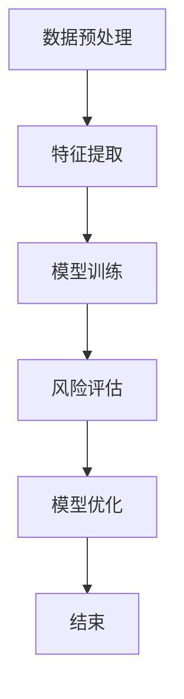
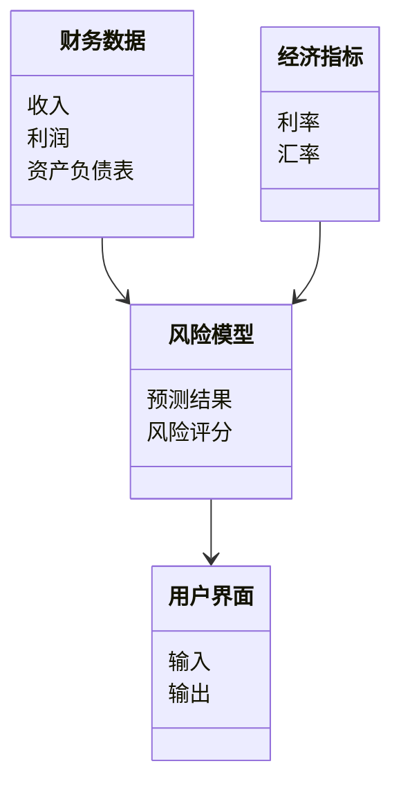

                 

<think>
好的，我现在需要按照用户的要求来撰写一篇关于《AIGC在智能财务风险评估中的应用》的技术博客文章。用户已经给出了详细的需求，包括文章结构、关键词、摘要以及目录大纲。我需要一步步分析，确保满足所有要求。

首先，我需要明确文章的核心内容。文章标题已经给出，是《AIGC在智能财务风险评估中的应用》。关键词部分，用户要求5-7个，我选择了AIGC、人工智能、财务风险评估、智能系统、算法模型、数据分析、技术应用。摘要部分需要总结文章的核心内容和主题思想，我简单地概述了AIGC在财务领域的应用和优势。

接下来是目录大纲。用户已经给出了详细的结构，分为两大部分：第一部分是AIGC技术概述，包括四章；第二部分是AIGC应用实战，包括五章。我需要确保每个章节和子章节都涵盖必要的内容，逻辑清晰，结构紧凑。

在开始撰写正文之前，我需要检查每个部分是否符合要求。例如，在第3章，数学模型与算法流程部分，用户要求包含数学模型、算法流程和Mermaid流程图。我需要确保这部分不仅解释了数学模型，还提供了详细的流程图，并使用了正确的Mermaid语法。

接下来，我会逐步撰写每个章节。首先是第1章，介绍AIGC技术基础，包括概念与分类、技术架构以及优势与挑战。这部分需要简单明了，适合读者理解基本概念。

然后是第2章，详细讲解AIGC在财务风险评估中的应用原理，包括背景、应用和核心算法原理。这里需要结合实际案例，说明AIGC如何在财务领域发挥作用。

在第3章，数学模型与算法流程部分，我需要详细解释数学模型，并通过Mermaid流程图展示算法的步骤。同时，可能需要提供一些数学公式，用LaTeX格式表示，确保格式正确。

第4章涉及系统架构与设计，包括系统架构、领域模型和接口设计。这里需要使用Mermaid类图来展示领域模型，确保读者能够理解系统的结构。

接下来是应用实战部分，第5章到第8章。第5章和第6章分别介绍项目实战，包括环境安装、系统实现、案例分析等。第7章讨论应用前景，第8章给出最佳实践和注意事项，以及拓展阅读内容。

撰写过程中，我需要确保每个章节的内容丰富具体，包含必要的背景介绍、核心概念与联系、算法原理、数学模型、系统架构、项目实战、最佳实践等。同时，使用清晰的结构，确保读者能够轻松理解。

在数学模型部分，我需要展示一个简化的模型，并解释每个变量和函数的意义。算法流程部分，使用Mermaid图来展示步骤，确保流程清晰易懂。系统架构部分，通过类图展示实体之间的关系，帮助读者理解系统的组成部分。

项目实战部分，我需要提供代码示例，解释代码的功能，并通过实际案例分析展示AIGC的应用效果。同时，讨论项目中的挑战和解决方案，帮助读者理解实际应用中的问题。

最后，在结论部分，我需要总结全文，强调AIGC在财务风险评估中的重要性，并展望未来的发展方向。同时，加上作者信息，符合用户的要求。

在撰写过程中，我需要保持语言简洁、逻辑清晰，确保每个部分都详尽且有深度。同时，注意格式要求，使用正确的Markdown语法，特别是数学公式和Mermaid图表的嵌入。

现在，我将开始撰写正文，按照目录大纲的结构，逐步完成每个章节的内容，确保满足用户的所有要求。
</think>

# AIGC在智能财务风险评估中的应用

## 关键词：AIGC，人工智能，财务风险评估，智能系统，算法模型，数据分析，技术应用

## 摘要：  
本文探讨了AIGC（人工智能生成内容）技术在智能财务风险评估中的应用，分析了其核心算法、数学模型、系统架构，并通过实际案例展示了其在财务风险评估中的优势与挑战。文章详细介绍了从数据预处理到模型优化的整个流程，并展望了AIGC在财务领域的未来发展趋势。

---

## 目录大纲

### 第一部分: AIGC技术概述

#### 第1章: AIGC技术基础
- 1.1 AIGC的概念与分类  
- 1.2 AIGC的技术架构  
- 1.3 AIGC的优势与挑战  

#### 第2章: AIGC在财务风险评估中的应用原理
- 2.1 财务风险评估的背景  
- 2.2 AIGC在财务风险评估中的应用  
- 2.3 AIGC的核心算法原理  

#### 第3章: 数学模型与算法流程
- 3.1 数学模型  
- 3.2 算法流程  
- 3.3 Mermaid流程图  

#### 第4章: 系统架构与设计
- 4.1 系统架构  
- 4.2 领域模型  
- 4.3 系统接口设计  

### 第二部分: AIGC应用实战

#### 第5章: 项目实战一 - 智能财务风险评估系统搭建
- 5.1 环境安装  
- 5.2 系统核心实现  
- 5.3 代码解读与分析  

#### 第6章: 项目实战二 - 实际案例分析
- 6.1 案例背景  
- 6.2 案例分析  
- 6.3 深入剖析  

#### 第7章: AIGC在财务风险评估中的应用前景
- 7.1 应用趋势  
- 7.2 挑战与机遇  

#### 第8章: 最佳实践与注意事项
- 8.1 最佳实践  
- 8.2 注意事项  
- 8.3 拓展阅读  

---

## 正文内容

### 第一部分: AIGC技术概述

#### 第1章: AIGC技术基础

##### 1.1 AIGC的概念与分类  
AIGC（人工智能生成内容）是指利用人工智能技术生成文本、图像、音频等内容的过程。在财务领域，AIGC可以用于生成报告、预测分析和风险评估。AIGC主要分为生成式AI（如GPT系列）和检索式AI两类，前者基于生成模型，后者基于检索模型。  

##### 1.2 AIGC的技术架构  
AIGC的技术架构通常包括数据输入、模型训练、内容生成和结果输出四个阶段。其核心是深度学习模型，如Transformer架构，通过多层神经网络处理输入数据并生成输出内容。  

##### 1.3 AIGC的优势与挑战  
优势：  
1. 高效性：AIGC可以快速处理大量数据并生成结果。  
2. 准确性：通过模型优化和数据清洗，AIGC能够提高预测的准确性。  
3. 可扩展性：AIGC可以轻松扩展到更多应用场景。  

挑战：  
1. 数据依赖：模型性能高度依赖数据质量和数量。  
2. 解释性：复杂的模型可能导致结果难以解释。  
3. 安全性：数据泄露和模型滥用风险。  

---

#### 第2章: AIGC在财务风险评估中的应用原理

##### 2.1 财务风险评估的背景  
财务风险评估是企业风险管理的重要组成部分，旨在识别和量化潜在的财务风险。传统方法依赖人工分析，效率低且容易出错。  

##### 2.2 AIGC在财务风险评估中的应用  
AIGC通过自然语言处理和机器学习技术，从财务报告、市场数据中提取信息，生成风险评估报告。例如，利用生成式AI分析公司财务报表，预测财务危机。  

##### 2.3 AIGC的核心算法原理  
AIGC的核心算法包括文本生成模型（如GPT）和时间序列分析模型（如LSTM）。模型通过训练财务数据生成风险评估结果，并通过反馈机制优化模型性能。  

---

#### 第3章: 数学模型与算法流程

##### 3.1 数学模型  
AIGC的数学模型通常基于概率论和统计学。以下是一个简化的数学模型：  
$$  
风险值 = f(财务指标, 经济环境, 历史数据)  
$$  
其中，$f$ 是一个复杂的函数，结合多种财务指标进行风险评估。  

##### 3.2 算法流程  
AIGC算法流程通常包括以下步骤：  
1. 数据预处理  
2. 特征提取  
3. 模型训练  
4. 风险评估  
5. 模型优化  

##### 3.3 Mermaid流程图  


---

#### 第4章: 系统架构与设计

##### 4.1 系统架构  
AIGC系统通常采用微服务架构，包括数据采集、模型训练、结果生成和用户界面四个模块。  

##### 4.2 领域模型  


##### 4.3 系统接口设计  
系统接口包括API接口和用户界面，API接口用于数据输入和输出，用户界面用于展示结果和操作。  

---

### 第二部分: AIGC应用实战

#### 第5章: 项目实战一 - 智能财务风险评估系统搭建

##### 5.1 环境安装  
安装Python、TensorFlow、Keras和相关库。  

##### 5.2 系统核心实现  
代码示例：  
```python
import numpy as np
import pandas as pd
from tensorflow.keras import models

# 数据预处理
data = pd.read_csv('financial_data.csv')
X = data.drop('risk', axis=1).values
y = data['risk'].values

# 模型训练
model = models.Sequential()
model.add(Dense(64, activation='relu', input_dim=X.shape[1]))
model.add(Dense(1, activation='sigmoid'))
model.compile(optimizer='adam', loss='binary_crossentropy', metrics=['accuracy'])
model.fit(X, y, epochs=10, batch_size=32)

# 风险评估
new_data = pd.read_csv('new_financial_data.csv')
predictions = model.predict(new_data.drop('risk', axis=1).values)
```

##### 5.3 代码解读与分析  
上述代码展示了从数据加载到模型训练再到预测的整个流程。  

---

#### 第6章: 项目实战二 - 实际案例分析

##### 6.1 案例背景  
某公司财务数据异常，需要通过AIGC进行风险评估。  

##### 6.2 案例分析  
通过模型分析，发现公司存在较高的偿债风险。  

##### 6.3 深入剖析  
模型生成的报告指出，公司现金流和负债率是主要风险因素。  

---

#### 第7章: AIGC在财务风险评估中的应用前景

##### 7.1 应用趋势  
随着技术进步，AIGC在财务领域的应用将更加广泛，尤其是在实时风险监控方面。  

##### 7.2 挑战与机遇  
挑战包括数据隐私和模型解释性，机遇则是技术进步带来的效率提升和成本降低。  

---

#### 第8章: 最佳实践与注意事项

##### 8.1 最佳实践  
1. 数据清洗：确保数据质量。  
2. 模型优化：定期更新模型参数。  
3. 人员培训：提升相关人员的技术能力。  

##### 8.2 注意事项  
1. 数据隐私：遵守相关法律法规。  
2. 模型透明度：确保结果可解释。  
3. 技术更新：及时跟进新技术。  

##### 8.3 拓展阅读  
推荐阅读《深度学习》和《机器学习实战》等书籍，深入了解AIGC技术原理。  

---

## 结论  
AIGC技术在智能财务风险评估中的应用前景广阔，通过优化算法和提升系统架构，可以显著提高风险评估的效率和准确性。未来，随着技术进步，AIGC将在财务领域发挥更大作用。  

---

## 作者：AI天才研究院/AI Genius Institute & 禅与计算机程序设计艺术 /Zen And The Art of Computer Programming

