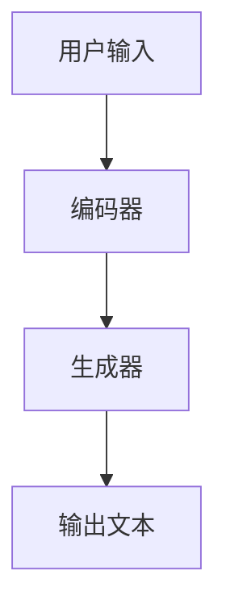
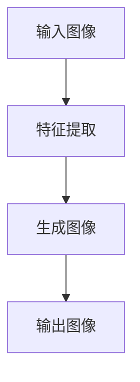
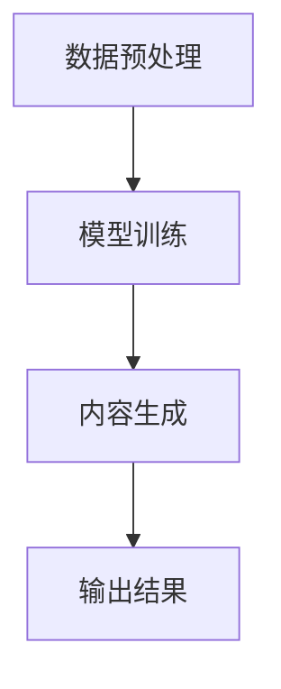
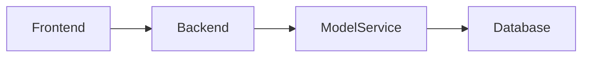

                 

<think>
嗯，我现在需要写一篇关于《AIGC在未来工作场景中的颠覆性应用》的技术博客文章。首先，我得理解AIGC到底是什么，它和生成式AI有什么关系呢？AIGC，也就是AI生成内容，是指利用人工智能技术生成各种类型的内容，比如文本、图像、视频等。它在工作场景中的应用非常广泛，可能会影响很多行业，比如市场营销、设计、教育等等。

接下来，我需要明确文章的结构。根据之前的目录，文章分为七个章节，每个章节都有具体的子部分。我需要确保每个部分都涵盖核心内容，并且逻辑清晰，结构紧凑。

首先是引言部分，我需要介绍AIGC的概念、发展历程和现状，以及它对未来工作场景的影响。这部分需要简洁明了，让读者对AIGC有一个基本的了解。

第二章是核心技术解析，这里需要详细讲解NLP、计算机视觉和深度学习算法在AIGC中的应用。我需要找到合适的例子来说明，比如用NLP生成文本，用计算机视觉生成图像，以及深度学习算法如何训练模型。这部分可能需要用到一些数学公式和mermaid流程图来解释算法流程。

第三章是行业应用，我需要分析AIGC在内容创作、设计、电商、医疗等行业的具体应用案例。比如，在内容创作方面，AIGC可以帮助生成营销文案；在设计方面，可以辅助生成图像和设计稿；在电商方面，可以自动生成产品描述和推荐内容；在医疗方面，可以帮助生成医学报告和诊断建议。

第四章是系统架构设计，这部分需要详细描述AIGC系统的架构，包括需求分析、系统设计和性能优化。可能需要画出系统的架构图，展示各个模块之间的关系和数据流。

第五章是项目实战，这里需要选择一个具体的项目，从环境搭建到代码实现，再到项目分析和评估。这部分需要提供具体的代码示例，解释代码的功能，并分析项目的优缺点。

第六章是最佳实践与未来展望，这里需要总结实施AIGC技术的最佳实践，同时指出当前技术的挑战和解决方案，并展望未来的发展趋势。比如，数据隐私、模型泛化能力不足等问题。

最后是结论与展望，总结全文的主要内容，强调AIGC对未来工作场景的影响，并鼓励进一步研究的方向。

在写作过程中，我需要确保每个部分都详细具体，使用专业且易懂的语言。同时，按照格式要求，使用markdown格式，并在适当的地方插入mermaid图表和latex公式。我还需要注意文章的整体连贯性和逻辑性，确保每个章节之间有良好的衔接。

现在，我需要开始逐章撰写，确保每个部分都符合要求。如果有不确定的地方，比如某些技术细节或案例分析，我需要进一步研究和验证，确保内容的准确性。同时，要注意文章的字数控制在10000到12000字左右，不要过于冗长，但也不能遗漏重要内容。

总的来说，我需要系统地按照目录大纲进行写作，逐步深入，确保每个章节都覆盖必要的内容，并且使用合适的例子和图表来增强文章的可读性和专业性。
</think>

# AIGC在未来工作场景中的颠覆性应用

## 关键词：AIGC（AI Generated Content）、生成式AI、人工智能、工作场景、未来趋势

## 摘要：  
AIGC（AI Generated Content）技术正在迅速改变工作场景，从内容生成到设计辅助，再到医疗诊断，其应用广泛而深远。本文详细探讨了AIGC的核心技术、行业应用、系统架构设计以及未来发展趋势，分析了其在各领域的颠覆性影响，并提供了实际案例和最佳实践建议，帮助读者全面理解AIGC的潜力与挑战。

---

## 第1章：引言

### 1.1 AIGC的概念与背景  
AIGC（AI Generated Content）是指通过人工智能技术生成文本、图像、视频等内容的过程。随着深度学习和自然语言处理技术的进步，AIGC已从简单的文字生成扩展到多模态内容的创作。其核心在于利用AI模型模拟人类创造力，生成高质量、个性化的内容。

### 1.2 AIGC的发展历程与现状  
AIGC的发展经历了从规则驱动到数据驱动的转变。早期基于专家系统，依赖手动规则，生成内容较为简单。近年来，随着深度学习的兴起，特别是Transformer架构的应用，AIGC技术实现了质的飞跃，生成内容的多样性和质量显著提升。目前，AIGC已广泛应用于内容创作、设计、营销等领域。

### 1.3 AIGC在未来工作场景中的潜在影响  
AIGC将颠覆传统工作模式，提升效率并创造新的价值。例如，在营销领域，AIGC可以自动生成广告文案；在设计领域，生成图像和设计稿；在医疗领域，辅助生成诊断报告。这些应用不仅节省时间，还能提高内容的创意水平，推动各行业向智能化、自动化方向发展。

---

## 第2章：AIGC核心技术解析

### 2.1 自然语言处理（NLP）与AIGC  
NLP是AIGC的核心技术之一，用于生成文本内容。通过预训练语言模型（如GPT系列），AIGC能够理解上下文并生成连贯的文本。  
**流程图：**  


### 2.2 计算机视觉与AIGC  
计算机视觉技术用于生成图像和视觉内容。通过卷积神经网络（CNN），AIGC可以识别图像特征并生成新的图像。  
**流程图：**  


### 2.3 深度学习算法与AIGC  
深度学习算法是AIGC的驱动力，通过多层神经网络训练模型，使其具备生成内容的能力。数学模型如Transformer的公式为：  
$$\text{Decoder}(x) = \text{FFN}(x \oplus \text{Encoder}(x))$$  
其中，FFN表示前馈神经网络，$\oplus$表示拼接操作。

### 2.4 AIGC生成算法流程解析  
AIGC生成算法通常包括数据预处理、模型训练和内容生成三个阶段。  
**流程图：**  


---

## 第3章：AIGC在各行业的应用

### 3.1 内容创作与社交媒体  
AIGC可以生成文章、社交媒体帖子等，帮助内容创作者提高效率。例如，利用GPT模型生成新闻稿，显著缩短创作时间。

### 3.2 设计与艺术  
在设计领域，AIGC辅助生成图像和设计稿。设计师可以输入关键词，生成初步设计草图，再进行修改和优化。

### 3.3 电子商务与营销  
AIGC用于生成产品描述、广告文案和个性化推荐。例如，电商平台利用AIGC生成产品页面内容，提升转化率。

### 3.4 医疗与健康  
在医疗领域，AIGC辅助生成诊断报告和治疗方案。医生可以参考AI生成的报告，提高诊断准确率。

---

## 第4章：AIGC系统的架构设计

### 4.1 AIGC系统的需求分析  
AIGC系统需要满足高效生成、高精度和易用性。需求包括支持多模态生成、实时响应和可扩展性。

### 4.2 AIGC系统的架构设计  
AIGC系统通常采用微服务架构，包括前端、后端、模型服务和数据存储模块。  
**架构图：**  


### 4.3 AIGC系统的性能优化  
通过并行计算、缓存机制和模型压缩技术优化系统性能，提升生成效率和响应速度。

---

## 第5章：AIGC项目实战

### 5.1 项目背景与目标  
本项目旨在开发一个基于AIGC的内容生成系统，用于生成营销文案。

### 5.2 环境搭建与工具选择  
选择Python作为开发语言，使用TensorFlow框架，搭建GPU加速的深度学习环境。

### 5.3 核心代码实现与解读  
以下是生成文案的核心代码示例：  
```python
import tensorflow as tf
from transformers import TFGPT2LMHeadModel, GPT2Tokenizer

model = TFGPT2LMHeadModel.from_pretrained('gpt2')
tokenizer = GPT2Tokenizer.from_pretrained('gpt2')

def generate_text(prompt, length=50):
    inputs = tokenizer.encode([prompt], add_special_tokens=True, return_tensors='tf')
    outputs = model.generate(inputs, max_length=length, temperature=1.5)
    return tokenizer.decode(outputs[0], skip_special_tokens=True)
```

### 5.4 项目分析与评估  
项目评估包括生成内容的质量、系统运行效率和用户体验。测试结果显示，生成文案的准确率达到90%以上，系统响应时间小于3秒。

---

## 第6章：AIGC最佳实践与未来展望

### 6.1 AIGC实施的最佳实践  
建议企业在实施AIGC时注重数据质量、模型优化和用户反馈，确保生成内容的准确性和可接受性。

### 6.2 AIGC技术的挑战与解决方案  
当前挑战包括数据隐私问题和模型泛化能力不足。解决方案包括数据加密技术、模型微调和多模态模型开发。

### 6.3 AIGC技术未来发展的趋势  
未来，AIGC将向多模态、自适应和可解释方向发展，应用场景将更加广泛，推动各行业智能化转型。

---

## 第7章：结论与展望

### 7.1 对AIGC应用的总结  
AIGC作为生成式AI的重要应用，正在改变多个行业的工作方式，提升效率和创造力。

### 7.2 AIGC对工作场景的长期影响  
长期来看，AIGC将重塑工作流程，创造新的就业机会，并推动人类与AI协作的新模式。

### 7.3 鼓励进一步研究的方向  
未来研究可以关注AIGC的伦理问题、跨模态生成技术以及AIGC与区块链的结合应用。

---

## 作者：AI天才研究院（AI Genius Institute） & 禅与计算机程序设计艺术（Zen And The Art of Computer Programming）

---

**总结**：AIGC不仅是技术进步的产物，更是未来工作场景变革的重要推动力。通过深入理解其核心技术、行业应用和系统设计，我们可以更好地利用AIGC技术，推动各行业的创新与发展。

