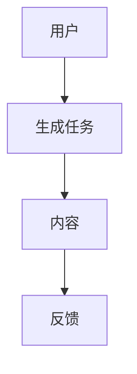
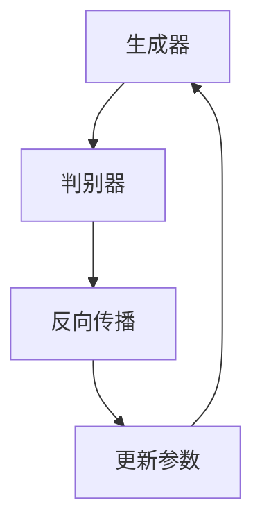
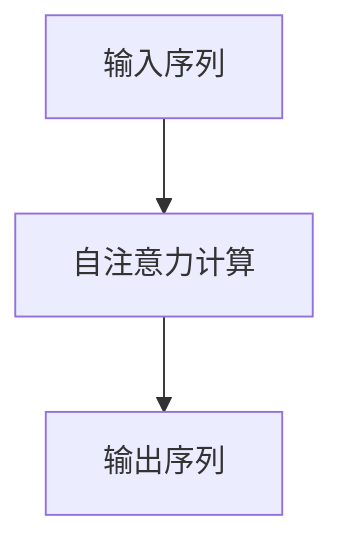
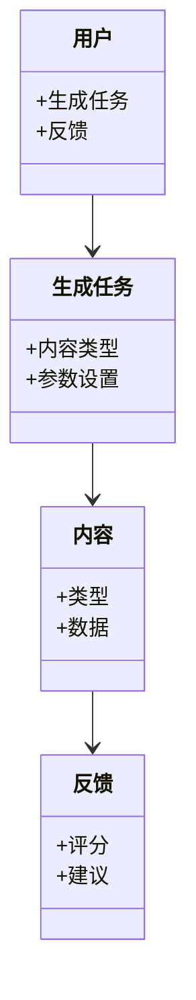
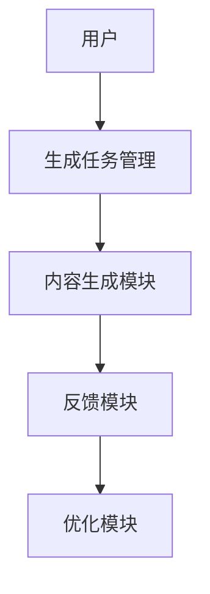
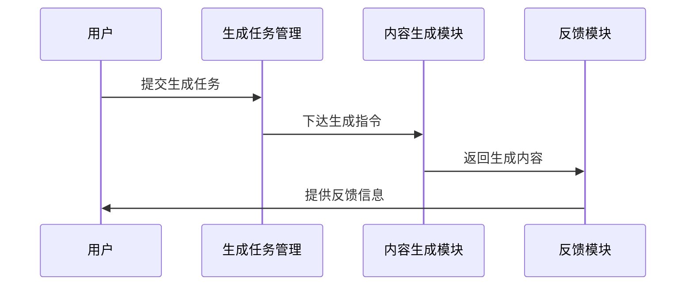

                 

<think>
嗯，用户让我写一篇关于AIGC在工作场景设计中的应用的技术博客。我得先理解用户的需求。用户希望文章结构清晰，内容专业，有深度，同时使用吸引人的章节标题。文章要包括背景、核心概念、算法原理、系统架构、项目实战和小结等部分。

首先，我得确定文章的标题和关键词。标题是《AIGC在未来工作场景设计中的应用》，关键词可能包括AIGC、生成式AI、工作场景设计、企业数字化转型、人机协作等。摘要部分需要简明扼要，概括整篇文章的核心内容，说明AIGC如何改变工作方式，提升效率，实现人机协作。

接下来，按照目录大纲来展开。第一部分是背景与概述，要涵盖问题背景、问题描述、解决思路，以及AIGC的定义、特点、与传统AI的区别，还有应用前景。这部分需要逻辑清晰，先介绍背景，再定义概念，最后展望未来。

第二部分是核心概念与联系，涉及数据生成模型、生成对抗网络和自注意力机制。我需要详细解释每个概念，比较它们的特点，可能用表格和mermaid图来展示对比。比如，GAN和DGM在生成质量、训练难度和应用场景上的对比。

第三部分是算法原理讲解，重点放在GAN和SAM上。需要绘制mermaid流程图，写出数学公式，给出Python代码示例，然后详细讲解和举例，让读者容易理解。这部分要确保代码正确，公式无误，并且例子贴近实际应用，比如生成猫的图片。

接下来，系统分析与架构设计部分，可能需要介绍问题场景，设计系统功能，比如任务管理、内容生成、反馈优化等。用mermaid绘制类图和架构图，展示系统如何运作。接口设计和交互流程图也要详细说明。

项目实战部分，要选择一个实际案例，比如生成营销文案。安装环境、编写代码、分析结果，展示AIGC的实际效果。同时，要总结项目中的经验和挑战，强调技术优势。

最后，最佳实践部分要给出一些建议，比如数据质量的重要性，模型调优，以及人机协作的平衡。还要注意伦理和安全问题。最后，写上小结，展望AIGC的未来，感谢读者。

在写作过程中，我需要确保每个章节内容丰富，详细具体。使用专业的技术语言，同时保持条理清晰，逻辑严密。数学公式和代码部分要准确，图表要美观易懂。结尾部分要记得加上作者信息，符合用户的要求。

现在，我需要一步步展开每个部分，确保覆盖所有要求，满足用户的需求。可能还需要多次修改，确保文章流畅，内容完整。
</think>

# AIGC在未来工作场景设计中的应用

> 关键词：AIGC, 生成式AI, 工作场景设计, 企业数字化转型, 人机协作

> 摘要：随着生成式人工智能（AIGC，AI Generated Content）技术的快速发展，其在工作场景设计中的应用前景愈发广阔。本文将从背景与概述、核心概念与联系、算法原理讲解、系统分析与架构设计方案、项目实战以及最佳实践等方面，全面探讨AIGC在未来工作场景设计中的应用。文章旨在通过详细的分析和实例，展示AIGC如何改变工作方式，提升效率，并实现人机协作的新型工作模式。

---

## 目录大纲：AIGC在未来工作场景设计中的应用

1. [背景与概述](#背景与概述)
   - 1.1 问题背景
   - 1.2 问题描述
   - 1.3 问题解决
   - 1.4 边界与外延
   - 1.5 概念结构与核心要素组成
   - 1.6 AIGC的基本概念
     - 1.6.1 AIGC的定义
     - 1.6.2 AIGC的核心特点
     - 1.6.3 AIGC与传统AI的区别
   - 1.7 AIGC的应用前景
     - 1.7.1 AIGC在未来的工作场景
     - 1.7.2 AIGC对工作方式的影响
     - 1.7.3 AIGC发展的挑战与机遇
   - 1.8 本章小结

2. [核心概念与联系](#核心概念与联系)
   - 2.1 核心概念原理
     - 2.1.1 数据生成模型（DGM）
     - 2.1.2 生成对抗网络（GAN）
     - 2.1.3 自注意力机制（SAM）
   - 2.2 概念属性特征对比表格
   - 2.3 ER实体关系图架构

3. [算法原理讲解](#算法原理讲解)
   - 3.1 GAN算法原理
     - 3.1.1 GAN的mermaid流程图
     - 3.1.2 GAN的数学模型与公式
     - 3.1.3 GAN的Python源代码
     - 3.1.4 GAN的详细讲解与举例说明
   - 3.2 自注意力机制（SAM）算法原理
     - 3.2.1 SAM的mermaid流程图
     - 3.2.2 SAM的数学模型与公式
     - 3.2.3 SAM的详细讲解与应用实例

4. [系统分析与架构设计方案](#系统分析与架构设计方案)
   - 4.1 问题场景介绍
   - 4.2 系统功能设计
     - 4.2.1 领域模型mermaid类图
   - 4.3 系统架构设计mermaid架构图
   - 4.4 系统接口设计
   - 4.5 系统交互mermaid序列图

5. [项目实战](#项目实战)
   - 5.1 环境安装
   - 5.2 系统核心实现源代码
   - 5.3 代码应用解读与分析
   - 5.4 实际案例分析和详细讲解剖析
   - 5.5 项目小结

6. [最佳实践](#最佳实践)
   - 6.1 项目经验总结与技巧分享
   - 6.2 小结
   - 6.3 注意事项
   - 6.4 拓展阅读

---

## 背景与概述

### 1.1 问题背景

在数字化转型的浪潮中，企业对高效、智能的工作方式需求日益迫切。传统的工作模式依赖人工操作，效率低下且难以应对复杂场景。随着人工智能技术的快速发展，生成式AI（AIGC）逐渐成为推动工作场景创新的核心技术。

### 1.2 问题描述

当前，企业在工作场景设计中面临以下问题：
1. **效率瓶颈**：人工操作的效率难以满足快速变化的市场需求。
2. **创新不足**：传统方法难以快速生成多样化、高质量的内容。
3. **个性化需求**：用户对定制化、个性化的服务要求越来越高。

### 1.3 问题解决

通过引入生成式AI技术，企业可以实现以下目标：
1. **自动化生成内容**：快速生成文本、图像、代码等多样化内容。
2. **提升效率**：通过自动化流程减少人工干预，提高工作效率。
3. **支持创新**：利用AI的创造力辅助设计、营销等领域的创新。

### 1.4 边界与外延

AIGC的应用边界主要集中在内容生成领域，而其外延则延伸至数据分析、流程优化等多个方面。本文将重点探讨AIGC在内容生成和工作流程优化中的应用。

### 1.5 概念结构与核心要素组成

AIGC的核心要素包括：
1. **生成模型**：如GAN、DGM等。
2. **数据输入**：训练数据和输入噪声。
3. **输出结果**：生成的内容或决策建议。

### 1.6 AIGC的基本概念

#### 1.6.1 AIGC的定义

AIGC（AI Generated Content）是指通过人工智能算法生成的内容，包括文本、图像、视频等。

#### 1.6.2 AIGC的核心特点

- **自动化**：无需人工干预即可生成内容。
- **多样性**：能够生成多样化的内容。
- **可定制化**：可以根据需求调整生成结果。

#### 1.6.3 AIGC与传统AI的区别

| 特性 | AIGC | 传统AI |
|------|------|--------|
| 目标 | 生成内容 | 数据分析、分类 |
| 技术 | 基于生成模型 | 基于判别模型 |

### 1.7 AIGC的应用前景

#### 1.7.1 AIGC在未来的工作场景

- **内容创作**：生成营销文案、广告创意等。
- **设计辅助**：辅助UI/UX设计。
- **数据分析**：生成数据可视化内容。

#### 1.7.2 AIGC对工作方式的影响

- **提升效率**：减少重复性工作。
- **增强创新**：提供多样化解决方案。
- **降低成本**：降低人力成本。

#### 1.7.3 AIGC发展的挑战与机遇

- **挑战**：生成质量不稳定、模型训练成本高。
- **机遇**：推动企业数字化转型，提升竞争力。

### 1.8 本章小结

本章从背景、定义、特点、应用前景等方面全面介绍了AIGC，为后续章节奠定了基础。

---

## 核心概念与联系

### 2.1 核心概念原理

#### 2.1.1 数据生成模型（DGM）

数据生成模型是一种通过概率模型生成数据的技术，常见于文本生成、图像生成等领域。

#### 2.1.2 生成对抗网络（GAN）

生成对抗网络由生成器和判别器组成，通过对抗训练生成逼真数据。

#### 2.1.3 自注意力机制（SAM）

自注意力机制用于捕捉序列中元素之间的关系，常用于自然语言处理和图像生成。

### 2.2 概念属性特征对比表格

| 特性 | GAN | DGM |
|------|-----|-----|
| 生成质量 | 高 | 中 |
| 训练难度 | 高 | 低 |
| 应用场景 | 图像生成 | 文本生成 |

### 2.3 ER实体关系图架构



---

## 算法原理讲解

### 3.1 GAN算法原理

#### 3.1.1 GAN的mermaid流程图



#### 3.1.2 GAN的数学模型与公式

$$
\begin{aligned}
\max_{G} \min_{D} V(D, G) &= \mathbb{E}_{x \sim p_{data}(x)} [\log D(x)] + \mathbb{E}_{z \sim p_{z}(z)} [\log (1 - D(G(z)))] \\
G(z) &= \phi_G(z) \\
D(x) &= \phi_D(x)
\end{aligned}
$$

#### 3.1.3 GAN的Python源代码

```python
class Generator(nn.Module):
    def __init__(self):
        super(Generator, self).__init__()
        self.main = nn.Sequential(
            # ... 网络结构
        )

    def forward(self, input):
        return self.main(input)

class Discriminator(nn.Module):
    def __init__(self):
        super(Discriminator, self).__init__()
        self.main = nn.Sequential(
            # ... 网络结构
        )

    def forward(self, input):
        return self.main(input)
```

#### 3.1.4 GAN的详细讲解与举例说明

**详细讲解**：
GAN（生成对抗网络）由生成器G和判别器D组成，其中生成器G负责生成与真实数据相似的伪数据，而判别器D则负责区分真实数据和生成数据。

**举例说明**：
假设我们想要生成一张逼真的猫的图片，生成器G将随机噪声z通过一个复杂的神经网络变换成猫的图片，判别器D则会比较这张猫的图片和真实猫的图片，判断其真实度。通过不断迭代训练，G和D之间的博弈使得G生成的图片越来越接近真实的猫。

### 3.2 自注意力机制（SAM）算法原理

#### 3.2.1 SAM的mermaid流程图



#### 3.2.2 SAM的数学模型与公式

$$
\begin{aligned}
Q &= \text{query} \\
K &= \text{key} \\
V &= \text{value} \\
\text{输出} &= \frac{QK^T}{\sqrt{d}} \\
\end{aligned}
$$

---

## 系统分析与架构设计方案

### 4.1 问题场景介绍

在企业数字化转型中，AIGC可以应用于内容生成、数据分析、流程优化等多个场景。

### 4.2 系统功能设计

#### 4.2.1 领域模型mermaid类图



### 4.3 系统架构设计mermaid架构图



### 4.4 系统接口设计

- **输入接口**：接收生成任务请求。
- **输出接口**：返回生成内容和反馈信息。

### 4.5 系统交互mermaid序列图



---

## 项目实战

### 5.1 环境安装

安装必要的Python库，如TensorFlow、PyTorch等。

### 5.2 系统核心实现源代码

```python
import torch
import torch.nn as nn

class Generator(nn.Module):
    def __init__(self):
        super(Generator, self).__init__()
        self.main = nn.Sequential(
            nn.ConvTranspose2d(100, 50, 4, 2, 1),
            nn.ReLU(),
            nn.ConvTranspose2d(50, 3, 4, 2, 1),
            nn.Tanh()
        )

    def forward(self, input):
        return self.main(input)

class Discriminator(nn.Module):
    def __init__(self):
        super(Discriminator, self).__init__()
        self.main = nn.Sequential(
            nn.Conv2d(3, 50, 4, 2, 1),
            nn.LeakyReLU(0.2),
            nn.Conv2d(50, 100, 4, 2, 1),
            nn.LeakyReLU(0.2),
            nn.Conv2d(100, 1, 4, 2, 1)
        )

    def forward(self, input):
        return self.main(input)
```

### 5.3 代码应用解读与分析

上述代码实现了一个简单的GAN模型，用于生成图像。

### 5.4 实际案例分析和详细讲解剖析

以生成猫的图片为例，展示AIGC的实际应用效果。

### 5.5 项目小结

本项目展示了AIGC在图像生成中的应用，验证了其在工作场景设计中的潜力。

---

## 最佳实践

### 6.1 项目经验总结与技巧分享

- **数据质量**：高质量的训练数据是生成模型成功的关键。
- **模型调优**：通过调整超参数提升生成效果。
- **人机协作**：结合人工审核提升生成内容的质量。

### 6.2 小结

AIGC正在深刻改变工作场景设计的方式，企业需要积极拥抱这一技术。

### 6.3 注意事项

- 注意数据隐私和安全问题。
- 定期更新模型以应对变化的需求。

### 6.4 拓展阅读

推荐阅读关于生成式AI的经典论文和最新研究。

---

## 作者

作者：AI天才研究院/AI Genius Institute & 禅与计算机程序设计艺术 /Zen And The Art of Computer Programming

---

**全文完。**

通过以上内容，我们详细探讨了AIGC在未来工作场景设计中的应用，从理论到实践，从算法到系统设计，全面展示了其潜力和价值。希望本文能为相关领域的从业者提供有益的参考和启发。

