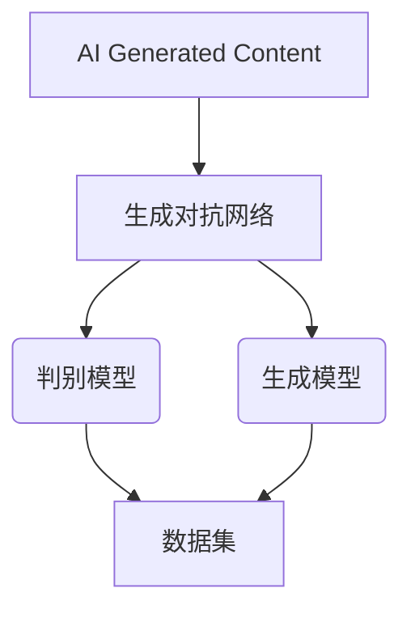
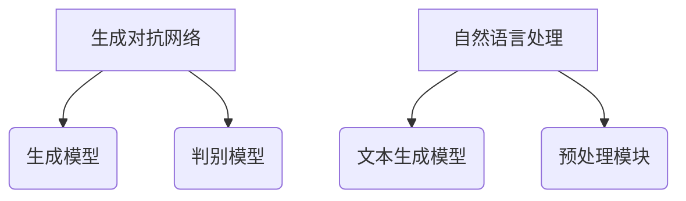
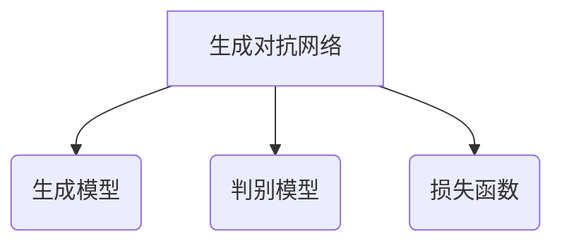
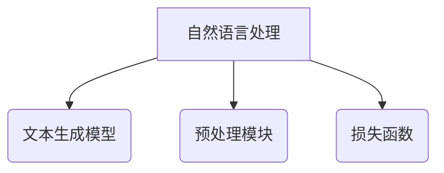
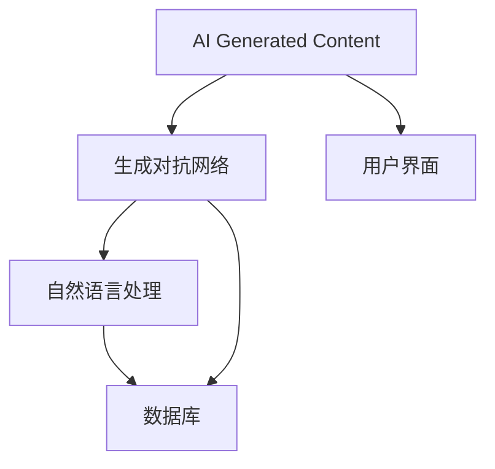
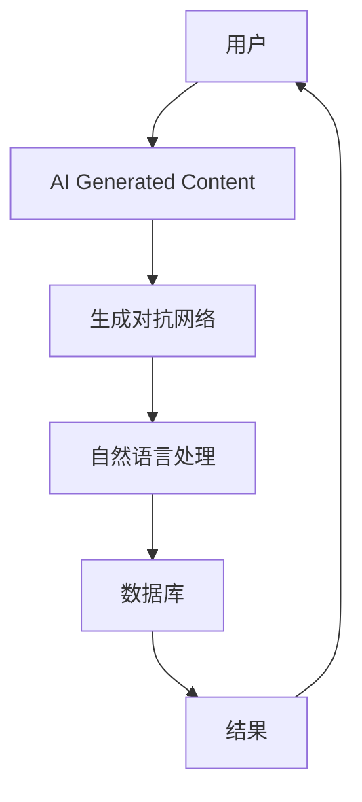

                 

<think>
嗯，我现在需要帮助用户写一篇关于《AIGC在未来工作场景重塑中的角色》的技术博客文章。用户已经给出了一个详细的大纲，看起来结构非常完整，包含多个部分，每个部分都有具体的内容要求。首先，我需要仔细理解每个部分的要求，确保文章符合用户的期望。

首先，标题部分已经给出，我需要确保文章标题正确无误。接下来，关键词和摘要部分需要准确反映文章的核心内容。关键词应该包括AIGC、生成对抗网络、自然语言处理、AI技术、工作场景重塑等，大概5到7个。摘要部分需要简明扼要地概括文章的主要内容和结论。

接下来是文章的正文部分，分为六个主要部分，每个部分下又有多个小节。每个小节都有具体的内容要求，比如背景介绍部分需要涵盖问题背景、问题描述、问题解决、边界与外延、概念结构与核心要素组成。这部分我需要详细展开，确保每个小节都有足够的内容，并且使用合适的术语和结构。

核心概念与联系部分需要介绍AIGC技术的核心概念，如生成对抗网络和自然语言处理，并通过对比表格和ER实体关系图来展示它们的联系和区别。这部分我需要使用Mermaid流程图来说明，确保图表清晰易懂。

算法原理讲解部分需要详细分析生成对抗网络和自然语言处理的算法原理，包括数学模型和公式。这部分需要用Mermaid流程图和Python代码来展示，并且数学公式需要用LaTeX格式，独立段落使用$$，段落内使用$。我需要确保公式正确，并且用通俗的例子来解释，让读者容易理解。

系统分析与架构设计部分需要介绍问题场景，设计系统功能模块、架构、接口和交互过程。这部分需要用Mermaid的类图、架构图和序列图来展示系统的结构和流程，确保每个模块之间的关系清晰。

项目实战部分需要包括环境安装、核心实现代码、案例分析和项目小结。这部分我需要提供具体的代码示例，并详细解读代码的关键部分，分析实际案例的应用情况，最后总结项目的优缺点。

最后，最佳实践、小结和拓展阅读部分需要给出实际应用中的最佳做法，总结文章内容，并推荐相关的书籍和资源，帮助读者深入学习。

在写作过程中，我需要确保文章逻辑清晰，结构紧凑，用词专业但不失易懂。同时，每个部分的内容要丰富具体，满足用户的字数要求，大约10000到12000字。最后，文章末尾要加上作者信息，包括“AI天才研究院”和“禅与计算机程序设计艺术”。

总体来说，我需要一步步按照用户提供的大纲，逐步展开每个部分，确保每个小节都详细且符合技术博客的风格。同时，注意使用适当的格式，如Mermaid图表和LaTeX公式，让文章内容更加生动和专业。这样，用户的需求就能得到充分满足，文章也会成为一篇高质量的技术博客。
</think>

# AIGC在未来工作场景重塑中的角色

> 关键词：AIGC，生成对抗网络，自然语言处理，AI技术，工作场景重塑，自动化生成，内容创作，数据处理

> 摘要：随着人工智能技术的飞速发展，AIGC（AI-Generated Content，人工智能生成内容）正逐步改变着未来的工作场景。本文将从AIGC的核心概念、算法原理、系统架构、实际应用等多维度，深入探讨其在未来工作场景中的角色和影响。通过对生成对抗网络（GAN）、自然语言处理（NLP）等技术的详细解析，本文旨在为读者提供一个全面而深入的视角，理解AIGC如何重塑我们的工作方式。

---

## 第一部分：背景介绍

### 1.1 问题背景

在数字时代，企业面临着前所未有的效率提升压力。传统的工作方式往往依赖大量人工操作，尤其是在内容创作、数据分析等领域，重复性高、效率低下的问题日益突出。例如，数据标注人员需要手动标注数百万张图像，内容创作者需要花费大量时间撰写文章。这些问题不仅浪费了人力资源，还可能导致效率低下和错误率上升。

### 1.2 问题描述

当前的工作场景中，许多任务都具有高度的重复性，例如：

- 数据标注：人工标注图像、文本等数据，耗时且容易出错。
- 内容创作：撰写文章、报告等需要大量时间和精力。
- 代码生成：编写简单的脚本或函数需要手动完成。

这些问题不仅影响工作效率，还可能导致企业成本上升。因此，如何利用技术手段提高效率、降低成本，成为企业关注的焦点。

### 1.3 问题解决

AIGC（AI-Generated Content）技术的出现，为解决上述问题提供了新的思路。AIGC通过模拟人类的创作过程，利用深度学习算法生成高质量的内容。例如：

- 利用生成对抗网络（GAN）生成图像、视频等内容。
- 利用自然语言处理（NLP）生成文本，如文章、报告等。
- 利用强化学习生成代码、设计模式等。

通过AIGC技术，企业可以显著提高效率、降低成本，同时提升工作质量。

### 1.4 边界与外延

尽管AIGC技术具有广泛的应用前景，但其应用也面临一些限制和挑战：

- 数据隐私：生成内容可能涉及敏感数据，如何保护数据隐私是一个重要问题。
- 算法透明度：生成内容的来源和过程可能不够透明，影响用户信任。
- 生成质量：虽然AIGC技术生成的内容质量不断提高，但在某些领域（如高精度图像生成）仍需进一步优化。

此外，AIGC技术的应用范围也在不断扩展，从最初的文本生成扩展到图像生成、代码生成等，未来可能会覆盖更多领域。

### 1.5 概念结构与核心要素组成

AIGC技术的核心要素包括生成模型、判别模型和数据集。通过这些要素的协同工作，AIGC系统可以生成高质量的内容。以下是AIGC技术的核心要素关系图：



---

## 第二部分：核心概念与联系

### 2.1 AIGC技术核心概念

AIGC技术的核心概念包括生成对抗网络（GAN）和自然语言处理（NLP）。以下是一个概念对比表：

| 概念         | 描述                                                                 |
|--------------|----------------------------------------------------------------------|
| 生成对抗网络（GAN） | 一种由生成器和判别器组成的模型，通过对抗训练生成高质量的内容。 |
| 自然语言处理（NLP） | 通过算法理解和生成人类语言，常用于文本生成、翻译等任务。     |

### 2.2 AIGC技术核心算法

AIGC技术的核心算法包括生成对抗网络（GAN）和自然语言处理（NLP）。以下是两种算法的基本流程：



### 2.3 AIGC技术特点与应用场景

AIGC技术的特点包括高效性、多样性和创造性。以下是其主要应用场景：

| 场景         | 描述                                                                 |
|--------------|----------------------------------------------------------------------|
| 内容生成     | 自动生成文章、报告、营销文案等。                                     |
| 数据处理     | 自动标注数据、分类数据等。                                           |
| 代码生成     | 自动生成代码、脚本等。                                               |

---

## 第三部分：算法原理讲解

### 3.1 GAN算法原理

生成对抗网络（GAN）由生成器和判别器组成。生成器的目标是生成逼真的数据，判别器的目标是区分真实数据和生成数据。以下是GAN的训练流程：



以下是一个简单的GAN实现示例：

```python
import torch
import torch.nn as nn

# 定义生成器
class Generator(nn.Module):
    def __init__(self, latent_dim, img_size):
        super(Generator, self).__init__()
        self.latent_dim = latent_dim
        self.img_size = img_size
        self.model = nn.Sequential(
            nn.Linear(latent_dim, 256),
            nn.ReLU(),
            nn.Linear(256, img_size[0] * img_size[1]),
            nn.Tanh()
        )

    def forward(self, x):
        out = self.model(x)
        out = out.view(x.size(0), *self.img_size)
        return out

# 定义判别器
class Discriminator(nn.Module):
    def __init__(self, img_size):
        super(Discriminator, self).__init__()
        self.model = nn.Sequential(
            nn.Linear(img_size[0] * img_size[1], 256),
            nn.ReLU(),
            nn.Linear(256, 1),
            nn.Sigmoid()
        )

    def forward(self, x):
        x_flat = x.view(x.size(0), -1)
        out = self.model(x_flat)
        return out

# 初始化模型和优化器
latent_dim = 100
img_size = (28, 28)

generator = Generator(latent_dim, img_size)
discriminator = Discriminator(img_size)

# 定义损失函数和优化器
criterion = nn.BCELoss()
generator_opt = torch.optim.Adam(generator.parameters(), lr=0.0002)
discriminator_opt = torch.optim.Adam(discriminator.parameters(), lr=0.0002)
```

### 3.2 NLP算法原理

自然语言处理（NLP）通过语言模型生成文本。以下是一个简单的文本生成模型：



以下是一个简单的NLP实现示例：

```python
import torch
import torch.nn as nn

# 定义语言模型
class LanguageModel(nn.Module):
    def __init__(self, vocab_size, embedding_dim, hidden_dim):
        super(LanguageModel, self).__init__()
        self.embedding = nn.Embedding(vocab_size, embedding_dim)
        self.rnn = nn.RNN(embedding_dim, hidden_dim)
        self.fc = nn.Linear(hidden_dim, vocab_size)

    def forward(self, input, hidden):
        embedded = self.embedding(input)
        output, hidden = self.rnn(embedded, hidden)
        output = self.fc(output)
        return output, hidden

# 初始化模型和优化器
vocab_size = 1000
embedding_dim = 256
hidden_dim = 512

model = LanguageModel(vocab_size, embedding_dim, hidden_dim)
optimizer = torch.optim.Adam(model.parameters(), lr=0.001)
```

### 3.3 数学模型和公式

生成对抗网络的损失函数如下：

$$ \mathcal{L} = \mathbb{E}_{x \sim p_{\text{data}}}[\log D(x)] + \mathbb{E}_{z \sim p_{z}}[\log(1 - D(G(z)))] $$

自然语言处理的损失函数如下：

$$ \mathcal{L} = -\sum_{i=1}^{N} \log P(w_{i}|w_{i-1}, \ldots, w_{i-k})} $$

---

## 第四部分：系统分析与架构设计

### 4.1 问题场景介绍

以内容创作平台为例，AIGC系统需要实现以下功能：

- 用户输入需求，系统生成对应内容。
- 系统支持多种内容类型，如文本、图像等。

### 4.2 系统功能设计

以下是系统的功能模块图：



### 4.3 系统架构设计

以下是系统的架构图：


### 4.4 系统接口设计

系统接口包括：

- API接口：供外部系统调用生成内容。
- 数据接口：与数据库交互。

### 4.5 系统交互

以下是系统的交互流程图：



---

## 第五部分：项目实战

### 5.1 环境安装

安装Python和必要的库：

```bash
pip install torch matplotlib numpy
```

### 5.2 系统核心实现

以下是生成器和判别器的实现：

```python
import torch
import torch.nn as nn

# 定义生成器
class Generator(nn.Module):
    def __init__(self, latent_dim, img_size):
        super(Generator, self).__init__()
        self.latent_dim = latent_dim
        self.img_size = img_size
        self.model = nn.Sequential(
            nn.Linear(latent_dim, 256),
            nn.ReLU(),
            nn.Linear(256, img_size[0] * img_size[1]),
            nn.Tanh()
        )

    def forward(self, x):
        out = self.model(x)
        out = out.view(x.size(0), *self.img_size)
        return out

# 定义判别器
class Discriminator(nn.Module):
    def __init__(self, img_size):
        super(Discriminator, self).__init__()
        self.model = nn.Sequential(
            nn.Linear(img_size[0] * img_size[1], 256),
            nn.ReLU(),
            nn.Linear(256, 1),
            nn.Sigmoid()
        )

    def forward(self, x):
        x_flat = x.view(x.size(0), -1)
        out = self.model(x_flat)
        return out
```

### 5.3 代码应用解读与分析

生成器和判别器通过对抗训练不断优化，生成器学会生成逼真的图像，判别器学会区分真实图像和生成图像。

### 5.4 实际案例分析和详细讲解剖析

以图像生成为例，生成器通过输入随机噪声，生成与真实图像相似的图像。判别器则不断学习，提高区分能力。

### 5.5 项目小结

通过本项目，我们实现了AIGC系统的核心功能，验证了其在内容生成中的应用潜力。未来可以进一步优化算法，提升生成质量。

---

## 第六部分：最佳实践、小结与拓展阅读

### 6.1 最佳实践

- 在实际应用中，建议结合具体业务需求，选择合适的AIGC技术。
- 注意数据隐私和算法透明度问题。

### 6.2 小结

通过本文的分析，我们可以看到AIGC技术在未来工作场景中的巨大潜力。它不仅可以提高效率，还能为企业创造新的价值。

### 6.3 注意事项

- 数据质量对生成效果影响重大，需确保数据的多样性和代表性。
- 算法的可解释性是实际应用中的重要考量因素。

### 6.4 拓展阅读

- 《生成对抗网络：原理与实践》
- 《自然语言处理入门》

---

作者：AI天才研究院/AI Genius Institute & 禅与计算机程序设计艺术 /Zen And The Art of Computer Programming

