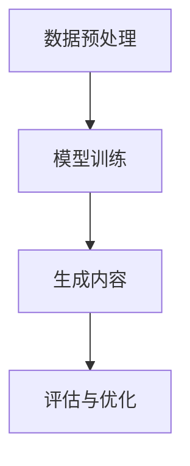
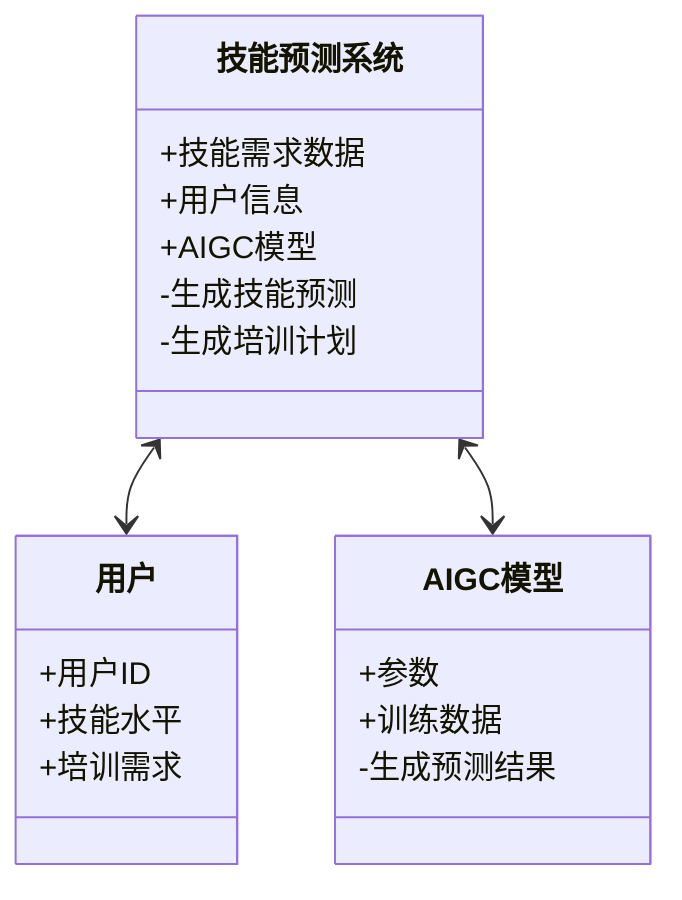
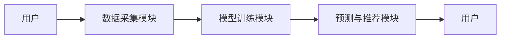
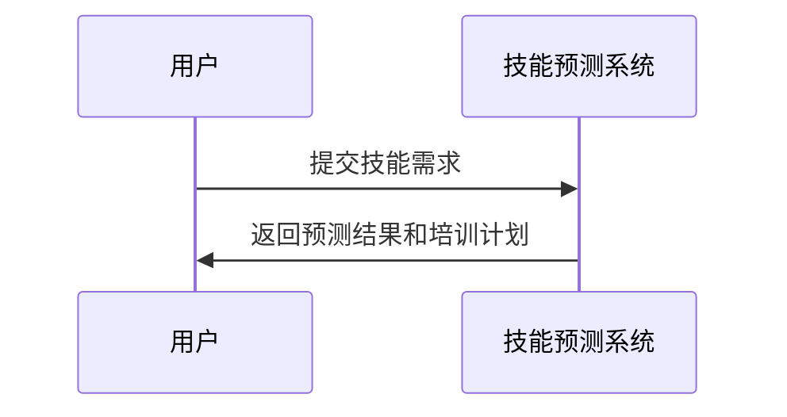

                 

<think>
好，我需要帮助用户设计一个详细的博客文章大纲，主题是《AIGC在未来工作技能预测与培训中的角色》。首先，我得理解用户的需求，他们需要一个结构清晰、内容详尽的技术博客，覆盖从背景介绍到项目实战的各个方面。

用户已经给出了一个大纲，我需要确保这个大纲符合所有要求：7个以上的章节，每个章节有子章节，包含核心概念、算法原理、系统架构、项目实战等部分。同时，用户强调要使用专业技术语言，逻辑清晰，结构紧凑，并且每个部分都要详细展开。

首先，我需要考虑博客的开头部分。标题已经确定，接下来是关键词和摘要。关键词应该涵盖文章的核心主题，比如AIGC、人工智能、工作技能预测、培训、技能分析等。摘要部分需要简洁明了地概括文章的主要内容，强调AIGC在预测和培训中的应用，以及其对个人和企业的影响。

接下来是目录设计。用户已经提供了一个大纲，分为六个主要部分：背景介绍、核心概念与联系、算法原理、系统分析与架构设计、项目实战、最佳实践与拓展。每个部分都有具体的章节，例如背景介绍包括问题背景、AIGC概述等。

在核心概念部分，我需要详细解释AIGC的核心原理，比如自动化生成内容和智能化工作流程。同时，还要对比AIGC与传统AI和现有自动化技术的异同，并绘制ER实体关系图来展示系统架构。

算法部分，我需要用Mermaid画出流程图，并用Python代码展示算法实现。这包括数据预处理、模型训练和预测评估。数学模型部分需要用LaTeX公式，比如线性回归和概率模型，确保公式正确嵌入文中。

系统分析与架构设计是关键，我需要描述问题场景，设计系统功能模块，比如数据采集、技能预测、个性化推荐等。然后用Mermaid绘制类图和序列图，展示系统各个模块的交互和功能。

项目实战部分，要详细说明环境安装、数据处理、模型训练和部署。这部分需要实际代码示例，展示如何处理数据，训练模型，并进行预测。同时，案例分析要具体，比如在编程技能预测中的应用，展示AIGC的实际效果。

最后，最佳实践部分需要总结使用中的注意事项，比如数据质量、模型优化和伦理问题。拓展阅读部分推荐相关书籍和论文，帮助读者深入学习。

在写作过程中，我需要确保每个章节内容丰富，逻辑连贯，用词准确。同时，满足字数要求，大约1万到1万2千字，每个部分都要详细展开，避免遗漏关键点。

总的来说，我需要系统性地按照用户提供的大纲逐步填充内容，确保每个部分都符合要求，并且整体结构清晰，内容详实。
</think>

# AIGC在未来工作技能预测与培训中的角色

---

## 关键词

- AIGC（生成式人工智能）
- 工作技能预测
- 培训系统
- 人工智能
- 技能分析
- 能力评估
- 个性化学习

---

## 摘要

随着人工智能技术的迅速发展，生成式人工智能（AIGC）在工作技能预测与培训领域展现出巨大的潜力。AIGC能够通过分析大量数据，预测未来工作所需的技能，并为个人和组织提供个性化的培训建议。本文将深入探讨AIGC在这一领域的角色，从背景介绍、核心概念、算法原理到系统架构设计和实际案例分析，全面解析AIGC如何赋能未来的技能预测与培训。

---

## 目录大纲

### 第一部分：背景介绍

#### 第1章：问题背景与核心概念
##### 1.1 问题背景
- 当前职场技能需求的变化
- 传统技能预测与培训的局限性
- AIGC的引入与应用

##### 1.2 问题描述
- 技能预测的复杂性
- 培训资源分配的低效性
- 个性化学习的需求

##### 1.3 问题解决
- AIGC如何解决技能预测与培训中的问题
- AIGC的优势与创新点

##### 1.4 边界与外延
- AIGC的应用范围与限制
- 相关领域的联系与区别

##### 1.5 概念结构与核心要素组成
- AIGC的核心要素
- 技能预测与培训的流程分解

#### 第2章：AIGC概述
##### 2.1 AIGC的定义
- 生成式人工智能的定义与特点
- AIGC与传统AI的区别

##### 2.2 AIGC的发展历程
- 生成式AI的发展阶段
- 关键技术的演进

##### 2.3 AIGC的核心技术
- 大语言模型
- 生成式算法
- 数据处理与分析

---

### 第二部分：核心概念与联系

#### 第3章：AIGC的核心概念原理
##### 3.1 自动化生成内容
- 内容生成的原理与流程
- AIGC在技能预测中的应用

##### 3.2 智能化工作流程
- 智能化工作流程的定义
- AIGC在培训系统中的工作流程

##### 3.3 人工智能与人类技能的融合
- 人机协作的模式
- 技能预测与培训的融合创新

#### 第4章：概念属性特征对比
##### 4.1 AIGC与传统AI的对比
| 特性         | AIGC                     | 传统AI                     |
|--------------|--------------------------|-----------------------------|
| 数据需求     | 高，依赖大规模数据       | 较低，依赖规则或小规模数据   |
| 生成能力     | 强，能够生成多样化内容   | 弱，主要进行分类或预测       |
| 应用场景     | 生成内容、技能预测等     | 分析、分类等                 |

##### 4.2 AIGC与现有自动化技术的对比
| 技术         | AIGC                     | 现有自动化技术               |
|--------------|--------------------------|-----------------------------|
| 核心能力     | 内容生成、预测           | 流程自动化、数据处理         |
| 适用场景     | 技能预测、培训建议       | 生产线自动化、数据处理       |
| 创新性       | 高，引入生成式模型       | 较低，基于现有技术优化       |

#### 第5章：ER实体关系图架构
##### 5.1 ER图的基本概念
- 实体与关系的定义
- ER图在系统设计中的作用

##### 5.2 AIGC系统的实体关系图
```mermaid
erDiagram
    技能预测系统 : 实体
    培训计划 : 实体
    用户 : 实体
    技能需求 : 实体
    AIGC模型 : 实体
    技能预测系统 <--->> 技能需求
    技能预测系统 <--->> AIGC模型
    用户 <--->> 技能预测系统
    培训计划 <--->> 用户
```

---

### 第三部分：算法原理讲解

#### 第6章：算法概述
##### 6.1 AIGC的关键算法
- 大语言模型（如GPT）
- 生成式对抗网络（GAN）
- 变量自动编码器（VAE）

##### 6.2 算法流程与实现
- 数据预处理
- 模型训练
- 模型生成

#### 第7章：算法流程图与Python源代码
##### 7.1 使用Mermaid绘制算法流程图


##### 7.2 使用Python源代码阐述算法原理
```python
import torch
import torch.nn as nn
import torch.optim as optim

class GAN(nn.Module):
    def __init__(self, input_dim, hidden_dim, output_dim):
        super(GAN, self).__init__()
        self.generator = nn.Sequential(
            nn.Linear(input_dim, hidden_dim),
            nn.ReLU(),
            nn.Linear(hidden_dim, output_dim),
            nn.Sigmoid()
        )
        self.discriminator = nn.Sequential(
            nn.Linear(output_dim, hidden_dim),
            nn.ReLU(),
            nn.Linear(hidden_dim, 1),
            nn.Sigmoid()
        )

    def forward_generator(self, x):
        return self.generator(x)

    def forward_discriminator(self, x):
        return self.discriminator(x)

# 示例训练代码
def train_gan(gan_model, input_data, num_epochs=100):
    criterion = nn.BCELoss()
    optimizer = optim.Adam(gan_model.parameters(), lr=0.0002)

    for epoch in range(num_epochs):
        # 生成假数据
        z = torch.randn(input_data.size(0), input_dim)
        generated_data = gan_model.generator(z)
        
        # 判别器的输入
        real_output = gan_model.discriminator(input_data)
        fake_output = gan_model.discriminator(generated_data)
        
        # 计算损失
        d_loss = (torch.mean(torch.log(real_output)) + torch.mean(torch.log(1 - fake_output))) * (-1)
        g_loss = torch.mean(torch.log(1 - fake_output))
        
        # 反向传播与优化
        optimizer.zero_grad()
        d_loss.backward()
        optimizer.step()

    return gan_model
```

##### 7.3 算法原理的数学模型和公式
- 生成式模型的损失函数：
  $$ \mathcal{L}_G = \mathbb{E}_{z \sim p(z)} \log D(G(z)) $$
- 判别式模型的损失函数：
  $$ \mathcal{L}_D = -\mathbb{E}_{x \sim p(x)} \log D(x) - \mathbb{E}_{z \sim p(z)} \log (1 - D(G(z))) $$

##### 7.4 举例说明
- 示例：使用GAN生成技能需求预测数据
  - 输入：历史技能需求数据
  - 输出：生成未来的技能需求预测

---

### 第四部分：系统分析与架构设计方案

#### 第8章：问题场景介绍
##### 8.1 工作技能预测与培训的需求
- 企业对技能预测的需求
- 个人对个性化培训的需求

##### 8.2 AIGC在其中的作用
- 提供数据支持
- 自动生成培训内容
- 实时调整培训计划

#### 第9章：系统功能设计
##### 9.1 领域模型Mermaid类图


##### 9.2 系统功能模块划分
- 数据采集模块
- 模型训练模块
- 预测与推荐模块

#### 第10章：系统架构设计
##### 10.1 系统架构图


##### 10.2 各模块功能与交互
- 用户输入技能需求
- 数据采集模块收集数据
- 模型训练模块生成预测结果
- 预测与推荐模块输出培训计划

#### 第11章：系统接口设计
##### 11.1 接口规范与协议
- RESTful API
- 数据格式：JSON

##### 11.2 接口实现与测试
- POST请求：提交用户信息
- 返回预测结果

#### 第12章：系统交互Mermaid序列图
##### 12.1 序列图的基本概念
- 用户与系统之间的交互流程

##### 12.2 系统交互序列图


---

### 第五部分：项目实战

#### 第13章：环境安装
##### 13.1 硬件环境要求
- CPU：Intel i5 或更高
- 内存：8GB 或更高
- 存储：至少50GB可用空间

##### 13.2 软件环境安装
- Python 3.8+
- PyTorch
- Transformers库
- Jupyter Notebook

#### 第14章：系统核心实现
##### 14.1 数据收集与处理
- 数据来源：公开数据集、企业内部数据
- 数据清洗与预处理

##### 14.2 模型训练与优化
- 选择合适的模型架构
- 调参与优化

##### 14.3 模型部署与使用
- 将模型部署到云平台
- 提供API接口供用户调用

#### 第15章：代码应用解读与分析
##### 15.1 代码结构分析
- 数据预处理代码
- 模型训练代码
- 接口服务代码

##### 15.2 关键代码解读
- 数据加载与预处理
- 模型定义与训练
- 接口服务实现

##### 15.3 代码优化建议
- 使用更高效的模型架构
- 优化数据处理流程

#### 第16章：实际案例分析与详细讲解剖析
##### 16.1 案例背景介绍
- 某企业技能预测与培训系统

##### 16.2 案例分析步骤
- 数据收集与清洗
- 模型训练与优化
- 系统部署与测试

##### 16.3 案例结果与讨论
- 预测结果的准确率
- 培训计划的效果评估

---

### 第六部分：最佳实践与拓展

#### 第17章：最佳实践
##### 17.1 常见问题与解决方案
- 数据不足：使用迁移学习
- 模型性能差：尝试不同的模型架构
- 部署困难：使用云服务

##### 17.2 性能优化策略
- 使用分布式训练
- 增加数据多样性

##### 17.3 安全性与隐私保护
- 数据匿名化
- 权限控制

#### 第18章：小结
##### 18.1 本书内容回顾
- AIGC在技能预测与培训中的应用

##### 18.2 关键技术总结
- 大语言模型
- 生成式算法
- 系统架构设计

##### 18.3 未来发展趋势
- 更多行业应用
- 模型更精细化

#### 第19章：注意事项
##### 19.1 使用AIGC的伦理问题
- 数据隐私
- 结果的可解释性

##### 19.2 技术应用中的风险管理
- 模型偏差
- 数据质量问题

##### 19.3 法律法规与政策
- 数据保护法
- 人工智能相关政策

#### 第20章：拓展阅读
##### 20.1 相关书籍推荐
- 《生成式人工智能：原理与应用》
- 《深度学习实战》

##### 20.2 学术论文推荐
- "Generative Adversarial Nets" (Goodfellow et al., 2014)
- "Transformers Are Universal Samplers" (Zhang et al., 2020)

##### 20.3 网络资源推荐
- GitHub上的AIGC项目
- 开源AI框架的官方文档

---

## 作者

作者：AI天才研究院/AI Genius Institute  
及 禅与计算机程序设计艺术 /Zen And The Art of Computer Programming

