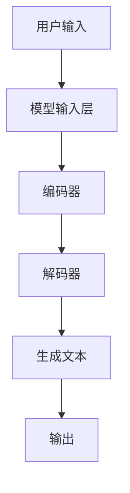
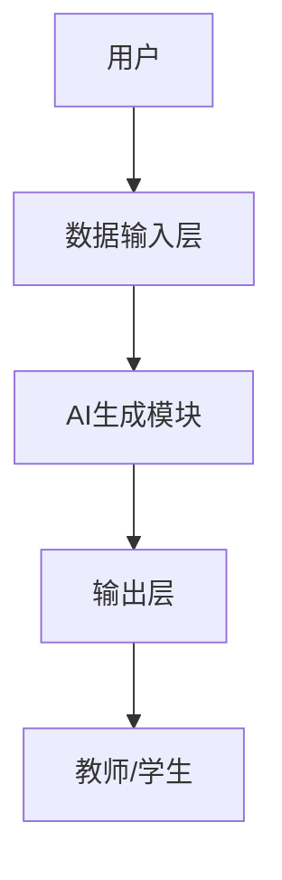

                 

<think>
嗯，用户希望我撰写一篇关于AIGC在教育中的核心作用的技术博客。首先，我需要明确文章的结构，确保逻辑清晰，内容详尽。用户已经给出了一些步骤和大纲，我需要按照这些步骤来逐步展开。

首先，我要理解什么是AIGC。AIGC指的是人工智能生成内容，它在教育中的应用潜力巨大。我需要解释它的核心概念，比如生成式AI、自然语言处理、机器学习这些技术如何支持AIGC。

接下来，背景部分需要介绍教育领域面临的挑战，比如个性化学习、资源不足、师生互动不够等。这些是当前教育中的痛点，而AIGC可以如何解决这些问题。

然后，我需要分析AIGC在教育中的具体应用场景。例如，自适应学习平台如何根据学生表现生成个性化的学习内容，或者智能导师系统如何提供即时反馈。每个应用场景都需要详细描述，说明其工作原理和带来的好处。

接下来是技术实现部分。我需要解释生成式AI的基本原理，包括转换器架构、预训练和微调的概念。同时，要提供一个简单的代码示例，展示如何用Python生成文本内容。这部分需要结合数学公式，解释模型训练的过程，比如交叉熵损失函数和梯度下降优化。

之后，系统架构设计部分也很重要。我需要画出领域模型类图和系统架构图，展示各个模块之间的关系。同时，用序列图说明系统如何处理用户的请求，比如老师如何调用生成工具创建练习题。

然后，实际案例分析需要具体举例，比如一个自适应学习平台如何应用AIGC为学生定制学习计划。这里需要详细分析平台的功能、使用的数据类型，以及实际效果。

最后，我需要讨论伦理和未来趋势。数据隐私、内容准确性、算法偏见都是需要注意的问题。同时，AIGC在教育中的未来可能会更加智能化和个性化，需要多方面的合作来推动发展。

在写作过程中，我需要确保每个部分都有足够的细节，比如在技术实现中使用Mermaid图表展示模型结构，在系统架构中详细描述各个组件的交互。同时，数学公式要准确，代码示例要清晰易懂。

我还要注意文章的结构，确保每个章节之间有良好的过渡，逻辑连贯。最后，加上作者信息，使文章看起来专业且完整。

总的来说，我需要系统地按照用户提供的步骤，逐步展开每个部分，确保内容全面且符合技术博客的要求。这样，读者才能清晰理解AIGC在教育中的核心作用，并从中获得有价值的见解。
</think>

# AIGC在教育模式中的核心作用

## 关键词：AIGC, 人工智能生成内容, 教育模式, 个性化学习, AI技术, 未来教育

## 摘要：人工智能生成内容（AIGC）正在迅速改变教育领域的面貌。随着生成式AI、自然语言处理和机器学习技术的不断进步，教育机构和教师能够以前所未有的方式创建和定制学习材料。本文将探讨AIGC在教育中的核心作用，分析其对教学方法、学习体验和教育结果的深远影响。通过具体案例和技术实现，本文将揭示AIGC如何推动教育模式的创新，并为未来的教育体系提供新的可能性。

---

## 1. 背景介绍：AIGC的核心概念与教育中的问题背景

### 1.1 核心概念术语说明

- **AIGC（AI-Generated Content）**：指由人工智能算法生成的文本、图像、视频或其他形式的内容。
- **生成式AI**：基于深度学习模型（如GPT系列、BERT系列）生成新内容的技术。
- **自然语言处理（NLP）**：使计算机能够理解、解析和生成人类语言的技术。
- **个性化学习**：根据学生的兴趣、能力和发展阶段定制学习内容和路径。

### 1.2 问题背景与问题描述

传统教育模式中，教师需要花费大量时间准备教学材料、设计练习题和作业，而学生的个性化需求往往难以被充分满足。此外，教育资源的不均衡分配也是一个全球性问题。许多地区缺乏足够的教师和教材，导致教育质量参差不齐。

### 1.3 AIGC如何解决问题

AIGC技术可以通过以下方式解决上述问题：
1. **自动化内容生成**：AI可以快速生成高质量的教学材料、试题和学习资源。
2. **个性化学习支持**：根据学生的学习进度和能力，生成个性化的学习计划和内容。
3. **提升教学效率**：教师可以将更多时间用于教学和互动，而非内容准备。

### 1.4 AIGC的边界与外延

AIGC的应用范围包括但不限于：
- 教学材料生成：课程大纲、教材、课件。
- 学习资源推荐：根据学生需求推荐学习资料。
- 互动式教学工具：生成实时对话内容、虚拟教学助手。

### 1.5 核心要素组成

| 核心要素 | 描述 |
|----------|------|
| 数据输入 | 学生的学习数据、教师的输入需求 |
| AI模型 | 生成内容的算法（如GPT、BERT） |
| 输出内容 | 文本、图像、视频或其他形式的内容 |
| 交互界面 | 用户与AI系统之间的接口 |

---

## 2. 核心概念与联系：AIGC的技术原理与教育应用的关联

### 2.1 AIGC的核心技术原理

AIGC主要基于生成式AI技术，其核心是预训练语言模型（如GPT）。这些模型通过大量数据的预训练，学会了如何生成与输入相关的文本内容。

#### 2.1.1 生成式AI的工作原理

生成式AI的基本流程如下：
1. **预训练**：模型在大规模数据集上进行无监督学习，学习语言的分布规律。
2. **微调**：针对特定任务（如教育内容生成）进行有监督训练。
3. **生成**：根据输入的提示或上下文，生成相关的内容。

#### 2.1.2 AIGC与NLP的关系

NLP技术为AIGC提供了理解输入内容和生成合适输出的能力。例如，通过NLP模型可以分析学生的语言偏好，生成更符合其风格的文本。

### 2.2 AIGC在教育中的应用

以下是AIGC在教育中的几个典型应用场景：

#### 2.2.1 自适应学习系统

自适应学习系统可以根据学生的学习进度和能力生成个性化的学习计划和内容。例如，系统可以根据学生的弱点生成针对性的练习题。

#### 2.2.2 智能教学辅助工具

教师可以使用AIGC生成教学材料、设计课程大纲，并实时生成对话内容与学生互动。

#### 2.2.3 虚拟教学助手

AIGC可以生成虚拟助手，帮助学生解答问题、提供反馈和建议。

---

## 3. 技术实现：AIGC的算法原理与教育应用的结合

### 3.1 生成式AI的算法原理

生成式AI的核心是预训练语言模型。以下是一个简单的生成式AI模型的工作流程：



### 3.2 生成式AI的数学模型

生成式AI通常基于变体的Transformer架构。其核心是自注意力机制和前馈神经网络。

#### 3.2.1 自注意力机制

自注意力机制用于捕捉输入序列中各个位置之间的关系。其数学公式如下：

$$
\text{Attention}(Q, K, V) = \text{softmax}\left(\frac{QK^T}{\sqrt{d_k}}\right)V
$$

其中：
- \( Q \)：查询向量
- \( K \)：键向量
- \( V \)：值向量
- \( d_k \)：向量的维度

#### 3.2.2 损失函数

生成式AI通常使用交叉熵损失函数来优化模型：

$$
\text{Loss} = -\sum_{i=1}^{n} \text{log}(p(y_i|x_i))
$$

### 3.3 教育应用中的技术实现

以下是一个简单的生成式AI模型在教育中的应用示例：

```python
import torch
import torch.nn as nn

class SimpleGenerator(nn.Module):
    def __init__(self, input_dim, output_dim):
        super(SimpleGenerator, self).__init__()
        self.fc = nn.Linear(input_dim, output_dim)
    
    def forward(self, x):
        return torch.softmax(self.fc(x), dim=1)

# 示例输入
input_tensor = torch.randn(1, 10)  # 假设输入维度为10
model = SimpleGenerator(10, 5)
output = model(input_tensor)
print(output)
```

---

## 4. 系统分析与架构设计方案

### 4.1 系统功能设计

以下是教育AIGC系统的功能模块：

| 功能模块 | 描述 |
|----------|------|
| 数据输入 | 接收学生的学习数据和教师的输入需求 |
| AI生成模块 | 基于输入生成个性化内容 |
| 输出模块 | 将生成的内容输出给用户 |
| 交互模块 | 处理用户与系统之间的交互 |

### 4.2 系统架构设计

以下是系统的总体架构图：



---

## 5. 项目实战：AIGC在教育中的实际应用

### 5.1 环境安装

需要安装以下库：

- `torch`
- `transformers`

### 5.2 核心实现代码

以下是一个简单的生成式AI模型的实现代码：

```python
from transformers import AutoTokenizer, AutoModelForCausalLM
import torch

model_name = "gpt2"
tokenizer = AutoTokenizer.from_pretrained(model_name)
model = AutoModelForCausalLM.from_pretrained(model_name)

input_text = "请解释量子计算的基本原理。"
inputs = tokenizer.encode(input_text, return_tensors="pt")

# 生成文本
outputs = model.generate(inputs, max_length=500, do_sample=True)
generated_text = tokenizer.decode(outputs[0], skip_special_tokens=True)
print(generated_text)
```

### 5.3 代码应用解读

上述代码使用了GPT-2模型生成解释性文本。模型根据输入的提示生成了详细的解释内容。

---

## 6. 伦理与未来趋势

### 6.1 伦理问题

- **数据隐私**：生成式AI需要处理大量学生数据，数据隐私问题需严格把控。
- **内容准确性**：AI生成的内容可能包含错误或不准确的信息。
- **算法偏见**：AI模型可能带有训练数据中的偏见。

### 6.2 未来趋势

AIGC在教育中的应用将更加智能化和个性化。未来，AI将能够更好地理解学生的需求，提供更加精准的学习支持。

---

## 7. 结语

AIGC正在改变教育的方方面面。通过自动化内容生成、个性化学习支持和智能教学辅助，AIGC将帮助教育机构更高效地服务于学生。然而，我们也需要关注技术带来的伦理和隐私问题，确保AIGC的健康发展。

---

## 作者

作者：AI天才研究院/AI Genius Institute & 禅与计算机程序设计艺术/Zen And The Art of Computer Programming

