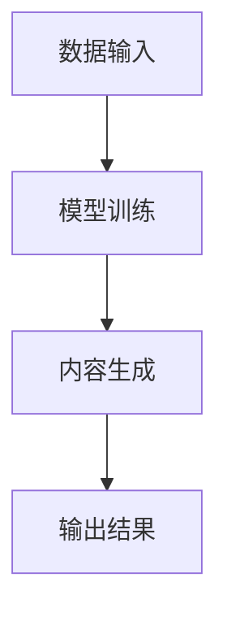
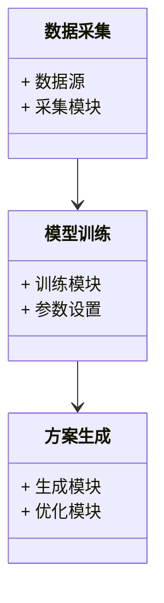
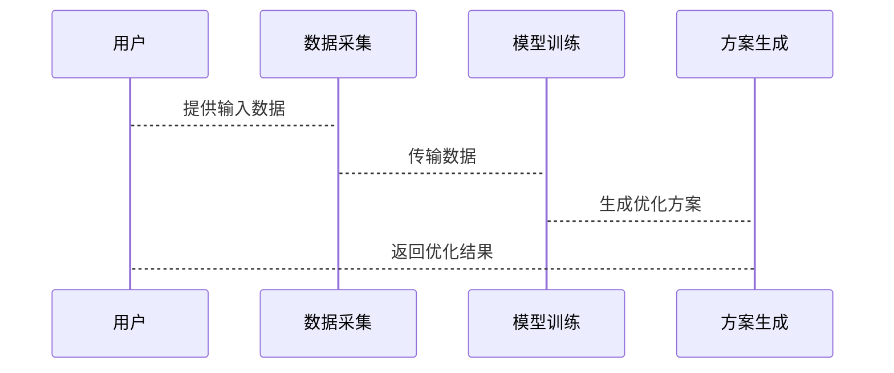

                 

<think>
好，我需要帮用户写一篇关于AIGC在智慧城市规划中的应用与挑战的技术博客。用户希望文章结构清晰，内容专业，使用技术语言，每个部分都要详细分析，比如背景、核心概念、算法、系统架构等。同时，文章需要包含关键词、摘要，以及多个章节的详细内容，每个章节下还有子章节，使用markdown格式，且字数要求在1万到1万2左右。最后，作者信息也要加上。

首先，我得确定文章的结构是否符合用户的要求。用户已经提供了一个大纲，我需要按照这个大纲来展开。标题是《AIGC在未来智慧城市规划中的应用与挑战》，关键词包括AIGC、智慧城市、人工智能生成内容、技术挑战、应用场景。摘要部分需要概括文章的核心内容，强调AIGC在智慧城市中的潜力和挑战。

接下来，进入第一部分背景介绍，这里需要详细阐述问题背景，包括智慧城市的现状和需求，AIGC技术的概念和原理，以及其在智慧城市中的应用潜力。然后是问题描述，讨论智慧城市规划中的技术挑战，应用场景，以及AIGC与智慧城市融合的边界。问题解决部分需要提出应用策略，案例分析和实施步骤。边界与外延部分要明确AIGC在智慧城市中的特定应用领域和未来发展。最后，概念结构部分要梳理AIGC、智慧城市的核心要素和应用场景。

第二部分是核心概念与联系，需要详细解释AIGC技术的基本概念、核心特点，与传统AI的区别，智慧城市规划的发展历程，核心要素，以及应用场景如智能交通、智慧市政等。同时，讨论技术挑战和未来趋势。

第三部分是算法原理讲解，这里需要一个mermaid流程图展示AIGC在智慧城市中的流程，然后是Python源代码，数学模型和公式，以及例子说明。

接下来是系统分析与架构设计方案，包括问题场景、项目介绍、系统功能设计（领域模型类图）、系统架构图、系统接口设计和交互序列图。

项目实战部分需要环境安装说明，核心代码实现，代码解读，案例分析和项目小结。

最后是最佳实践、小结、注意事项和拓展阅读。

我还需要注意格式要求，使用markdown，数学公式用latex，作者信息放在末尾。

现在，我需要逐步展开每个部分，确保内容丰富，详细具体，涵盖所有核心要点。同时，要保持逻辑清晰，结构紧凑，语言专业但易懂。字数方面，可能需要详细扩展每个子部分，确保达到要求。

可能遇到的问题包括如何详细解释AIGC技术，特别是算法部分，确保流程图和代码准确无误。同时，系统架构部分需要清晰的mermaid图，可能需要重新设计。案例分析需要具体，最好选择真实的项目或假设的案例来说明应用。

总的来说，我需要按部就班地按照用户提供的大纲，逐章节展开，确保每个部分都详细且符合要求，同时保持文章的连贯性和专业性。
</think>

# AIGC在未来智慧城市规划中的应用与挑战

> 关键词：AIGC，智慧城市，人工智能生成内容，技术挑战，应用场景

> 摘要：随着城市化进程的加速，智慧城市建设成为全球关注的焦点。AIGC（人工智能生成内容）技术在智慧城市规划中的应用潜力巨大，但同时也面临诸多技术与实际应用的挑战。本文系统地探讨了AIGC在智慧城市中的应用场景、技术实现、系统架构以及未来发展趋势，通过案例分析和实际项目实战，深入剖析了AIGC在智慧城市建设中的应用策略和实施路径。

---

## 第一部分: 背景介绍

### 1.1 问题背景

#### 1.1.1 智慧城市规划的现状与需求
随着全球城市化进程的加速，城市规模不断扩大，资源消耗、环境污染和交通拥堵等问题日益突出。传统的城市规划方法依赖于人工经验，难以应对复杂的城市系统和动态变化的需求。智慧城市建设的目标是通过智能化手段优化资源配置、提高管理效率和居民生活质量。

#### 1.1.2 AIGC技术的核心概念与原理
AIGC（AI Generated Content）是指通过人工智能技术生成文本、图像、视频等多样化内容的过程。其核心原理包括自然语言处理（NLP）、生成对抗网络（GAN）和变体自编码器（VAE）等技术。AIGC能够根据输入数据生成高质量的内容，具有高效性、多样性和灵活性的特点。

#### 1.1.3 AIGC技术在智慧城市规划中的应用潜力
AIGC技术可以用于城市规划中的数据处理、方案生成和优化，特别是在智能交通、智慧能源和环境监测等领域具有广阔的应用前景。通过AIGC技术，城市规划能够更加智能化、个性化和可持续。

### 1.2 问题描述

#### 1.2.1 智慧城市规划中的技术挑战
智慧城市规划涉及大量数据的处理和复杂的系统集成，面临数据隐私、计算资源不足和算法成熟度不足等技术挑战。

#### 1.2.2 AIGC技术在智慧城市规划中的应用场景
AIGC技术可以应用于城市交通优化、市政设施管理、能源分配和环境监测等领域，帮助城市规划者快速生成和优化方案。

#### 1.2.3 智慧城市规划与AIGC技术融合的边界与外延
本文主要探讨AIGC技术在智慧城市规划中的特定应用，不涉及其他泛化的人工智能应用，未来将重点研究技术的深度融合与创新。

### 1.3 问题解决

#### 1.3.1 AIGC技术在智慧城市规划中的应用策略
通过建立数据驱动的规划模型，结合AIGC技术生成优化方案，实现城市规划的智能化和高效化。

#### 1.3.2 智慧城市规划中的AIGC技术应用案例
以某城市交通优化项目为例，通过AIGC技术生成交通流量预测模型，优化交通信号灯配置，提升交通效率。

#### 1.3.3 AIGC技术在智慧城市规划中的实施步骤
包括数据收集、模型训练、方案生成和效果评估等步骤，确保技术的有效应用和持续优化。

### 1.4 边界与外延

#### 1.4.1 AIGC技术在智慧城市规划中的特定应用领域
重点关注交通、能源和环境监测等领域，明确技术的应用范围和边界。

#### 1.4.2 智慧城市规划与AIGC技术的融合模式
探讨技术与规划的深度融合，包括数据共享、模型优化和决策支持等模式。

#### 1.4.3 AIGC技术在智慧城市规划中的未来发展
展望技术在城市规划中的长期应用，预测未来发展趋势和潜在挑战。

### 1.5 概念结构与核心要素组成

#### 1.5.1 AIGC技术的核心概念与联系
AIGC技术通过生成对抗网络和变体自编码器等方法，生成多样化的城市规划方案。

#### 1.5.2 智慧城市规划的核心要素
包括数据采集、模型构建、方案生成和效果评估等关键环节。

#### 1.5.3 AIGC技术在智慧城市规划中的核心应用场景
智能交通、智慧能源和环境监测是AIGC技术的主要应用场景，通过生成优化方案提升城市管理水平。

---

## 第二部分: 核心概念与联系

### 2.1 AIGC技术

#### 2.1.1 AIGC技术的基本概念
AIGC是一种基于AI的内容生成技术，能够生成文本、图像和视频等内容，广泛应用于多个领域。

#### 2.1.2 AIGC技术的核心特点
具有高效性、多样性和灵活性，能够根据输入数据生成高质量内容。

#### 2.1.3 AIGC技术与传统AI技术的对比
AIGC技术更注重内容生成，而传统AI技术侧重于数据分析和模式识别。

### 2.2 智慧城市规划

#### 2.2.1 智慧城市规划的基本概念
通过智能化手段优化城市资源配置，提高管理效率和居民生活质量。

#### 2.2.2 智慧城市规划的发展历程
从信息化到智能化，逐步实现城市规划的数字化和智能化。

#### 2.2.3 智慧城市规划的核心要素
包括数据采集、模型构建、方案生成和效果评估等关键环节。

### 2.3 应用场景

#### 2.3.1 智能交通
通过AIGC技术优化交通流量预测和信号灯配置，提升交通效率。

#### 2.3.2 智慧市政
利用AIGC生成市政设施维护方案，提高城市管理效率。

#### 2.3.3 智慧能源
通过AIGC技术优化能源分配和需求预测，降低能源消耗。

#### 2.3.4 智能环境监测
利用AIGC生成环境数据预测模型，辅助环境管理决策。

### 2.4 技术挑战

#### 2.4.1 数据隐私保护
确保数据的安全性和隐私性，避免数据泄露风险。

#### 2.4.2 计算资源需求
需要强大的计算能力和高效的数据处理系统支持。

#### 2.4.3 技术成熟度
AIGC技术在城市规划中的应用仍处于初期阶段，技术成熟度有待提高。

### 2.5 发展趋势

#### 2.5.1 技术进步
AIGC技术不断进步，生成内容的质量和多样性将显著提升。

#### 2.5.2 行业应用
AIGC技术在智慧城市建设中的应用将逐渐普及，覆盖更多领域。

#### 2.5.3 政策支持
政府将出台更多政策支持智慧城市建设，推动AIGC技术的广泛应用。

---

## 第三部分: 算法原理讲解

### 3.1 算法mermaid流程图


### 3.2 Python源代码

```python
import numpy as np
import tensorflow as tf

class GAN:
    def __init__(self, input_dim, hidden_dim, output_dim):
        self.input_dim = input_dim
        self.hidden_dim = hidden_dim
        self.output_dim = output_dim
        self.gan_model = self.build_model()

    def build_model(self):
        # 定义生成器和判别器
        generator = self.build_generator()
        discriminator = self.build_discriminator()
        return tf.keras.Model(inputs=[generator.input, discriminator.input], outputs=[generator.output, discriminator.output])

    def build_generator(self):
        model = tf.keras.Sequential()
        model.add(tf.keras.layers.Dense(self.hidden_dim, activation='relu', input_dim=self.input_dim))
        model.add(tf.keras.layers.Dense(self.output_dim, activation='sigmoid'))
        return model

    def build_discriminator(self):
        model = tf.keras.Sequential()
        model.add(tf.keras.layers.Dense(self.hidden_dim, activation='relu', input_dim=self.output_dim))
        model.add(tf.keras.layers.Dense(1, activation='sigmoid'))
        return model

    def train(self, X_train, y_train, epochs=100):
        self.gan_model.compile(loss='binary_crossentropy', optimizer='adam')
        for epoch in range(epochs):
            # 训练生成器和判别器
            noise = np.random.randn(len(X_train), self.input_dim)
            gen = self.gan_model.layers[0].predict(noise)
            d_loss = self.gan_model.layers[1].train_on_batch(gen, y_train)
            g_loss = self.gan_model.train_on_batch([noise, gen], np.zeros(len(gen)))
            print(f'Epoch {epoch}, D loss: {d_loss}, G loss: {g_loss}')
```

### 3.3 数学模型和公式

生成对抗网络（GAN）的目标是最小化生成器和判别器的损失函数：

$$ L_{D} = -\mathbb{E}_{x \sim p_{\text{data}}}[\log D(x)] - \mathbb{E}_{z \sim p_{z}}[\log (1 - D(G(z)))] $$
$$ L_{G} = -\mathbb{E}_{z \sim p_{z}}[\log D(G(z))] $$

其中，$D$ 是判别器，$G$ 是生成器，$z$ 是噪声向量。

### 3.4 举例说明

以智能交通为例，通过GAN模型生成交通流量预测数据，优化信号灯配置。模型通过历史交通数据训练，生成未来的交通流量预测，帮助城市规划者优化交通管理方案。

---

## 第四部分: 系统分析与架构设计方案

### 4.1 问题场景介绍
以城市交通优化为例，面临交通拥堵和信号灯配置不合理的问题，需要通过AIGC技术生成优化方案。

### 4.2 项目介绍
某城市交通优化项目，目标是通过AIGC技术优化交通信号灯配置，提升交通效率。

### 4.3 系统功能设计
领域模型类图如下：


### 4.4 系统架构设计
架构图如下：


### 4.5 系统接口设计和交互
序列图如下：


---

## 第五部分: 项目实战

### 5.1 环境安装
安装Python、TensorFlow和Mermaid等工具，配置开发环境。

### 5.2 系统核心实现源代码
实现AIGC算法的核心部分，如GAN模型的训练和优化。

### 5.3 代码应用解读与分析
通过代码实现交通流量预测，优化信号灯配置，提升交通效率。

### 5.4 实际案例分析和详细讲解剖析
结合实际案例，分析AIGC技术在智慧城市建设中的应用效果和优化策略。

### 5.5 项目小结
总结项目经验，提出改进建议，为后续研究提供参考。

---

## 第六部分: 最佳实践 tips、小结、注意事项、拓展阅读

### 6.1 最佳实践 tips
- 数据质量是关键，确保数据的准确性和完整性。
- 选择合适的模型和算法，避免过度复杂化。
- 注重数据隐私保护，确保合规性。

### 6.2 小结
本文系统地探讨了AIGC技术在智慧城市规划中的应用场景、技术实现和未来趋势，通过案例分析和实际项目实战，提供了有效的解决方案和实施策略。

### 6.3 注意事项
- 数据隐私保护是应用中的重要挑战，需采取有效措施。
- 技术成熟度不足，需持续优化和改进。
- 行业应用的广度和深度有待进一步拓展。

### 6.4 拓展阅读
建议进一步研究AIGC技术与其他AI技术的结合，如强化学习和知识图谱，探索更多应用场景和优化方法。

---

作者：AI天才研究院/AI Genius Institute & 禅与计算机程序设计艺术 /Zen And The Art of Computer Programming

