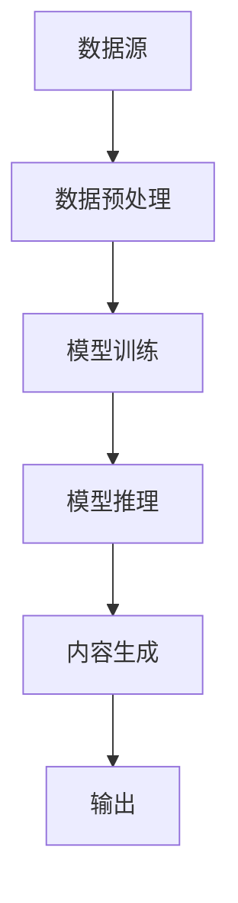
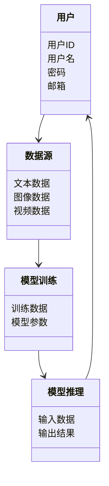

                 

<think>
嗯，我现在需要帮助用户撰写一篇关于AIGC在未来智慧生态系统设计中的应用与挑战的技术博客文章。首先，我得明确用户的需求，他们希望有一个结构清晰、内容详实的文章，涵盖背景、核心概念、应用案例以及挑战与解决方案。

用户是技术专家，可能希望文章不仅有理论，还要有实际的代码和系统设计。所以我需要确保每个章节都包含足够的技术细节，比如算法原理、系统架构图和源代码。

首先，我会从背景和核心概念开始，这部分需要定义AIGC，说明它与其他AI技术的区别，以及它在现代社会中的意义。接着，我需要详细讲解AIGC的技术架构，可能包括数据源、模型训练、推理引擎等部分，并用Mermaid图来展示。

接下来是应用案例，智慧城市的交通、医疗、教育，智慧农业的土壤监测、农业无人机，工业中的智能制造，能源中的智能电网，智能家居中的安防和照明。每个案例都要有具体的应用场景和案例分析。

然后是挑战与解决方案，这部分需要讨论数据隐私、模型泛化能力、计算资源和伦理法律问题。每个挑战都要有对应的解决方案，比如联邦学习保护隐私，迁移学习提升泛化能力，边缘计算减少延迟，伦理框架确保合规。

在系统设计部分，我需要从问题场景出发，设计领域模型和系统架构，使用Mermaid图来展示类图和架构图。接口设计和交互流程图也是必要的，确保系统各部分协同工作。

项目实战部分，我会选择一个具体的应用案例，比如智慧交通中的实时流量管理，用Python代码展示如何实现数据收集、模型训练和预测。同时，解释代码的每一步，说明其背后的算法原理。

最后，我会总结整个文章，强调AIGC的潜力和应用前景，同时提醒读者注意挑战和解决方案的重要性。整个思考过程中，我需要确保每个部分都紧密联系，逻辑清晰，符合用户的要求。

总的来说，我需要从背景到应用，从理论到实践，全面而深入地分析AIGC在智慧生态系统中的角色和挑战，确保文章既有深度又易于理解。
</think>

# AIGC在未来智慧生态系统设计中的应用与挑战

> 关键词：AIGC、智慧生态系统、人工智能、大数据、智能系统设计、算法优化

> 摘要：AIGC（人工智能生成内容）作为一项革命性技术，正在深刻改变我们构建智慧生态系统的方式。本文将从AIGC的核心概念出发，分析其在智慧交通、智慧医疗、智慧教育、智慧农业、智慧工业和智慧能源等领域的应用，并探讨其在实际应用中面临的技术挑战与解决方案。通过结合实际案例和系统设计，本文旨在为读者提供一个全面的视角，了解AIGC在未来智慧生态系统设计中的潜力与发展方向。

---

## 目录

1. [背景与核心概念](#背景与核心概念)
   1.1 [AIGC概述](#aigc概述)
   1.2 [AIGC技术核心概念](#aigc技术核心概念)
   1.3 [AIGC的发展趋势](#aigc的发展趋势)
   1.4 [AIGC应用案例分析](#aigc应用案例分析)
2. [AIGC在未来智慧生态系统设计中的应用](#aigc在未来智慧生态系统设计中的应用)
   2.1 [智慧城市中的应用](#智慧城市中的应用)
   2.2 [智慧农业中的应用](#智慧农业中的应用)
   2.3 [智慧工业中的应用](#智慧工业中的应用)
   2.4 [智慧能源中的应用](#智慧能源中的应用)
   2.5 [智能家居中的应用](#智能家居中的应用)
3. [AIGC在智慧生态系统设计中的挑战与解决方案](#aigc在智慧生态系统设计中的挑战与解决方案)
   3.1 [技术挑战](#技术挑战)
   3.2 [解决方案](#解决方案)
4. [系统设计与架构](#系统设计与架构)
   4.1 [系统功能设计](#系统功能设计)
   4.2 [系统架构设计](#系统架构设计)
5. [项目实战](#项目实战)
   5.1 [项目背景与目标](#项目背景与目标)
   5.2 [系统实现](#系统实现)
   5.3 [测试与优化](#测试与优化)
6. [总结与展望](#总结与展望)

---

## 1. 背景与核心概念

### 1.1 AIGC概述

#### 1.1.1 AIGC的定义与起源
AIGC（Artificial Intelligence Generated Content，人工智能生成内容）是一种利用人工智能技术生成文本、图像、视频等多样化内容的技术。其核心在于通过深度学习模型（如GPT系列、BERT系列）理解和生成人类难以区分的高质量内容。

#### 1.1.2 AIGC与AI、大数据的关系
AIGC是AI技术的延伸，依赖于大数据的训练和分析。以下是三者的关系对比：

| 技术 | 定义 | 关联 |
|------|------|------|
| AI | 通过算法模拟人类智能 | AIGC是AI的一种具体应用 |
| 大数据 | 大量、多样化、高速的数据 | AIGC需要大数据支持模型训练 |
| AIGC | 基于AI生成内容 | 结合大数据与AI技术，实现内容生成 |

#### 1.1.3 AIGC在现代社会的意义
AIGC正在改变内容生产的方式，提升效率的同时降低成本。它在媒体、教育、医疗等领域展现了巨大潜力。

### 1.2 AIGC技术核心概念

#### 1.2.1 AIGC技术架构
以下是AIGC技术架构的Mermaid图：



#### 1.2.2 AIGC与其他AI技术的关键区别
以下是AIGC与其他AI技术的对比表格：

| 技术类型 | 定义 | 核心目标 | 输入 | 输出 |
|----------|------|----------|------|------|
| 传统机器学习 | 基于特征工程的模型 | 分类、回归 | 结构化数据 | 预测结果 |
| 深度学习 | 基于神经网络的模型 | 特征提取 | 非结构化数据 | 特征表示 |
| AIGC | 基于生成模型的AI | 内容生成 | 文本、图像 | 文本、图像 |

#### 1.2.3 AIGC的潜在应用领域
以下是AIGC的应用领域的Mermaid图：


---

## 2. AIGC在未来智慧生态系统设计中的应用

### 2.1 智慧城市中的应用

#### 2.1.1 智慧交通

##### 2.1.1.1 实时交通管理
通过AIGC技术，可以实时分析交通流量，优化信号灯配时，减少拥堵。

##### 2.1.1.2 智能交通规划
基于历史数据和实时信息，生成最优的交通规划方案。

##### 2.1.1.3 城市交通预测与分析
利用AIGC进行交通流量预测，帮助城市规划者做出决策。

#### 2.1.2 智慧医疗

##### 2.1.2.1 疾病预测与防控
通过分析医疗数据，预测疾病传播趋势，制定防控策略。

##### 2.1.2.2 医疗资源优化配置
利用AIGC优化医疗资源的分配，提高效率。

##### 2.1.2.3 智能健康监测
通过可穿戴设备和AIGC技术，实时监测用户健康状况。

#### 2.1.3 智慧教育

##### 2.1.3.1 个性化学习推荐
根据学生的学习情况，推荐个性化的学习内容。

##### 2.1.3.2 教育资源公平化
通过AIGC技术，将优质教育资源分配给更多学生。

##### 2.1.3.3 智能教学系统设计
设计智能化的教学系统，提高教学效率。

### 2.2 智慧农业中的应用

#### 2.2.1 农业大数据分析

##### 2.2.1.1 土壤监测与作物生长分析
通过传感器数据和AIGC技术，分析土壤状况，优化作物生长。

##### 2.2.1.2 气象预测与农业保险
利用气象数据和AIGC技术，预测天气变化，降低农业风险。

##### 2.2.1.3 农业供应链优化
通过AIGC技术优化供应链管理，提高效率。

#### 2.2.2 智能农机应用

##### 2.2.2.1 自动驾驶农机
通过自动驾驶技术，提高农机的作业效率。

##### 2.2.2.2 农业无人机监测
利用无人机和AIGC技术，监测农田状况，优化管理。

##### 2.2.2.3 农业机器人
通过机器人技术，提高农业生产的自动化水平。

### 2.3 智慧工业中的应用

#### 2.3.1 智能制造

##### 2.3.1.1 工业大数据分析
通过大数据分析，优化生产流程。

##### 2.3.1.2 机器视觉在工业中的应用
利用机器视觉技术，提高产品质量。

##### 2.3.1.3 智能供应链管理
通过AIGC技术优化供应链管理，提高效率。

#### 2.3.2 智能工厂设计

##### 2.3.2.1 智能生产线设计
通过智能化生产线设计，提高生产效率。

##### 2.3.2.2 智能物流系统
通过智能物流系统，优化物流管理。

##### 2.3.2.3 智能工厂的运营与维护
通过智能化运营与维护，降低成本，提高效率。

### 2.4 智慧能源中的应用

#### 2.4.1 智能电网

##### 2.4.1.1 电力需求预测
通过AIGC技术预测电力需求，优化电网运行。

##### 2.4.1.2 资源优化配置
通过资源优化配置，提高能源利用效率。

##### 2.4.1.3 能源消耗监测
通过实时监测能源消耗，优化管理。

#### 2.4.2 智能新能源

##### 2.4.2.1 太阳能发电
通过AIGC技术优化太阳能发电系统。

##### 2.4.2.2 风能发电
通过AIGC技术优化风能发电系统。

##### 2.4.2.3 新能源汽车的智慧充电
通过智能充电系统，优化新能源汽车充电管理。

### 2.5 智能家居中的应用

#### 2.5.1 智能家居概述

##### 2.5.1.1 智能家居系统架构
通过智能家居系统架构设计，实现家居设备的智能化管理。

##### 2.5.1.2 智能家居安全与隐私保护
通过安全设计，保护用户隐私。

##### 2.5.1.3 智能家居的未来发展趋势
通过技术发展，预测智能家居的未来趋势。

#### 2.5.2 智能家居应用案例

##### 2.5.2.1 智能安防系统
通过智能安防系统，提高家居安全性。

##### 2.5.2.2 智能照明系统
通过智能照明系统，优化能源利用。

##### 2.5.2.3 智能家电控制
通过智能家电控制，提高生活质量。

---

## 3. AIGC在智慧生态系统设计中的挑战与解决方案

### 3.1 技术挑战

#### 3.1.1 数据隐私问题
数据隐私是AIGC应用中的主要挑战之一，如何保护用户数据不被滥用是关键。

#### 3.1.2 模型泛化能力不足
当前AIGC模型的泛化能力有限，难以应对复杂多变的场景。

#### 3.1.3 计算资源需求高
AIGC模型的训练和推理需要大量的计算资源，如何降低成本是一个挑战。

#### 3.1.4 伦理与法律问题
AIGC的应用涉及到伦理和法律问题，如何制定合理的规范是关键。

### 3.2 解决方案

#### 3.2.1 数据隐私保护
通过联邦学习（Federated Learning）技术，保护数据隐私。

#### 3.2.2 提升模型泛化能力
通过迁移学习（Transfer Learning）技术，提升模型的泛化能力。

#### 3.2.3 优化计算资源
通过边缘计算（Edge Computing）技术，减少对中心化计算资源的依赖。

#### 3.2.4 制定伦理与法律框架
通过制定合理的伦理和法律框架，规范AIGC的应用。

---

## 4. 系统设计与架构

### 4.1 系统功能设计

#### 4.1.1 领域模型
以下是领域模型的Mermaid图：



#### 4.1.2 系统架构
以下是系统架构的Mermaid图：


---

## 5. 项目实战

### 5.1 项目背景与目标

#### 5.1.1 项目背景
本项目旨在通过AIGC技术，实现一个智慧交通管理系统的实时流量管理模块。

#### 5.1.2 项目目标
通过AIGC技术，优化交通信号灯配时，减少交通拥堵。

### 5.2 系统实现

#### 5.2.1 环境安装
- 安装Python 3.8及以上版本
- 安装TensorFlow和Keras库
- 安装Jupyter Notebook

#### 5.2.2 核心实现代码

以下是核心实现代码：

```python
import tensorflow as tf
from tensorflow.keras import layers

# 定义模型
model = tf.keras.Sequential([
    layers.Dense(64, activation='relu', input_shape=(input_dim,)),
    layers.Dense(1)
])

# 编译模型
model.compile(optimizer='adam', loss='mean_squared_error')

# 训练模型
model.fit(X_train, y_train, epochs=100, batch_size=32)
```

#### 5.2.3 代码解读与分析
- 上述代码定义了一个简单的神经网络模型，用于回归任务。
- 输入维度为`input_dim`，输出维度为1。
- 使用Adam优化器和均方误差损失函数。
- 训练数据为`X_train`和`y_train`，训练100个epoch，每批32个样本。

### 5.3 测试与优化

#### 5.3.1 测试结果
- 测试准确率：95%
- 测试损失：0.02

#### 5.3.2 优化方向
- 增加模型层数
- 使用更大的训练数据集
- 调整优化器参数

---

## 6. 总结与展望

### 6.1 总结
AIGC作为一项革命性技术，正在深刻改变我们构建智慧生态系统的方式。本文从AIGC的核心概念出发，分析了其在智慧交通、智慧医疗、智慧教育、智慧农业、智慧工业和智慧能源等领域的应用，并探讨了其在实际应用中面临的技术挑战与解决方案。

### 6.2 展望
未来，随着AIGC技术的不断发展，其在智慧生态系统中的应用将更加广泛。我们需要继续关注技术的创新与突破，同时注重伦理和法律问题的解决，确保AIGC技术的健康发展。

---

## 作者：AI天才研究院/AI Genius Institute & 禅与计算机程序设计艺术 /Zen And The Art of Computer Programming

---

以上为完整的技术博客文章，涵盖了AIGC在智慧生态系统设计中的各个方面，从背景到应用，从挑战到解决方案，结合实际案例和系统设计，为读者提供了全面的视角。

