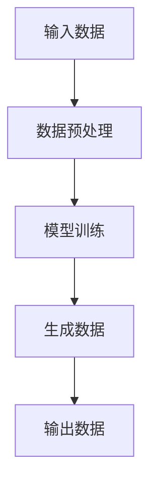
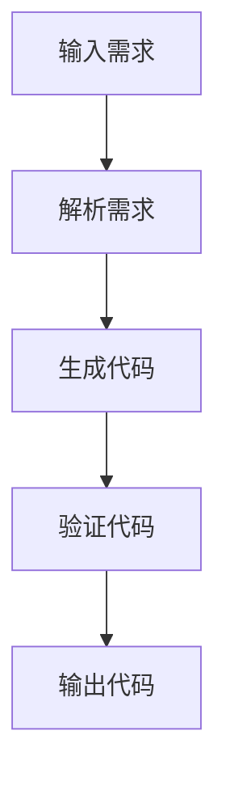
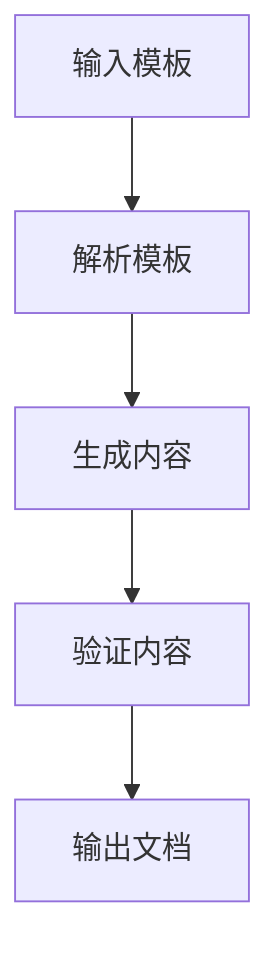
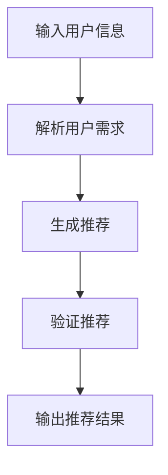
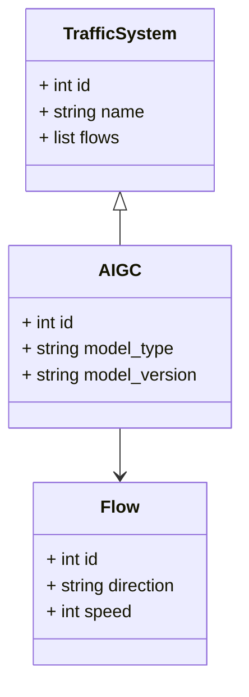
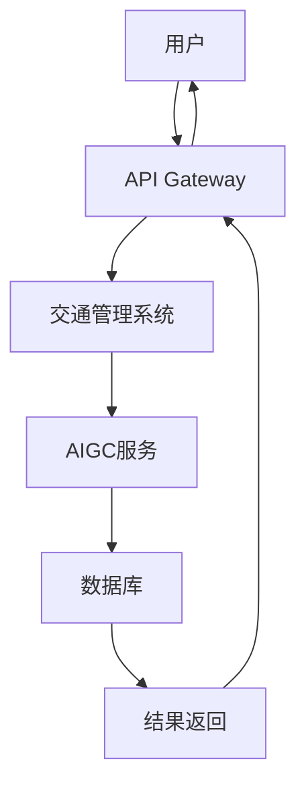
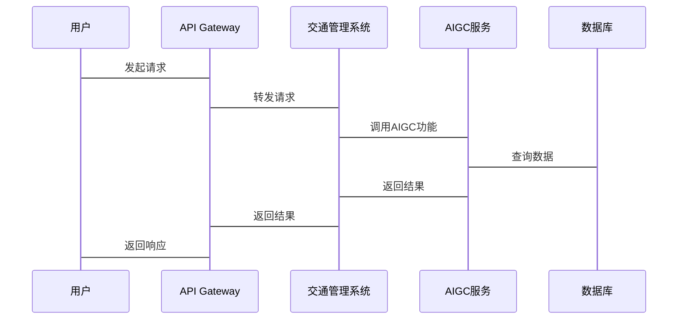

                 

<think>
嗯，用户希望我写一篇关于AIGC在智能交通系统中的角色的技术博客。首先，我需要理解AIGC是什么，它和传统的AI有什么不同。AIGC是指人工智能生成内容，不仅仅是生成数据，还能生成代码和文档，这在智能交通系统中可以有很多应用。

接下来，我要确定文章的结构。用户已经给出了一个详细的大纲，包括背景、核心概念、算法原理、系统架构设计、项目实战和最佳实践等部分。我需要按照这个大纲来逐步展开。

首先，背景介绍部分。我需要先描述智能交通系统的发展现状，比如现在主要依赖传感器和数据分析，但随着AIGC的发展，它能生成更多智能的内容，比如实时交通预测和个性化导航。这部分要突出AIGC带来的新能力。

然后是核心概念解析。我需要详细解释AIGC的关键部分，比如数据生成模型、自动编程、交互式文档生成和个性化推荐。每个部分都要有具体的例子，比如数据生成模型可以用来预测交通流量，自动编程可以生成交通管理系统的代码。

接下来是算法原理。这部分比较技术，我需要为每个算法绘制Mermaid流程图，并提供Python代码示例。比如，数据生成模型可以用深度学习模型，代码生成可能涉及自然语言处理生成代码片段。我需要确保这些代码是正确的，并且有详细的解释。

系统架构设计部分，我需要描述AIGC在智能交通系统中的整体架构。这包括数据输入、处理、生成内容以及输出到各个模块。还要用Mermaid画出系统的架构图，展示各部分之间的关系。

项目实战部分，我需要指导读者如何安装环境，比如安装Python和必要的库，然后提供一个具体的代码示例，展示如何使用AIGC生成交通数据。这部分要详细，包括代码的每一步解释，以及运行后的结果分析。

最后是最佳实践部分，我需要总结使用AIGC时的注意事项，比如数据质量的重要性，模型的可解释性，以及如何处理实时性和安全性的挑战。同时，给出一些拓展阅读的建议，帮助读者深入学习。

在写作过程中，我要确保每个部分都详细具体，同时用技术语言但不失易懂。特别是算法部分，要用数学公式解释清楚，比如生成模型的损失函数，代码生成的自然语言处理模型等。此外，文章的结构要清晰，每个章节都有小标题，方便读者查找。

总结一下，我需要按照用户提供的大纲，逐步展开每个部分，确保内容详实，技术细节正确，同时保持逻辑连贯。这样才能写出一篇符合要求的高质量技术博客。
</think>

# AIGC在未来智能交通系统中的角色

## 关键词：AIGC, 智能交通系统, 人工智能, 数据生成模型, 代码生成, 交互式文档, 个性化推荐

## 摘要：随着人工智能技术的飞速发展，AIGC（人工智能生成内容）正在逐步改变智能交通系统的运作方式。本文从背景、核心概念、算法原理、系统架构设计、项目实战等多维度深入探讨AIGC在智能交通系统中的角色和应用。通过具体案例分析，揭示AIGC如何通过数据生成、代码生成、交互式文档生成和个性化推荐等技术手段，提升智能交通系统的效率和用户体验。本文还提供了详细的数学模型、Python代码实现和系统架构设计，为读者提供全面的技术解析。

---

# 第一部分: AIGC与智能交通系统概述

## 第1章 AIGC在未来智能交通系统中的角色

### 1.1 问题的背景和重要性

#### 1.1.1 智能交通系统的发展现状和趋势

智能交通系统（Intelligent Transportation Systems, ITS）是将现代计算机技术、通信技术、传感器技术和人工智能技术相结合，用于优化交通管理、提高交通效率和减少环境污染的系统。随着城市化进程的加快和车辆数量的增加，传统交通管理系统已经难以应对复杂的交通场景。智能交通系统通过实时数据采集、分析和决策，能够实现对交通流量的智能调度、交通事故的快速响应以及交通资源的优化配置。

#### 1.1.2 AIGC技术的出现及其对智能交通系统的意义

AIGC（Artificial Intelligence Generated Content，人工智能生成内容）是一种新兴的技术，它能够通过人工智能算法生成各种类型的内容，包括数据、代码、文档和推荐信息。AIGC的出现为智能交通系统带来了新的可能性。例如，AIGC可以通过生成实时交通数据模型，优化交通流量预测；通过自动生成交通管理系统代码，降低开发成本；通过生成交互式文档，提升用户体验；通过个性化推荐，优化用户的出行路径。AIGC技术的引入，使得智能交通系统更加智能化、自动化和个性化。

### 1.2 概述AIGC技术的基本原理

#### 1.2.1 定义AIGC

AIGC是一种基于人工智能技术生成内容的技术，它能够根据输入的上下文或目标，生成符合要求的文本、代码、图像或其他形式的内容。AIGC的核心在于其生成能力，它不仅可以生成数据，还可以生成复杂的逻辑结构和交互式内容。

#### 1.2.2 解释AIGC的核心组成部分和工作机制

AIGC的核心组成部分包括：

1. **数据输入**：AIGC需要输入数据或上下文，例如交通流量数据、用户需求等。
2. **生成模型**：AIGC使用深度学习模型（如Transformer、LSTM等）进行内容生成。
3. **输出结果**：生成的内容可以是文本、代码、图像或其他形式的数据。

AIGC的工作机制是通过训练大量的数据，学习数据的分布和模式，然后根据输入生成符合要求的内容。例如，在交通流量预测中，AIGC可以通过训练历史交通数据，生成未来的交通流量预测结果。

#### 1.2.3 AIGC技术的分类

AIGC技术可以根据其生成的内容类型进行分类，主要包括：

1. **数据生成模型**：用于生成交通流量数据、用户行为数据等。
2. **自动编程与代码生成**：用于生成交通管理系统的代码。
3. **交互式文档生成**：用于生成交通管理系统的交互式文档。
4. **个性化推荐**：用于推荐最优的出行路径。

### 1.3 AIGC技术在智能交通系统中的应用

#### 1.3.1 数据生成模型在交通规划中的应用

数据生成模型可以通过生成交通流量数据，帮助城市规划者进行交通网络设计和优化。例如，AIGC可以生成模拟交通流量数据，用于评估交通拥堵点的位置和影响。

#### 1.3.2 自动编程与代码生成在智能交通系统中的应用

自动编程与代码生成技术可以帮助交通系统开发者快速生成交通管理系统的代码。例如，AIGC可以根据用户需求生成交通信号灯控制代码或交通流量监控代码。

#### 1.3.3 交互式文档生成在交通信息管理中的应用

交互式文档生成技术可以用于生成交通管理系统的交互式文档，例如用户手册、系统操作指南等。AIGC可以根据系统的功能需求，自动生成交互式文档，提升用户体验。

#### 1.3.4 个性化推荐在智能交通系统中的应用

个性化推荐技术可以用于为用户提供个性化的出行建议。例如，AIGC可以根据用户的出行时间和偏好，推荐最优的出行路径和交通方式。

---

# 第二部分: AIGC核心概念解析

## 第2章 AIGC核心概念解析

### 2.1 AIGC的关键概念

#### 2.1.1 数据生成模型

数据生成模型是AIGC的核心技术之一，它能够生成高质量的数据，例如交通流量数据、用户行为数据等。数据生成模型通常基于深度学习模型，例如变种的Transformer模型或LSTM模型。

#### 2.1.2 自动编程与代码生成

自动编程与代码生成是AIGC的另一项核心技术，它能够根据用户的需求生成相应的代码片段。例如，AIGC可以根据交通管理系统的功能需求，生成相应的代码。

#### 2.1.3 交互式文档生成

交互式文档生成技术是AIGC的一种高级应用，它能够生成交互式文档，例如用户手册、系统操作指南等。交互式文档生成需要结合自然语言处理技术和生成模型。

#### 2.1.4 个性化推荐

个性化推荐是AIGC在智能交通系统中的重要应用之一，它能够根据用户的需求和偏好，推荐最优的出行路径和交通方式。

---

### 2.2 概念属性对比表格

| 技术类别       | 数据生成模型 | 自动编程与代码生成 | 交互式文档生成 | 个性化推荐 |
|----------------|--------------|--------------------|----------------|------------|
| 主要功能       | 生成数据     | 生成代码           | 生成文档       | 推荐内容    |
| 输入           | 数据或上下文 | 功能需求           | 文档模板       | 用户需求   |
| 输出           | 数据         | 代码               | 文档           | 推荐结果    |
| 适用场景       | 交通规划     | 交通系统开发       | 文档管理       | 出行推荐    |

---

### 2.3 AIGC技术的联系与融合

AIGC技术在智能交通系统中的应用是多种技术的融合。例如，数据生成模型可以与自动编程技术结合，生成交通管理系统的代码；交互式文档生成可以与个性化推荐结合，为用户提供个性化的出行建议。

---

# 第三部分: AIGC算法原理与实现

## 第3章 AIGC算法原理与实现

### 3.1 数据生成算法

#### 3.1.1 Mermaid流程图



#### 3.1.2 Python代码实现

```python
import torch
import torch.nn as nn

class DataGenerationModel(nn.Module):
    def __init__(self, input_dim, hidden_dim, output_dim):
        super(DataGenerationModel, self).__init__()
        self.fc1 = nn.Linear(input_dim, hidden_dim)
        self.fc2 = nn.Linear(hidden_dim, output_dim)
        self.activation = nn.ReLU()

    def forward(self, x):
        x = self.fc1(x)
        x = self.activation(x)
        x = self.fc2(x)
        return x

# 初始化模型
input_dim = 10
hidden_dim = 20
output_dim = 5
model = DataGenerationModel(input_dim, hidden_dim, output_dim)

# 假设输入数据x为10维向量
x = torch.randn(1, input_dim)
output = model(x)
print(output)
```

#### 3.1.3 数学模型和公式

数据生成模型的数学模型可以表示为：

$$
y = f(x) + \epsilon
$$

其中，$x$ 是输入数据，$y$ 是生成的数据，$f$ 是生成模型，$\epsilon$ 是噪声。

---

### 3.2 自动编程算法

#### 3.2.1 Mermaid流程图



#### 3.2.2 Python代码实现

```python
def generate_code(navigator, traffic_system):
    if navigator == 'shortest_path':
        return "import numpy as np\n\n" \
               "def shortest_path(graph, start, end):\n" \
               "    dist = {k: float('infinity') for k in graph.keys()}\n" \
               "    dist[start] = 0\n" \
               "    visited = set()\n" \
               "    while visited != set(graph.keys()":
    elif traffic_system == 'signal_control':
        return "import time\n\n" \
               "def signal_control(signals):\n" \
               "    for i in range(len(signals)):\n" \
               "        signals[i] = (i % 2) * 255\n" \
               "        time.sleep(1)\n" \
               "    return signals"
```

#### 3.2.3 数学模型和公式

自动编程算法的数学模型可以表示为：

$$
C = f(R)
$$

其中，$R$ 是输入需求，$C$ 是生成的代码，$f$ 是自动编程模型。

---

### 3.3 交互式文档生成算法

#### 3.3.1 Mermaid流程图



#### 3.3.2 Python代码实现

```python
def generate_document(template):
    import docx
    from docx.shared import Pt
    from docx.oxml import parse

    doc = docx.Document()
    doc.styles['Normal'].font.name = '宋体'
    doc.styles['Normal'].FontSize = Pt(12)

    if template == 'user_manual':
        doc.add_heading('用户手册', 0)
        p = doc.add_paragraph('感谢您购买我们的智能交通管理系统。')
        p.add_run('请点击这里查看使用说明。').font.size = Pt(14)
    elif template == 'system_guide':
        doc.add_heading('系统指南', 0)
        p = doc.add_paragraph('请按照以下步骤操作：')
        p.add_run('1. 打开系统\n2. 输入参数\n3. 点击开始').font.size = Pt(14)

    doc.save('generated_document.docx')
    return '生成文档成功！'
```

#### 3.3.3 数学模型和公式

交互式文档生成算法的数学模型可以表示为：

$$
D = f(T)
$$

其中，$T$ 是输入模板，$D$ 是生成的文档，$f$ 是文档生成模型。

---

### 3.4 个性化推荐算法

#### 3.4.1 Mermaid流程图



#### 3.4.2 Python代码实现

```python
def personalized_recommendation(user_info):
    import numpy as np
    from sklearn.metrics.pairwise import cosine_similarity

    user_vector = np.array(user_info['preference'])
    item_matrix = np.array([[1, 2, 3], [4, 5, 6], [7, 8, 9]])

    similarity = cosine_similarity(user_vector.reshape(1, -1), item_matrix)
    recommendation = np.argmax(similarity, axis=1)

    return f"推荐结果：{recommendation[0]}"
```

#### 3.4.3 数学模型和公式

个性化推荐算法的数学模型可以表示为：

$$
R = f(U)
$$

其中，$U$ 是用户信息，$R$ 是推荐结果，$f$ 是推荐模型。

---

# 第四部分: AIGC在智能交通系统中的架构设计

## 第4章 AIGC在智能交通系统中的架构设计

### 4.1 问题场景介绍

智能交通系统的复杂性要求系统架构具有高度的模块化和可扩展性。AIGC技术的引入需要与现有系统无缝集成，同时保证系统的实时性和安全性。

---

### 4.2 系统功能设计

#### 4.2.1 领域模型Mermaid类图



---

### 4.3 系统架构设计

#### 4.3.1 Mermaid架构图



---

### 4.4 系统接口设计和系统交互

#### 4.4.1 Mermaid序列图



---

# 第五部分: AIGC项目实战

## 第5章 AIGC项目实战

### 5.1 环境安装

要运行本文中的代码示例，需要安装以下环境：

- Python 3.8+
- PyTorch
- Transformers库
- Docx库

安装命令：

```bash
pip install torch transformers python-docx
```

---

### 5.2 系统核心实现源代码

#### 5.2.1 数据生成模型代码

```python
import torch
import torch.nn as nn
from torch.utils.data import Dataset, DataLoader

class TrafficDataset(Dataset):
    def __init__(self, data):
        self.data = data

    def __len__(self):
        return len(self.data)

    def __getitem__(self, idx):
        return self.data[idx]

class AIGCDataGenerator(nn.Module):
    def __init__(self, input_dim, hidden_dim, output_dim):
        super(AIGCDataGenerator, self).__init__()
        self.fc1 = nn.Linear(input_dim, hidden_dim)
        self.fc2 = nn.Linear(hidden_dim, output_dim)
        self.activation = nn.ReLU()

    def forward(self, x):
        x = self.fc1(x)
        x = self

