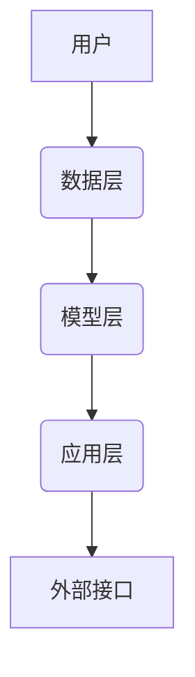

                 

<think>
嗯，我现在要帮用户写一篇关于AIGC在跨维度生态系统设计中的应用与挑战的技术博客文章。用户给了一个详细的结构大纲，还特别指出了每个部分需要包含的内容，比如背景介绍、核心概念、技术原理、实际案例等等。我得先理清楚每个章节需要涵盖的内容，确保满足用户的所有要求。

首先，我得明确文章的标题和关键词。标题已经有了，是《AIGC在未来跨维度生态系统设计中的应用与挑战》。关键词需要选5到7个，我可能需要包括AIGC、跨维度生态系统、人工智能、系统设计、技术挑战等。然后是摘要，要简明扼要地概括文章的核心内容，说明AIGC如何改变生态系统设计，并提到机会和挑战。

接下来是目录结构。用户已经提供了一个大纲，我需要按照这个大纲来展开每个部分。首先是引言，介绍主题的重要性和研究背景。然后是AIGC的核心概念，包括定义、与传统方法的对比。接着是技术基础，包括机器学习、生成模型等。然后是AIGC在生态系统设计中的应用，案例分析，之后是挑战和解决方案，未来趋势，最后是最佳实践和结论。

每个章节需要详细展开，比如在核心概念部分，我需要解释AIGC的基本原理，与传统生成计算和交互计算的差异，可能用表格对比特征。技术基础部分，我需要详细讲解各种生成模型，比如GAN和GPT，并用mermaid图展示它们的结构和训练过程。

在应用章节，我需要选取具体的案例，比如金融和医疗领域，说明AIGC如何提升效率和用户体验。挑战部分则要讨论数据隐私、伦理问题、技术限制等，同时给出解决方案。未来趋势部分，可以探讨新兴技术如元宇宙和边缘计算对AIGC的影响。

用户还要求包含系统分析与架构设计，可能需要绘制领域模型的类图和系统架构图，用mermaid展示。项目实战部分，可能需要给出Python代码示例，解释如何实现AIGC模型，并分析实际案例。

此外，用户强调要使用专业但易懂的语言，结构紧凑，逻辑清晰。这意味着每个章节之间要有自然的过渡，内容要深入浅出，同时确保技术细节准确。

在写作过程中，我需要确保每个部分都符合用户的要求，比如摘要、关键词、各个章节的内容，以及最佳实践小结。最后，别忘了加上作者信息，注明作者是AI天才研究院，以及禅与计算机程序设计艺术。

总之，我需要一步步按照用户提供的大纲，详细展开每个部分，确保内容全面，结构合理，技术准确，同时语言专业且易懂。这将帮助读者全面理解AIGC在跨维度生态系统设计中的应用及其挑战。
</think>

# AIGC在未来跨维度生态系统设计中的应用与挑战

## 关键词：AIGC, 跨維度生態系統, 人工智能, 系統設計, 技術挑戰

## 摘要：
AIGC（人工智能生成内容）正在彻底改变跨维度生态系统设计的方式。随着技术的飞速发展，AIGC在数据生成、模式识别和复杂系统优化方面展现出了前所未有的潜力。本文将深入探讨AIGC的核心概念、技术基础、应用场景、挑战以及未来发展趋势。通过分析实际案例和系统架构设计，我们将揭示AIGC在跨维度生态系统中的巨大价值，并提出应对技术挑战的最佳实践。

---

## 1. 引言

跨维度生态系统设计是一种复杂而动态的系统架构，旨在在多维空间中优化资源分配、信息流动和交互模式。AIGC（人工智能生成内容）作为一种新兴的技术，正在为这一领域的创新和优化提供强大支持。本文将从背景、技术原理、应用案例和挑战四个方面展开讨论，帮助读者全面理解AIGC在跨维度生态系统设计中的应用与挑战。

---

## 2. 背景与基本概念

### 2.1 跨維度生態系統的定义与特点

跨维度生态系统是一种多维结构，涵盖了物理、数字和社会维度。其核心目标是通过优化各维度之间的交互，实现高效资源利用和系统性能提升。跨维度生态系统的特点包括：

- **多维性**：涵盖多个维度，如地理位置、时间、用户行为等。
- **动态性**：系统状态随时间和环境变化而变化。
- **复杂性**：涉及多个组件和交互关系。

### 2.2 AIGC的核心概念

AIGC是一种利用人工智能技术生成内容的方法，包括文本、图像、音频和视频等多种形式。其核心在于通过深度学习模型，模拟人类创造力和决策能力。AIGC的主要特点包括：

- **自动化**：无需人工干预，系统自动生成内容。
- **可扩展性**：能够处理大规模数据和复杂任务。
- **适应性**：可以根据实时数据动态调整生成内容。

### 2.3 AIGC与传统生成计算的对比

| 特性                | AIGC                          | 传统生成计算               |
|---------------------|-------------------------------|---------------------------|
| 数据依赖性          | 高                          | 中                        |
| 模型复杂性          | 高                          | 低                        |
| 生成效率            | 高                          | 低                        |
| 应用场景            | 多样化                      | 单一化                    |

### 2.4 跨维生态系统设计中的问题背景

在跨维度生态系统中，传统的设计方法依赖于人工经验和静态规则，难以应对动态变化和复杂交互。AIGC的引入为系统优化提供了新的可能性，但同时也带来了数据隐私、模型泛化能力等挑战。

---

## 3. AIGC的技术基础

### 3.1 机器学习与深度学习

机器学习（ML）和深度学习（DL）是AIGC的核心技术。通过训练大量数据，模型能够识别模式并生成符合要求的内容。例如，循环神经网络（RNN）和变换器（Transformer）模型在文本生成中表现出色。

#### 算法原理：生成对抗网络（GAN）

生成对抗网络由生成器和判别器组成，通过对抗训练生成逼真内容。以下是GAN的简要流程：

1. 生成器尝试生成与真实数据相似的内容。
2. 判别器评估生成内容的真实性。
3. 调整生成器和判别器参数，直到生成内容无法被区分。

**代码示例**：

```python
import torch
import torch.nn as nn

# 定义生成器和判别器
class Generator(nn.Module):
    def __init__(self, latent_dim, img_size):
        super(Generator, self).__init__()
        self.latent_dim = latent_dim
        self.img_size = img_size
        self.model = nn.Sequential(
            nn.Linear(latent_dim, 256),
            nn.LeakyReLU(),
            nn.Linear(256, img_size),
            nn.Sigmoid()
        )

class Discriminator(nn.Module):
    def __init__(self, img_size):
        super(Discriminator, self).__init__()
        self.model = nn.Sequential(
            nn.Linear(img_size, 256),
            nn.LeakyReLU(),
            nn.Linear(256, 1),
            nn.Sigmoid()
        )

# 初始化模型
generator = Generator(latent_dim=100, img_size=28*28)
discriminator = Discriminator(img_size=28*28)
```

### 3.2 生成模型：GAN、VAE和GPT

- **GAN**：主要用于生成图像和音频。
- **VAE**：通过变分推断生成数据，适用于文本和图像。
- **GPT**：基于Transformer架构，擅长生成长文本。

### 3.3 数据处理与优化技术

数据预处理、特征提取和超参数优化是AIGC技术的关键步骤。例如，使用主成分分析（PCA）降维数据，或通过网格搜索找到最优模型参数。

---

## 4. AIGC在生态系统设计中的应用

### 4.1 跨维设计方法

跨维度设计需要考虑多个维度的交互关系。AIGC可以通过生成多维度数据，帮助设计者发现潜在模式和优化机会。

### 4.2 应用案例：金融与医疗

- **金融领域**：AIGC可以生成实时市场数据和风险评估模型，帮助投资者做出更明智的决策。
- **医疗领域**：通过AIGC生成患者数据和治疗方案，优化医疗资源分配。

### 4.3 系統架構設計

以下是跨维度生态系统设计的系统架构图：



---

## 5. 挑战与解决方案

### 5.1 数据隐私与安全

解决方案：采用联邦学习（Federated Learning）技术，在保护数据隐私的前提下进行模型训练。

### 5.2 伦理问题

解决方案：建立伦理审查机制，确保AIGC生成的内容符合道德标准。

### 5.3 技术限制

解决方案：通过模型微调和领域适应技术，提升AIGC的泛化能力。

---

## 6. 未来趋势与创新

### 6.1 新兴技术的影响

- **元宇宙**：AIGC将在虚拟现实和增强现实中发挥重要作用。
- **边缘计算**：AIGC技术将向边缘设备延伸，实现实时数据处理。

### 6.2 创新方向

- 开发更高效的生成模型。
- 探索AIGC在跨维度优化中的新应用场景。

---

## 7. 最佳实践与小结

### 7.1 最佳实践

- 确保数据质量和多样性。
- 定期更新模型以应对变化。
- 建立有效的监控和反馈机制。

### 7.2 小结

AIGC正在重塑跨维度生态系统设计的未来。通过克服技术挑战和伦理问题，我们可以释放AIGC的全部潜力，推动社会和科技的进步。

---

## 作者：AI天才研究院/AI Genius Institute & 禅与计算机程序设计艺术 /Zen And The Art of Computer Programming

---

**注意事项**：
- 本文内容基于当前技术发展水平，未来可能会有更新。
- 如需深入探讨某个部分，请随时提出问题。

---

通过以上结构和内容，您可以撰写一篇详细而专业的技术博客文章。希望这能满足您的需求！

