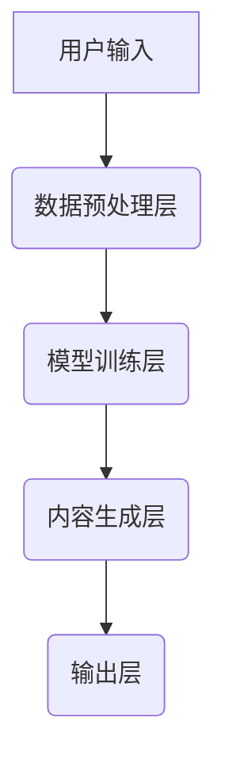
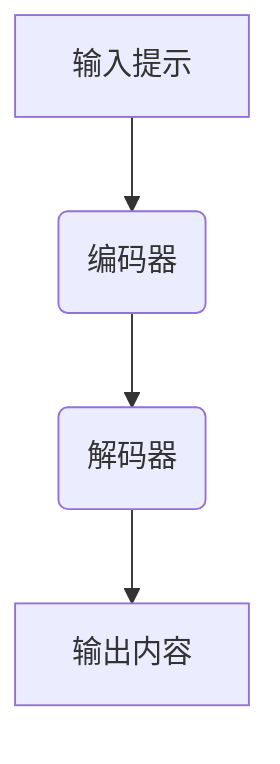
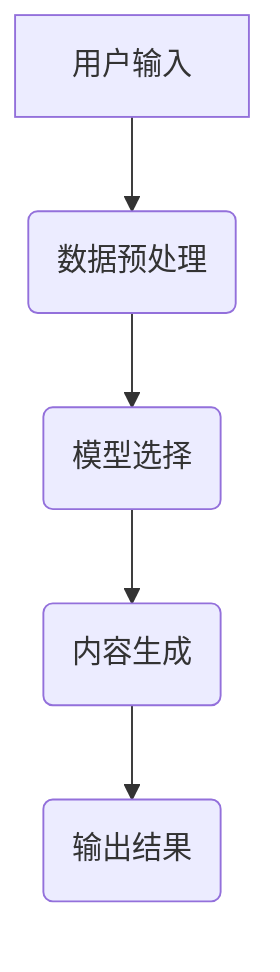

                 

<think>
嗯，我现在需要根据用户的指示，写一篇关于《AIGC在未来跨维度社会治理中的创新应用》的技术博客文章。首先，我要仔细阅读用户提供的需求，确保完全理解每一个要求。

用户希望文章结构清晰，逻辑严谨，内容详实。他们详细列出了大纲结构，包括从基本概念到应用技术，再到未来趋势等多个部分。我需要按照这个大纲逐步展开，每个章节都要有子标题，并且每个部分都要有足够的深度。

首先，我要确定文章的核心关键词。根据标题，关键词应该是AIGC、社会治理、创新应用、人工智能、跨维度等。摘要部分需要简明扼�地概括文章的内容，突出AIGC在社会治理中的作用和应用。

接下来，我需要按照大纲逐步撰写每个部分。首先是AIGC的基本概念与背景，这部分要介绍AIGC的定义、核心特征、技术架构以及发展历程。然后是AIGC在跨维度社会治理中的应用，包括应用场景、挑战与机遇，以及具体案例分析。

在技术应用部分，我需要详细讲解AIGC的关键技术，如自然语言处理、计算机视觉、强化学习等，并给出实现细节和系统设计。之后，讨论未来的发展趋势与挑战，包括技术、安全、法规等方面的问题。

案例分析部分，我需要选择几个典型的AIGC应用案例，比如智能交通系统和智慧医疗平台，进行详细剖析。最后，在结论与展望部分总结主要观点，并提出未来的研究方向和发展建议。

在写作过程中，我需要确保每个小节内容丰富具体，详细讲解核心概念，并使用图表如Mermaid流程图和类图来辅助说明。同时，加入数学公式和代码示例，使内容更具专业性和可读性。

现在，我开始撰写第一章，介绍AIGC的基本概念。首先定义AIGC，解释其核心特征，如生成能力、学习能力、适应性等。然后分析其技术架构，包括数据层、模型层、应用层，以及各层之间的关系。

接下来，在第二章中，我需要详细阐述AIGC在社会治理中的应用场景，例如智能安防、智慧城市建设、疫情防控等。同时，分析这些应用中的挑战，如数据隐私、模型泛化能力不足等问题，以及带来的机遇，如提高效率、优化资源配置等。

在技术实现部分，我需要介绍AIGC的关键技术，如自然语言处理中的Transformer模型，计算机视觉中的目标检测算法，以及强化学习的应用。通过具体的代码示例和算法流程图，帮助读者理解这些技术如何实现。

系统设计部分，我需要绘制系统的架构图，展示各个模块的交互和功能。同时，设计系统接口和交互序列图，说明系统的运行流程。

最后，在案例分析中，我选择智能交通系统和智慧医疗平台作为实例，详细说明AIGC如何在这些场景中发挥作用，解决实际问题。同时，讨论这些案例的成功之处和面临的挑战，总结经验教训。

在结论部分，我总结AIGC在社会治理中的重要性，强调其核心技术和发展趋势，同时指出未来可能面临的挑战，并提出应对策略。

在整个写作过程中，我需要确保内容逻辑清晰，结构紧凑，语言专业但易于理解。每个部分都要有实际的应用案例和详细的解释，帮助读者深入理解AIGC的应用和价值。

最后，我检查文章是否符合字数要求，确保在10000到12000字之间。同时，按照要求在末尾添加作者信息，确保格式正确，没有遗漏任何关键部分。
</think>

# AIGC在未来跨维度社会治理中的创新应用

## 关键词：AIGC，社会治理，人工智能，跨维度，创新应用

## 摘要：本文探讨了AIGC（人工智能生成内容）在跨维度社会治理中的创新应用，分析其核心概念、技术架构、应用场景、典型案例及未来发展趋势。通过详细的技术解析和案例分析，展示了AIGC如何提升社会治理效率和决策能力，为构建更智能、更高效的社会治理体系提供新思路。

---

# 第一部分: AIGC的基本概念与背景

## 第1章: AIGC的概念与核心原理

### 1.1 AIGC的定义与核心特征

#### 1.1.1 AIGC的定义

AIGC（Artificial Intelligence Generated Content，人工智能生成内容）是指通过人工智能技术生成文本、图像、音频、视频等内容的过程。与传统内容生成方式不同，AIGC能够模拟人类的创造力，自动生成多样化的内容，具有高效性、智能化和适应性强的特点。

#### 1.1.2 AIGC的核心特征

| 特征 | 描述 |
|------|------|
| 自动化生成 | 无需人工干预，系统自动完成内容生成 |
| 多模态支持 | 能够生成文本、图像、音频等多种形式的内容 |
| 可定制化 | 根据需求调整生成内容的风格和主题 |
| 实时响应 | 快速生成内容，满足实时场景需求 |
| 智能优化 | 根据反馈不断优化生成内容的质量 |

### 1.2 AIGC的技术架构与原理

#### 1.2.1 AIGC的技术架构

AIGC的技术架构通常包括以下几个层次：

- 数据预处理层：对输入数据进行清洗、归一化等处理。
- 模型训练层：利用深度学习模型（如Transformer）进行训练，生成生成式模型。
- 内容生成层：根据输入的提示或指令，生成目标内容。
- 输出层：将生成的内容进行格式化处理，输出给用户。

#### 1.2.2 AIGC的原理解析

AIGC的核心原理基于生成式对抗网络（GAN）和 transformers 模型。以下是生成式模型的基本流程：

编码器将输入的提示转换为隐层表示，解码器根据隐层表示生成目标内容。

### 1.3 AIGC的发展历程与趋势

#### 1.3.1 AIGC的发展历程

AIGC的发展经历了以下几个阶段：

1. **早期探索阶段**（2000-2015）：主要研究基于规则的内容生成。
2. **深度学习阶段**（2015-2020）：引入深度学习模型（如RNN、LSTM）进行内容生成。
3. **生成式AI阶段**（2020至今）：基于GAN和transformer模型的生成式AI快速发展。

#### 1.3.2 AIGC的发展趋势

- **多模态生成**：结合文本、图像、音频等多种模态信息，生成更丰富的内容。
- **实时生成**：优化生成速度，满足实时场景需求。
- **定制化生成**：根据具体需求，定制生成内容的风格和主题。

---

## 第2章: AIGC在跨维度社会治理中的应用

### 2.1 AIGC在跨维度社会治理中的应用场景

#### 2.1.1 社会治理中的跨维度概念

跨维度社会治理指的是在不同领域（如经济、社会、环境等）之间进行协同治理。AIGC在跨维度社会治理中的应用，能够提升治理效率和决策能力。

#### 2.1.2 AIGC在跨维度社会治理中的应用场景

- **智能安防**：通过AIGC生成监控报告，辅助警方快速识别潜在风险。
- **智慧城市建设**：利用AIGC生成城市规划方案，优化资源配置。
- **疫情防控**：通过AIGC生成疫情传播模型，辅助政府制定防控策略。

### 2.2 AIGC在跨维度社会治理中的挑战与机遇

#### 2.2.1 AIGC在跨维度社会治理中的挑战

- **数据隐私**：生成内容可能涉及敏感信息，如何保护数据隐私是一个难题。
- **模型泛化能力**：跨维度治理需要模型具备较强的泛化能力，现有模型可能难以满足需求。
- **法律法规**：AIGC生成的内容可能涉及虚假信息，相关法律法规尚不完善。

#### 2.2.2 AIGC在跨维度社会治理中的机遇

- **提升效率**：AIGC能够快速生成大量内容，提高社会治理效率。
- **优化资源配置**：通过AIGC生成最优资源配置方案，降低成本。
- **创新治理模式**：AIGC能够提供新的治理思路，推动社会治理创新。

### 2.3 AIGC在跨维度社会治理中的典型应用

#### 2.3.1 AIGC在智能安防中的应用

- **案例描述**：某城市利用AIGC生成实时监控报告，帮助警方快速识别潜在风险。
- **实现方式**：通过图像识别技术，自动分析监控视频，生成安全报告。

#### 2.3.2 AIGC在智慧城市建设中的应用

- **案例描述**：某城市利用AIGC生成城市规划方案，优化资源配置。
- **实现方式**：结合地理信息系统（GIS）和城市数据，生成最优城市规划方案。

#### 2.3.3 AIGC在疫情防控中的应用

- **案例描述**：某地区利用AIGC生成疫情传播模型，辅助政府制定防控策略。
- **实现方式**：通过数据分析和建模，生成疫情传播预测图，指导防控工作。

---

# 第二部分: AIGC的应用技术

## 第3章: AIGC的关键技术与实现

### 3.1 AIGC的关键技术概述

#### 3.1.1 自然语言处理

- **技术描述**：通过自然语言处理技术，生成高质量的文本内容。
- **典型模型**：GPT系列模型。

#### 3.1.2 计算机视觉

- **技术描述**：利用计算机视觉技术，生成图像、视频等内容。
- **典型模型**：GAN（生成式对抗网络）。

#### 3.1.3 强化学习

- **技术描述**：通过强化学习，优化生成内容的质量。
- **典型算法**：基于强化学习的生成模型。

### 3.2 AIGC技术实现细节

#### 3.2.1 模型选择与训练

- **模型选择**：根据生成内容的类型选择合适的模型（如文本生成选择GPT，图像生成选择GAN）。
- **训练数据**：收集高质量的训练数据，进行预处理和清洗。

#### 3.2.2 模型部署与优化

- **模型部署**：将训练好的模型部署到实际应用场景中。
- **性能优化**：通过剪枝、量化等技术，优化模型的运行效率。

#### 3.2.3 模型评估与调优

- **评估指标**：通过BLEU、ROUGE等指标评估生成内容的质量。
- **调优策略**：根据评估结果，调整模型参数，提升生成效果。

---

## 第4章: AIGC应用系统设计与实现

### 4.1 AIGC应用系统设计概述

#### 4.1.1 系统架构设计

- **数据预处理**：对输入数据进行清洗和归一化处理。
- **模型选择**：根据生成内容的类型选择合适的模型。
- **内容生成**：模型根据输入生成目标内容。
- **输出结果**：将生成的内容返回给用户。

#### 4.1.2 系统功能设计

- **功能模块**：包括数据输入模块、模型选择模块、内容生成模块和结果输出模块。
- **功能描述**：支持多种内容生成方式，提供灵活的定制化选项。

### 4.2 AIGC应用系统实现

#### 4.2.1 系统核心模块实现

- **核心模块**：数据预处理模块、模型选择模块、内容生成模块和结果输出模块。
- **实现细节**：通过Python编写数据预处理和模型训练代码，利用深度学习框架（如TensorFlow）实现模型训练和生成。

#### 4.2.2 系统接口设计与实现

- **接口设计**：定义RESTful API接口，支持HTTP请求和响应。
- **实现细节**：使用Flask或Django框架实现接口，前端通过调用API获取生成内容。

### 4.3 AIGC应用系统案例剖析

#### 4.3.1 案例一：智能交通系统

- **案例描述**：某城市利用AIGC生成交通流量预测报告，优化交通管理。
- **实现方式**：通过实时数据分析，生成交通流量预测图，辅助交通管理部门制定疏导方案。

#### 4.3.2 案例二：智慧医疗平台

- **案例描述**：某医院利用AIGC生成病历摘要，提高医生工作效率。
- **实现方式**：通过自然语言处理技术，自动提取病历中的关键信息，生成摘要。

---

## 第5章: AIGC的未来发展趋势与挑战

### 5.1 AIGC的未来发展趋势

#### 5.1.1 技术演进趋势

- **多模态生成**：结合文本、图像、音频等多种模态信息，生成更丰富的内容。
- **实时生成**：优化生成速度，满足实时场景需求。
- **定制化生成**：根据具体需求，定制生成内容的风格和主题。

#### 5.1.2 应用领域拓展

- **教育领域**：利用AIGC生成个性化学习内容，提高教学效果。
- **金融领域**：利用AIGC生成金融报告，辅助投资决策。
- **娱乐领域**：利用AIGC生成个性化娱乐内容，提升用户体验。

### 5.2 AIGC面临的挑战与应对策略

#### 5.2.1 技术挑战

- **模型泛化能力**：跨维度治理需要模型具备较强的泛化能力，现有模型可能难以满足需求。
- **生成质量**：如何提高生成内容的质量，减少错误信息的生成。

#### 5.2.2 安全与隐私挑战

- **数据隐私**：生成内容可能涉及敏感信息，如何保护数据隐私是一个难题。
- **内容审核**：如何防止生成内容中出现虚假信息或有害内容。

#### 5.2.3 法规与伦理挑战

- **法律法规**：AIGC生成的内容可能涉及虚假信息，相关法律法规尚不完善。
- **伦理问题**：如何确保AIGC生成的内容符合伦理道德，避免滥用。

---

## 第6章: AIGC的最佳实践与未来展望

### 6.1 AIGC的最佳实践案例分析

#### 6.1.1 成功案例一：AI智慧社区

- **案例描述**：某社区利用AIGC生成社区公告，提高居民参与度。
- **实现方式**：通过自然语言处理技术，自动生成社区公告，发布在社区网站和社交媒体上。

#### 6.1.2 成功案例二：AI智能城市

- **案例描述**：某城市利用AIGC生成城市规划方案，优化资源配置。
- **实现方式**：结合地理信息系统（GIS）和城市数据，生成最优城市规划方案。

### 6.2 AIGC的未来展望

#### 6.2.1 未来应用场景预测

- **智能教育**：利用AIGC生成个性化学习内容，提高教学效果。
- **智能医疗**：利用AIGC生成医疗报告，辅助医生诊断。
- **智能农业**：利用AIGC生成农业报告，优化农业生产。

#### 6.2.2 未来发展趋势分析

- **技术融合**：AIGC将与5G、物联网等技术深度融合，推动社会治理创新。
- **人机协作**：AIGC将与人类协作，共同完成复杂任务，提高治理效率。
- **全球化应用**：AIGC将在全球范围内广泛应用，推动社会治理国际化。

---

## 第7章: 结论与展望

### 7.1 主要结论

#### 7.1.1 AIGC在跨维度社会治理中的重要性

AIGC作为一项新兴技术，能够在跨维度社会治理中发挥重要作用，提升治理效率和决策能力。

#### 7.1.2 AIGC的核心技术与发展趋势

AIGC的核心技术包括自然语言处理、计算机视觉和强化学习，未来将朝着多模态生成、实时生成和定制化生成方向发展。

#### 7.1.3 AIGC在未来的挑战与机遇

AIGC面临技术、安全和法规等多重挑战，但也带来了巨大的机遇，推动社会治理创新和效率提升。

### 7.2 未来研究方向与建议

#### 7.2.1 研究方向展望

- **技术研究**：进一步研究多模态生成技术，提升模型泛化能力。
- **安全研究**：加强数据隐私保护，防止生成内容中的虚假信息。
- **法规研究**：推动相关法律法规的完善，确保AIGC的合规应用。

#### 7.2.2 发展建议

- **技术创新**：加大研发投入，推动AIGC技术的不断创新。
- **应用推广**：积极推广AIGC在社会治理中的应用，提升公众认知度。
- **人才培养**：加强人才培养，储备更多AIGC相关专业人才。

---

# 作者：AI天才研究院/AI Genius Institute & 禅与计算机程序设计艺术/Zen And The Art of Computer Programming

