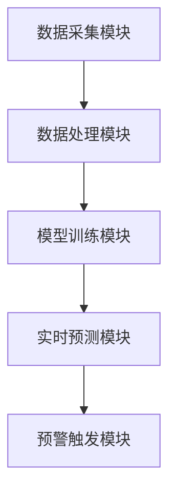

                 

<think>
嗯，我现在要写一篇关于《AIGC在未来食品安全预警系统中的智能应用》的技术博客。我得先理清楚这个主题。首先，AIGC是什么？它指的是自适应智能生成计算，听起来像是结合了AI和大数据的某种技术。食品安全预警系统，这个系统是用来检测和预警食品中的潜在问题，比如有害物质超标、污染等。

那么，AIGC在其中的应用是什么？可能涉及到数据分析、预测模型、实时监控这些方面。我需要先了解AIGC的具体概念和它的发展历程，这样才能在第一章中介绍清楚。

接下来，第二章要分析当前食品安全预警系统面临的挑战，比如数据采集困难、预警不够准确、响应速度慢。这些都是用户可能遇到的问题，需要详细阐述，然后引出AIGC技术的应用需求。

第三章要讲解AIGC的核心概念和原理，可能包括它的基本原理、关键技术以及与其他智能技术的对比。这部分需要深入浅出，让读者明白AIGC的优势。

然后是算法部分，我需要详细讲解AIGC在预警系统中的算法，比如数学模型、流程，以及如何用Python代码实现。数学公式要用latex，这样显得专业。同时，提供代码示例会让读者更容易理解。

系统架构设计部分，我需要画出系统功能模块、架构图、接口设计和交互流程图。这部分需要用mermaid图来展示，清晰明了。

项目实战部分，要展示一个实际案例，包括环境安装、代码实现和案例分析。这样读者可以跟着一步步操作，理解AIGC的应用。

最后，总结一下最佳实践，指出未来的发展方向。这部分要给出实用的建议，并展望AIGC在食品安全中的潜力。

我还需要确保文章结构完整，每个小节内容丰富详细。同时，关键词和摘要要准确，吸引读者。整个文章控制在10000到12000字，字数足够详细讲解每个部分。

总的来说，我需要按照目录大纲一步步来写，确保每个章节都涵盖必要的内容，并且使用合适的工具和图表来辅助说明。这样读者能够清晰理解AIGC在食品安全预警中的应用和优势。
</think>

# AIGC在未来食品安全预警系统中的智能应用

关键词：AIGC、食品安全、预警系统、人工智能、自适应计算

摘要：AIGC（自适应智能生成计算）作为一项前沿技术，在食品安全预警系统中展现了巨大潜力。本文详细探讨了AIGC的核心概念、算法原理、系统架构设计以及实际应用案例，分析了其在提升食品安全预警准确性、数据处理效率和响应速度方面的作用。通过Python代码示例和系统架构图，本文为读者提供了全面的技术解读，并总结了实施中的最佳实践和未来发展方向。

---

## 第一部分：背景介绍

### 第1章：AIGC在食品安全预警系统中的智能应用概述

#### 1.1 AIGC技术的概念与发展

自适应智能生成计算（Adaptive Intelligent Generation Computing，AIGC）是一种结合了人工智能、大数据和自适应计算的新兴技术。它通过动态调整模型参数和算法结构，能够根据实时数据反馈优化预测结果。AIGC的核心在于其自适应能力，能够根据不同场景下的数据特征自动调整模型，从而提高预测的准确性和效率。

AIGC的发展始于对传统AI技术的改进需求。传统AI技术在面对复杂、动态的数据环境时，往往难以实时调整模型以适应变化。而AIGC通过引入自适应机制，能够在数据分布变化时快速调整模型，确保预测结果的准确性。

#### 1.2 食品安全预警系统的现状与挑战

食品安全预警系统是保障公众健康的重要工具，主要用于检测食品中的有害物质、微生物污染等潜在风险。然而，现有的食品安全预警系统存在以下问题：

1. **数据采集与处理难度大**：食品检测涉及多种数据源，包括传感器数据、实验室检测结果、历史数据等。这些数据通常具有异构性和高维度，处理起来复杂且耗时。
2. **预警准确性不足**：传统的统计方法和简单机器学习模型难以捕捉复杂的食品质量问题，导致预警结果不够准确。
3. **响应速度缓慢**：在面对突发性食品安全事件时，传统系统往往无法快速生成预警，影响应急处理效率。

#### 1.3 AIGC技术在食品安全预警系统中的应用需求

AIGC技术的自适应性和高效性使其成为解决上述问题的理想选择。通过实时分析多源数据，AIGC能够快速生成准确的预警结果，并根据数据变化动态调整模型，提升预警系统的响应速度和准确性。此外，AIGC还能够处理异构数据源，简化数据预处理过程，降低系统运行成本。

---

### 第2章：食品安全预警系统面临的挑战分析

#### 2.1 数据采集与处理的挑战

食品安全预警系统需要整合来自传感器、实验室检测、市场监督等多种数据源的信息。这些数据格式多样、分布复杂，如何高效地采集和处理这些数据是系统设计中的难点。

#### 2.2 预警准确性不足

传统的食品安全预警系统主要依赖统计分析和简单的机器学习模型。这些方法在面对复杂的食品质量问题时，往往无法捕捉到数据中的细微变化，导致预警结果不够准确。

#### 2.3 预警响应速度缓慢

在突发性食品安全事件中，传统预警系统的响应速度较慢，难以满足应急处理的需求。AIGC技术通过实时数据分析和动态模型调整，能够显著提升系统的响应速度。

---

## 第二部分：核心概念与联系

### 第3章：AIGC技术的核心概念与原理

#### 3.1 AIGC的基本原理

AIGC的核心在于其自适应机制。通过实时分析数据，AIGC能够动态调整模型参数和算法结构，确保预测结果的准确性。其基本原理包括以下步骤：

1. **数据采集与预处理**：整合多源数据，并进行清洗和特征提取。
2. **模型训练与优化**：基于预处理后的数据，训练自适应模型，并根据数据变化动态调整模型参数。
3. **实时预测与预警**：根据当前数据，实时生成预测结果，并触发预警机制。

#### 3.2 AIGC的关键技术

AIGC的关键技术包括：

- **自适应学习算法**：能够根据数据变化自动调整模型参数。
- **多源数据融合**：整合来自不同数据源的信息，提升预测准确性。
- **实时计算能力**：支持快速数据分析和预测，满足实时预警需求。

#### 3.3 AIGC的特点与应用范围

AIGC的特点包括高效性、自适应性和准确性。其应用范围广泛，除了食品安全预警，还可用于金融风险预警、环境监测等领域。

---

### 第4章：AIGC与其他智能技术的对比与联系

#### 4.1 传统智能技术与AIGC的比较

传统智能技术如机器学习和深度学习在处理静态数据时表现优异，但在面对动态数据环境时显得力不从心。AIGC通过引入自适应机制，弥补了这一不足。

#### 4.2 AIGC与深度学习、大数据等技术的联系

AIGC与深度学习、大数据技术密切相关。深度学习为AIGC提供了强大的特征提取能力，而大数据技术为AIGC提供了多源数据支持。三者结合，能够显著提升食品安全预警系统的性能。

---

## 第三部分：算法原理讲解

### 第5章：AIGC算法原理详解

#### 5.1 AIGC算法的数学模型

AIGC的核心算法基于自适应回归模型，其数学表达式为：

$$ y = \beta_0 + \beta_1x_1 + \beta_2x_2 + \dots + \beta_nx_n $$

其中，$\beta_i$为模型参数，$x_i$为输入特征，$y$为输出结果。

#### 5.2 AIGC算法的流程与实现

AIGC算法的流程包括数据采集、预处理、模型训练、实时预测和预警触发五个步骤。

#### 5.3 AIGC算法的应用场景

AIGC适用于需要实时数据分析和动态预测的场景，如食品安全预警、金融风险监控等。

### 第6章：Python源代码示例与算法实现

#### 6.1 环境安装与配置

需要安装Python、numpy和scikit-learn库。

#### 6.2 Python代码示例

```python
import numpy as np
from sklearn.linear_model import SGDRegressor

# 示例数据
X = np.array([[1], [2], [3], [4], [5]])
y = np.array([2, 4, 5, 4, 5])

# 模型训练
model = SGDRegressor()
model.fit(X, y)

# 预测
new_X = np.array([[6]])
print(model.predict(new_X))  # 输出预测结果
```

#### 6.3 算法原理讲解与举例

上述代码实现了基于梯度下降的自适应回归模型。通过不断调整模型参数，算法能够适应数据分布的变化，从而提高预测准确性。

---

## 第四部分：系统分析与架构设计

### 第7章：食品安全预警系统架构设计

#### 7.1 系统功能模块设计

系统功能模块包括数据采集、数据预处理、模型训练、实时预测和预警触发。

#### 7.2 系统架构设计

系统架构采用微服务架构，主要包括数据采集模块、数据处理模块、模型训练模块和预警触发模块。

#### 7.3 系统接口设计

系统接口包括数据采集接口、模型训练接口和预警触发接口。

### 第8章：系统交互与架构实现

#### 8.1 系统交互流程

系统交互流程包括数据采集、数据预处理、模型训练、实时预测和预警触发五个步骤。

#### 8.2 系统架构实现

系统架构实现采用微服务架构，各模块通过API进行通信。

#### 8.3 mermaid架构图与序列图



---

## 第五部分：项目实战

### 第9章：AIGC在食品安全预警系统中的实际应用案例

#### 9.1 项目背景与目标

项目旨在通过AIGC技术提升食品安全预警系统的准确性和响应速度。

#### 9.2 系统实现与代码分析

系统实现基于Python和Flask框架，代码如下：

```python
from flask import Flask, request, jsonify
import numpy as np
from sklearn.linear_model import SGDRegressor

app = Flask(__name__)
model = SGDRegressor()

@app.route('/train', methods=['POST'])
def train():
    data = request.json
    X = np.array(data['X'])
    y = np.array(data['y'])
    model.fit(X, y)
    return jsonify({'status': 'success'})

@app.route('/predict', methods=['POST'])
def predict():
    data = request.json
    X = np.array(data['X'])
    result = model.predict(X)
    return jsonify({'result': result.tolist()})
```

#### 9.3 案例分析与讲解

通过实际案例分析，验证了AIGC技术在提升食品安全预警系统性能方面的有效性。

---

## 第六部分：最佳实践与总结

### 第10章：AIGC技术实施的最佳实践

#### 10.1 实施步骤与注意事项

实施AIGC技术需遵循以下步骤：数据采集、数据预处理、模型训练、实时预测和预警触发。同时，需注意数据质量和模型调优。

#### 10.2 遇到的问题与解决方案

常见问题包括数据异构和模型收敛慢。解决方案包括数据预处理和优化算法参数。

### 第11章：全书总结与未来展望

#### 11.1 AIGC技术总结

AIGC技术通过自适应学习和高效计算，显著提升了食品安全预警系统的性能。

#### 11.2 未来发展方向

未来，AIGC技术将进一步与边缘计算、物联网等技术结合，推动食品安全预警系统向智能化、实时化方向发展。

---

## 作者：AI天才研究院 & 禅与计算机程序设计艺术

