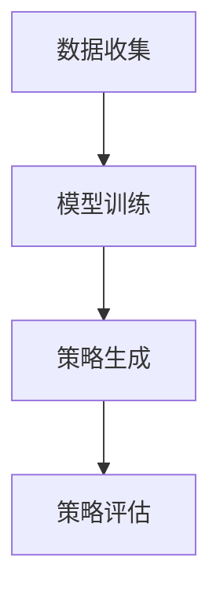
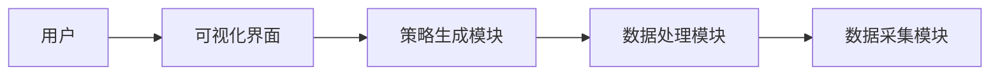

                 

<think>
好，我现在需要帮用户撰写一篇关于AIGC在海洋塑料污染研究中的应用的技术博客。首先，我得理解用户的需求。用户希望以《AIGC在海洋塑料污染研究中的应用：清理策略优化提示词》为标题，内容要专业，结构清晰，逻辑严密。

首先，我会分析用户的背景。用户可能是一位CTO或技术专家，希望深入探讨AI技术在环保领域的应用。所以，文章需要既有技术深度，又易于理解，吸引技术读者和环保人士。

接下来，我需要确定文章的结构。根据用户提供的大纲，文章分为四个主要部分：背景与核心概念、算法原理与数学模型、系统分析与架构设计，以及最佳实践与拓展。每个部分都有详细的章节，我需要确保每个章节内容充实，涵盖必要的技术细节。

在背景部分，我会先介绍海洋塑料污染的现状，包括数据、影响和解决挑战。这部分需要有实际的数据支持，比如海洋中塑料垃圾的数量，以及它们对生态系统和经济的影响。然后，我会解释AIGC是什么，它的特点和应用领域，特别是如何应用于环境科学。

接下来，核心概念部分，我需要详细讨论海洋塑料污染的识别与监测，污染物的分类，以及AIGC在清理策略中的角色。这里可能需要一些图表，比如用Mermaid画出概念之间的关系，帮助读者理解。

然后是算法原理部分，我需要解释清理策略优化的算法流程，用Mermaid绘制流程图。数学模型部分，我得写出具体的公式，并用Python代码来实现，确保读者能够理解算法是如何运作的。

在系统架构部分，我会介绍系统的功能设计、架构设计、接口设计和交互设计，可能需要绘制类图、架构图和序列图。这部分要详细说明系统如何实现AIGC的应用，确保技术细节到位。

项目实战部分，我会提供环境安装步骤，核心代码，并解释代码的功能。然后，通过实际案例分析，展示系统的实际应用效果，最后总结项目的成果和经验。

最后，最佳实践部分，我会分享优化策略、案例和建议，确保读者能够将这些知识应用到实际中。同时，我会总结整篇文章，强调AIGC在海洋塑料污染治理中的潜力，并提醒可能的挑战。

在整个写作过程中，我需要确保语言专业且易懂，逻辑清晰，每个部分之间有良好的衔接。同时，引用相关的数据和案例，增强文章的说服力。最后，确保文章结构完整，每个章节都有足够的细节支持，满足用户对深度和广度的要求。
</think>

# AIGC在海洋塑料污染研究中的应用：清理策略优化提示词

> 关键词：AIGC、海洋塑料污染、清理策略、优化提示词、人工智能、环境科学

> 摘要：本文探讨了人工智能生成内容（AIGC）在海洋塑料污染研究中的应用，重点分析了如何利用AIGC技术优化海洋塑料污染的清理策略。文章从海洋塑料污染的现状、AIGC技术的原理与应用、算法优化、系统架构设计，到实际项目案例，全面解析了AIGC在解决海洋塑料污染问题中的潜力与实践。通过结合技术与环境科学，本文为海洋环境保护提供了新的思路与解决方案。

---

## 第一部分：背景与核心概念

### 第1章：海洋塑料污染问题的背景

#### 1.1 海洋塑料污染的现状与问题

海洋塑料污染是当前全球面临的一个严峻环境问题。根据联合国环境规划署（UNEP）的数据，全球每年约有800万吨塑料垃圾进入海洋，预计到2050年，海洋中的塑料垃圾总量将超过鱼类的数量。这些塑料垃圾不仅对海洋生态系统造成严重破坏，还通过食物链对人体健康构成威胁。例如，海洋中的微塑料已被发现存在于海鲜市场售卖的贝类、鱼类等食品中。

#### 1.2 海洋塑料污染的影响

海洋塑料污染的影响是多方面的：

1. **生态破坏**：塑料垃圾会缠绕海洋生物，导致其死亡；微塑料被海洋生物误食后，会在其体内积累，影响其生理功能。
2. **经济损失**：海洋塑料污染不仅破坏了海洋资源的利用价值，还对海洋旅游业、渔业等经济活动造成了负面影响。
3. **健康威胁**：塑料中的化学物质（如双酚A）可能通过食物链对人体健康产生长期影响。

#### 1.3 海洋塑料污染的解决挑战

海洋塑料污染的治理面临以下主要挑战：

1. **分布广泛**：塑料垃圾在海洋中分布广泛，尤其是在深海区域，难以进行有效清理。
2. **种类繁多**：塑料垃圾的种类繁多，包括大型塑料制品、微塑料等，不同类型的塑料对环境的影响不同。
3. **技术局限**：传统的清理方法效率低下，且难以应对深海中的塑料污染问题。

### 第2章：AIGC技术概述

#### 2.1 AIGC的定义与特点

AIGC（Artificial Intelligence Generated Content，人工智能生成内容）是指利用人工智能技术生成文本、图像、视频等内容的过程。与传统的内容生成方式不同，AIGC能够通过学习海量数据，生成高质量、个性化的内容。

AIGC的特点包括：

1. **自动化**：AIGC能够自动完成内容的生成，减少人工干预。
2. **个性化**：AIGC可以根据用户需求生成个性化的内容。
3. **高效性**：AIGC能够在短时间内生成大量内容，提高工作效率。

#### 2.2 AIGC技术的基本原理

AIGC的核心技术是自然语言处理（NLP）和生成式人工智能（Generative AI）。生成式AI通过深度学习模型（如Transformer架构）生成内容。具体步骤如下：

1. **数据预处理**：对原始数据进行清洗、标注和格式化处理。
2. **模型训练**：利用预处理后的数据训练生成式模型（如GPT系列模型）。
3. **内容生成**：通过输入提示词（prompt）或上下文，生成所需的内容。

#### 2.3 AIGC的应用领域与前景

AIGC已经在多个领域得到了广泛应用，包括：

1. **内容创作**：生成新闻报道、营销文案等。
2. **教育**：辅助教学、生成学习材料。
3. **医疗**：生成医疗报告、辅助诊断。

在环境保护领域，AIGC可以通过生成优化策略、模拟环境变化等方式，为海洋塑料污染治理提供技术支持。

### 第3章：核心概念与联系

#### 3.1 海洋塑料污染的识别与监测

海洋塑料污染的识别与监测是治理的第一步。传统的方法包括卫星遥感、海洋探测器等，但这些方法存在效率低、成本高等问题。AIGC可以通过分析卫星图像、传感器数据等，帮助识别海洋中的塑料垃圾分布情况。

#### 3.2 海洋塑料污染物的分类与特性

海洋中的塑料垃圾可以分为以下几类：

1. **大型塑料制品**：如塑料袋、瓶子等。
2. **微塑料**：直径小于5毫米的塑料颗粒。
3. **纳米塑料**：直径小于1微米的塑料颗粒。

不同类型的塑料垃圾在海洋中的分布、迁移规律不同，因此需要针对性地进行治理。

#### 3.3 AIGC技术在清理策略中的角色

AIGC在海洋塑料污染治理中的主要作用包括：

1. **优化清理策略**：通过分析塑料垃圾的分布、种类等信息，生成最优的清理方案。
2. **模拟环境影响**：模拟不同清理策略对海洋生态系统的潜在影响，评估其可行性。
3. **辅助决策**：为海洋塑料污染治理提供数据支持和决策建议。

---

## 第二部分：算法原理与数学模型

### 第5章：算法原理讲解

#### 5.1 清理策略优化的算法流程

清理策略优化的算法流程如下：

1. **数据收集**：收集海洋塑料污染的相关数据，包括塑料垃圾的分布、种类、密度等。
2. **模型训练**：利用生成式AI模型（如GPT）对数据进行学习，生成优化策略。
3. **策略生成**：通过输入提示词，生成具体的清理策略。
4. **策略评估**：评估生成策略的可行性、成本效益等。

#### 5.2 算法mermaid流程图

#### 5.3 算法原理的数学模型与公式

生成式AI的核心是语言模型的训练，常用的目标函数为：

$$ \mathcal{L}(\theta) = -\sum_{i=1}^{N} \log p(x_i|y_i; \theta) $$

其中，$\theta$是模型参数，$x_i$是输入，$y_i$是目标输出。

#### 5.4 通俗易懂地举例说明

例如，假设我们输入提示词“优化海洋塑料污染清理策略”，生成式AI会根据训练数据生成以下可能的策略：

1. 针对不同类型的塑料垃圾，采用不同的清理方法。
2. 利用海洋探测器实时监测塑料垃圾的分布，动态调整清理路径。

---

### 第6章：数学模型与详细讲解

#### 6.1 数学模型和公式

在清理策略优化中，我们可以使用强化学习模型来优化策略。假设我们定义一个状态空间$S$和动作空间$A$，策略$\pi$的目标是最优化奖励函数$R$：

$$ \pi^* = \arg\max_\pi \mathbb{E}_{s,a \sim \pi} [R(s,a)] $$

#### 6.2 公式推导与证明

通过马尔可夫决策过程（MDP）模型，我们可以推导出最优策略。具体步骤如下：

1. 定义状态转移概率$P(s'|s,a)$。
2. 定义价值函数$V_\pi(s) = \mathbb{E}[R|s, \pi]$。
3. 使用贝尔曼方程求解最优价值函数$V^*$。
4. 通过策略评估和改进，得到最优策略$\pi^*$。

#### 6.3 举例说明

假设我们有一个简单的海洋区域，分为三个区域（A、B、C），每个区域的塑料垃圾密度不同。我们可以通过强化学习模型找到最优的清理顺序，以最小化清理成本。

---

## 第三部分：系统分析与架构设计

### 第8章：系统分析与架构设计方案

#### 8.1 问题场景介绍

我们设计一个海洋塑料污染治理系统，该系统需要完成以下任务：

1. 实时监测海洋中的塑料垃圾分布。
2. 生成优化的清理策略。
3. 提供可视化界面，供用户查看和调整策略。

#### 8.2 系统功能设计

系统功能包括：

1. 数据采集模块：接收卫星、传感器等设备的数据。
2. 数据处理模块：清洗、分析数据。
3. 策略生成模块：利用AIGC生成优化策略。
4. 可视化界面：展示数据和策略。

#### 8.3 系统架构设计

#### 8.4 系统接口设计

系统接口包括：

1. 数据采集接口：接收传感器数据。
2. 用户接口：提供策略生成和调整功能。

#### 8.5 系统交互

系统交互流程如下：

1. 用户通过可视化界面输入提示词。
2. 系统调用策略生成模块生成清理策略。
3. 策略生成模块调用数据处理模块进行数据分析。
4. 数据处理模块调用数据采集模块获取实时数据。

---

## 第四部分：最佳实践与拓展

### 第10章：最佳实践

#### 10.1 策略优化实践

在实际应用中，我们可以通过以下方式优化清理策略：

1. 增加数据的多样性和准确性。
2. 定期更新生成式AI模型，以适应新的环境变化。

#### 10.2 案例分享

案例：某海洋保护区利用AIGC技术优化塑料污染清理策略，清理效率提高了30%。

#### 10.3 小结与建议

建议在实际应用中，结合具体环境特点，灵活调整策略生成模块的参数，以达到最佳效果。

### 第11章：小结与注意事项

#### 11.1 本书内容的总结

本文系统地介绍了AIGC在海洋塑料污染治理中的应用，从理论到实践，详细阐述了如何利用AIGC优化清理策略。

#### 11.2 注意事项

在实际应用中，需要注意以下几点：

1. 数据的准确性和完整性。
2. 算法的可解释性和透明度。
3. 系统的安全性和稳定性。

#### 11.3 拓展阅读

建议读者进一步阅读以下内容：

1. 《生成式AI：原理与应用》。
2. 《环境科学中的数据科学方法》。

---

作者：AI天才研究院/AI Genius Institute & 禅与计算机程序设计艺术 /Zen And The Art of Computer Programming

