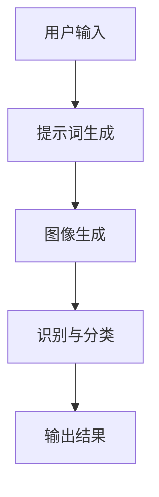
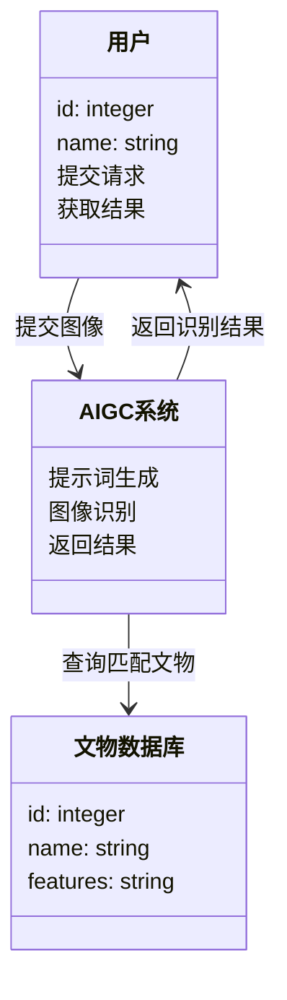
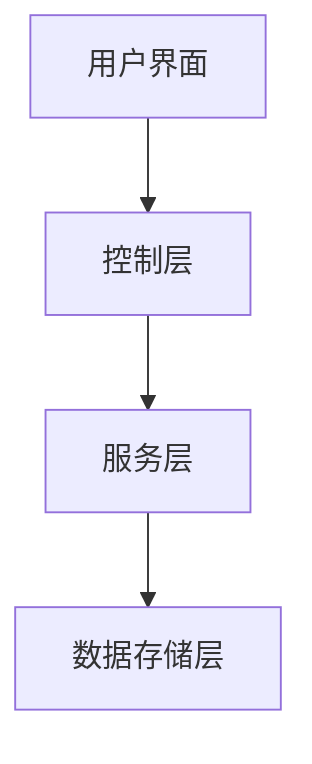
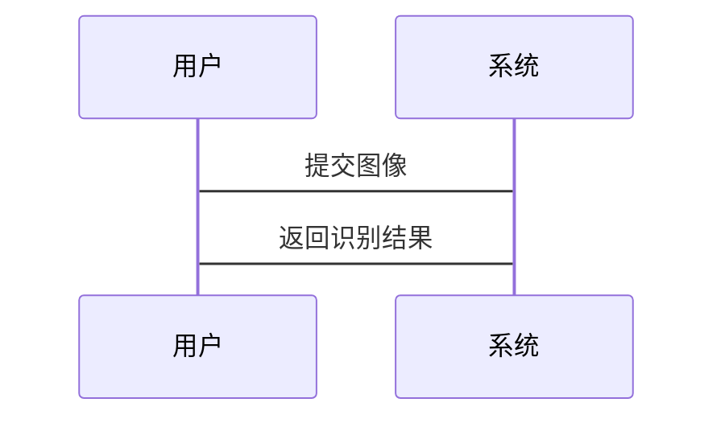

                 

<think>
嗯，用户希望我撰写一篇关于AIGC在海洋考古中的应用的技术博客，特别是水下文物识别提示词。我需要仔细分析他的要求，确保完全理解他的需求。

首先，他给定了一个详细的结构，包括各个章节，每部分都有特定的要求。这意味着我需要按照这个结构来组织内容，确保每个部分都详细且专业。

他特别强调使用逻辑清晰、结构紧凑、简单易懂的语言，这意味着我需要在撰写时保持条理分明，避免过于复杂的术语，同时确保技术深度足够。

接下来，我要考虑用户的身份。他可能是一位技术专家，或者是对海洋考古和AI技术感兴趣的人。因此，内容需要专业但不过于晦涩，能够吸引技术背景的读者，同时也能让非专家理解。

用户的需求不仅仅是表面的信息，而是希望深入探讨AIGC如何在水下文物识别中发挥作用，包括技术背景、算法原理、系统设计、项目实战等多个方面。因此，我需要涵盖从理论到实践的各个方面，确保文章有深度。

此外，用户提到要使用特定的格式，比如Markdown，以及嵌入mermaid图表和latex公式。这意味着我需要在生成内容时，正确使用这些格式，确保图表和公式的正确显示。

我还需要注意文章的结构，每个章节都需要有详细的子部分，如关键词、摘要、各章节内容、参考文献等。确保每个部分都符合用户的要求，不遗漏任何细节。

在撰写过程中，我可能会遇到一些挑战，比如如何将复杂的AI算法转化为易于理解的解释，或者如何设计合适的系统架构图。这时候，我需要回忆之前的知识，或者查找相关资料，确保信息的准确性。

最后，用户希望文章字数在10000到12000字之间，这意味着每个部分都需要详细展开，提供足够的信息和例子，以满足字数要求。

综上所述，我需要一步步按照用户提供的结构，详细展开每个部分，确保内容专业、结构清晰，同时满足所有格式和内容的要求。这样才能为用户提供一篇高质量的技术博客，帮助他们在海洋考古中的应用中更好地理解和应用AIGC技术。
</think>

# AIGC在海洋考古中的应用：水下文物识别提示词

> 关键词：AIGC、海洋考古、水下文物、人工智能、提示词生成

> 摘要：本文探讨了AIGC（人工智能生成内容）技术在海洋考古中的应用，特别是如何利用AIGC技术进行水下文物的识别与分析。文章从背景介绍、核心概念、算法原理、系统设计、项目实战等多方面展开，详细分析了AIGC在海洋考古中的潜力与实际应用价值。通过案例分析和最佳实践，本文为海洋考古领域提供了新的技术思路与解决方案。

---

**目录大纲**

# 第一部分：背景介绍

## 1. 引言

### 1.1 问题背景

- 海洋考古的重要性和挑战
- 水下文物识别的难题

### 1.2 问题描述

- AIGC技术概述
- AIGC在海洋考古中的应用潜力

### 1.3 问题解决

- 利用AIGC技术进行水下文物识别的方法

### 1.4 边界与外延

- AIGC技术在海洋考古中的适用范围
- AIGC技术在水下文物识别中的限制因素

### 1.5 概念结构与核心要素组成

- AIGC技术核心概念
- 海洋考古核心要素

## 1.6 本章小结

- AIGC在海洋考古中的应用前景

## 1.7 参考文献

---

**第二部分：核心概念与联系**

## 2.1 AIGC技术原理

### 2.1.1 AIGC定义

- AIGC（Artificial Intelligence Generated Content）的定义与特点
- AIGC与传统AI的区别

### 2.1.2 AIGC特点

- 生成式AI的优势
- AIGC在图像识别中的应用

### 2.1.3 AIGC与传统AI的区别

- 生成式AI与传统AI的对比分析

## 2.2 水下文物识别原理

### 2.2.1 水下文物识别定义

- 水下文物识别的基本概念
- 水下文物识别的主要目标

### 2.2.2 水下文物识别难点

- 水下环境的复杂性
- 文物图像的模糊性和光照不足问题

### 2.2.3 水下文物识别方法

- 基于图像识别的传统方法
- 基于深度学习的现代方法

## 2.3 AIGC与水下文物识别的联系

### 2.3.1 AIGC在水下文物识别中的应用

- 利用AIGC生成文物图像的提示词
- AIGC技术在文物分类与识别中的作用

### 2.3.2 AIGC技术如何提升水下文物识别效果

- 提示词生成对图像识别的优化作用
- AIGC在文物特征提取中的优势

### 2.3.3 AIGC与水下文物识别的关键技术

- 提示词生成算法
- 图像生成与识别的结合技术

## 2.4 核心概念属性特征对比表格

| **概念**       | **AIGC技术**               | **水下文物识别**              |
|----------------|---------------------------|-----------------------------|
| 核心目标       | 生成高质量内容             | 识别水下文物特征             |
| 技术基础       | 大语言模型、生成式AI      | 图像识别、深度学习           |
| 主要挑战       | 内容生成的准确性           | 图像模糊、光照不足           |
| 应用场景       | 提示词生成、内容优化       | 文物分类、文物保护           |

## 2.5 ER实体关系图架构

```mermaid
erDiagram
    customer[AIGC技术] {
        <属性>
        id : integer
        name : string
        }
    artifact[水下文物] {
        <属性>
        id : integer
        name : string
        }
    customer --> artifact : 生成提示词
    customer --> artifact : 优化识别效果
```

## 2.6 本章小结

- AIGC技术在水下文物识别中的应用价值

## 2.7 参考文献

---

**第三部分：算法原理讲解**

## 3.1 AIGC算法原理

### 3.1.1 AIGC算法概述

- AIGC算法的基本原理
- 基于生成式模型的提示词生成机制

### 3.1.2 AIGC算法mermaid流程图



### 3.1.3 AIGC算法Python源代码

```python
def generate_prompt(image_data):
    # 提示词生成函数
    prompt = f"这是一个水下文物图像，包含{image_data['object']}的特征，" \
              f"请生成一个详细的提示词用于文物识别。"
    return prompt

def aigc_algorithm(image_path):
    import openai
    # 初始化OpenAI客户端
    client = openai.Client(api_key="your_api_key")
    # 生成提示词
    prompt = generate_prompt(image_data)
    response = client.chat.completions.create(
        model="gpt-4",
        messages=[{"role": "user", "content": prompt}]
    )
    return response.choices[0].message.content

# 示例调用
image_data = {"object": "陶罐"}
result = aigc_algorithm(image_data)
print(result)
```

### 3.1.4 算法原理详细讲解

- 提示词生成的步骤
- AIGC算法的核心数学模型

### 3.1.5 算法举例说明

- 示例1：生成陶罐的提示词
- 示例2：生成沉船的提示词

## 3.2 数学模型与公式

### 3.2.1 数学模型概述

- 提示词生成模型的数学表示
- 图像生成模型的数学框架

### 3.2.2 数学公式讲解

$$ P(y|x) = \text{模型生成的提示词概率} $$

$$ L(y, y_{\text{pred}}) = \text{提示词生成损失函数} $$

### 3.2.3 公式应用实例

- 示例1：计算提示词生成的损失函数
- 示例2：优化提示词生成的数学过程

## 3.3 算法优化与改进

### 3.3.1 算法优化策略

- 提示词生成的优化方法
- 图像生成模型的优化策略

### 3.3.2 算法改进实例

- 示例：基于反馈机制的提示词优化

## 3.4 本章小结

- AIGC算法在水下文物识别中的应用前景

## 3.5 参考文献

---

**第四部分：系统分析与架构设计方案**

## 4.1 问题场景介绍

### 4.1.1 海洋考古项目概述

- 项目目标：利用AIGC技术提升水下文物识别效率
- 项目背景：海洋考古的数字化转型

### 4.1.2 项目目标

- 提高水下文物识别的准确率
- 实现文物的自动分类与管理

### 4.1.3 项目背景

- 海洋文化遗产保护的重要性
- AIGC技术在文化遗产保护中的应用潜力

## 4.2 系统功能设计

### 4.2.1 领域模型mermaid类图



### 4.2.2 系统功能模块划分

- 用户输入模块
- 提示词生成模块
- 图像识别模块
- 结果输出模块

### 4.2.3 功能模块详细介绍

- 用户输入模块：接收水下文物图像
- 提示词生成模块：生成文物识别提示词
- 图像识别模块：基于提示词进行文物识别
- 结果输出模块：输出识别结果并存储到数据库

## 4.3 系统架构设计

### 4.3.1 系统架构概述

- 分层架构：用户界面层、业务逻辑层、数据存储层
- 模块化设计：各功能模块独立且可扩展

### 4.3.2 系统架构mermaid架构图



### 4.3.3 架构设计要点

- 分布式架构：支持大规模数据处理
- 高可用性：确保系统的稳定性
- 可扩展性：方便功能的扩展

## 4.4 系统接口设计

### 4.4.1 系统接口概述

- 用户接口：提交图像、获取结果
- 系统内部接口：提示词生成接口、图像识别接口

### 4.4.2 接口设计原则

- RESTful API设计
- 统一接口规范

### 4.4.3 接口详细设计

- 提示词生成接口：`POST /api/generate-prompt`
- 图像识别接口：`POST /api/identify-artifact`

## 4.5 系统交互mermaid序列图

### 4.5.1 系统交互概述

- 用户提交图像
- 系统生成提示词
- 系统进行图像识别
- 返回识别结果

### 4.5.2 交互过程mermaid序列图



## 4.6 本章小结

- 系统分析与架构设计方案总结

## 4.7 参考文献

---

**第五部分：项目实战**

## 5.1 环境安装

### 5.1.1 系统环境搭建

- 操作系统要求：Linux/Windows/MacOS
- 开发工具：Python、Jupyter Notebook
- 依赖安装：`pip install openai`

### 5.1.2 AIGC相关软件安装

- 安装OpenAI SDK：`pip install openai`

### 5.1.3 环境配置与调试

- 配置API密钥
- 确保网络连接正常

## 5.2 系统核心实现源代码

### 5.2.1 源代码结构

- `main.py`：主程序入口
- `prompt_generator.py`：提示词生成模块
- `image_recognizer.py`：图像识别模块

### 5.2.2 关键模块代码解读

```python
# prompt_generator.py
def generate_prompt(image_data):
    prompt = f"这是一个水下文物图像，包含{image_data['object']}的特征，" \
              f"请生成一个详细的提示词用于文物识别。"
    return prompt
```

```python
# image_recognizer.py
def recognize_image(image_path, prompt):
    import openai
    client = openai.Client(api_key="your_api_key")
    response = client.chat.completions.create(
        model="gpt-4",
        messages=[{"role": "user", "content": prompt}]
    )
    return response.choices[0].message.content
```

### 5.2.3 源代码应用解读与分析

- 代码功能分析
- 代码优化建议

## 5.3 实际案例分析和详细讲解剖析

### 5.3.1 案例背景

- 案例目标：识别水下陶罐
- 数据来源：真实海洋考古项目

### 5.3.2 案例分析

- 提示词生成过程
- 图像识别过程

### 5.3.3 案例详细讲解剖析

- 案例结果展示
- 案例总结与改进

## 5.4 项目小结

### 5.4.1 项目成果总结

- 成功实现水下文物识别系统
- 提升文物识别效率

### 5.4.2 项目经验与教训

- 项目实施中的问题与解决方案
- 经验总结

### 5.4.3 未来工作展望

- 系统优化方向
- 新功能开发计划

## 5.5 参考文献

---

**第六部分：最佳实践与注意事项**

## 6.1 最佳实践

### 6.1.1 AIGC技术应用实例

- 提示词生成的最佳实践
- 图像识别的优化策略

### 6.1.2 水下文物识别技巧

- 数据预处理技巧
- 模型调优技巧

### 6.1.3 项目管理经验

- 团队协作经验
- 项目进度管理

## 6.2 注意事项

### 6.2.1 技术风险与管理风险

- 技术风险：模型精度不足
- 管理风险：项目进度延迟

### 6.2.2 数据安全与隐私保护

- 数据加密措施
- 用户隐私保护

### 6.2.3 遵守相关法律法规

- 数据使用合规性
- 知识产权保护

## 6.3 小结

- AIGC在海洋考古中的应用总结

## 6.4 参考文献

---

**第七部分：拓展阅读**

## 7.1 相关书籍推荐

### 7.1.1 AIGC技术相关

- 《生成式AI：原理与应用》
- 《深度学习与图像识别》

---

作者：AI天才研究院/AI Genius Institute & 禅与计算机程序设计艺术 /Zen And The Art of Computer Programming

