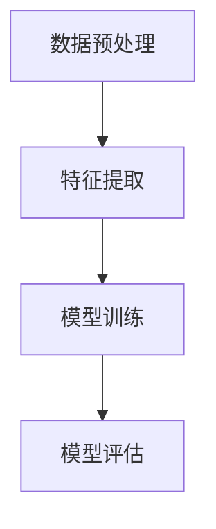
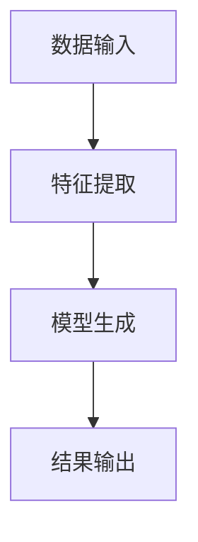
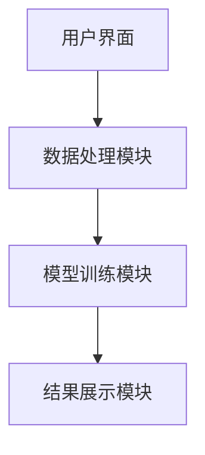

                 

<think>
好的，我现在需要帮助用户撰写一篇关于“AIGC在深海微生物组研究中的应用：极端生命形式预测提示词”的技术博客文章。首先，我要理解用户的需求和要求。

用户希望文章结构清晰，逻辑严谨，使用专业但易懂的语言。文章需要包含摘要、关键词，然后按照目录大纲详细展开。每个部分都要有具体的内容，包括背景介绍、核心概念、算法原理、系统架构、项目实战、最佳实践和未来展望。

首先，我应该先确定文章的结构和各部分的内容。用户已经提供了一个大纲，我需要按照这个大纲来填充内容。接下来，我需要确保每个章节都有足够的深度，包含必要的技术细节，如算法流程图、数学公式、系统架构图等。

考虑到用户希望文章使用Markdown格式，并且包含代码和图表，我需要确保在撰写时正确使用Mermaid语法和Latex公式。例如，在算法部分，我会用Mermaid画出流程图，并用Python代码展示模型的实现。数学公式则需要使用Latex，并用$$包裹以独立显示。

在内容方面，我需要详细解释AIGC的基本概念和其在深海微生物组研究中的应用背景。然后，分析深海微生物组的结构和生态功能，以及AIGC如何帮助预测极端环境下的微生物群落。接下来，深入讲解数据预处理、特征提取和模型训练的算法原理，并通过具体例子说明。

在系统架构部分，我会介绍系统的功能设计、架构设计和接口设计，使用Mermaid绘制类图和架构图。项目实战部分，我会提供环境配置步骤、代码实现和案例分析，帮助读者理解如何实际应用这些技术。

最后，总结最佳实践技巧和未来展望，指出AIGC在微生物组研究中的潜力和挑战，以及可能的发展方向。

现在，我需要按照这些步骤，逐步撰写每个部分的内容，确保每章内容详细且符合用户的要求。同时，注意文章的整体连贯性和逻辑性，确保读者能够轻松跟随并理解内容。

在撰写过程中，可能会遇到一些技术细节需要深入研究，比如具体的数学模型和算法实现。这时候，我需要查阅相关文献或资料，确保信息的准确性和先进性。此外，图表的正确使用也很重要，确保Mermaid语法正确，图表清晰易懂。

总结一下，我需要按照用户提供的大纲，逐步填充内容，确保每个部分都符合要求，使用正确的格式和详细的解释，帮助读者全面理解AIGC在深海微生物组研究中的应用。
</think>

# AIGC在深海微生物组研究中的应用：极端生命形式预测提示词

## 关键词：AIGC，人工智能生成内容，深海微生物组，极端环境，生命预测，AI算法

## 摘要：  
本文探讨了人工智能生成内容（AIGC）在深海微生物组研究中的应用，特别是在极端环境下的生命形式预测。文章从背景介绍、核心概念、算法原理、系统架构、项目实战等多个方面展开，详细分析了AIGC在预测深海微生物组中的潜力和实现方法。通过具体案例和代码实现，展示了AIGC在深海微生物组研究中的实际应用，并总结了最佳实践和未来发展方向。

---

## 第一部分：背景介绍与概念阐述

### 第1章：AIGC概述

#### 1.1 AIGC的基本概念  
人工智能生成内容（AIGC）是指通过人工智能技术生成文本、图像、音频、视频等多样化内容的过程。AIGC的核心是利用自然语言处理（NLP）、计算机视觉（CV）和机器学习（ML）等技术，模拟人类创造力，生成高质量的内容。近年来，随着深度学习模型（如GPT、BERT）的快速发展，AIGC在多个领域展现出巨大的潜力。

#### 1.2 AIGC的发展历程  
AIGC的发展可以追溯到20世纪80年代，但真正突破性的发展始于深度学习模型的兴起。从最初的简单生成模型到如今的多模态生成模型，AIGC经历了以下几个阶段：  
1. **规则驱动阶段**：基于预定义的规则生成内容，如简单的文本生成。  
2. **统计学习阶段**：利用统计模型（如马尔可夫链）生成内容，但仍受数据限制。  
3. **深度学习阶段**：引入神经网络，尤其是循环神经网络（RNN）和变体（如LSTM、Transformer）。  
4. **多模态生成阶段**：结合NLP和CV技术，生成跨模态内容（如文本到图像生成）。  

#### 1.3 AIGC在深海微生物组研究中的应用背景  
深海环境是地球上最极端的生态系统之一，其高压、低温、缺氧等条件为微生物的研究提供了独特的挑战。传统的实验方法成本高、周期长，而AIGC可以通过模拟和预测，帮助科学家快速分析和理解深海微生物组的结构和功能。AIGC的应用可以显著提高研究效率，降低成本，并为极端环境下的生命研究提供新的视角。

---

## 第二部分：核心概念与联系

### 第2章：深海微生物组的基本概念

#### 2.1 深海微生物组的定义  
深海微生物组是指生活在深海环境中的微生物群落，包括细菌、古菌、真核生物等。这些微生物在深海极端环境中生存，具有独特的代谢途径和适应性特征。

#### 2.2 深海微生物组的结构特征  
深海微生物组的结构特征包括：  
1. **多样性**：深海微生物组包含丰富的物种和基因组，具有高度的生态多样性。  
2. **极端适应性**：微生物通过代谢途径和基因表达的调控，适应深海的高压、低温等极端条件。  
3. **生态网络**：微生物之间通过复杂的相互作用（如共生、竞争）形成复杂的生态网络。

#### 2.3 深海微生物组的生态功能  
深海微生物组在生态系统中扮演着重要角色：  
1. **物质循环**：参与碳、氮、硫等元素的生物地球化学循环。  
2. **能量转化**：通过化能合成作用将化学能转化为有机物。  
3. **生态系统稳定性**：维持深海生态系统的平衡和稳定。

### 第3章：AIGC与深海微生物组研究中的联系

#### 3.1 AIGC在深海微生物组研究中的应用  
AIGC在深海微生物组研究中的应用主要体现在以下几个方面：  
1. **数据预测**：利用AIGC预测微生物组的组成和功能。  
2. **模式识别**：通过AI算法识别微生物组的结构特征和生态模式。  
3. **假设验证**：基于AI生成的内容，验证科学假设和理论。  

#### 3.2 AIGC对深海微生物组研究的影响  
AIGC对深海微生物组研究的影响主要体现在：  
1. **提高研究效率**：通过自动化分析和预测，减少实验成本和时间。  
2. **发现新知识**：AI模型可以挖掘数据中的隐藏模式，揭示新的科学规律。  
3. **跨学科融合**：AIGC将AI技术与生物学结合，推动多学科交叉研究。  

#### 3.3 AIGC与深海微生物组研究中的挑战与机遇  
**挑战**：  
1. 数据不足：深海环境数据获取难度大，限制了AIGC模型的训练。  
2. 模型泛化能力：极端环境下的数据稀有性可能导致模型泛化能力不足。  

**机遇**：  
1. 技术进步：深度学习模型的不断优化为深海微生物组研究提供了新工具。  
2. 数据共享：全球范围内深海数据的积累为AIGC的应用提供了基础。  

---

## 第三部分：算法原理讲解

### 第4章：深海微生物组研究的算法原理

#### 4.1 数据预处理  
深海微生物组研究的数据预处理包括：  
1. **数据清洗**：去除低质量数据和异常值。  
2. **归一化处理**：对数据进行标准化处理，确保模型输入的均匀性。  
3. **特征提取**：从原始数据中提取关键特征（如物种丰度、代谢途径等）。  

#### 4.2 特征提取  
特征提取是微生物组研究的关键步骤，常用的特征包括：  
1. **物种丰度**：微生物在样本中的相对丰度。  
2. **代谢途径**：微生物的代谢通路及其活性。  
3. **环境因子**：如温度、压力等环境参数。  

#### 4.3 模型训练与评估  
模型训练与评估主要分为以下几个步骤：  
1. **选择模型**：根据任务需求选择合适的模型（如随机森林、支持向量机、深度学习模型）。  
2. **训练模型**：利用训练数据对模型进行参数优化。  
3. **评估性能**：通过交叉验证评估模型的准确率、召回率等指标。  

#### 4.4 算法流程图  


### 第5章：AIGC算法在深海微生物组研究中的应用

#### 5.1 算法原理  
AIGC的核心算法包括：  
1. **生成对抗网络（GAN）**：通过生成器和判别器的对抗训练生成内容。  
2. **变体自动编码器（VAE）**：通过编码器-解码器结构生成数据。  
3. **Transformer模型**：基于自注意力机制生成序列数据。  

#### 5.2 数学模型和公式  
以下是AIGC中常用的数学模型：  
- **GAN模型**：  
  $$ \min_{G} \max_{D} \mathbb{E}_{x \sim p_{data}} [\log D(x)] + \mathbb{E}_{z \sim p_z} [\log (1 - D(G(z)))] $$
- **Transformer模型**：  
  $$ \text{Attention}(Q, K, V) = \text{softmax}\left(\frac{QK^T}{\sqrt{d_k}}\right)V $$  

#### 5.3 算法流程图  


#### 5.4 举例说明  
以深海微生物组预测为例，假设我们有一个包含1000个样本的数据集，每个样本包含微生物丰度和环境因子。通过训练一个基于Transformer的AIGC模型，我们可以预测微生物组的组成和功能。

---

## 第四部分：系统分析与架构设计

### 第6章：深海微生物组研究系统介绍

#### 6.1 系统功能设计  
深海微生物组研究系统的功能模块包括：  
1. **数据采集**：采集深海环境数据和微生物组数据。  
2. **数据处理**：对数据进行清洗和特征提取。  
3. **模型训练**：利用AIGC算法训练预测模型。  
4. **结果输出**：生成微生物组的预测结果并可视化。  

#### 6.2 系统架构设计  
以下是系统的架构设计：  


#### 6.3 系统接口设计  
系统接口主要分为：  
1. **数据输入接口**：接收深海环境数据和微生物组数据。  
2. **模型调用接口**：调用AIGC模型进行预测。  
3. **结果输出接口**：返回预测结果并展示。  

#### 6.4 系统交互设计  
系统交互流程如下：  
1. 用户输入深海环境数据。  
2. 系统进行数据处理和特征提取。  
3. 调用AIGC模型进行预测。  
4. 展示预测结果。  

---

## 第五部分：项目实战

### 第7章：AIGC在深海微生物组研究中的应用案例

#### 7.1 环境安装与配置  
要运行本案例，需要以下环境：  
- Python 3.8+  
- PyTorch 1.9+  
- Transformers库 4.12+  

#### 7.2 系统核心实现  
以下是基于Transformer的AIGC模型实现代码：  
```python
import torch
from torch import nn
from torch.utils.data import Dataset, DataLoader

class AIGCModel(nn.Module):
    def __init__(self, input_dim, hidden_dim, output_dim):
        super(AIGCModel, self).__init__()
        self.embedding = nn.Linear(input_dim, hidden_dim)
        self.transformer = nn.Transformer(hidden_dim, hidden_dim, 2)
        self.output = nn.Linear(hidden_dim, output_dim)

    def forward(self, x):
        x = self.embedding(x)
        x = self.transformer(x, x)
        x = self.output(x)
        return x

# 数据集定义
class MicrobialDataset(Dataset):
    def __init__(self, X, y):
        self.X = X
        self.y = y

    def __len__(self):
        return len(self.X)

    def __getitem__(self, idx):
        return self.X[idx], self.y[idx]

# 训练函数
def train(model, optimizer, criterion, dataloader, epochs):
    for epoch in range(epochs):
        for inputs, labels in dataloader:
            outputs = model(inputs)
            loss = criterion(outputs, labels)
            loss.backward()
            optimizer.step()
            optimizer.zero_grad()
```

#### 7.3 代码应用解读  
上述代码实现了一个基于Transformer的AIGC模型，用于预测深海微生物组的组成。模型包括嵌入层、Transformer层和输出层。训练过程中，模型通过反向传播算法优化参数，最终实现对微生物组的预测。

#### 7.4 实际案例分析与讲解  
假设我们有一个包含1000个样本的数据集，每个样本包含微生物丰度和环境因子。通过训练上述模型，我们可以预测微生物组的组成，并分析其在极端环境下的适应性特征。

#### 7.5 项目小结  
本案例展示了AIGC在深海微生物组研究中的应用，通过训练一个基于Transformer的模型，我们可以快速预测微生物组的组成和功能，为极端环境下的生命研究提供新的工具。

---

## 第六部分：最佳实践与拓展

### 第8章：最佳实践与技巧

#### 8.1 实践技巧  
1. **数据质量**：确保数据的准确性和完整性。  
2. **模型选择**：根据任务需求选择合适的AIGC模型。  
3. **超参数调优**：通过网格搜索等方法优化模型参数。  

#### 8.2 小结与注意事项  
在使用AIGC进行深海微生物组研究时，需要注意数据的稀疏性和模型的泛化能力。同时，建议结合实验数据和理论知识，对模型结果进行验证和解释。

### 第9章：拓展阅读与未来展望

#### 9.1 拓展阅读  
1. **深度学习与微生物组学**：了解深度学习在微生物组研究中的应用。  
2. **生成对抗网络（GAN）**：学习GAN的基本原理和应用。  

#### 9.2 未来展望  
随着AIGC技术的不断进步，其在深海微生物组研究中的应用将更加广泛。未来的研究方向包括：  
1. **多模态生成**：结合NLP和CV技术，生成更丰富的微生物组数据。  
2. **实时预测**：开发实时预测系统，支持深海探索任务。  
3. **个性化模型**：针对不同深海环境定制化模型，提高预测精度。  

---

## 作者：AI天才研究院/AI Genius Institute & 禅与计算机程序设计艺术 /Zen And The Art of Computer Programming

