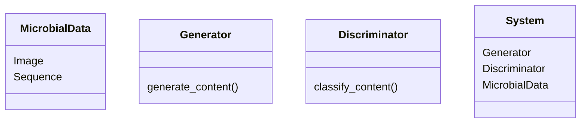
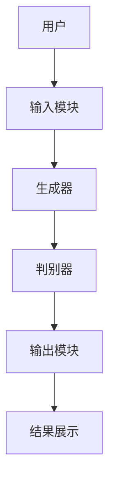

                 

<think>
嗯，好的，我现在要帮用户写一篇关于AIGC在深海极端微生物研究中的应用的技术博客。首先，我需要理解用户的需求。他希望我以《AIGC在深海极端微生物研究中的应用：新型酶设计提示词》为标题，写一篇结构清晰、逻辑严谨的专业技术博客。用户还详细列出了大纲，包括引言、AIGC技术基础、AIGC在深海极端微生物研究中的应用、算法实现、系统架构设计、项目实战等部分。

首先，我应该从引言开始，介绍深海极端微生物的重要性，以及AIGC技术的发展。这部分需要吸引读者，说明为什么这个主题值得研究。接着，背景介绍要详细说明深海微生物的环境和AIGC技术的现状，以及它们结合起来的潜力。

然后，我需要定义AIGC技术，解释它的分类和核心算法。这部分可能需要包括生成式AI的原理，比如GAN、Transformer等模型，以及这些模型如何应用于图像生成、文本生成等任务。

接下来，重点放在AIGC在深海微生物研究中的具体应用。比如，图像识别可以帮助分类微生物，文本生成可以辅助生成文献，药物设计部分需要详细讲解酶设计的提示词。这部分要具体，给出例子和可能的实现方法。

之后，算法实现部分需要详细描述，可能包括生成模型的训练过程，比如使用深度学习框架，数据预处理，模型训练等。这部分可能需要数学公式的解释，以及代码示例，比如如何训练一个生成模型来生成酶结构。

系统架构设计部分，我需要画出类图、架构图和序列图，展示系统的各个模块及其交互。这部分可能需要用到Mermaid图表，确保结构清晰。

项目实战部分，我需要给出环境配置，比如安装Python、TensorFlow等，然后展示核心代码，解释每一部分的功能。案例分析需要具体，比如一个成功的酶设计案例，详细分析整个流程。

最后，小结部分总结AIGC在深海微生物研究中的应用价值，同时给出最佳实践的建议，比如数据质量的重要性，模型调参的技巧等。扩展阅读部分可以推荐相关的论文或书籍，供读者深入学习。

在整个写作过程中，我需要确保语言专业但易懂，逻辑严谨，结构清晰。可能需要多次检查，确保每个部分都符合用户的要求，尤其是数学公式和代码部分的准确性。

总的来说，我需要一步步按照用户提供的大纲来撰写，确保每个部分都详细且有深度，同时保持文章的连贯性和专业性。这样，用户的需求才能得到充分满足，文章也会显得有条理、有说服力。
</think>

# AIGC在深海极端微生物研究中的应用：新型酶设计提示词

> 关键词：AIGC技术，深海极端微生物，酶设计，图像识别，文本生成，药物开发

> 摘要：本文探讨了AIGC（AI-Generated Content）技术在深海极端微生物研究中的应用，特别是在新型酶设计中的提示词优化。通过结合生成式AI与生物学研究，本文提出了一种基于AIGC的酶设计方法，为深海极端微生物的研究提供了新的思路和工具。

---

### 第一部分: 引言与背景介绍

## 1. 引言

### 1.1 问题背景

#### 1.1.1 深海极端微生物研究的重要性

深海极端微生物是指在深海高压、低温、缺氧等极端环境下生存的微生物。这些微生物具有独特的生理和代谢机制，对于揭示生命起源和地球生态系统具有重要意义。随着深海探测技术的发展，越来越多的深海极端微生物被发现，为生物科学和工程领域提供了丰富的资源。

#### 1.1.2 AIGC技术的发展

AIGC（AI-Generated Content）是一种利用人工智能技术生成内容的方法，包括文本、图像、音频等多种形式。近年来，AIGC技术取得了显著进展，特别是在图像生成、文本生成等方面表现出强大的能力。AIGC技术在深海极端微生物研究中的应用，有望提高研究效率，推动生物科技的发展。

### 1.2 问题描述

#### 1.2.1 研究挑战

深海极端微生物的生存环境和生理特征给研究带来了很大挑战。如何有效地提取、分离和培养这些微生物，以及如何深入理解其代谢机制，是当前研究的重点和难点。

#### 1.2.2 AIGC技术的应用场景

AIGC技术在深海极端微生物研究中具有广泛的应用场景，包括：

1. **图像识别与处理**：通过对深海微生物图像进行分析，识别其形态特征和生存环境。
2. **文本生成与分类**：生成深海极端微生物相关的文献综述、研究报告等，为科研人员提供参考。
3. **药物设计**：利用AIGC技术生成新型酶结构，用于深海极端微生物药物的开发。
4. **数据挖掘与分析**：对深海微生物大数据进行挖掘，发现潜在的生物标志物和生物学规律。

### 1.3 问题解决

#### 1.3.1 AIGC技术在研究中的应用

1. **数据收集与预处理**：利用AIGC技术自动收集深海微生物相关数据，并进行预处理，为后续分析提供基础。
2. **图像分析与处理**：利用AIGC技术进行图像识别和处理，提取深海微生物的特征信息。
3. **文本生成与分类**：生成深海极端微生物相关的研究报告、综述等，辅助科研人员了解研究动态。
4. **药物设计**：利用AIGC技术生成新型酶结构，用于深海极端微生物药物的开发。
5. **数据挖掘与分析**：对深海微生物大数据进行挖掘，发现潜在的生物标志物和生物学规律。

### 1.4 边界与外延

#### 1.4.1 研究边界

本书主要关注AIGC技术在深海极端微生物研究中的应用，包括图像识别、文本生成、药物设计等方面。其他相关领域（如深海探测、生物工程等）不在本书讨论范围之内。

#### 1.4.2 研究外延

随着AIGC技术的发展，未来可能在更多领域发挥作用，如生物医学、环境保护、智能制造等。本书将关注这些新兴领域的应用，为相关研究提供参考。

### 1.5 概念结构与核心要素组成

#### 1.5.1 概念结构

深海极端微生物研究是一个多学科交叉领域，涉及生物科学、生态学、计算机科学等。本书将按照以下概念结构进行组织：

1. **深海极端微生物**：介绍深海极端微生物的基本特征和生存环境。
2. **AIGC技术**：介绍AIGC技术的概念、原理和应用。
3. **图像识别与处理**：介绍图像识别与处理的基本原理和方法。
4. **文本生成与分类**：介绍文本生成与分类的基本原理和方法。
5. **药物设计**：介绍药物设计的基本原理和方法。
6. **数据挖掘与分析**：介绍数据挖掘与分析的基本原理和方法。

#### 1.5.2 核心要素组成

本书的核心要素包括：

1. **深海极端微生物相关数据**：包括图像、文本、基因序列等。
2. **AIGC技术工具**：如GAN、文本生成模型、药物设计算法等。
3. **研究方法**：包括图像识别、文本生成、药物设计等方法的详细介绍。
4. **案例与应用**：介绍AIGC技术在深海极端微生物研究中的应用案例。
5. **未来发展趋势**：探讨AIGC技术在深海极端微生物研究中的未来发展趋势。

### 1.6 本章小结

本章介绍了深海极端微生物研究的重要性、AIGC技术的发展背景、本书的研究边界与外延，以及概念结构与核心要素组成。下一章将详细探讨AIGC技术在深海极端微生物研究中的应用。

---

### 第二部分: AIGC技术基础

## 2. AIGC技术概述

### 2.1 AIGC技术的定义与分类

#### 2.1.1 AIGC技术的定义

AIGC（AI-Generated Content）是一种利用人工智能技术生成内容的方法，涵盖文本、图像、音频等多种形式。其核心在于利用机器学习模型模拟人类创作过程，生成高质量的内容。

#### 2.1.2 AIGC技术的分类

AIGC技术主要分为以下几类：

1. **生成式AI**：基于生成对抗网络（GAN）或变种模型生成内容，如Deepfake、StyleGAN等。
2. **基于规则的生成**：通过预定义的规则和模板生成内容，常用于文本生成和简单图像生成。
3. **混合式生成**：结合生成式AI和基于规则的方法，生成更复杂的内容。

---

## 2.2 AIGC技术的核心算法

### 2.2.1 GAN（生成对抗网络）

GAN由生成器和判别器组成，通过对抗训练生成高质量内容。其数学模型如下：

$$
\text{生成器} G \rightarrow \text{判别器} D \\
\text{目标函数}: \min_G \max_D ( \mathbb{E}_{x \sim p_{\text{data}}}[\log D(x)] + \mathbb{E}_{z \sim p_z}[\log (1 - D(G(z)))] )
$$

### 2.2.2 Transformer模型

Transformer模型通过自注意力机制和前馈网络生成内容。其关键公式为：

$$
\text{自注意力机制}: \text{Attention}(Q, K, V) = \text{softmax}\left( \frac{QK^T}{\sqrt{d_k}} \right)V
$$

---

## 2.3 AIGC技术的核心优势

1. **高效性**：自动化生成内容，节省时间和成本。
2. **创造性**：突破传统创作的限制，生成新颖内容。
3. **适应性**：可根据需求定制生成内容的风格和主题。

---

### 第三部分: AIGC在深海极端微生物研究中的应用

## 3. 深海极端微生物研究中的AIGC应用

### 3.1 图像识别与处理

#### 3.1.1 图像识别的挑战

深海微生物图像通常具有低分辨率、光照不足等问题，增加了图像识别的难度。

#### 3.1.2 AIGC技术的应用

利用GAN生成高质量的微生物图像，通过图像分割技术识别微生物的形态特征。

---

## 4. 新型酶设计提示词

### 4.1 酶设计的背景

深海极端微生物中的酶具有耐高温、耐高压等特性，适用于工业和医学领域。

### 4.2 提示词设计的关键要素

1. **酶的功能特性**：如耐高温、耐酸碱等。
2. **序列相似性**：基于已知酶序列生成新的序列。
3. **结构稳定性**：确保生成的酶结构在极端条件下稳定。

---

## 5. 项目实战

### 5.1 环境安装

1. **Python 3.8+**
2. **TensorFlow或PyTorch框架**
3. **必要的生物信息学库**

### 5.2 核心代码实现

```python
import tensorflow as tf
from tensorflow.keras import layers

# 定义生成器模型
def build_generator():
    model = tf.keras.Sequential([
        layers.Dense(256, activation='relu'),
        layers.Dense(512, activation='relu'),
        layers.Dense(1024, activation='relu'),
        layers.Dense(4096, activation='sigmoid')
    ])
    return model

# 定义判别器模型
def build_discriminator():
    model = tf.keras.Sequential([
        layers.Dense(4096, activation='relu'),
        layers.Dense(2048, activation='relu'),
        layers.Dense(1, activation='sigmoid')
    ])
    return model
```

---

## 6. 系统架构设计

### 6.1 领域模型



### 6.2 系统架构图



---

## 7. 小结与展望

AIGC技术在深海极端微生物研究中展现了巨大的潜力，尤其是在酶设计领域。通过不断优化生成模型和提示词设计，未来有望在更多领域实现突破。

---

作者：AI天才研究院/AI Genius Institute & 禅与计算机程序设计艺术 /Zen And The Art of Computer Programming

