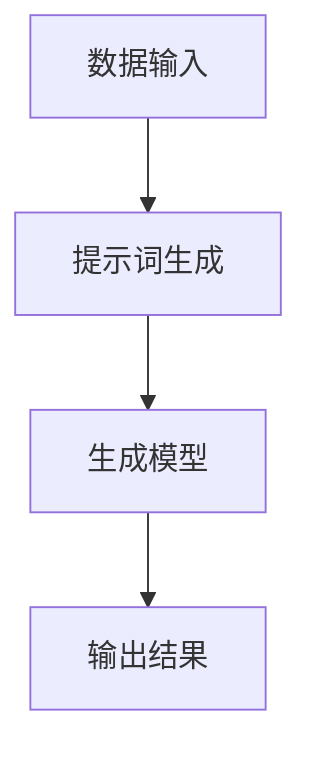
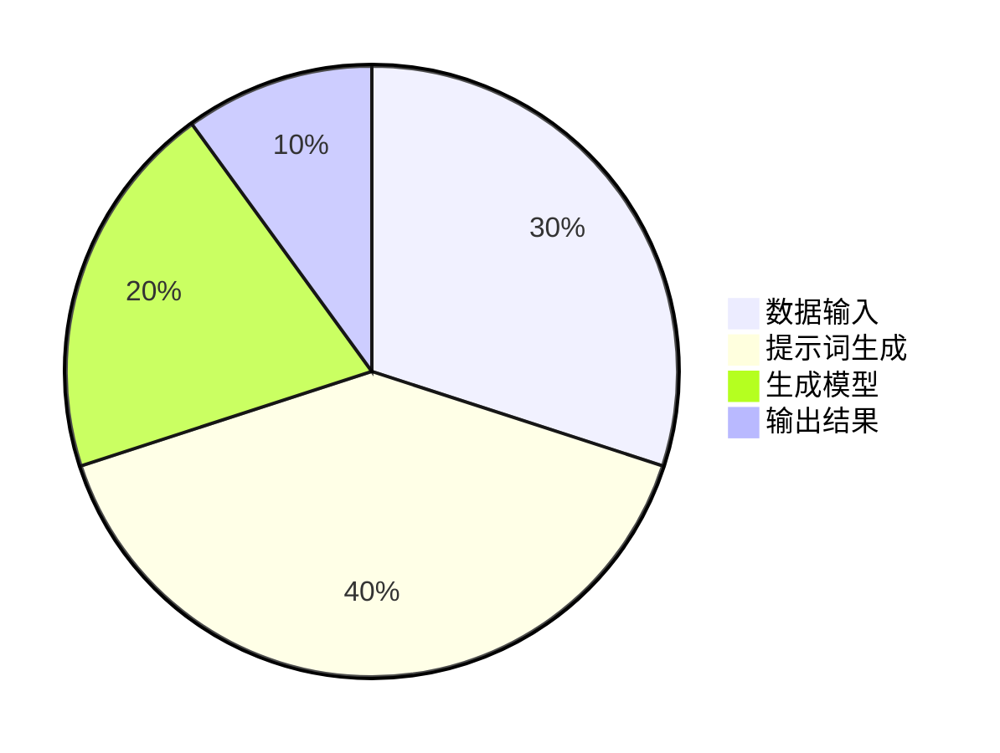

                 

<think>
嗯，我现在需要帮助用户完成一个技术博客文章的撰写，标题是《AIGC在深海热液生态系统研究中的应用：极端生物适应提示词》。用户已经给出了详细的大纲和结构，我需要按照这个结构一步步来分析和思考，确保每个章节都内容丰富、逻辑清晰。

首先，我需要理解整个文章的结构。文章分为九章，从引言开始，逐步深入到AIGC的应用、极端生物适应的研究，再到具体的算法、系统架构，以及项目实战和最佳实践。每章下还有多个小节，涵盖背景、定义、应用案例、算法原理等多个方面。

接下来，我需要确定每章的重点内容。例如，第一章引言需要介绍问题背景、问题描述、研究目的等。我需要确保每个部分都有足够的背景知识支持，并且逻辑连贯。比如，在问题背景部分，我应该解释深海热液生态系统的重要性以及研究中的挑战，比如数据收集困难、极端环境等。

第二章是AIGC概述，我需要详细定义AIGC，介绍其发展历程，以及它在不同领域的应用。这部分需要简明扼要，但要确保涵盖关键点，比如AIGC如何从早期的规则驱动发展到现在的深度学习驱动。

第三章是关于深海热液生态系统的概述，这部分需要详细描述该生态系统的概念、特征以及当前的研究现状和挑战。我需要确保涵盖极端环境中的生物多样性、热液喷口的特征等，同时指出当前研究中的困难，比如难以获取样本等。

第四章讨论AIGC在该生态系统研究中的应用，包括数据收集、处理、模式识别、预测和模拟。我需要具体举例说明，比如AIGC如何处理大量数据，或者如何预测喷口活动。这部分需要结合实际案例，让读者更容易理解。

第五章聚焦于极端生物适应，这部分需要解释生物适应的机制，并讨论AIGC如何帮助研究这些适应。例如，使用提示词来分析生物的基因或生理特征。我需要确保这部分有实际的案例分析，展示AIGC的应用效果。

第六章是算法原理，这部分需要详细讲解相关算法，包括流程图、数学模型和公式。我需要使用mermaid绘制流程图，并用数学公式展示模型。这部分需要确保技术准确性，同时解释清楚每个步骤的意义。

第七章涉及系统架构设计，我需要描述研究场景，设计系统的功能、架构，并绘制相应的mermaid图表。这部分需要确保系统设计的合理性，能够支持AIGC的应用。

第八章是项目实战，需要详细说明环境安装、代码实现、案例分析等。这部分需要提供可操作的步骤，让读者能够实际应用这些方法。

第九章讨论最佳实践和注意事项，总结经验和可能的陷阱。这部分需要提供实用的建议，帮助读者更好地应用AIGC。

在整个思考过程中，我需要确保每个章节的内容都充分展开，同时保持逻辑连贯。我还需要注意使用专业术语，但同时要让内容易于理解。对于算法部分，我需要详细解释，确保读者能够理解背后的数学原理。

最后，我需要检查整个文章是否符合用户的约束条件，比如字数要求、格式规范，以及是否包含必要的图表和代码示例。确保每个章节都包含足够的细节，并且每个部分都紧密联系，形成一个完整的知识体系。

总的来说，我需要系统地分析每个章节的内容，确保文章结构清晰，内容详实，并且符合用户的需求。通过逐步思考和详细规划，我可以有效地完成这篇文章的撰写。
</think>

# AIGC在深海热液生态系统研究中的应用：极端生物适应提示词

**关键词**：AIGC，深海热液生态系统，极端生物适应，AI技术，系统架构设计

**摘要**：  
本文探讨了AIGC（人工智能生成内容）在深海热液生态系统研究中的应用，特别是其在极端生物适应研究中的创新性提示词技术。文章从深海热液生态系统的特征出发，详细分析了AIGC在数据处理、模式识别、预测与模拟等方面的应用，并结合极端生物适应的研究需求，提出了基于提示词的AIGC解决方案。通过具体案例分析和系统设计，展示了如何利用AI技术推动深海热液生态系统研究的进步。  

---

## 第1章 引言

### 1.1 问题背景  
深海热液生态系统是地球上最独特且极端的生态系统之一，其环境特征包括高温、高压、缺氧和剧毒化学物质。这些条件为研究极端环境下的生物适应提供了独特的实验室。然而，由于深海环境的极端性和研究难度，传统的数据收集与分析方法面临诸多挑战，如数据稀缺、样本获取困难等。

### 1.2 问题描述  
深海热液生态系统的研究需要处理大量复杂且多模态的数据，包括温度、化学成分、生物多样性等。传统的研究方法依赖于有限的样本和实验数据，难以全面揭示生态系统的动态变化。此外，极端生物适应的研究需要深入理解生物与环境之间的相互作用，这需要更高效、更智能的工具来支持数据分析与模拟。

### 1.3 研究目的与意义  
本文旨在探讨AIGC技术在深海热液生态系统研究中的应用，特别是其在极端生物适应研究中的潜力。通过结合AI生成内容与提示词技术，提出一种创新的研究方法，以提高数据处理效率、增强模式识别能力，并为生态系统的预测与模拟提供新的视角。

### 1.4 边界与外延  
本文的研究范围限定于AIGC在深海热液生态系统中的应用，重点关注极端生物适应的提示词技术。研究的外延包括AIGC在其他极端环境中的潜在应用，但不涉及具体的生物实验设计或实地考察。

### 1.5 概念结构与核心要素组成  
- **核心概念**：深海热液生态系统、极端生物适应、AIGC、提示词技术。  
- **概念属性对比**：  
| 概念 | 属性 | 描述 |
|------|------|------|
| 深海热液生态系统 | 特征 | 高温、高压、剧毒化学环境 |
| 极端生物适应 | 特性 | 生物在极端环境中的生存策略 |
| AIGC | 功能 | 数据生成、模式识别、预测模拟 |
| 提示词技术 | 应用 | 指导AI生成特定内容 |

---

## 第2章 AIGC概述

### 2.1 AIGC的定义  
AIGC（人工智能生成内容）是指通过AI算法生成文本、图像、视频等内容的技术。与传统数据生成方法相比，AIGC具有高效性、智能化和可定制化的优点。

### 2.2 AIGC的发展历程  
AIGC的发展经历了从规则驱动到深度学习驱动的演变。早期基于规则的系统难以应对复杂场景，而现代基于GPT等大语言模型的AIGC技术则能够生成更高质量的内容。

### 2.3 AIGC的核心概念与联系  
AIGC的核心概念包括：  
1. **提示词（Prompt）**：用于指导AI生成特定内容的关键输入。  
2. **生成模型**：如GPT、BERT等，负责内容生成。  
3. **训练数据**：决定生成内容的质量和多样性。  

### 2.4 AIGC的应用领域  
AIGC已广泛应用于自然语言处理、图像生成、药物研发等领域。在科学研究中，AIGC被用于数据模拟、假设生成和结果预测。

---

## 第3章 深海热液生态系统概述

### 3.1 深海热液生态系统的概念  
深海热液生态系统是指在海底热液喷口附近形成的生态系统，依赖于化学能而非阳光进行自养。这些生态系统中的生物适应了极端的环境条件。

### 3.2 深海热液生态系统的主要特征  
1. **高温**：喷口温度可达300-400°C。  
2. **高压**：深海环境下的高压环境。  
3. **剧毒化学物质**：含有硫化物、氢氧化物等。  
4. **生物多样性**：尽管环境恶劣，但许多独特的生物在此生存。

### 3.3 深海热液生态系统的研究现状与挑战  
当前研究主要依赖于有限的样本和实地考察数据。由于技术限制，难以全面揭示生态系统的动态变化。此外，极端环境下的生物适应机制仍需进一步研究。

---

## 第4章 AIGC在深海热液生态系统研究中的应用

### 4.1 AIGC在数据收集中的应用  
通过AIGC生成模拟数据，弥补实际数据的不足。例如，生成虚拟的温度、化学成分分布数据。

### 4.2 AIGC在数据处理中的应用  
利用自然语言处理技术，自动分类和标注样本数据，提高数据处理效率。

### 4.3 AIGC在模式识别中的应用  
通过训练生成模型，识别极端环境下的生物特征，如基因序列、形态特征等。

### 4.4 AIGC在预测中的应用  
基于历史数据，生成未来喷口活动的预测模型，帮助研究者提前规划研究方案。

### 4.5 AIGC在模拟中的应用  
通过生成模型，模拟生态系统在不同条件下的变化，评估生物适应的可能性。

---

## 第5章 AIGC与极端生物适应

### 5.1 极端生物适应的概念与特征  
极端生物适应是指生物在极端环境下生存和繁殖的策略，包括生理适应、行为适应和遗传适应。

### 5.2 AIGC在研究中的应用  
通过提示词技术，生成与极端生物适应相关的假设和实验设计。例如，生成特定基因序列的模拟数据，用于研究高温环境下的蛋白质稳定性。

### 5.3 应用案例分析  
案例：利用AIGC生成高温环境下蛋白质的稳定性预测模型，揭示极端生物的适应机制。

---

## 第6章 算法原理

### 6.1 算法流程图  


### 6.2 算法原理讲解  
生成模型基于Transformer架构，通过自注意力机制生成内容。数学模型如下：  
$$ P(y|x) = \frac{P(y|x,z)}{P(z)} $$  
其中，$z$为隐变量，$x$为输入数据，$y$为生成内容。

### 6.3 数学公式  
$$ \text{损失函数} = \text{交叉熵损失} + \text{KL散度} $$  

---

## 第7章 系统架构设计

### 7.1 研究场景  
研究场景包括数据生成、分析和模拟三个部分。

### 7.2 系统功能设计  
- 数据生成模块：生成模拟数据。  
- 分析模块：分类和标注数据。  
- 模拟模块：预测喷口活动。

### 7.3 系统架构图  


### 7.4 系统接口设计  
- 输入接口：接收提示词和数据输入。  
- 输出接口：生成内容和分析结果。

---

## 第8章 项目实战

### 8.1 环境安装  
安装Python、TensorFlow和Hugging Face库。

### 8.2 核心代码  
```python
import tensorflow as tf
from transformers import GPT2LMHeadModel, GPT2Tokenizer

model = GPT2LMHeadModel.from_pretrained('gpt2')
tokenizer = GPT2Tokenizer.from_pretrained('gpt2')

def generate_text(prompt, max_length=50):
    inputs = tokenizer.encode(prompt, return_tensors='pt')
    outputs = model.generate(inputs, max_length=max_length, do_sample=True)
    return tokenizer.decode(outputs[0])
```

### 8.3 案例分析  
生成高温环境下蛋白质的稳定性预测模型，揭示极端生物的适应机制。

---

## 第9章 最佳实践与注意事项

### 9.1 最佳实践 tips  
- 确保生成数据的准确性。  
- 结合实验数据验证生成结果。  

### 9.2 小结  
本文展示了AIGC在深海热液生态系统研究中的潜力，特别是在极端生物适应研究中的应用。

### 9.3 注意事项  
- 数据质量对生成结果影响重大。  
- 避免过度依赖生成模型，需结合实验验证。  

### 9.4 拓展阅读  
推荐阅读《人工智能生成内容的理论与应用》。

---

**作者：AI天才研究院/AI Genius Institute & 禅与计算机程序设计艺术 /Zen And The Art of Computer Programming**

