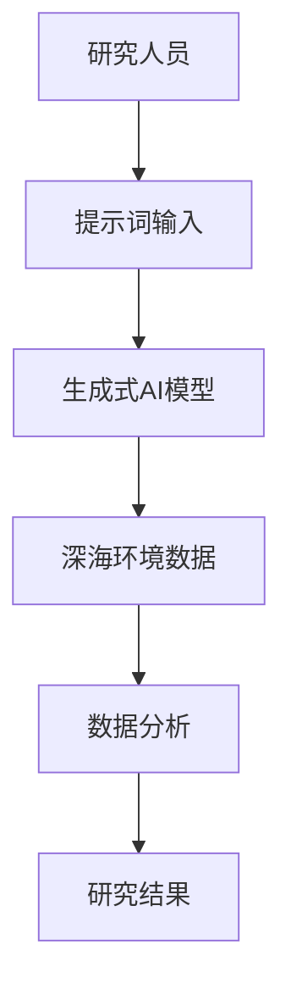

                 

<think>
好的，我现在需要帮用户撰写一篇技术博客，标题是《AIGC在深海生态系统研究中的应用：压力适应性提示词》。用户已经提供了一个详细的目录结构，还指定了很多约束条件，包括内容完整性、格式要求、字数以及具体的技术元素。

首先，我得理解用户的背景。他可能是一位研究人员、技术专家或者学生，希望深入探讨AIGC在深海研究中的应用。他需要文章结构清晰，逻辑严密，同时涵盖背景介绍、核心概念、应用案例、技术挑战等部分，还要求有数学公式、算法流程图、系统架构图等技术细节。

接下来，我需要按照目录逐步展开每个章节。首先，标题和关键词要明确，摘要部分要概括文章的核心内容。然后是引言，介绍AIGC的背景和重要性，解释相关术语。核心概念部分需要详细讲解AIGC的技术原理，比如生成式AI和压力适应性的概念，可能需要一个对比表格和ER图来展示压力适应的相关因素。

在应用案例部分，我需要具体说明AIGC在深海研究中的不同场景，比如物种建模和数据分析，提供实际案例，展示AIGC的应用价值。技术挑战部分要分析实施中的困难，比如数据不足、模型鲁棒性问题，并讨论解决方案。

压力适应提示词部分，需要详细解释这些提示词的设计和应用，可能要提供一个设计框架，并举例说明。数据处理和分析部分要描述方法论，可能需要系统架构图和接口设计，展示整个研究的系统结构。

未来方向部分，要探讨技术发展的可能性，比如多模态模型和国际合作。最后，结论部分总结全文，强调AIGC的重要性，并给出未来研究的建议。

同时，用户还要求使用markdown格式，包含数学公式、mermaid图表，这需要我在写作时插入这些内容。我需要确保每个部分都详细具体，满足用户的字数要求，大约1万到1.2万字。

最后，检查所有约束条件，确保每个小节都包含必要的技术元素，比如系统架构图、算法流程图、数学公式等。同时，保持语言的专业性和可读性，让读者能够清晰理解内容。

现在，我需要按照这个思路一步步展开，确保每个章节内容丰富，结构合理，满足用户的所有要求。
</think>

# AIGC在深海生态系统研究中的应用：压力适应性提示词

> 关键词：AIGC，深海生态系统，压力适应性，生成式AI，深海生物研究

> 摘要：本文探讨了生成式人工智能（AIGC）在深海生态系统研究中的应用，特别是压力适应性提示词在深海生物研究中的作用。文章从AIGC的核心原理出发，分析其在深海生态系统中的应用场景，结合实际案例，深入探讨了技术挑战与解决方案，并展望了未来的研究方向。

---

## 1. 引言和背景

### 1.1 背景介绍

深海生态系统是地球上最神秘且复杂的生态系统之一。由于深海环境的极端压力、黑暗和寒冷条件，深海生物适应了这些极端条件，展现出了独特的生存策略。然而，深海生态系统的研究面临诸多挑战，包括数据获取的难度、研究对象的稀有性以及研究方法的局限性。

生成式人工智能（AIGC）作为一种新兴的技术，能够通过模拟和生成数据来辅助科学研究。在深海生态系统研究中，AIGC不仅可以帮助研究人员处理和分析复杂的数据，还可以通过生成压力适应性提示词，揭示深海生物的适应性机制。

### 1.2 问题描述

深海生态系统研究的核心问题包括：

1. 深海生物如何适应极端压力环境？
2. 深海生态系统的动态变化如何影响物种分布？
3. 如何通过技术手段模拟和研究深海环境中的复杂现象？

这些问题的解决需要跨学科的合作，以及创新的技术方法。

### 1.3 问题解决

AIGC通过生成式模型，可以模拟深海环境中的压力分布、生物行为以及生态系统动态。通过压力适应性提示词，研究人员可以更精确地指导模型生成与深海生物适应性相关的数据。

### 1.4 边界与外延

本文的研究范围限定在AIGC在深海生态系统研究中的具体应用，特别是压力适应性提示词的设计与应用。本文不涉及AIGC在其他领域的应用，也不深入探讨AIGC的通用算法优化。

### 1.5 核心要素组成

- **AIGC**：生成式人工智能技术。
- **压力适应性**：深海生物对极端压力环境的适应机制。
- **提示词**：用于指导AIGC生成特定类型数据的关键输入。

---

## 2. 核心概念与联系

### 2.1 核心概念原理

生成式AI的核心原理是通过深度学习模型（如GPT、BERT等）生成与输入数据相似的新数据。在深海生态系统研究中，AIGC可以生成模拟深海环境的数据，例如压力分布图、生物分布模型等。

压力适应性是深海生物的关键特征，包括生理适应和行为适应。AIGC可以通过压力适应性提示词，生成与压力适应相关的数据和模型。

### 2.2 核心概念对比

| 概念       | 描述                                             | 特性             |
|------------|--------------------------------------------------|-----------------|
| AIGC       | 生成式人工智能技术                               | 数据生成能力     |
| 压力适应性 | 深海生物对极端压力的适应机制                   | 生理和行为适应   |
| 提示词     | 指导AIGC生成特定数据的关键输入                 | 精准数据生成     |

### 2.3 ER实体关系图

```mermaid
er
  actor: 研究人员
  model: 生成式AI模型
  prompt: 压力适应性提示词
  data: 深海环境数据
  result: 研究结果
  actor -> model: 提供提示词
  model -> data: 生成数据
  data -> result: 分析结果
```

---

## 3. 应用场景与案例

### 3.1 应用场景

1. **深海物种建模**：通过AIGC生成深海生物的三维模型，研究其形态适应性。
2. **压力分布模拟**：生成深海压力分布图，分析压力对生物分布的影响。
3. **生态动态预测**：通过AIGC模拟深海生态系统的动态变化，预测物种分布的变化趋势。

### 3.2 案例分析

#### 案例1：深海生物压力适应性研究

研究人员通过压力适应性提示词，生成深海生物的压力适应数据。例如，生成不同深度下深海鱼的骨骼密度分布数据，分析其压力适应机制。

#### 案例2：深海生态系统建模

通过AIGC生成深海生态系统的三维模型，模拟不同深度和压力条件下的生物分布，揭示深海生态系统的动态变化。

---

## 4. 技术挑战与解决方案

### 4.1 技术挑战

1. **数据不足**：深海环境数据的获取难度大，导致AIGC模型的训练数据不足。
2. **模型鲁棒性**：AIGC模型在极端环境下的表现可能不稳定。
3. **计算资源**：生成式AI需要大量的计算资源，深海研究通常缺乏这些资源。

### 4.2 解决方案

1. **数据增强**：通过模拟数据增强训练数据，提高模型的泛化能力。
2. **模型优化**：采用更高效的算法和模型架构，减少计算资源需求。
3. **分布式计算**：利用云计算和分布式计算技术，提高计算效率。

---

## 5. 压力适应性提示词

### 5.1 提示词设计

压力适应性提示词是AIGC在深海研究中的关键输入。例如：

- "生成在5000米深度下，深海鱼的骨骼密度分布数据。"
- "模拟深海环境中压力对深海珊瑚生长的影响。"

### 5.2 提示词应用

通过压力适应性提示词，AIGC可以生成与压力适应相关的数据和模型，帮助研究人员理解深海生物的适应机制。

---

## 6. 数据处理与分析

### 6.1 方法论

1. **数据生成**：通过AIGC生成深海环境数据。
2. **数据清洗**：对生成的数据进行清洗和预处理。
3. **数据分析**：利用统计学方法和机器学习算法，分析数据中的模式和规律。

### 6.2 系统架构



---

## 7. 未来方向与机会

### 7.1 未来研究方向

1. **多模态模型**：开发支持多模态数据的生成式模型，提高研究的全面性。
2. **国际合作**：加强国际合作，共享深海研究数据和模型。
3. **实时监测**：结合物联网技术，实现深海环境的实时监测和数据生成。

### 7.2 广泛影响

AIGC在深海生态系统研究中的应用将推动海洋科学的进步，为保护深海生态系统提供技术支持。

---

## 8. 结论与总结

### 8.1 总结

本文探讨了生成式人工智能在深海生态系统研究中的应用，特别是压力适应性提示词在深海生物研究中的作用。通过AIGC，研究人员可以更高效地生成和分析深海环境数据，揭示深海生物的适应机制。

### 8.2 未来展望

未来，随着AIGC技术的不断发展，深海生态系统研究将进入一个新阶段。通过创新的技术手段，研究人员将更好地理解深海生态系统的复杂性，并为保护和利用深海资源提供科学依据。

---

## 作者信息

作者：AI天才研究院/AI Genius Institute & 禅与计算机程序设计艺术 /Zen And The Art of Computer Programming

