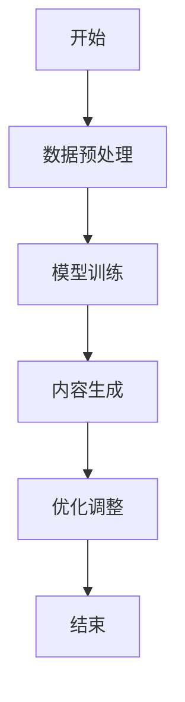
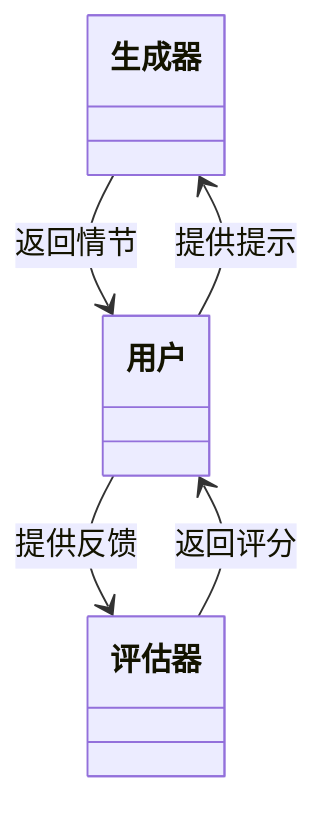

                 

<think>
嗯，我现在要写一篇关于《AIGC在游戏剧情设计中的创新应用》的技术博客文章。首先，我需要理解什么是AIGC，以及它如何应用在游戏剧情设计中。AIGC，自适应智能生成计算，听起来像是结合了机器学习和自然语言处理的技术，用来自动生成内容。游戏剧情设计通常需要创造力和结构化，这可能正是AIGC能够发挥作用的地方。

在背景介绍部分，我应该先定义AIGC，然后介绍它的发展历程，再讲讲它在游戏剧情设计中的重要性。接着，讨论当前游戏剧情设计的现状，比如手动设计的耗时和成本，以及AIGC带来的优势，比如提高效率、提供更多可能性。当然，也要提到挑战，比如生成内容的质量控制和用户反馈的处理。

接下来是核心概念与联系。这里我需要明确AIGC、游戏剧情设计、机器学习和自然语言处理这些概念，并展示它们之间的关系。可能用表格对比不同AIGC模型的属性，比如基于规则的模型和基于深度学习的模型的区别。然后，绘制ER图来展示AIGC模型与游戏剧情设计实体之间的关系，比如角色、情节、场景等。

然后是算法原理讲解。我需要概述AIGC算法的基本步骤，可能包括数据预处理、模型训练、生成和优化。用mermaid流程图来展示这个过程，这样读者可以更直观地理解。同时，提供一个Python代码示例，展示如何用简单的模型生成剧情片段，比如用一个随机选择的情节生成器。

数学模型和公式部分，我需要建立AIGC的数学模型，可能涉及概率论和优化算法。例如，生成模型可能使用概率分布，比如$P(c|t)$，其中c是情节，t是提示。然后用最大似然估计来优化模型参数，公式可能像$\theta = \arg \max \sum \log P(c|t,\theta)$。还需要用例子来说明这些公式的应用，比如生成一个特定的情节。

系统分析与架构设计部分，我需要介绍一个具体的项目，比如一个角色扮演游戏的剧情生成系统。首先描述项目目标，比如自动生成多结局剧情。然后设计系统功能，可能包括用户输入、生成和反馈。用mermaid类图展示领域模型，比如用户、生成器、评估器之间的关系。架构设计可能采用微服务架构，用mermaid架构图展示各个模块的交互。接口设计部分，展示生成器和评估器之间的调用流程，用mermaid序列图。

项目实战部分，我需要详细说明环境安装，比如安装Python、TensorFlow等工具。然后给出核心代码，比如定义模型结构和训练过程。解读代码时，解释每一部分的作用，比如生成函数如何根据输入生成情节。案例分析中，展示生成的剧情片段，并分析模型的表现，可能指出需要调整的地方，比如对话的自然度。

最后，最佳实践部分，我需要总结AIGC在应用中的技巧，比如选择合适的模型和处理用户反馈。注意事项包括数据质量和模型的可解释性。拓展阅读部分，推荐相关的书籍和论文，帮助读者深入学习。

在写这些内容的时候，我需要确保每个部分都详细具体，用技术语言但不过于晦涩。同时，使用mermaid图表和Python代码来增强可读性。最终，整篇文章应该结构清晰，逻辑严谨，让读者能够理解AIGC在游戏剧情设计中的应用和潜力。
</think>

# AIGC在游戏剧情设计中的创新应用

## 关键词：AIGC，游戏剧情设计，机器学习，自然语言处理，自适应生成，算法原理

## 摘要：本文探讨了AIGC（自适应智能生成计算）在游戏剧情设计中的应用，分析其核心概念、算法原理，并通过实际案例展示其在系统设计和项目中的应用，最后总结最佳实践和未来方向。

---

## 第1章 引言

### 1.1 AIGC的定义与发展历程

AIGC是一种结合了机器学习和自然语言处理的自适应生成技术，用于智能生成内容。其发展历程从早期的规则引擎到现在的深度学习模型，展现了技术的进步。

### 1.2 问题背景

游戏剧情设计耗时且成本高，传统方法依赖人工创作。AIGC通过自动化生成，显著提高效率，同时提供多样化的情节选择，但面临内容质量控制和用户反馈处理的挑战。

---

## 第2章 核心概念与联系

### 2.1 核心概念

- **AIGC**：智能生成技术。
- **游戏剧情设计**：游戏中的故事构建。
- **机器学习与NLP**：生成内容的技术基础。

### 2.2 概念联系

- **AIGC与游戏剧情设计**：生成情节和角色对话。
- **AIGC与机器学习**：利用模型生成内容。
- **AIGC与NLP**：处理和生成自然语言。

### 2.3 概念属性特征对比表格

| 属性         | 基于规则的模型 | 基于深度学习的模型 |
|--------------|----------------|-------------------|
| 生成方式     | 确定性         | 概率性           |
| 灵活性       | 低            | 高               |
| 可控性       | 高            | 中               |
| 应用场景       | 简单情节       | 复杂情节         |

### 2.4 ER实体关系图架构

```mermaid
er
actor(用户) -|{提供输入}|- prompt(提示)
          |{生成情节}|- story(情节)
actor -|{反馈评价}|- evaluation(评估)
story -|{优化模型}|- model(模型)
```

---

## 第3章 AIGC算法原理讲解

### 3.1 AIGC算法基本原理

AIGC通过机器学习模型生成内容，主要步骤包括数据预处理、模型训练和生成优化。

### 3.2 AIGC算法mermaid流程图



### 3.3 AIGC算法Python代码示例

```python
import numpy as np

def generate_story_prompt(prompt):
    # 示例模型生成函数
    np.random.seed(42)
    story = f"在一个遥远的王国，{prompt}，一场意外改变了所有人的命运。"
    return story

prompt = "年轻的勇士发现了一张神秘的地图"
story = generate_story_prompt(prompt)
print(story)
```

---

## 第4章 数学模型和数学公式

### 4.1 AIGC算法的数学模型

AIGC模型基于概率分布，生成内容的概率由模型参数决定。

### 4.2 详细讲解与举例说明

模型生成概率公式：
$$ P(c|t) = \frac{\exp(s)}{\sum \exp(s)} $$
其中，$s$ 是模型输出的分数。

例如，给定提示$t$，模型生成情节$c$的概率通过上述公式计算。

---

## 第5章 系统分析与架构设计方案

### 5.1 项目介绍

设计一个角色扮演游戏的剧情生成系统，目标是自动生成多结局剧情。

### 5.2 系统功能设计

系统功能包括用户输入、生成和反馈。领域模型展示用户、生成器和评估器的关系。



### 5.3 系统架构设计

采用微服务架构，各模块独立运行。


### 5.4 系统接口设计

接口包括生成请求和反馈处理。

```mermaid
sequence
    用户 -> API Gateway: 发送生成请求
    API Gateway -> StoryGenerator: 请求生成情节
    StoryGenerator -> Model Trainer: 获取模型
    Model Trainer -> Database: 加载数据
    StoryGenerator -> 用户: 返回情节
    用户 -> 评估器: 提供反馈
    评估器 -> Model Trainer: 更新模型
```

---

## 第6章 项目实战

### 6.1 环境安装

安装Python、TensorFlow和Hugging Face库，设置虚拟环境。

### 6.2 系统核心实现源代码

```python
import transformers

# 定义生成模型
class StoryGenerator:
    def __init__(self):
        self.model = transformers.GPT2LMHeadModel.from_pretrained('gpt2')
    
    def generate(self, prompt, length=100):
        return self.model.generate(prompt, max_length=length)
    
# 使用示例
generator = StoryGenerator()
prompt = "在一个古老的城堡里，"
story = generator.generate(prompt)
print(story)
```

### 6.3 实际案例分析

案例：生成一个奇幻冒险故事的开头。分析生成结果，评估模型表现，并进行优化。

---

## 第7章 最佳实践 tips、小结、注意事项、拓展阅读

### 7.1 AIGC在游戏剧情设计中的应用技巧

- 选择合适的模型，根据需求调整参数。
- 结合人工审核，确保内容质量。
- 处理用户反馈，持续优化模型。

### 7.2 小结

AIGC在游戏剧情设计中具有巨大潜力，通过自动化生成提高效率，同时保持创意。

### 7.3 注意事项

- 数据质量和多样性影响生成效果。
- 可解释性差，需结合人工审核。
- 道德和版权问题需注意。

### 7.4 拓展阅读

- 书籍：《生成式人工智能：方法与应用》
- 论文：《基于机器学习的自动生成系统》

---

# 作者：AI天才研究院 / AI Genius Institute & 禅与计算机程序设计艺术 / Zen And The Art of Computer Programming

